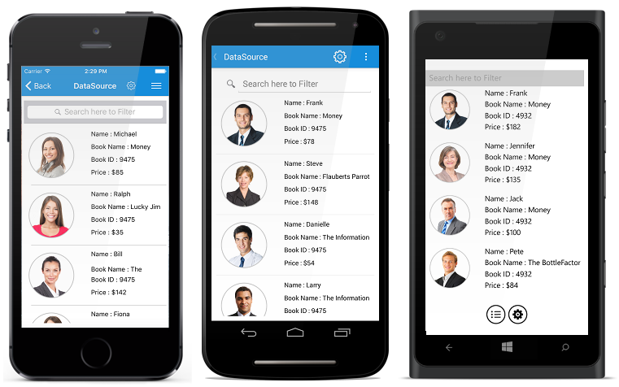
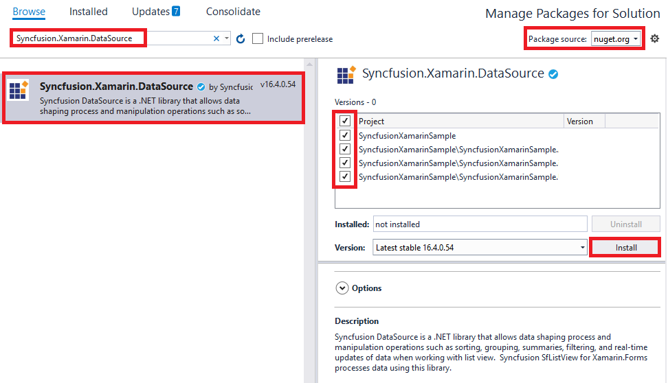
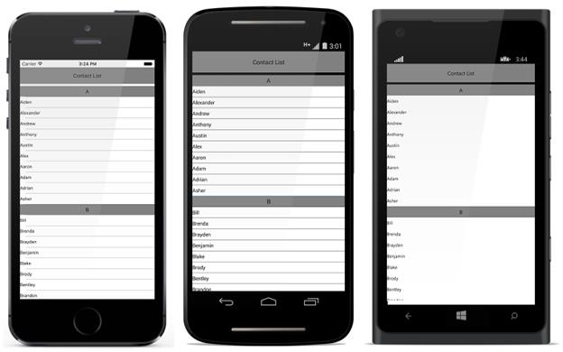

# DataSource

## Overview

DataSource is a non UI component that consumes raw data and processes data operations such as sorting, filtering and grouping saving developers’ time and efforts in building the functionality themselves. We can apply DataSource to any data bound control which can be further processed using the bound DataSource.

## Getting started 

### Assembly deployment

After installing Essential Studio for Xamarin, you can find all the required assemblies in the following installation folders,
{Syncfusion Essential Studio Installed location}\Essential Studio\{Syncfusion release version}\lib

Refer [control dependencies](https://help.syncfusion.com/xamarin/introduction/control-dependencies#datasource) section to get the list of assemblies or NuGet package needs to be added as reference to use the DataSource control in any application.

N> Assemblies can be found in an unzipped package location in Mac.

## Adding DataSource reference

You can add DataSource reference using one of the following methods:

**Method 1: Adding DataSource reference from nuget.org**

Syncfusion Xamarin components are available in [nuget.org](https://www.nuget.org/). To add DataSource to your project, open the NuGet package manager in Visual Studio, search for [Syncfusion.Xamarin.DataSource](https://www.nuget.org/packages/Syncfusion.Xamarin.DataSource), and then install it.

N> Install the same version of DataSource NuGet in all the projects.

**Method 2: Adding DataSource reference from toolbox**

Syncfusion also provides Xamarin Toolbox. Using this toolbox, you can drag the DataSource control to the XAML page. It will automatically install the required NuGet packages and add the namespace to the page. To install Syncfusion Xamarin Toolbox, refer to [Toolbox](https://help.syncfusion.com/xamarin/utility#toolbox).

**Method 3: Adding DataSource assemblies manually from the installed location**

If you prefer to manually reference the assemblies instead referencing from NuGet, add the following assemblies in respective projects.

Location: {Installed location}/{version}/Xamarin/lib

<table>
<tr>
<td>PCL</td>
<td>Syncfusion.DataSource.Portable.dll Syncfusion.Licensing.dll </td>
</tr>
</table>

N> To know more about obtaining our components, refer to these links for [Mac](https://help.syncfusion.com/xamarin/introduction/download-and-installation/mac/) and [Windows](https://help.syncfusion.com/xamarin/introduction/download-and-installation/windows/).

I> Starting with v16.2.0.x, if you reference Syncfusion assemblies from the trial setup or from the NuGet feed, you also have to include a license key in your projects. Please refer to [Syncfusion license key](https://help.syncfusion.com/common/essential-studio/licensing/license-key/) to know about registering Syncfusion license key in your Xamarin application to use our components.

## Creating your first DataSource in Xamarin.Forms

* This is how the final output will look like on iOS, Android and Windows Phone devices. You can also download the entire source code of this demo from [here](https://github.com/SyncfusionExamples/xamarin-datasource-getting-started).

* Create a new blank [(Xamarin.Forms.NET Standard) application](https://docs.microsoft.com/en-us/xamarin/xamarin-forms/get-started/first-app/?pivots=windows) in Xamarin Studio or Visual Studio for Xamarin.Forms.
* Now, create a simple data source as shown in the following code example. Add the following code example in a newly created class file and save it as **Contacts.cs** file.



public class Contacts : INotifyPropertyChanged
{
    private string contactName;

    public Contacts(string name)
    {
        contactName = name;
    }

    public string ContactName
    {
        get { return contactName; }
        set
        {
            if (contactName != value)
            {
                contactName = value;
                this.RaisedOnPropertyChanged("ContactName");
            }
        }
    }

    public event PropertyChangedEventHandler PropertyChanged;

    public void RaisedOnPropertyChanged(string _PropertyName)
    {
        if (PropertyChanged != null)
        {
            PropertyChanged(this, new PropertyChangedEventArgs(_PropertyName));
        }
    }
}



* Add the following code example in a newly created class file and save it as **ContactList.cs** file.



public class ContactsList : ObservableCollection<Contacts>, INotifyPropertyChanged
{
    public ContactsList()
    {
        foreach (var customerName in CustomerNames)
        {
            var contact = new Contacts(customerName);
            this.Add(contact);
        }
    }
    string[] CustomerNames = new string[] {
    "Kyle",
    "Gina",
    "Irene",
    "Katie",
    "Michael",
    "Oscar",
    "Ralph",
    "Torrey",
    "William",
    "Bill",
    "Daniel",
    "Frank",
    "Brenda",
    "Danielle",
    "Fiona",
    "Howard",
    "Jack",
    "Larry",
    };
}



* You can set the source for the DataSource by using the [DataSource.Source](https://help.syncfusion.com/cr/xamarin/Syncfusion.DataSource.DataSource.html#Syncfusion_DataSource_DataSource_Source) property. You can bind the [DataSource.DisplayItems](https://help.syncfusion.com/cr/xamarin/Syncfusion.DataSource.DataSource.html#Syncfusion_DataSource_DataSource_DisplayItems) as `ItemsSource` for any data bound control.



public App()
{
    DataSource dataSource = new DataSource();
    dataSource.Source = new ContactsList();
}



## Sorting

DataSource allows sorting the bound source by using the [DataSource.SortDescriptors](https://help.syncfusion.com/cr/xamarin/Syncfusion.DataSource.DataSource.html#Syncfusion_DataSource_DataSource_SortDescriptors) property. You can create a [SortDescriptor](https://help.syncfusion.com/cr/xamarin/Syncfusion.DataSource.SortDescriptor.html) for the property to be sorted and add it in the `DataSource.SortDescriptors` collection. 
The `SortDescriptor` object holds following three properties:

* PropertyName: Specifies name of the sorted property.
* Direction: Specifies an object of type [ListSortDirection](https://help.syncfusion.com/cr/xamarin/Syncfusion.DataSource.ListSortDirection.html) that defines the sorting direction.
* Comparer: Specifies a comparer to be applied when sorting take place.

 The following code illustrates this.
 


dataSource.SortDescriptors.Add(new SortDescriptor("ContactName"));



## Grouping

DataSource allows sorting the bound source by using the [DataSource.GroupDescriptors](https://help.syncfusion.com/cr/xamarin/Syncfusion.DataSource.DataSource.html#Syncfusion_DataSource_DataSource_GroupDescriptors) property. You can create a [GroupDescriptor](https://help.syncfusion.com/cr/xamarin/Syncfusion.DataSource.GroupDescriptor.html) for the property to be grouped and add it in the `DataSource.GroupDescriptors` collection.
`GroupDescriptor` object holds following two properties:

* PropertyName: Specifies name of the grouped property.
* KeySelector: Sets the [KeySelector](https://help.syncfusion.com/cr/xamarin/Syncfusion.DataSource.GroupDescriptor.html#Syncfusion_DataSource_GroupDescriptor_KeySelector) for grouping.
* Comparer: Comparer to be applied in when sorting take place

The following code example illustrates this without `KeySelector`.



dataSource.GroupDescriptors.Add(new GroupDescriptor("ContactName"));




The following code example illustrates this with `KeySelector`.



    dataSource.GroupDescriptors.Add(new GroupDescriptor() 
    {
        PropertyName = "ContactName",
        KeySelector = (object obj1) =>
        {
            var item = (obj1 as Contacts);
            return item.ContactName[0].ToString();
        }
    });




## Binding DataSource to a ListView

Please refer the below code example that illustrates binding the created DataSource to a ListView control.



public App()
{
    DataSource dataSource = new DataSource();
    dataSource.Source = new ContactsList();
    dataSource.SortDescriptors.Add(new SortDescriptor("ContactName"));
    dataSource.GroupDescriptors.Add(new GroupDescriptor() 
    {
        PropertyName = "ContactName",
        KeySelector = (object obj1) =>
        {
            var item = (obj1 as Contacts);
            return item.ContactName[0].ToString();
        }
    });

  StackLayout stack = new StackLayout();
    stack.Children.Add(new Label()
    {
        TextColor = Color.Black,
        FontSize = 14,
        HeightRequest = 50,
        Text ="Contact List",
        HorizontalTextAlignment = TextAlignment.Center,
        VerticalTextAlignment = TextAlignment.Center,
        BackgroundColor = Color.Gray
    });
           
    listView = new ListView();
    listView.ItemTemplate = new DataTemplate(() =>
    {
        var label = new Label()
        {
            TextColor = Color.Black,
            FontSize = 12,
            VerticalTextAlignment = TextAlignment.Center,
            BackgroundColor = Color.White,
        };
        label.SetBinding(Label.TextProperty, new Binding("ContactName"));
        var viewCell = new ViewCell() { View = label };
        viewCell.BindingContextChanged += ViewCell_BindingContextChanged;
        return viewCell;
    });
    listView.ItemsSource = dataSource.DisplayItems;
    stack.Children.Add(listView);
    MainPage = new ContentPage { Content = stack };
    Device.OnPlatform(iOS:() => MainPage.Padding = new Thickness(0, 20, 0, 0));
}

//Will be executed only in grouping case. Existing view in view cell will be replaced by label.
private void ViewCell_BindingContextChanged(object sender, EventArgs e)
{
    var viewCell = sender as ViewCell;
    if (viewCell.BindingContext is GroupResult)
    {
        var label = new Label()
        {
            TextColor = Color.Black,
            FontSize = 14,
            HeightRequest = 50,
            HorizontalTextAlignment = TextAlignment.Center,
            VerticalTextAlignment = TextAlignment.Center,
            BackgroundColor = Color.Gray
        };
        label.SetBinding(Label.TextProperty, new Binding("Key"));
        viewCell.View = label;
    }
}




## Defining the LiveDataUpdateMode

`DataSource` listens manipulation operations such as add, delete, and data update (property change) at runtime and responds based on the [LiveDataUpdateMode](https://help.syncfusion.com/cr/xamarin/Syncfusion.DataSource.LiveDataUpdateMode.html) property. Default value is `LiveDataUpdateMode.Default`. The `LiveDataUpdateMode` property holds the following two enumeration values:

* Default: Refreshes an item in view when the underlying property is changed.
* AllowDataShaping: Refreshes an item in view and also updates the collection when the underlying property is changed.


private void UpdateData_Clicked(object sender, EventArgs e)
{
   DataSource.LiveDataUpdateMode = LiveDataUpdateMode.AllowDataShaping;
   ViewModel.Items[0].Title = "DataSourceItem_0";
}


## Defining the source data type

When the [Source](https://help.syncfusion.com/cr/xamarin/Syncfusion.DataSource.DataSource.html#Syncfusion_DataSource_DataSource_Source) property binds with different types of underlying collection derived from the same type, set the [SourceType](https://help.syncfusion.com/cr/xamarin/Syncfusion.DataSource.DataSource.html#Syncfusion_DataSource_DataSource_SourceType) as base type for all different types.


DataSource.SourceType = typeof(Contacts);
