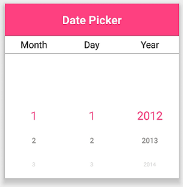
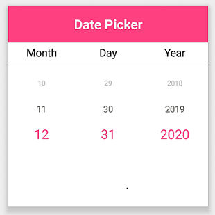

# Date Restriction

DatePicker provides an option to select a date value within a specified range by using the MinimumDate and MaximumDate properties. Always the MinimumDate value has to be lesser than the MaximumDate value.





<?xml version="1.0" encoding="utf-8" ?>
<ContentPage xmlns="http://xamarin.com/schemas/2014/forms"
             xmlns:x="http://schemas.microsoft.com/winfx/2009/xaml"
             xmlns:local="clr-namespace:DatePickerSample"
             xmlns:syncfusion="clr-namespace:Syncfusion.XForms.Pickers;assembly=Syncfusion.SfPicker.XForms"
             x:Class="DatePickerSample.MainPage">
    <ContentPage.Content>
        <syncfusion:SfDatePicker x:Name="datepicker"
                                 MinimumDate="1/1/2012"
                                 MaximumDate="12/31/2020"/>
    </ContentPage.Content>
</ContentPage>



  

using Syncfusion.XForms.Pickers;
using Xamarin.Forms;

namespace DatePickerSample
{
    public partial class MainPage : ContentPage
    {
        public MainPage()
        {
            InitializeComponent();
            SfDatePicker datePicker = new SfDatePicker()
            {
                MinimumDate = new System.DateTime(2012, 1, 1),
                MaximumDate = new System.DateTime(2020, 12, 31)
            };

            this.Content = datePicker;
        }
    }
}





