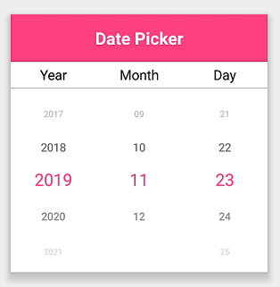

# Formatting in Xamarin DatePicker (SfDatePicker)

Format is a way to represent the value of the date in a different string format.

By default, the DatePicker’s format is "[`DateFormat.M_d_yyyy`](https://help.syncfusion.com/cr/xamarin/Syncfusion.XForms.Pickers.DateFormat.html#Syncfusion_XForms_Pickers_DateFormat_M_d_yyyy)".

The different types of formats are:

[`M_d_yyyy`](https://help.syncfusion.com/cr/xamarin/Syncfusion.XForms.Pickers.DateFormat.html#Syncfusion_XForms_Pickers_DateFormat_M_d_yyyy) - Represents the month day year in m/d/yyyy format.

[`MM_dd_yyyy`](https://help.syncfusion.com/cr/xamarin/Syncfusion.XForms.Pickers.DateFormat.html#Syncfusion_XForms_Pickers_DateFormat_MM_dd_yyyy) - Represents the month day year in mm/dd/yyyy format.

[`yyyy_MM_dd`](https://help.syncfusion.com/cr/xamarin/Syncfusion.XForms.Pickers.DateFormat.html#Syncfusion_XForms_Pickers_DateFormat_yyyy_MM_dd) - Represents the year month day in yyyy/mm/dd format.

[`dd_MMM_yyyy`](https://help.syncfusion.com/cr/xamarin/Syncfusion.XForms.Pickers.DateFormat.html#Syncfusion_XForms_Pickers_DateFormat_dd_MMM_yyyy) - Represents the day month year in dd/mmm/yyyy format.

[`dd_MM_yyyy`](https://help.syncfusion.com/cr/xamarin/Syncfusion.XForms.Pickers.DateFormat.html#Syncfusion_XForms_Pickers_DateFormat_dd_MM_yyyy) - Represents the day month year in dd/MM/yyyy format.

[`dd_MM`](https://help.syncfusion.com/cr/xamarin/Syncfusion.XForms.Pickers.DateFormat.html#Syncfusion_XForms_Pickers_DateFormat_dd_MM) - Represents the day month in dd/MM format.

[`MM_yyyy`](https://help.syncfusion.com/cr/xamarin/Syncfusion.XForms.Pickers.DateFormat.html#Syncfusion_XForms_Pickers_DateFormat_MM_yyyy) - Represents the month year in MM/yyyy format.

[`MMM_yyyy`](https://help.syncfusion.com/cr/xamarin/Syncfusion.XForms.Pickers.DateFormat.html#Syncfusion_XForms_Pickers_DateFormat_MMM_yyyy) - Represents the month year in MMM/yyyy format

The following example demonstrates the DatePicker with the custom format [`DateFormat.yyyy-MM-dd`](https://help.syncfusion.com/cr/xamarin/Syncfusion.XForms.Pickers.DateFormat.html#Syncfusion_XForms_Pickers_DateFormat_yyyy_MM_dd).





<?xml version="1.0" encoding="utf-8" ?>
<ContentPage xmlns="http://xamarin.com/schemas/2014/forms"
             xmlns:x="http://schemas.microsoft.com/winfx/2009/xaml"
             xmlns:local="clr-namespace:DatePickerSample"
             xmlns:syncfusion="clr-namespace:Syncfusion.XForms.Pickers;assembly=Syncfusion.SfPicker.XForms"
             x:Class="DatePickerSample.MainPage">
    <ContentPage.Content>
        <syncfusion:SfDatePicker x:Name="datepicker"
                                 Format="yyyy_MM_dd"/>
    </ContentPage.Content>
</ContentPage>



  

using Syncfusion.XForms.Pickers;
using Xamarin.Forms;

namespace DatePickerSample
{
    public partial class MainPage : ContentPage
    {
        public MainPage()
        {
            InitializeComponent();
            SfDatePicker datePicker = new SfDatePicker()
            {
                Format = DateFormat.yyyy_MM_dd
            };

            this.Content = datePicker;
        }
    }
}





