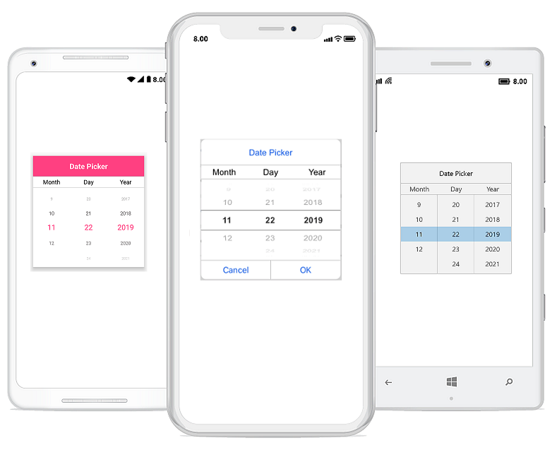

# Getting Started

This section explains the steps required to work with the DatePicker control for Xamarin.Forms.

## Adding SfDatePicker reference

You can add SfDatePicker reference using one of the following methods:

**Method 1: Adding SfDatePicker reference from nuget.org**

Syncfusion Xamarin components are available in [nuget.org](https://www.nuget.org/). To add SfDatePicker to your project, open the NuGet package manager in Visual Studio, search for [Syncfusion.Xamarin.SfPicker](https://www.nuget.org/packages/Syncfusion.Xamarin.SfPicker), and then install it.

N> Install the same version of SfPicker NuGet in all the projects.

**Method 2: Adding SfDatePicker reference from toolbox**

Syncfusion also provides Xamarin Toolbox. Using this toolbox, you can drag the SfDatePicker control to the XAML page. It will automatically install the required NuGet packages and add the namespace to the page. To install Syncfusion Xamarin Toolbox, refer to [Toolbox](https://help.syncfusion.com/xamarin/utility#toolbox).

**Method 3: Adding SfDatePicker assemblies manually from the installed location**

If you prefer to manually reference the assemblies instead referencing from NuGet, add the following assemblies in respective projects.

Location: {Installed location}/{version}/Xamarin/lib

<table>
<tr>
<td>PCL</td>
<td>Syncfusion.SfPicker.XForms.dll Syncfusion.Core.XForms.dll Syncfusion.Licensing.dll </td>
</tr>
<tr>
<td>Android</td>
<td>Syncfusion.SfPicker.Android.dll Syncfusion.SfPicker.XForms.Android.dll Syncfusion.SfPicker.XForms.dll Syncfusion.Core.XForms.dll Syncfusion.Core.XForms.Android.dll Syncfusion.Licensing.dll </td>
</tr>
<tr>
<td>iOS</td>
<td>Syncfusion.SfPicker.iOS.dll Syncfusion.SfPicker.XForms.iOS.dll Syncfusion.SfPicker.XForms.dll Syncfusion.Core.XForms.dll Syncfusion.Core.XForms.iOS.dll Syncfusion.Licensing.dll </td>
</tr>
<tr>
<td>UWP</td>
<td>Syncfusion.SfInput.UWP.dll Syncfusion.SfShared.UWP.dll Syncfusion.SfPicker.XForms.UWP.dll Syncfusion.SfPicker.XForms.dll Syncfusion.Core.XForms.dll Syncfusion.Core.XForms.UWP.dll Syncfusion.Licensing.dll </td>
</tr>
</table>

N> To know more about obtaining our components, refer to these links for [Mac](https://help.syncfusion.com/xamarin/introduction/download-and-installation/mac/) and [Windows](https://help.syncfusion.com/xamarin/introduction/download-and-installation/windows/).

I> Starting with v16.2.0.x, if you reference Syncfusion assemblies from the trial setup or from the NuGet feed, you also have to include a license key in your projects. Please refer to [Syncfusion license key](https://help.syncfusion.com/common/essential-studio/licensing/license-key/) to know about registering Syncfusion license key in your Xamarin application to use our components.

N> After adding the reference, an additional step is required for iOS and UWP projects. If you are adding the references from toolbox, this step is not needed.

### Additional step for iOS

To launch [`SfDatePicker`] in iOS, call the `SfDatePickerRenderer.Init()` in the FinishedLaunching overridden method of the `AppDelegate` class in iOS Project as demonstrated in the following code example.



public override bool FinishedLaunching(UIApplication app, NSDictionary options)
{
    global::Xamarin.Forms.Forms.Init();
    LoadApplication(new App());
    SfDatePickerRenderer.Init();
    return base.FinishedLaunching(app, options);
}



### Additional step for UWP

This step is required only if the application is deployed in Release mode with .NET native tool chain enabled. It is needed for resolving the known Framework issue “Custom controls not rendering in Release mode” in UWP platform. Initializing the [`SfDatePicker`] assembly at the `OnLaunched` overridden method of the `App` class in UWP project is the suggested work around. The following code example demonstrates initializing the [`SfDatePicker`] assembly.



protected override void OnLaunched(LaunchActivatedEventArgs e)
{
    ..... 
    rootFrame.NavigationFailed += OnNavigationFailed;
    // Add `using System.Reflection;` 
    List<Assembly> assembliesToInclude = new List<Assembly>();
    //Now, add all the assemblies that your app uses 
    assembliesToInclude.Add(typeof(SfDatePickerRenderer).GetTypeInfo().Assembly);
    // replaces Xamarin.Forms.Forms.Init(e);
    Xamarin.Forms.Forms.Init(e, assembliesToInclude);
    ..... 
}



### Creating a simple SfDatePicker

The [`SfDatePicker`] control is entirely configured in C# code or in XAML markup. The following steps explain how to create a [`SfDatePicker`] and configure its elements.

### Adding namespace for referred assemblies



xmlns:syncfusion="clr-namespace:Syncfusion.XForms.Pickers;assembly=Syncfusion.SfPicker.XForms"


using Syncfusion.XForms.Pickers;



### Referring SfDatePicker control with declared suffix name for namespace



<?xml version="1.0" encoding="utf-8" ?>
<ContentPage xmlns="http://xamarin.com/schemas/2014/forms"
             xmlns:x="http://schemas.microsoft.com/winfx/2009/xaml"
             xmlns:local="clr-namespace:DatePickerSample"
             xmlns:syncfusion="clr-namespace:Syncfusion.XForms.Pickers;assembly=Syncfusion.SfPicker.XForms"
             x:Class="DatePickerSample.MainPage">
    <ContentPage.Content>
        <syncfusion:SfDatePicker/>
    </ContentPage.Content>
</ContentPage>



using Syncfusion.XForms.Pickers;
using Xamarin.Forms;

namespace DatePickerSample
{
    public partial class MainPage : ContentPage
    {
        public MainPage()
        {
            InitializeComponent();
            SfDatePicker datePicker = new SfDatePicker();
            this.Content = datePicker;
        }
    }
}




### Set header to the DatePicker

The SfDatePicker control allows you to define header text by setting the `SfDatePicker.HeaderText`, and enable SfDatePicker header by setting `SfDatePicker.ShowHeader` property to true. The default value of `SfDatePicker.ShowHeader` is "true".




<?xml version="1.0" encoding="utf-8" ?>
<ContentPage xmlns="http://xamarin.com/schemas/2014/forms"
             xmlns:x="http://schemas.microsoft.com/winfx/2009/xaml"
             xmlns:local="clr-namespace:DatePickerSample"
             xmlns:syncfusion="clr-namespace:Syncfusion.XForms.Pickers;assembly=Syncfusion.SfPicker.XForms"
             x:Class="DatePickerSample.MainPage">
    <ContentPage.Content>
        <syncfusion:SfDatePicker HeaderText="Select a date"/>
    </ContentPage.Content>
</ContentPage>




using Syncfusion.XForms.Pickers;
using Xamarin.Forms;

namespace DatePickerSample
{
    public partial class MainPage : ContentPage
    {
        public MainPage()
        {
            InitializeComponent();
            SfDatePicker datePicker = new SfDatePicker()
            {
                HeaderText = "Select a date"
            };

            this.Content = datePicker;
        }
    }
}




### Enable validation button in footer

In SfDatePicker control, validation buttons (OK and Cancel)can be enabled by setting `SfDatePicker.ShowFooter` property to true. The default value of `SfDatePicker.ShowFooter` property is "false".




<?xml version="1.0" encoding="utf-8" ?>
<ContentPage xmlns="http://xamarin.com/schemas/2014/forms"
             xmlns:x="http://schemas.microsoft.com/winfx/2009/xaml"
             xmlns:local="clr-namespace:DatePickerSample"
             xmlns:syncfusion="clr-namespace:Syncfusion.XForms.Pickers;assembly=Syncfusion.SfPicker.XForms"
             x:Class="DatePickerSample.MainPage">
    <ContentPage.Content>
        <syncfusion:SfDatePicker ShowFooter="True"/>
    </ContentPage.Content>
</ContentPage>


  

using Syncfusion.XForms.Pickers;
using Xamarin.Forms;

namespace DatePickerSample
{
    public partial class MainPage : ContentPage
    {
        public MainPage()
        {
            InitializeComponent();
            SfDatePicker datePicker = new SfDatePicker()
            {
                ShowFooter = true
            };

            this.Content = datePicker;
        }
    }
}




### PickerHeight and PickerWidth

The SfDatePicker control allows you to the change the height and the width of the SfDatePicker using the `SfDatePicker.PickerHeight`, and `SfDatePicker.PickerWidth` properties.




<?xml version="1.0" encoding="utf-8" ?>
<ContentPage xmlns="http://xamarin.com/schemas/2014/forms"
             xmlns:x="http://schemas.microsoft.com/winfx/2009/xaml"
             xmlns:local="clr-namespace:DatePickerSample"
             xmlns:syncfusion="clr-namespace:Syncfusion.XForms.Pickers;assembly=Syncfusion.SfPicker.XForms"
             x:Class="DatePickerSample.MainPage">
    <ContentPage.Content>
        <Grid>
            <syncfusion:SfDatePicker x:Name="datepicker"
                                     PickerMode="Dialog"
                                     PickerHeight="300"
                                     PickerWidth="300"/> >
            <Button Text="Open Picker" 
                    x:Name="pickerButton"
                    Clicked="Button_Clicked"
                    HorizontalOptions="Center"
                    VerticalOptions="Center"
                    HeightRequest="50" 
                    WidthRequest="100"/>
        </Grid>
    </ContentPage.Content>
</ContentPage>




using Syncfusion.XForms.Pickers;
using System;
using System.ComponentModel;
using System.Runtime.CompilerServices;
using System.Windows.Input;
using Xamarin.Forms;

namespace DatePickerSample
{
    public partial class MainPage : ContentPage
    {
        SfDatePicker datePicker;
        public MainPage()
        {
            InitializeComponent();
            Grid grid = new Grid();
            datePicker = new SfDatePicker()
            {
                PickerMode = DatePickerMode.Dialog,
                PickerHeight = 300,
                PickerWidth = 300
            };

            Button pickerButton = new Button()
            {
                Text = "Open Picker",
                HeightRequest = 50,
                WidthRequest = 100,
                HorizontalOptions = LayoutOptions.Center,
                VerticalOptions = LayoutOptions.Center
            };

            pickerButton.Clicked += Button_Clicked;

            grid.Children.Add(datePicker);
            grid.Children.Add(pickerButton);
            this.Content = grid;
        }

        private void Button_Clicked(object sender, System.EventArgs e)
        {
            datePicker.IsOpen = true;
        }
    }
}




### Date

The date can be selected by using the Date property. The default value of Date is current date.




<?xml version="1.0" encoding="utf-8" ?>
<ContentPage xmlns="http://xamarin.com/schemas/2014/forms"
             xmlns:x="http://schemas.microsoft.com/winfx/2009/xaml"
             xmlns:local="clr-namespace:DatePickerSample"
             xmlns:syncfusion="clr-namespace:Syncfusion.XForms.Pickers;assembly=Syncfusion.SfPicker.XForms"
             x:Class="DatePickerSample.MainPage">
    <ContentPage.Content>
        <syncfusion:SfDatePicker x:Name="datepicker"
                                 Date="3/5/2011"/>
    </ContentPage.Content>
</ContentPage>




using Syncfusion.XForms.Pickers;
using Xamarin.Forms;

namespace DatePickerSample
{
    public partial class MainPage : ContentPage
    {
        public MainPage()
        {
            InitializeComponent();
            SfDatePicker datePicker = new SfDatePicker()
            {
                Date = new System.DateTime(2011, 3, 5)
            };

            this.Content = datePicker;
        }
    }
}




You can find the complete getting started sample here: [GettingStarted](https://www.syncfusion.com/downloads/support/directtrac/general/ze/DatePickerSample-472749877)