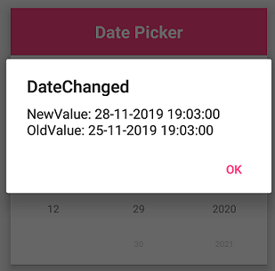

# How to handle date changed using the DateSelected event

You can perform an operation when selecting a date using the [`DateSelected`](https://help.syncfusion.com/cr/xamarin/Syncfusion.XForms.Pickers.SfDatePicker.html#Syncfusion_XForms_Pickers_SfDatePicker_DateSelected) event. The [`DateSelected`](https://help.syncfusion.com/cr/xamarin/Syncfusion.XForms.Pickers.SfDatePicker.html#Syncfusion_XForms_Pickers_SfDatePicker_DateSelected) event returns the following arguments:

<table>
<tr>
<th>Members</th>
<th>Description</th>
</tr>
<tr>
<td>NewValue</td>
<td>Shows recently selected date in DatePicker.</td>
</tr>
<tr>
<td>OldValue</td>
<td>Shows previously selected date in DatePicker.</td>
</tr>
</table>





<?xml version="1.0" encoding="utf-8" ?>
<ContentPage xmlns="http://xamarin.com/schemas/2014/forms"
             xmlns:x="http://schemas.microsoft.com/winfx/2009/xaml"
             xmlns:local="clr-namespace:DatePickerSample"
             xmlns:syncfusion="clr-namespace:Syncfusion.XForms.Pickers;assembly=Syncfusion.SfPicker.XForms"
             x:Class="DatePickerSample.MainPage">
    <ContentPage.Content>
        <syncfusion:SfDatePicker x:Name="datepicker"
                                 DateSelected="Datepicker_DateSelected"/>
    </ContentPage.Content>
</ContentPage>



  

using Syncfusion.XForms.Pickers;
using Xamarin.Forms;

namespace DatePickerSample
{
    public partial class MainPage : ContentPage
    {
        SfDatePicker datePicker;
        public MainPage()
        {
            InitializeComponent();
            datePicker = new SfDatePicker();
            datePicker.DateSelected += Datepicker_DateSelected;
            this.Content = datePicker;
        }

        private void Datepicker_DateSelected(object sender, Syncfusion.XForms.Pickers.DateChangedEventArgs e)
        {
            DisplayAlert("DateChanged", "NewDate: " + e.NewValue + "\n" + "OldDate: " + e.OldValue, "Ok");
        }
    }
}





