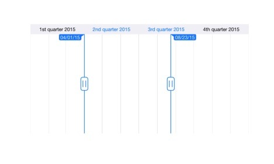

# Major and Minor Scales

The SfDateTimeRangeNavigator control displays major and minor scales at the top and bottom position of the control. 

## Intervals

By default, best possible interval component will be chosen for both major and minor scales based on the available size of the view. For example, if the available space is sufficient to show only year labels without overlapping, interval will be displayed in years. However, you can also set specific [`DateTimeIntervalType`](https://help.syncfusion.com/cr/xamarin/Syncfusion.RangeNavigator.XForms.DateTimeIntervalType.html) components using [`Intervals`](https://help.syncfusion.com/cr/xamarin/Syncfusion.RangeNavigator.XForms.SfDateTimeRangeNavigator.html#Syncfusion_RangeNavigator_XForms_SfDateTimeRangeNavigator_Intervals) property as demonstrated in the below code snippet.



<rangenavigator:SfDateTimeRangeNavigator Minimum="1/1/2015" Maximum="1/1/2016" ViewRangeStart="5/1/2015" 
	ViewRangeEnd="9/1/2016" Intervals="Year,Month" />



SfDateTimeRangeNavigator dateTime = new SfDateTimeRangeNavigator();
dateTime.Intervals = DateTimeIntervalType.Year | DateTimeIntervalType. Month;



## Appearance Customization

The [`MajorScaleStyle`](https://help.syncfusion.com/cr/xamarin/Syncfusion.RangeNavigator.XForms.SfDateTimeRangeNavigator.html#Syncfusion_RangeNavigator_XForms_SfDateTimeRangeNavigator_MajorScaleStyle) and [`MinorScaleStyle`](https://help.syncfusion.com/cr/xamarin/Syncfusion.RangeNavigator.XForms.SfDateTimeRangeNavigator.html#Syncfusion_RangeNavigator_XForms_SfDateTimeRangeNavigator_MinorScaleStyle) properties of [`SfDateTimeRangeNavigator`](https://help.syncfusion.com/cr/xamarin/Syncfusion.RangeNavigator.XForms.SfDateTimeRangeNavigator.html) are used to customize the appearance of ticks and labels.

* [`Position`](https://help.syncfusion.com/cr/xamarin/Syncfusion.RangeNavigator.XForms.ScaleStyle.html#Syncfusion_RangeNavigator_XForms_ScaleStyle_Position) – used to position the labels and ticks [`inside`](https://help.syncfusion.com/cr/xamarin/Syncfusion.RangeNavigator.XForms.ScalePosition.html) or [`outside`](https://help.syncfusion.com/cr/xamarin/Syncfusion.RangeNavigator.XForms.ScalePosition.html) of the range navigator.
* [`LabelAlignment`](https://help.syncfusion.com/cr/xamarin/Syncfusion.RangeNavigator.XForms.ScaleStyle.html#Syncfusion_RangeNavigator_XForms_ScaleStyle_LabelAlignment) – used to align the label at [`Left`](https://help.syncfusion.com/cr/xamarin/Syncfusion.RangeNavigator.XForms.LabelAlignment.html), [`Center`](https://help.syncfusion.com/cr/xamarin/Syncfusion.RangeNavigator.XForms.LabelAlignment.html) and [`Right`](https://help.syncfusion.com/cr/xamarin/Syncfusion.RangeNavigator.XForms.LabelAlignment.html). 
* [`LabelTextColor`](https://help.syncfusion.com/cr/xamarin/Syncfusion.RangeNavigator.XForms.ScaleStyle.html#Syncfusion_RangeNavigator_XForms_ScaleStyle_LabelTextColor) – used to change the text color of the labels.
* [`LabelFontSize`](https://help.syncfusion.com/cr/xamarin/Syncfusion.RangeNavigator.XForms.ScaleStyle.html#Syncfusion_RangeNavigator_XForms_ScaleStyle_LabelFontSize) – used to change the font size of the labels.
* [`LabelFontAttributes`](https://help.syncfusion.com/cr/xamarin/Syncfusion.RangeNavigator.XForms.ScaleStyle.html#Syncfusion_RangeNavigator_XForms_ScaleStyle_LabelFontAttributes) – used to change the font attribute of the labels.
* [`LabelFontFamily`](https://help.syncfusion.com/cr/xamarin/Syncfusion.RangeNavigator.XForms.ScaleStyle.html#Syncfusion_RangeNavigator_XForms_ScaleStyle_LabelFontFamily) – used to change the font family of the labels.
* [`SelectedLabelFontSize`](https://help.syncfusion.com/cr/xamarin/Syncfusion.RangeNavigator.XForms.ScaleStyle.html#Syncfusion_RangeNavigator_XForms_ScaleStyle_SelectedLabelFontSize) – used to change the font size of the selected labels.
* [`SelectedLabelFontAttributes`](https://help.syncfusion.com/cr/xamarin/Syncfusion.RangeNavigator.XForms.ScaleStyle.html#Syncfusion_RangeNavigator_XForms_ScaleStyle_SelectedLabelFontAttributes) – used to change the font attribute of the selected labels.
* [`SelectedLabelFontFamily`](https://help.syncfusion.com/cr/xamarin/Syncfusion.RangeNavigator.XForms.ScaleStyle.html#Syncfusion_RangeNavigator_XForms_ScaleStyle_SelectedLabelFontFamily) – used to change the font family of the selected labels.
* [`LabelMargin`](https://help.syncfusion.com/cr/xamarin/Syncfusion.RangeNavigator.XForms.ScaleStyle.html#Syncfusion_RangeNavigator_XForms_ScaleStyle_LabelMargin) – used to change the margin size of the labels.
* [`SelectedLabelTextColor`](https://help.syncfusion.com/cr/xamarin/Syncfusion.RangeNavigator.XForms.ScaleStyle.html#Syncfusion_RangeNavigator_XForms_ScaleStyle_SelectedLabelTextColor) – used to change the text color of the selected labels.
* [`SelectedLabelMargin`](https://help.syncfusion.com/cr/xamarin/Syncfusion.RangeNavigator.XForms.ScaleStyle.html#Syncfusion_RangeNavigator_XForms_ScaleStyle_SelectedLabelMargin) – used to change the margin of the selected labels.
* [`TickLineWidth`](https://help.syncfusion.com/cr/xamarin/Syncfusion.RangeNavigator.XForms.ScaleStyle.html#Syncfusion_RangeNavigator_XForms_ScaleStyle_TickLineWidth) - used to change the thickness of the tick line.
* [`TickLineColor`](https://help.syncfusion.com/cr/xamarin/Syncfusion.RangeNavigator.XForms.ScaleStyle.html#Syncfusion_RangeNavigator_XForms_ScaleStyle_TickLineColor) - used to change the color of the tick line.



<rangenavigator:SfDateTimeRangeNavigator Minimum="1/1/2015" Maximum="1/1/2016" ViewRangeStart="5/1/2015" 
	ViewRangeEnd="9/1/2016">

	<rangenavigator:SfDateTimeRangeNavigator.MajorScaleStyle>
		<rangenavigator:ScaleStyle Position="Inside" LabelAlignment="Right" SelectedLabelTextColor="Blue" 
			SelectedLabelFontSize="20" SelectedLabelMargin="15" LabelTextColor="Black" LabelFontSize="20" LabelMargin="15"/>	
	</rangenavigator:SfDateTimeRangeNavigator.MajorScaleStyle>
	
	<rangenavigator:SfDateTimeRangeNavigator.MinorScaleStyle>
		<rangenavigator:ScaleStyle Position="Inside" LabelAlignment="Left" SelectedLabelTextColor="Black" 
			SelectedLabelFontSize="20" SelectedLabelMargin="15" LabelTextColor="Red" LabelFontSize="20" LabelMargin="15" />
	</rangenavigator:SfDateTimeRangeNavigator.MinorScaleStyle>

</rangenavigator:SfDateTimeRangeNavigator>



SfDateTimeRangeNavigator dateTime = new SfDateTimeRangeNavigator();

dateTime.MajorScaleStyle.Position = ScalePosition.Inside;
dateTime.MajorScaleStyle.LabelTextColor = Color.Black;
dateTime.MajorScaleStyle.LabelMargin = 15;
dateTime.MajorScaleStyle.LabelFontSize = 20;
dateTime.MajorScaleStyle.LabelAlignment = LabelAlignment.Right;
dateTime.MajorScaleStyle.SelectedLabelTextColor = Color.Red;
dateTime.MajorScaleStyle.SelectedLabelMargin = 15;
dateTime.MajorScaleStyle.SelectedLabelFontSize = 20;

dateTime.MinorScaleStyle.Position = ScalePosition.Inside;
dateTime.MinorScaleStyle.LabelTextColor = Color.Red;
dateTime.MinorScaleStyle.LabelMargin = 15;
dateTime.MinorScaleStyle.LabelFontSize = 20;
dateTime.MinorScaleStyle.LabelAlignment = LabelAlignment.Left;
dateTime.MinorScaleStyle.SelectedLabelTextColor = Color.Black;
dateTime.MinorScaleStyle.SelectedLabelMargin = 15;
dateTime.MinorScaleStyle.SelectedLabelFontSize = 20;



## Scale visibility

You can also control the visibility of minor scale and major scale using the  [`MajorScaleStyle.IsVisible`](https://help.syncfusion.com/cr/xamarin/Syncfusion.RangeNavigator.XForms.ScaleStyle.html#Syncfusion_RangeNavigator_XForms_ScaleStyle_IsVisible) and [`MinorScaleStyle.IsVisible`](https://help.syncfusion.com/cr/xamarin/Syncfusion.RangeNavigator.XForms.ScaleStyle.html#Syncfusion_RangeNavigator_XForms_ScaleStyle_IsVisible) properties.

### Hide minor scale



    <rangenavigator:SfDateTimeRangeNavigator Minimum="2015,01,01" Maximum="2019,01,01">
        <rangenavigator:SfDateTimeRangeNavigator.MinorScaleStyle>
            <rangenavigator:ScaleStyle IsVisible="false" />
            </rangenavigator:SfDateTimeRangeNavigator.MinorScaleStyle>
    </rangenavigator:SfDateTimeRangeNavigator>




SfDateTimeRangeNavigator dateTime = new SfDateTimeRangeNavigator();
dateTime.Minimum = new DateTime(2015, 01, 01);
dateTime.Maximum = new DateTime(2019, 01, 01);
dateTime.MinorScaleStyle.IsVisible = false;




### Hide major scale



    <rangenavigator:SfDateTimeRangeNavigator Minimum="2015,01,01" Maximum="2019,01,01">        
        <rangenavigator:SfDateTimeRangeNavigator.MajorScaleStyle>
            <rangenavigator:ScaleStyle IsVisible="false" />
        </rangenavigator:SfDateTimeRangeNavigator.MajorScaleStyle>
    </rangenavigator:SfDateTimeRangeNavigator>




SfDateTimeRangeNavigator dateTime = new SfDateTimeRangeNavigator();
dateTime.Minimum = new DateTime(2015, 01, 01);
dateTime.Maximum = new DateTime(2019, 01, 01);
dateTime.MajorScaleStyle.IsVisible = false;




## MinorScaleLabelsCreated event

This event occurs when the minor scale labels are created initially. The argument of this event contains the following information:

* `MinorScaleLabels` - Gets the `Content` of the each minor scale label.

 

 

 <rangenavigator:SfDateTimeRangeNavigator Minimum="2015,01,01" Maximum="2019,01,01" MinorScaleLabelsCreated="MinorScaleLabelsCreated" >
    
  


 

public MainPage()
    {
        InitializeComponent();
        SfDateTimeRangeNavigator dateTime = new SfDateTimeRangeNavigator();
		dateTime.Minimum = new DateTime(2015, 01, 01);
        dateTime.Maximum = new DateTime(2019, 01, 01);
		dateTime.MinorScaleLabelsCreated += MinorScaleLabelsCreated;
    }

 private void MinorScaleLabelsCreated(object sender, Syncfusion.RangeNavigator.XForms.MinorScaleLabelsCreatedEventArgs e)
    {
        // handle event action.
    }





## MajorScaleLabelsCreated event

This event occurs when the major scale labels are created initially. The argument of this event contains the following information:

* `MajorScaleLabels` - Gets the `Content` of the each major scale label.

 

 

 <rangenavigator:SfDateTimeRangeNavigator Minimum="2015,01,01" Maximum="2016,01,01" MajorScaleLabelsCreated="MajorScaleLabelsCreated" >
    
  


 

public MainPage()
    {
        InitializeComponent();
        SfDateTimeRangeNavigator dateTime = new SfDateTimeRangeNavigator();
		dateTime.Minimum = new DateTime(2015, 01, 01);
        dateTime.Maximum = new DateTime(2016, 01, 01);
		dateTime.MajorScaleLabelsCreated += MajorScaleLabelsCreated;
    }

private void MajorScaleLabelsCreated(object sender, Syncfusion.RangeNavigator.XForms.MajorScaleLabelsCreatedEventArgs e)
    {
        // handle event action.
    }



