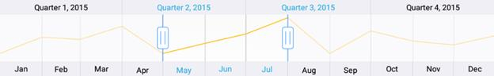

# Getting Started in Xamarin.Forms SfDateTimeRangeNavigator

This section walks you through the steps required to add [`SfDateTimeRangeNavigator`](https://help.syncfusion.com/cr/xamarin/Syncfusion.RangeNavigator.XForms.SfDateTimeRangeNavigator.html) and populate it with data, and also explains how to respond to range selection performed in the control. 

## Adding SfDateTimeRangeNavigator reference

You can add SfDateTimeRangeNavigator reference in one of the following methods:

**Method 1: Adding SfDateTimeRangeNavigator reference from nuget.org**

Syncfusion Xamarin components are available in [nuget.org](https://www.nuget.org/). To add SfDateTimeRangeNavigator to your project, open the NuGet package manager in Visual Studio, search for [Syncfusion.Xamarin.SfChart](https://www.nuget.org/packages/Syncfusion.Xamarin.SfChart/), and then install it.

N> Install the same version of the SfChart NuGet in all the projects.

**Method 2: Adding SfDateTimeRangeNavigator reference from toolbox**

Syncfusion also provides Xamarin Toolbox. Using this toolbox, you can drag the SfDateTimeRangeNavigator control to the XAML page. It will automatically install the required NuGet packages and add the namespace to the page. To install Syncfusion Xamarin Toolbox, refer to [Toolbox](https://help.syncfusion.com/xamarin/utility#toolbox).

**Method 3: Adding SfDateTimeRangeNavigator assemblies manually from the installed location**

If you prefer to manually reference the assemblies instead referencing from NuGet, add the following assemblies in respective projects.

Location : {Installed location}/{version}/Xamarin/lib

<table>
<tr>
<td>
PCL
</td>
<td>
Syncfusion.SfChart.XForms.dll 
Syncfusion.Core.XForms.dll 
Syncfusion.Licensing.dll 
</td>
</tr>
<tr>
<td>
Android
</td>
<td>
Syncfusion.SfChart.XForms.Android.dll 
Syncfusion.SfChart.XForms.dll 
Syncfusion.Core.XForms.dll 
Syncfusion.Core.XForms.Android.dll 
Syncfusion.Licensing.dll 
</td>
</tr>
<tr>
<td>
iOS
</td>
<td>
Syncfusion.SfChart.XForms.iOS.dll 
Syncfusion.SfChart.XForms.dll 
Syncfusion.Core.XForms.dll 
Syncfusion.Core.XForms.iOS.dll 
Syncfusion.Licensing.dll 
</td>
</tr>
<tr>
<td>
UWP
</td>
<td>
Syncfusion.SfChart.UWP.dll 
Syncfusion.SfChart.XForms.UWP.dll 
Syncfusion.SfChart.XForms.dll 
Syncfusion.Core.XForms.dll 
Syncfusion.Core.XForms.UWP.dll 
Syncfusion.Licensing.dll 
</td>
</tr>
</table>

N> To know more about obtaining our components, refer to these links for [Mac](https://help.syncfusion.com/xamarin/introduction/download-and-installation/mac/) and [Windows](https://help.syncfusion.com/xamarin/introduction/download-and-installation/windows/).

I> Starting with v16.2.0.x, if you reference Syncfusion assemblies from the trial setup or from the NuGet feed, you also have to include a license key in your projects. Please refer to [Syncfusion license key](https://help.syncfusion.com/common/essential-studio/licensing/license-key/) to know about registering Syncfusion license key in your Xamarin application to use our components.

## Launching the application on each platform with range navigator 

To use the range navigator inside an application, each platform application requires some additional configurations. The configurations vary from platform to platform and is discussed in the following sections:

N> If you are adding the references from toolbox, below steps are not needed.

### iOS

To launch the range navigator in iOS, call the SfRangeNavigatorRenderer.Init() method in the FinishedLaunching overridden method of the AppDelegate class after the Xamarin.Forms framework initialization and before the LoadApplication method is called as demonstrated in the following code sample:

 

public override bool FinishedLaunching(UIApplication app, NSDictionary options) 
{ 
    … 
    global::Xamarin.Forms.Forms.Init();

    Syncfusion.RangeNavigator.XForms.iOS.SfRangeNavigatorRenderer.Init();     

    LoadApplication(new App()); 
    …
}



### Universal Windows Platform (UWP)

To launch the range navigator in UWP, call the SfRangeNavigatorRenderer.Init() method in the constructor of MainPage before the LoadApplication method is called as demonstrated in the following code sample.

 

public MainPage() 
{ 
    … 

  Syncfusion.RangeNavigator.XForms.UWP.SfRangeNavigatorRenderer.Init(); 

  LoadApplication (new App ()); 
  … 
}



In addition to the above configurations, you need to initialize the control assemblies in App.xaml.cs in UWP project as shown in the below code snippets. This is required to deploy application with range navigator in `Release` mode in UWP platform.

 

// In App.xaml.cs 
protected override void OnLaunched(LaunchActivatedEventArgs e)
{ 
   … 
   if (rootFrame == null) 
   { 
      List<Assembly> assembliesToInclude = new List<Assembly>();

      assembliesToInclude.Add(typeof(Syncfusion.RangeNavigator.XForms.UWP. SfRangeNavigatorRenderer).GetTypeInfo().Assembly);

      Xamarin.Forms.Forms.Init(e, assembliesToInclude); 
   } 
… 
}



### Android

The Android platform does not require any additional configuration to render the range navigator.

## Adding and configuring SfDateTimeRangeNavigator 

First, let us initialize the control with major and minor date time scales by specifying the minimum and maximum date to be visualized in the control using [`Minimum`](https://help.syncfusion.com/cr/xamarin/Syncfusion.RangeNavigator.XForms.SfDateTimeRangeNavigator.html#Syncfusion_RangeNavigator_XForms_SfDateTimeRangeNavigator_Minimum) and [`Maximum`](https://help.syncfusion.com/cr/xamarin/Syncfusion.RangeNavigator.XForms.SfDateTimeRangeNavigator.html#Syncfusion_RangeNavigator_XForms_SfDateTimeRangeNavigator_Maximum) properties.

Following code example illustrates this,




 <rangenavigator:SfDateTimeRangeNavigator  Minimum="2015,01,01" Maximum="2016,01,01"/>



[C#]

SfDateTimeRangeNavigator rangeNavigator = new SfDateTimeRangeNavigator()
{
	Minimum = new DateTime(2015, 01, 01),
	Maximum = new DateTime(2016, 01, 01)
};





N> If you don’t specify [`Minimum`](https://help.syncfusion.com/cr/xamarin/Syncfusion.RangeNavigator.XForms.SfDateTimeRangeNavigator.html#Syncfusion_RangeNavigator_XForms_SfDateTimeRangeNavigator_Minimum) and [`Maximum`](https://help.syncfusion.com/cr/xamarin/Syncfusion.RangeNavigator.XForms.SfDateTimeRangeNavigator.html#Syncfusion_RangeNavigator_XForms_SfDateTimeRangeNavigator_Maximum) properties, minimum and maximum dates will be chosen automatically based on the provided data using [`ItemsSource`](https://help.syncfusion.com/cr/xamarin/Syncfusion.RangeNavigator.XForms.SfDateTimeRangeNavigator.html#Syncfusion_RangeNavigator_XForms_SfDateTimeRangeNavigator_ItemsSource) property, which is explained in the next step in this section.

Next, create a data model representing the list of sample data.


[C#]

public class DataModel
{
	public ObservableCollection<Model> DateTimeData {get; set;}
	
	public DataModel()
	{ 		
		DateTimeData = new ObservableCollection<Model>()
		{ 
			
			new Model (new DateTime(2015, 01, 01), 14), 
			new Model (new DateTime(2015, 02, 01), 54), 
			new Model (new DateTime(2015, 03, 01), 23), 
			new Model (new DateTime(2015, 04, 01), 53), 
			new Model (new DateTime(2015, 05, 01), 25), 
			new Model (new DateTime(2015, 06, 01), 32), 
			new Model (new DateTime(2015, 07, 01), 78), 
			new Model (new DateTime(2015, 08, 01), 100), 
			new Model (new DateTime(2015, 09, 01), 55), 
			new Model (new DateTime(2015, 10, 01), 38), 
			new Model (new DateTime(2015, 11, 01), 27), 
			new Model (new DateTime(2015, 12, 01), 56), 
			new Model (new DateTime(2016, 01, 01), 33) 
			
		}; 
	} 
} 

public class Model 
{ 
	public DateTime Date { get; set; } 
	
	public double Value { get; set; } 
	
	public Model(DateTime dateTime, double value) 
	{ 
		Date = dateTime;
		Value = value; 
	} 
} 



Then, let us populate the chart, which is displayed inside the [`SfDateTimeRangeNavigator`](https://help.syncfusion.com/cr/xamarin/Syncfusion.RangeNavigator.XForms.SfDateTimeRangeNavigator.html), by setting the above data using [`ItemsSource`](https://help.syncfusion.com/cr/xamarin/Syncfusion.RangeNavigator.XForms.SfDateTimeRangeNavigator.html#Syncfusion_RangeNavigator_XForms_SfDateTimeRangeNavigator_ItemsSource) property. And then specify the property names which contain the x and y values in the model using [`XBindingPath`](https://help.syncfusion.com/cr/xamarin/Syncfusion.RangeNavigator.XForms.SfDateTimeRangeNavigator.html#Syncfusion_RangeNavigator_XForms_SfDateTimeRangeNavigator_XBindingPath) and [`YBindingPath`](https://help.syncfusion.com/cr/xamarin/Syncfusion.RangeNavigator.XForms.SfDateTimeRangeNavigator.html#Syncfusion_RangeNavigator_XForms_SfDateTimeRangeNavigator_YBindingPath) properties.

N> By default, data is visualized using line series. You can change the chart type or add more series by accessing the SfChart instance using [`SfDateTimeRangeNavigator.Content`](https://help.syncfusion.com/cr/xamarin/Syncfusion.RangeNavigator.XForms.SfDateTimeRangeNavigator.html#Syncfusion_RangeNavigator_XForms_SfDateTimeRangeNavigator_Content) property. 




 <rangenavigator:SfDateTimeRangeNavigator ItemsSource="{Binding DateTimeData}" XBindingPath="Date" YBindingPath="Value"/>



[C#]

SfDateTimeRangeNavigator rangeNavigator = new SfDateTimeRangeNavigator() 
{ 
	rangeNavigator.ItemsSource = new DataModel().DateTimeData, 
	rangeNavigator.XBindingPath = "Date", 
	rangeNavigator.YBindingPath = "Value" 
};  





## Handle range selection

In real time, other controls like chart, grid etc., are updated in response to the range selection performed in SfDateTimeRangeNavigator. You can handle the selection using [`RangeChanged`](https://help.syncfusion.com/cr/xamarin/Syncfusion.RangeNavigator.XForms.SfDateTimeRangeNavigator.html) event and update other controls based on the selected date time or perform some other tasks using the selected data.

N> You can get the selected start and end date using [`ViewRangeStart`](https://help.syncfusion.com/cr/xamarin/Syncfusion.RangeNavigator.XForms.SfDateTimeRangeNavigator.html#Syncfusion_RangeNavigator_XForms_SfDateTimeRangeNavigator_ViewRangeStart) and [`ViewRangeEnd`](https://help.syncfusion.com/cr/xamarin/Syncfusion.RangeNavigator.XForms.SfDateTimeRangeNavigator.html#Syncfusion_RangeNavigator_XForms_SfDateTimeRangeNavigator_ViewRangeEnd) properties or get the collection of selected data using [`SelectedData`](https://help.syncfusion.com/cr/xamarin/Syncfusion.RangeNavigator.XForms.SfDateTimeRangeNavigator.html#Syncfusion_RangeNavigator_XForms_SfDateTimeRangeNavigator_SelectedData) property.

Following code example illustrates how to handle range selection and update chart's date time axis range,


[C#]

rangeNavigator.RangeChanged += rangeNavigator_RangeChanged;  
...

private void rangeNavigator_RangeChanged(object sender, RangeChangedEventArgs e) 
{ 
	//Updating chart's date time range 
}  



You can find the complete getting started sample from this [link.](https://github.com/SyncfusionExamples/Getting_started_of_SfDateTimeRangeNavigator_in_Xamarin.Forms)

