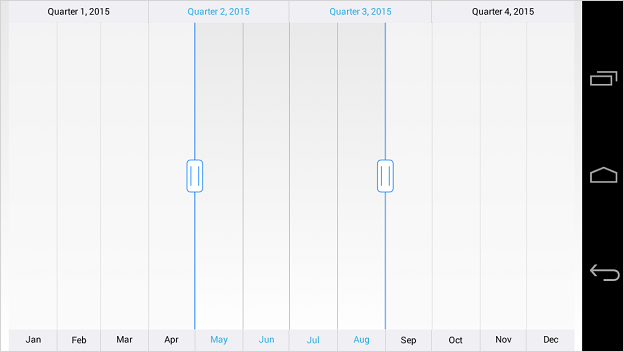
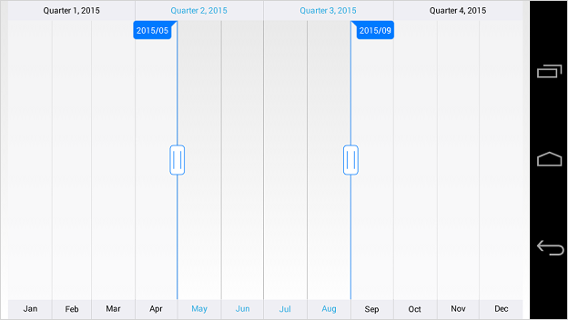

# Tooltip

The tooltip is used to show the selected range start and end value of the [`SfDateTimeRangeNavigator`](https://help.syncfusion.com/cr/xamarin/Syncfusion.RangeNavigator.XForms.SfDateTimeRangeNavigator.html).

## Tooltip Visibility

The [`EnableTooltip`](https://help.syncfusion.com/cr/xamarin/Syncfusion.RangeNavigator.XForms.SfDateTimeRangeNavigator.html#Syncfusion_RangeNavigator_XForms_SfDateTimeRangeNavigator_EnableTooltip) property of [`SfDateTimeRangeNavigator`](https://help.syncfusion.com/cr/xamarin/Syncfusion.RangeNavigator.XForms.SfDateTimeRangeNavigator.html) is used to control the visibility of the left and right tooltip. It is true by default.



<rangenavigator:SfDateTimeRangeNavigator Minimum="1/1/2015" Maximum="1/1/2016" ViewRangeStart="5/1/2015" 
	ViewRangeEnd="9/1/2016" EnableTooltip="False"/>



SfDateTimeRangeNavigator dateTimeRangeNavigator = new SfDateTimeRangeNavigator(); 

dateTimeRangeNavigator.EnableTooltip = false;



## Tooltip Format

You can format the date value of the tooltip using [`TooltipFormat`](https://help.syncfusion.com/cr/xamarin/Syncfusion.RangeNavigator.XForms.SfDateTimeRangeNavigator.html#Syncfusion_RangeNavigator_XForms_SfDateTimeRangeNavigator_TooltipFormat) property of **SfDateTimeRangeNavigator**.



<rangenavigator:SfDateTimeRangeNavigator TooltipFormat="yyyy/MM" />



dateTimeRangeNavigator.TooltipFormat = "yyyy/MM";



## Appearance Customization

The [`LeftTooltipStyle`](https://help.syncfusion.com/cr/xamarin/Syncfusion.RangeNavigator.XForms.SfDateTimeRangeNavigator.html#Syncfusion_RangeNavigator_XForms_SfDateTimeRangeNavigator_LeftTooltipStyle) and [`RightTooltipStyle`](https://help.syncfusion.com/cr/xamarin/Syncfusion.RangeNavigator.XForms.SfDateTimeRangeNavigator.html#Syncfusion_RangeNavigator_XForms_SfDateTimeRangeNavigator_RightTooltipStyle) properties of [`SfDateTimeRangeNavigator`](https://help.syncfusion.com/cr/xamarin/Syncfusion.RangeNavigator.XForms.SfDateTimeRangeNavigator.html) are used to customize the left and right tooltip. Following properties are available in each tooltip style to customize the appearance of the tooltip.

* [`TextColor`](https://help.syncfusion.com/cr/xamarin/Syncfusion.RangeNavigator.XForms.TooltipStyle.html#Syncfusion_RangeNavigator_XForms_TooltipStyle_TextColor) – used to change the color of the tooltip text.
* [`BackgroundColor`](https://help.syncfusion.com/cr/xamarin/Syncfusion.RangeNavigator.XForms.TooltipStyle.html#Syncfusion_RangeNavigator_XForms_TooltipStyle_BackgroundColor) – used to change the background color of the tooltip.
* [`BorderColor`](https://help.syncfusion.com/cr/xamarin/Syncfusion.RangeNavigator.XForms.TooltipStyle.html#Syncfusion_RangeNavigator_XForms_TooltipStyle_BorderColor) – used to change the border color of the tooltip.
* [`BorderWidth`](https://help.syncfusion.com/cr/xamarin/Syncfusion.RangeNavigator.XForms.TooltipStyle.html#Syncfusion_RangeNavigator_XForms_TooltipStyle_BorderWidth) – used to change the width of the tooltip border.
* [`FontFamily`](https://help.syncfusion.com/cr/xamarin/Syncfusion.RangeNavigator.XForms.TooltipStyle.html#Syncfusion_RangeNavigator_XForms_TooltipStyle_FontFamily) – used to change the font family of the tooltip text.
* [`FontSize`](https://help.syncfusion.com/cr/xamarin/Syncfusion.RangeNavigator.XForms.TooltipStyle.html#Syncfusion_RangeNavigator_XForms_TooltipStyle_FontSize) – used to change the font size of the tooltip text.
* [`FontAttributes`](https://help.syncfusion.com/cr/xamarin/Syncfusion.RangeNavigator.XForms.TooltipStyle.html#Syncfusion_RangeNavigator_XForms_TooltipStyle_FontAttributes) – used to change the font attribute of the tooltip text.
* [`Margin`](https://help.syncfusion.com/cr/xamarin/Syncfusion.RangeNavigator.XForms.TooltipStyle.html#Syncfusion_RangeNavigator_XForms_TooltipStyle_Margin) - used to change the margin size of the tooltip text.



<rangenavigator:SfDateTimeRangeNavigator Minimum="1/1/2015" Maximum="1/1/2016" ViewRangeStart="5/1/2015" ViewRangeEnd="9/1/2016">

	<rangenavigator:SfDateTimeRangeNavigator.LeftTooltipStyle>
		<rangenavigator:TooltipStyle TextColor="Blue" BackgroundColor="White" BorderColor="Blue" BorderWidth="2" 
			FontSize="30" Margin="15"/>
	</rangenavigator:SfDateTimeRangeNavigator.LeftTooltipStyle>
	
	<rangenavigator:SfDateTimeRangeNavigator.RightTooltipStyle>
	
		<rangenavigator:TooltipStyle TextColor="Blue" BackgroundColor="White" BorderColor="Blue" BorderWidth="2" 
			FontSize="30" Margin="15"/>
	</rangenavigator:SfDateTimeRangeNavigator.RightTooltipStyle>
	
</rangenavigator:SfDateTimeRangeNavigator>



dateTimeRangeNavigator.LeftTooltipStyle.TextColor = Color.Blue;
dateTimeRangeNavigator.LeftTooltipStyle.BackgroundColor = Color.White;
dateTimeRangeNavigator.LeftTooltipStyle.BorderColor = Color.Blue;
dateTimeRangeNavigator.LeftTooltipStyle.BorderWidth = 2;
dateTimeRangeNavigator.LeftTooltipStyle.FontSize = 30;
dateTimeRangeNavigator.LeftTooltipStyle.Margin = 15;

dateTimeRangeNavigator.RightTooltipStyle.TextColor = Color.Blue;
dateTimeRangeNavigator.RightTooltipStyle.BackgroundColor = Color.White;
dateTimeRangeNavigator.RightTooltipStyle.BorderColor = Color.Blue;
dateTimeRangeNavigator.RightTooltipStyle.BorderWidth = 2;
dateTimeRangeNavigator.RightTooltipStyle.FontSize = 30;
dateTimeRangeNavigator.RightTooltipStyle.Margin = 15;



