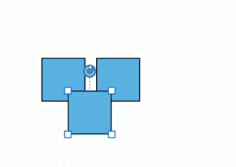
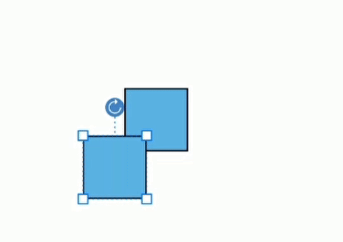

# Diagram in Xamarin Diagram (SfDiagram)
[Xamarin Diagram](https://www.syncfusion.com/xamarin-ui-controls/xamarin-diagram) allows to create different types of diagrams such as flow charts, use case diagrams, workflow process diagrams, and more.

## Page settings
Page settings enable to customize the appearance, width, and height of the Diagram page. The size and appearance of the Diagram pages can be customized with the PageSettings property.
The PageWidth and PageHeight properties of page settings define the size of the page. You can also customize the appearance of off-page regions with the property BackgroundColor.
The following code illustrates how to customize the page size and the appearance of page and off-page.


<diagram:SfDiagram x:Name="diagram" BackgroundColor="Lime"> 
<diagram:SfDiagram.PageSettings> 
<diagram:PageSettings PageWidth="500" PageHeight="50” PageBackGround="White" /> 
</diagram:SfDiagram.PageSettings> 
</diagram:SfDiagram>


//Sets Page background 
diagram.BackgroundColor = Color.Lime; 
//Sets Page size 
diagram.PageSettings.PageWidth = 500; 
diagram.PageSettings.PageHeight = 500; 
//Customizes the appearance of Page
diagram.PageSettings.PageBackGround= Color.White;



## View Port Start Position
Page settings enable you to customize the viewport start position of the diagram page. The enum `ViewPort Start Position` has two constants: Default, Origin. The default value is set to Default.

### Default 
The viewport of the diagram page is decided based on the node's offsets. 

N> The viewport of the diagram page will be in a negative region when the node’s offsets are negative.  

### Origin
The viewport of the diagram page begins with origin (0,0) even though when the node’s offsets are negative.

The following code explains how to customize the view port start position of the page.



<diagram:SfDiagram x:Name="diagram"> 
    <diagram:SfDiagram.PageSettings>
      <diagram:PageSettings ViewPortStartPosition = "Origin">  
    <diagram:SfDiagram.PageSettings>
</diagram:SfDiagram>


//Sets the viewport start position.
SfDiagram.PageSettings.ViewPortStartPosition = ViewportStartPosition.Origin;



## Stencil:
Stencil has a collection of Symbols. Stencil is used to clone the desired symbol by dragging it from the Stencil and dropping it into the SfDiagram.
The following code snippet illustrates to add the stencil.


<syncfusion:Stencil x:Name="stencil" >
</syncfsion:Stencil>



Stencil stencil = new Stencil(); 
this.Content = stencil;




## Node template:
You can replace the entire node template with your own design using SfDiagram.NodeTemplate property.
The following code snippet and screenshot illustrates this.


<DataTemplate x:Key="template">
  <Grid WidthRequest="80" HeightRequest="80">
    <Image Source="diagram.png"/>
  </Grid>
</DataTemplate>
<control:SfDiagram x:Name="diagram" NodeTemplate="{StaticResource template}"/>


var template = new DataTemplate(() =>
{
    Grid grid = new Grid();
    grid.WidthRequest = 80;
    grid.HeightRequest = 80;
    Image image = new Image();
    image.Source = "employee.png";
    grid.Children.Add(image);
    return grid;
});
diagram.NodeTemplate = template;



## Diagram constraints
The constraints property of Diagram allows you to enable/disable certain features.
The Diagram Constraints allow you to enable or disable the following behaviors of Node.
EnableDrag
EnableResize
EnableRotation
EnableTextEditing
EnableSelectors
EnableZoomAndPan
IsReadOnly
**Example**
The following code illustrates how to disable the item dragging.


<synfusion:SfDiagram x:Name="diagram" EnableDrag="False">
</syncfusion:SfDiagram>


SfDiagram diagram = new SfDiagram(); 
// Disable the item dragging
diagram.EnableDrag = false;
this.Content = diagram;



## Show Selector Handle
You can show or hide the selector handle for the diagram element based on the specified SelectorPosition options. You can restrict the resize operation for Nodes using the `ShowSelectorHandle` method. The following code sample explains this.


SfDiagram diagram = new SfDiagram(); 
diagram.AddNode(new Node(100, 100, 300,300) { ShapeType = ShapeType.Rectangle });         
diagram.ShowSelectorHandle(false, SelectorPosition.TopLeft);
diagram.ShowSelectorHandle(false, SelectorPosition.TopRight);
diagram.ShowSelectorHandle(false, SelectorPosition.BottomLeft);
diagram.ShowSelectorHandle(false, SelectorPosition.BottomRight);
diagram.ShowSelectorHandle(true, SelectorPosition.MiddleLeft);
diagram.ShowSelectorHandle(true, SelectorPosition.MiddleRight);
diagram.ShowSelectorHandle(true, SelectorPosition.TopCenter);
diagram.ShowSelectorHandle(true, SelectorPosition.BottomCenter);
this.Content = diagram;



##  Load and Save JSON :
You can save the diagram in JSON format and load the JSON saved file into Diagram. The following code sample explains this.


SfDiagram diagram = new SfDiagram();
string JsonText = diagram.SaveAsJson();
diagram.LoadFromJson(JsonText);



## Diagram style settings		
It is easier to apply default rendering styles to all shapes, connectors, stencil symbol, and stencil header in a diagram. Pass the following arguments to diagram style setting constructor: 
 * DefaultNodeStyle argument: Defines the node style properties. 
 * DefaultConnectorStyle argument: Defines the connector style properties.
 * DefaultSymbolStyle argument: Defines the symbol style properties. 
 * DefaultHeaderStyle argument: Defines the header style properties. 
The following code shows how to define the diagram style settings for the diagram object.



// Diagram style settings 
Syncfusion.SfDiagram.XForms.Style NodeStyle = new Syncfusion.SfDiagram.XForms.Style() { Brush = new SolidBrush(Color.Blue), StrokeBrush = new SolidBrush(Color.Brown), StrokeWidth = 2, StrokeStyle = StrokeStyle.Dashed };
Syncfusion.SfDiagram.XForms.Style ConnectorStyle = new Syncfusion.SfDiagram.XForms.Style() { StrokeBrush = new SolidBrush(Color.DeepSkyBlue), StrokeWidth = 3.0f, StrokeStyle = StrokeStyle.Dotted };
SymbolStyle SymbolStyle = new SymbolStyle() { Width = 70, Height = 70, BorderThickness = 4, BorderBrush = Color.Gray }; HeaderStyle HeaderStyle = new HeaderStyle() { FontSize = 24, TextBrush = Color.White, Fill = Color.SteelBlue, FontStyle = FontStyle.Italic, HorizontalAlignment = HorizontalAlignment.Center };
DiagramStyleSettings diagramStyleSettings = new DiagramStyleSettings(NodeStyle, ConnectorStyle, SymbolStyle, HeaderStyle);
//Passing diagram style settings instance to SfDiagram constructor
SfDiagram diagram = new SfDiagram(diagramStyleSettings);



## Zooming enhancement 
Supports customizing the zoom levels. You can set minimum zoom level value to 0.01f and maximum to ‘infinite’. 


<!-- Define the minimum and maximum zoom factor value -->
<control:SfDiagram x:Name="diagram"  MinimumZoomFactor="0.01" MaximumZoomFactor="5.00" />




// Define the minimum and maximum zoom factor value 
  diagram.MinimumZoomFactor = 0.01f;
  diagram.MaximumZoomFactor = 5.00f;



## Clear
Remove all the items from the diagram page using the ['Clear'](https://help.syncfusion.com/cr/xamarin/Syncfusion.SfDiagram.XForms.SfDiagram.html#Syncfusion_SfDiagram_XForms_SfDiagram_Clear) method. To remove all the items in the diagram, use the following code snippet.


 
  SfDiagram diagram = new SfDiagram(); 
  diagram.Clear(); 
  this.Content = diagram;



## Select
Select the node or connector items from the diagram using the ['Select'](https://help.syncfusion.com/cr/xamarin/Syncfusion.SfDiagram.XForms.SfDiagram.html#Syncfusion_SfDiagram_XForms_SfDiagram_Select_Syncfusion_SfDiagram_XForms_DiagramBaseItem_) method. To select the items in the diagram, use the following code snippet.


 
  SfDiagram diagram = new SfDiagram(); 
  Node node = new Node() { Width = 120, Height = 40, OffsetX = 300,OffsetY = 60};
  diagram.AddNode(node);
  diagram.Select(node); 
  this.Content = diagram;



## ClearSelection
Clear the selected items from the diagram using the ['ClearSelection'](https://help.syncfusion.com/cr/xamarin/Syncfusion.SfDiagram.XForms.SfDiagram.html#Syncfusion_SfDiagram_XForms_SfDiagram_ClearSelection) method. To clear the selected items in the diagram, use the following code snippet. 


 
  SfDiagram diagram = new SfDiagram(); 
  diagram. ClearSelection();  
  this.Content = diagram;



## Undo and Redo 
The diagram tracks the history of actions that are performed after initializing the diagram and provides support to reverse and restore those changes.  
The ['Undo'](https://help.syncfusion.com/cr/xamarin/Syncfusion.SfDiagram.XForms.SfDiagram.html#Syncfusion_SfDiagram_XForms_SfDiagram_Undo) function is performed to reverse the action of an earlier action.

The ['Redo'](https://help.syncfusion.com/cr/xamarin/Syncfusion.SfDiagram.XForms.SfDiagram.html#Syncfusion_SfDiagram_XForms_SfDiagram_Redo) function is restores any actions that have been previously undone using an undo.


 
  //To perform the Undo action in the Diagram
  SfDiagram diagram = new SfDiagram(); 
  diagram.Undo(); 
  this.Content = diagram;

  //To Perform the Redo action in the Diagram
  SfDiagram diagram = new SfDiagram(); 
  diagram.Redo(); 
  this.Content = diagram;



## BringToFront and SendToBack
The ['BringToFront'](https://help.syncfusion.com/cr/xamarin/Syncfusion.SfDiagram.XForms.SfDiagram.html#Syncfusion_SfDiagram_XForms_SfDiagram_BringToFront) is used to visually move the selected elements to the front of all other overlapped elements. 

The ['SendToBack'](https://help.syncfusion.com/cr/xamarin/Syncfusion.SfDiagram.XForms.SfDiagram.html#Syncfusion_SfDiagram_XForms_SfDiagram_SendToBack) visually moves the selected elements behind all other overlapped elements. 


 
  //Bring it to the front
  SfDiagram diagram = new SfDiagram(); 
  diagram.BringToFront(); 
  this.Content = diagram;

  // Send it To the Back
  SfDiagram diagram = new SfDiagram(); 
  diagram.SendToBack();  
  this.Content = diagram;



## BringForward and SendBackward
The ['BringForward'](https://help.syncfusion.com/cr/xamarin/Syncfusion.SfDiagram.XForms.SfDiagram.html#Syncfusion_SfDiagram_XForms_SfDiagram_BringForward) visually moves the selected element over the nearest overlapping element. 

The ['SendBackward'](https://help.syncfusion.com/cr/xamarin/Syncfusion.SfDiagram.XForms.SfDiagram.html#Syncfusion_SfDiagram_XForms_SfDiagram_SendBackward) visually moves the selected elements behind the underlying element. 


 
  // Brings it Forward
  SfDiagram diagram = new SfDiagram(); 
  diagram.BringForward();
  this.Content = diagram;

  // Send it Backward
  SfDiagram diagram = new SfDiagram(); 
  diagram.SendBackward(); 
  this.Content = diagram;



## DiagramClicked  
The ['DiagramClickedEvent'](https://help.syncfusion.com/cr/xamarin/Syncfusion.SfDiagram.XForms.DiagramClickedEventArgs.html) will be triggered when you click the ['Diagram'](https://help.syncfusion.com/cr/xamarin/Syncfusion.SfDiagram.XForms.html) page. The following code example explains how to create a DiagramClickedEvent trigger.



<diagram:SfDiagram x:Name="diagram" VerticalOptions="FillAndExpand" DiagramClicked="Diagram_DiagramClicked"/>



SfDiagram diagram = new SfDiagram();
diagram.DiagramClicked += Diagram_DiagramClicked; 
this.Content = diagram;

private void Diagram_DiagramClicked(object sender, DiagramClickedEventArgs args)
{
    var items = args.Item;
}



## ItemAdded
The ['ItemAddedEvent'](https://help.syncfusion.com/cr/xamarin/Syncfusion.SfDiagram.XForms.ItemAddedEventArgs.html) will be triggered when the node or connector will be added to the ['Diagram'](https://help.syncfusion.com/cr/xamarin/Syncfusion.SfDiagram.XForms.html).The following code example explains how to create a ItemAddedEvent trigger.



<diagram:SfDiagram x:Name="diagram" VerticalOptions="FillAndExpand" ItemAdded="Diagram_ItemAdded"/>



SfDiagram diagram = new SfDiagram();
diagram.ItemAdded += Diagram_ItemAdded;
this.Content = diagram;

private void Diagram_ItemAdded(object sender, ItemAddedEventArgs args)
{
    Node node = (Node)args.Item;
}



## DragEnd
The ['DragEndEvent'](https://help.syncfusion.com/cr/xamarin/Syncfusion.SfDiagram.XForms.DragEndEventArgs.html) will be triggered when the node or connector will be dragged from the one place to another place of the ['Diagram'](https://help.syncfusion.com/cr/xamarin/Syncfusion.SfDiagram.XForms.html) page. The following code example explains how to create a DragEndEvent trigger.



<diagram:SfDiagram x:Name="diagram" VerticalOptions="FillAndExpand" DragEnd="Diagram_DragEnd"/>



SfDiagram diagram = new SfDiagram();
diagram.DragEnd += Diagram_DragEnd;
this.Content = diagram;

private void Diagram_DragEnd(object sender, DragEndEventArgs args)
{
    Node node = (Node)args.Item;
}



## DiagramObjectDeleted
The ['DiagramObjectDeletedEvent'](https://help.syncfusion.com/cr/xamarin/Syncfusion.SfDiagram.XForms.DiagramObjectDeletedEventArgs.html) will be triggered when you delete the node or connector from the['Diagram'](https://help.syncfusion.com/cr/xamarin/Syncfusion.SfDiagram.XForms.html) page. The following code example explains how to create a DiagramObjectDeletedEvent trigger.



<diagram:SfDiagram x:Name="diagram" VerticalOptions="FillAndExpand" DiagramObjectDeleted="Diagram_DiagramObjectDeleted"/>



SfDiagram diagram = new SfDiagram();
diagram.DiagramObjectDeleted += Diagram_DiagramObjectDeleted; 
this.Content = diagram;

private void Diagram_DiagramObjectDeleted(object sender, DiagramObjectDeletedEventArgs args)
{
    Node node = (Node)args.Item;
}



## ResizeEnd
The ['ResizeEndEvent'](https://help.syncfusion.com/cr/xamarin/Syncfusion.SfDiagram.XForms.ResizeEndEventArgs.html) will be triggered when the node or connector is resizing. The following code example explains how to create a ResizeEndEvent trigger.



<diagram:SfDiagram x:Name="diagram" VerticalOptions="FillAndExpand" ResizeEnd="Diagram_ResizeEnd"/>



SfDiagram diagram = new SfDiagram();
diagram.ResizeEnd += Diagram_ResizeEnd;
this.Content = diagram;  

private void Diagram_ResizeEnd(object sender, ResizeEndEventArgs args)
{
    Node node = (Node)args.Item;
}



## ItemLongPressed
The ['ItemLongPressedEvent'](https://help.syncfusion.com/cr/xamarin/Syncfusion.SfDiagram.XForms.ItemLongPressedEventArgs.html) will be triggered when long pressing the node or connector items. The following code example explains how to create a ItemLongPressedEvent trigger.



<diagram:SfDiagram x:Name="diagram" VerticalOptions="FillAndExpand" ItemLongPressed="Diagram_ItemLongPressed" />



SfDiagram diagram = new SfDiagram();
diagram.ItemLongPressed += Diagram_ItemLongPressed;
this.Content = diagram;   

private void Diagram_ItemLongPressed(object sender, ItemLongPressedEventArgs args)
{
    Node node = (Node)args.Item;
}

 

N> Diagram supports zooming with custom option in Xamarin.Forms.Android and Xamarin.Forms.iOS alone.
You can also explore our [Xamarin Diagram example](https://github.com/syncfusion/xamarin-demos/tree/master/Forms/Diagram) to understand how to present and manipulate data.
