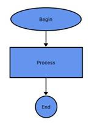

# Getting Started with Xamarin Diagram (SfDiagram)

This section provides a quick overview for working with Diagram for Xamarin.Forms. This walkthrough demonstrates that, how to create a simple flow chart and an organization chart.

## Assembly deployment

After installing [Essential Studio for Xamarin](https://www.syncfusion.com/downloads/xamarin), you can find all the required assemblies in the installation folders, {Syncfusion Essential Studio Installed location} \Essential Studio\\{Version #}\Xamarin\lib.

E.g.: C:\Program Files (x86) \Syncfusion\Essential Studio\19.1.0.54\Xamarin\lib

N> Assemblies can be found in unzipped package location(Documents/Syncfusion/{Version #}/Xamarin/lib) in Mac.

## Adding SfDiagram reference

You can add SfDiagram reference using one of the following methods:

**Method 1: Adding SfDiagram reference from nuget.org**

Syncfusion Xamarin components are available in [nuget.org](https://www.nuget.org/). To add SfDiagram to your project, open the NuGet package manager in Visual Studio, search for [Syncfusion.Xamarin.SfDiagram](https://www.nuget.org/packages/Syncfusion.Xamarin.SfDiagram), and then install it.

N> Install the same version of SfDiagram NuGet in all the projects.

**Method 2: Adding SfDiagram reference from toolbox**

Syncfusion also provides Xamarin Toolbox. Using this toolbox, you can drag the SfDiagram control to the XAML page. It will automatically install the required NuGet packages and add the namespace to the page. To install Syncfusion Xamarin Toolbox, refer to [Toolbox](https://help.syncfusion.com/xamarin/utility#toolbox).

**Method 3: Adding SfDiagram assemblies manually from the installed location**

If you prefer to manually reference the assemblies instead referencing from NuGet, add the following assemblies in respective projects.

Location: {Installed location}/{version}/Xamarin/lib

<table>
<tr>
<td>.NET Standard</td>
<td>Syncfusion.SfDiagram.XForms.dll Syncfusion.Core.XForms.dll Syncfusion.Licensing.dll </td>
</tr>
<tr>
<td>Android</td>
<td>Syncfusion.SfDiagram.XForms.Android.dll Syncfusion.SfDiagram.XForms.dll Syncfusion.Core.XForms.dll Syncfusion.Core.XForms.Android.dll Syncfusion.Licensing.dll </td>
</tr>
<tr>
<td>iOS</td>
<td>Syncfusion.SfDiagram.XForms.iOS.dll Syncfusion.SfDiagram.XForms.dll Syncfusion.Core.XForms.dll Syncfusion.Core.XForms.iOS.dll Syncfusion.Licensing.dll </td>
</tr>
<tr>
<td>UWP</td>
<td>Syncfusion.SfDiagram.UWP.dll Syncfusion.SfDiagram.XForms.UWP.dll Syncfusion.SfDiagram.XForms.dll Syncfusion.Core.XForms.dll Syncfusion.Core.XForms.UWP.dll Syncfusion.Licensing.dll </td>
</tr>
</table>

N> To know more about obtaining our components, refer to these links for [Mac](https://help.syncfusion.com/xamarin/introduction/download-and-installation/mac/) and [Windows](https://help.syncfusion.com/xamarin/introduction/download-and-installation/windows/).

I> Starting with v16.2.0.x, if you reference Syncfusion assemblies from the trial setup or from the NuGet feed, you also have to include a license key in your projects. Please refer to [Syncfusion license key](https://help.syncfusion.com/common/essential-studio/licensing/license-key/) to know about registering Syncfusion license key in your Xamarin application to use our components.

N> If you are adding the references from toolbox, this step is not needed.

### Additional step for iOS

To launch SfDiagram in iOS, call the `SfDiagramRenderer.Init()` in `FinishedLaunching` overridden method of `AppDelegate` class in iOS Project, as demonstrated in the following code example.



public override bool FinishedLaunching(UIApplication app, NSDictionary options)
{
    global::Xamarin.Forms.Forms.Init();
    LoadApplication(new App());
    SfDiagramRenderer.Init();
    return base.FinishedLaunching(app, options);
}



I>We need to create an instance of the `SfDiagramRenderer` in iOS and UWP projects as shown in this [KB article](https://www.syncfusion.com/kb/8618).

### Additional step for UWP

This step is required only if the application is deployed in Release mode with .NET native tool chain enabled and it is for resolving the known Framework issue “Custom controls not rendering in Release mode” in UWP platform. Initializing the SfDiagram assembly at `OnLaunched` overridden method of the `App` class in UWP project is the suggested work around, as demonstrated in the following code example.



protected override void OnLaunched(LaunchActivatedEventArgs e)
{

    ..... 

    rootFrame.NavigationFailed += OnNavigationFailed;
    // you'll need to add `using System.Reflection;` 
    List<Assembly> assembliesToInclude = new List<Assembly>();
    //Now, add all the assemblies your app uses 
    assembliesToInclude.Add(typeof(SfDiagramRenderer).GetTypeInfo().Assembly);
    // replaces Xamarin.Forms.Forms.Init(e);
    Xamarin.Forms.Forms.Init(e, assembliesToInclude);

    ..... 

}



I> You can refer to the [KB article](https://www.syncfusion.com/kb/8617) for more details.

## Basic building blocks of Diagram
* **Diagram**- It represents the drawing surface where all the graphical elements like nodes and connectors resides, can be used to display various types of diagrams and it is the root instance of the diagram control. A Diagram instance contains a collection of nodes and  connectors to represent the  graphical diagram.
* **Nodes**- This represents the geometric shapes such as flowchart elements, network diagram elements, use case elements, etc.
* **Connectors-**These are the objects used to create link between two nodes, to represent the relationships between them in the diagram.
* **Ports-**It represents a point in the node, where the connectors can be connected. A Node can contain any number of ports.
* **Annotation-**It is a block of the text that can be displayed over a Node or Connector. Annotation is used to textually represent an object with a string that can be edited at run time.

## Creating a simple flow chart
Create a new cross platform app (Xamarin.Forms) with portable class library in the Visual Studio and name the project as “GettingStarted” and refer to the above mentioned assemblies to the respective projects.
An additional step is required to render the SfDiagram control in iOS project. You need to create an instance of the SfDiagramRenderer class within FinishedLaunching method of AppDelegate class in iOS project as shown as follows


public override bool FinishedLaunching(UIApplication app, NSDictionary options)
{
    global::Xamarin.Forms.Forms.Init();
    LoadApplication(new App());
    new SfDiagramRenderer();
    return base.FinishedLaunching(app, options);
}



**Adding SfDiagram in Xamarin.Forms**
1. Import SfDiagram control namespace as xmlns:syncfusion="clr-namespace:Syncfusion.SfDiagram.XForms;assembly=Syncfusion.SfDiagram.XForms in XAML Page.
2. Set the SfDiagram control as content to the ContentPage.



<?xml version="1.0" encoding="utf-8" ?>
<ContentPage xmlns="http://xamarin.com/schemas/2014/forms"
             xmlns:x="http://schemas.microsoft.com/winfx/2009/xaml"
             xmlns:local="clr-namespace:GettingStarted;assembly=GettingStarted"
             xmlns:syncfusion="clr-namespace:Syncfusion.SfDiagram.XForms;assembly=Syncfusion.SfDiagram.XForms" 
             x:Class="GettingStarted.Sample">
  <ContentPage.Content>
<!--Initializes the SfDiagram-->
       <syncfusion:SfDiagram x:Name="diagram" />
  </ContentPage.Content>
</ContentPage>


using Syncfusion.SfDiagram.XForms;
using Xamarin.Forms;
namespace GettingStarted
{
    public class App : Application
    {
        SfDiagram diagram;
        public App()
        {
            //Initializes the SfDiagram
            diagram= new SfDiagram();
            MainPage = new ContentPage { Content = diagram};
        }
    }
}



{{ codesnippet1 | UnOrderList_Indent_Level_1 }}

The following code snippet illustrates the creation of Nodes and Connectors in the diagram.


public GettingStarted()
        {
           InitializeComponent();
           //Initializes the SfDiagram
           SfDiagram diagram = new SfDiagram();
           Node Begin = AddNode("Begin", 150, 60, 120, 40, "Begin", ShapeType.Ellipse);
           Node Process = AddNode("Process", 150, 140, 120, 60, "Process", ShapeType.Rectangle);
           Node End = AddNode("End", 190, 225, 40, 40, "End", ShapeType.Ellipse);
//Add nodes to the SfDiagram
diagram.AddNode(Begin);
diagram.AddNode(Process);
diagram.AddNode(End);
Connector connector1 = new Connector()
{
SourceNode = Begin,
TargetNode = Process,
};
Connector connector2 = new Connector()
{
SourceNode = Process,
TargetNode = End,
};
//Add connectors to the SfDiagram
diagram.AddConnector(connector1);
diagram.AddConnector(connector2);
this.Content = diagram;
         }
///

///create the node
///

public Node AddNode(string id, float offsetX, float offsetY, float width, float height, string text, ShapeType shape)
{
Node node = new Node();
node.OffsetX = offsetX;
node.OffsetY = offsetY;
node.Height = height;
node.Width = width;
node.ShapeType = shape;
node.Style.Brush = new SolidBrush(Color.FromRgb(100, 149, 237));
node.Annotations.Add(new Annotation() { Content = text});
return node;
}


The flow chart will get displayed in the SfDiagram as follows

This demo project can be downloaded from the following link [GettingStarted_Demo.](https://www.syncfusion.com/downloads/support/directtrac/general/ze/Diagram246576052.zip)

## Create a simple organizational chart
SfDiagram provides support to auto-arrange the nodes based on hierarchical relation. Organization chart is an example of displaying hierarchical information.
Now, you have to create a class named “Employee” to store the employee’s information like name, designation, ID, reporting person ID, etc. Also, create a collection class that stores a collection of the employees.


//Employee Business Object
public class Employee
{
    public string ParentId { get; set; }
    public string Name { get; set; }
    public string Designation { get; set; }
    public int EmpId { get; set; }
}
//Employee Collection
public class Employees : ObservableCollection<Employee>  
{
}



**Initialize Employee data**
Define Employee Information as a Collection. The below code example shows an employee array whose,
* Name is used as a unique identifier and
* ParentId is used to identify the person to whom an employee report to, in the organization.



<!-- Initializes the employee collection--> 
<local:Employees x:Key="employees"> 
<local:Employee Name="Elizabeth" EmpId="1" ParentId="" Designation="CEO"/> 
<local:Employee Name="Christina" EmpId="2" ParentId="1" Designation="Manager"/> 
<local:Employee Name="Yang" EmpId="3" ParentId="1" Designation="Manager"/> 
<local:Employee Name="Yoshi" EmpId="4" ParentId="2" Designation="Team Lead"/> 
<local:Employee Name="Philip" EmpId="5" ParentId="2" Designation="S/w Developer"/> 
<local:Employee Name="Roland" EmpId="6" ParentId="3" Designation="TeamLead"/> 
<local:Employee Name="Yuonne" EmpId="7" ParentId="3" Designation="Testing Engineer"/> 
</local:Employees> 
<!--Initializes the DataSourceSettings --> 
<syncfusion:DataSourceSettings x:Key="DataSourceSettings" DataSource="{StaticResource employees}" ParentId="ParentId" Id="EmpId" Root="1"/> 
<!--Initializes the Layout--> 
<syncfusion:DirectedTreeLayout x:Key="treeLayout" HorizontalSpacing="80" VerticalSpacing="50" TreeOrientation="TopToBottom"/> 
<syncfusion:LayoutManager x:Key="layoutManager" Layout="{StaticResource treeLayout}"/> 
<!--Initializes the SfDiagram--> 
<syncfusion:SfDiagram x:Name="diagram" LayoutManager="{StaticResource layoutManager}" DataSourceSettings="{StaticResource DataSourceSettings}"/>


//Initializes the employee collection
ObservableCollection<Employee> employees = new ObservableCollection<Employee>();            
employees.Add(new Employee() { Name = "Elizabeth", EmpId = "1", ParentId = "", Designation = "CEO" });
employees.Add(new Employee() { Name = "Christina", EmpId = "2", ParentId = "1", Designation = "Manager" });
employees.Add(new Employee() { Name = "Yang", EmpId = "3", ParentId = "1", Designation = "Manager" });
employees.Add(new Employee() { Name = "Yoshi", EmpId = "4", ParentId = "2", Designation = "Team Lead" });
employees.Add(new Employee() { Name = "Philip", EmpId = "5", ParentId = "2", Designation = "S/w Developer" });
employees.Add(new Employee() { Name = "Roland", EmpId = "6", ParentId = "3", Designation = "TeamLead" });
employees.Add(new Employee() { Name = "Yvonne", EmpId = "7", ParentId = "3", Designation = "Testing Engineer" });
//Initializes the DataSourceSettings
diagram.DataSourceSettings = new DataSourceSettings() { DataSource = employees, Id = "EmpId", ParentId = "ParentId" };
//Initializes the Layout
DirectedTreeLayout treeLayout = new DirectedTreeLayout() { HorizontalSpacing = 80, VerticalSpacing = 50, TreeOrientation = TreeOrientation.TopToBottom };
diagram.LayoutManager = new LayoutManager() { Layout = treeLayout };



{{ codesnippet1 | UnOrderList_Indent_Level_1 }}

**BeginNodeRender**

An user can change the node content using the [BeginNodeRender](https://help.syncfusion.com/xamarin/diagram/layout#beginnoderender) event of the SfDiagram. This event will fire for each node added in the Layout when the layout is getting updated.



// Registering an event
diagram.BeginNodeRender += Diagram_BeginNodeRender;

private void Diagram_BeginNodeRender(object sender, BeginNodeRenderEventArgs args)
        {
            Node node = args.Item;
            node.ShapeType = ShapeType.RoundedRectangle;
            node.Width = 150;
            node.Height = 60;
            node.Annotations.Add(new Annotation() { Content = (node.Content as Employee).Name });
        }



**Density Calculation**

The following code snippets shows how to calculate the unit to get same size  for SfDiagram in Android and iOS platform.




  //For Android
   var mainDisplayInfo = DeviceDisplay.MainDisplayInfo;

   float Density = (float)mainDisplayInfo.Density;

  //For iOS
   var mainDisplayInfo = DeviceDisplay.MainDisplayInfo;

   float staticDensity = (float)mainDisplayInfo.Density;

   float m_currentDensity = 1;

   var factor = m_currentDensity / staticDensity;




The Employee data is displayed in the SfDiagram as follows

This demo project can be downloaded from the following link [OrganizationalChart_Demo.](https://www.syncfusion.com/downloads/support/directtrac/general/ze/OrganizationalChart1297437028.zip)

N> You can refer to our [Xamarin Diagram](https://www.syncfusion.com/xamarin-ui-controls/xamarin-diagram) feature tour page for its groundbreaking feature representations.You can also explore our [Xamarin Diagram example](https://github.com/syncfusion/xamarin-demos/tree/master/Forms/Diagram) to understand how to present and manipulate data.