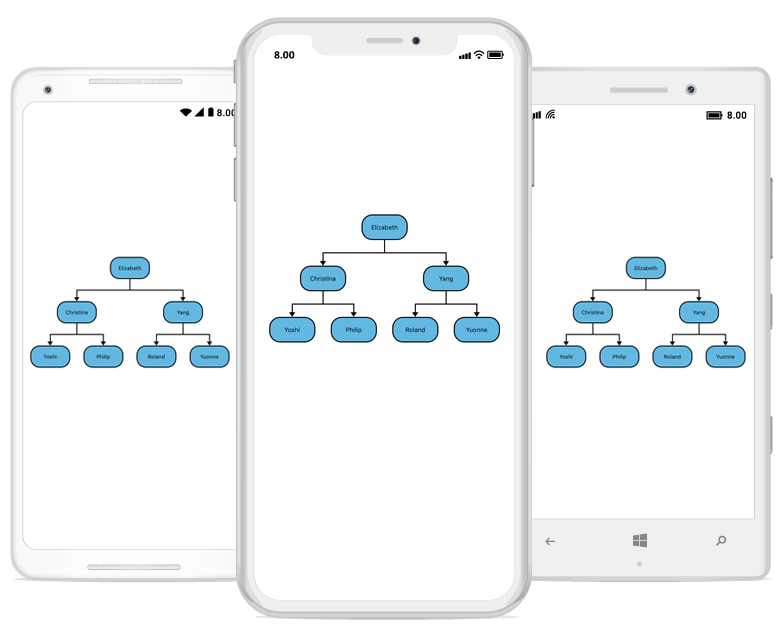

# Xamarin Diagram (SfDiagram) Overview

The diagram control allows to create different types of diagrams such as flowcharts, use case diagrams, workflow process diagrams, etc.

## Key features

* **Node, Connector, Port:** Elements that is used to compose diagrams.
* **Interaction:** Zoom, pan.
* **Layouts:** Arrange nodes in a tree like structure based on the relationship on Nodes.
* **Clipboard Commands:** Performs cut, copy, and paste operations.
* **Undo/Redo:** Performs correction in the recent changes.
* **Serialization:** Save the current state of the diagram, and load it back when needed.
* **Stencil:** It holds a list of symbols that is dropped over the diagram.
