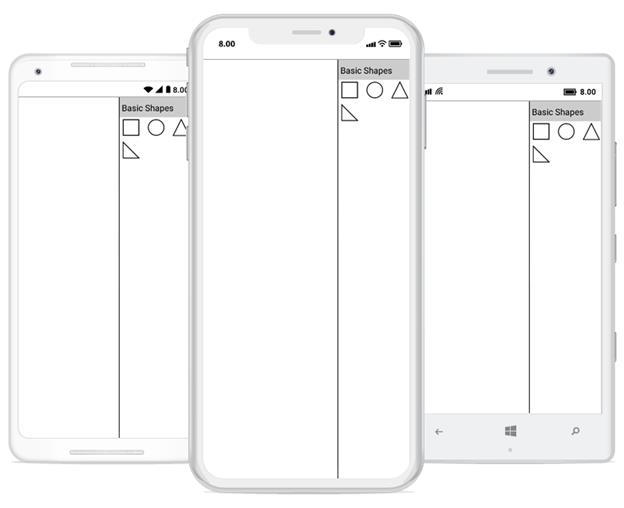

# Stencil
Stencil has a collection of Symbols. Stencil is used to clone the desired symbol by dragging it from the Stencil and dropping it into the SfDiagram. Each symbol can be grouped together by using the SymbolGroup .


<!-- Add namespace in xaml page -->
xmlns:sfDiagram="clr-namespace:Syncfusion.SfDiagram.XForms;assembly=Syncfusion.SfDiagram.XForms"



## Add default shapes into stencil
The following example illustrates how to add the Symbol into a Collection:


<ContentPage.Resources>
  <ResourceDictionary>
<!-- Add Symbols into SymbolCollection -->
      <control:SymbolCollection x:Key="collection1">
        <control:Node Height="50" Width="50" ShapeType="Rectangle" />
        <control:Node Height="50" Width="50" ShapeType="Ellipse" />
        <control:Node Height="50" Width="50" ShapeType="Triangle" />
        <control:Node Height="50" Width="50" ShapeType="RightAngleTriangle" />
      </control:SymbolCollection>
<!-- Add collection into SymbolGroup -->
      <control:SymbolGroups x:Key="groups">
       <control:SymbolGroup SymbolSource="{StaticResource collection1}" HeaderName="BasicShapes" />
      </control:SymbolGroups>
    </ResourceDictionary>
  </ContentPage.Resources> 
  <ContentPage.Content>
    <Grid x:Name="grid">
      <Grid.ColumnDefinitions>
        <ColumnDefinition Width="500"/>
        <ColumnDefinition Width="500"/>
        </Grid.ColumnDefinitions>
<!-- Add SfDiagram and stencil in xaml page -->
      <control:SfDiagram x:Name="diagram">
      </control:SfDiagram>
      <control:Stencil x:Name="stencil" SymbolGroups="{StaticResource groups}" >
      </control:Stencil>
      </Grid>
</ContentPage.Content>


//Add Symbols into SymbolCollection
SymbolCollection Collection1 = new SymbolCollection();
Collection1.Add(new Node() { Width = 50, Height = 50, ShapeType = ShapeType.Rectangle});
Collection1.Add(new Node() { Width = 50, Height = 50, ShapeType = ShapeType.Ellipse});
Collection1.Add(new Node() { Width = 50, Height = 50, ShapeType = ShapeType.Triangle});
Collection1.Add(new Node() { Width = 50, Height = 50, ShapeType = ShapeType.RightAngleTriangle});
//Add collection into SymbolGroup
stencil.SymbolGroups.Add(new SymbolGroup() { SymbolSource = coll, HeaderName = "BasicShapes" });


This Collection will be the SymbolSource to the Stencil. Based on the SymbolSource, the Stencil will populate the Symbols.

## Add custom shapes into stencil
The following example illustrates how to add the custom shapes into a Collection:


//Custom shapes 
            Pen pen = new Pen();
            pen.StrokeBrush = new SolidBrush(Color.Red);
            pen.StrokeWidth = 2;
            SolidBrush brush = new SolidBrush(Color.Yellow);
            pen.Brush = brush;
            Pen pen1 = new Pen();
            pen1.StrokeBrush = new SolidBrush(Color.Gray);
            pen1.StrokeWidth = 2;
            SolidBrush brush1 = new SolidBrush(Color.Blue);
            brush1.FillColor = Color.Blue;
            pen1.Brush = brush1;
            Node custom = new Node();
            SfGraphics graphics = new SfGraphics();
            Pen pen2 = new Pen();
            pen2.StrokeBrush = new SolidBrush(Color.Blue);
            pen2.StrokeWidth = 2;
            SolidBrush brush2 = new SolidBrush(Color.FromRgb(99, 184, 225));
            brush2.FillColor = Color.FromRgb(99, 184, 225);
            pen2.Brush = brush2;
            graphics.DrawRectangle(pen2, new Xamarin.Forms.Rectangle(0, 0, 50, 50));
            custom.UpdateSfGraphics(graphics);
            Node custom1 = new Node();
            SfGraphics grap4 = new SfGraphics();
            SfGraphicsPath sfpath4 = new SfGraphicsPath();
            Pen pen14 = new Pen();
            pen14.StrokeBrush = new SolidBrush(Color.Blue);
            pen14.StrokeWidth = 2;
            SolidBrush brush14 = new SolidBrush(Color.Transparent);
            brush14.FillColor = Color.Transparent;
            pen14.Brush = brush14;
            List<Point> coll4 = new List<Point>();
            coll4.Add(new Point(0, 12));
            coll4.Add(new Point(12, 12));
            coll4.Add(new Point(12, 6));
            coll4.Add(new Point(12, 42));
            coll4.Add(new Point(12, 30));
            coll4.Add(new Point(0, 30));
            grap4.DrawLines(pen14, coll4.ToArray());
            sfpath4.MoveTo(12, 6);
            sfpath4.CubicTo(12, 6, 38, 20, 12, 36);
            grap4.DrawPath(sfpath4);
            custom1.UpdateSfGraphics(grap4);
            Node custom2 = new Node();
            SfGraphics grap5 = new SfGraphics();
            SfGraphicsPath sfpath5 = new SfGraphicsPath();
            List<Point> pointscol5 = new List<Point>();
            pointscol5.Add(new Point(0, 15));
            pointscol5.Add(new Point(15, 15));
            pointscol5.Add(new Point(15, 0));
            pointscol5.Add(new Point(30, 15));
            pointscol5.Add(new Point(15, 30));
            pointscol5.Add(new Point(15, 15));
            sfpath5.AddLines(pointscol5.ToArray());
            grap5.DrawPath(sfpath5);
            custom2.UpdateSfGraphics(grap5);
            Node custom3 = new Node();
            Pen pen4 = new Pen();
            pen4.StrokeBrush = new SolidBrush(Color.Blue);
            pen4.StrokeWidth = 2;
            SolidBrush brush4 = new SolidBrush(Color.White);
            brush4.FillColor = Color.White;
            pen4.Brush = brush4;
            SfGraphics grap6 = new SfGraphics();
            SfGraphicsPath sfpath6 = new SfGraphicsPath();
            List<Point> pointscol6 = new List<Point>();
            pointscol6.Add(new Point(0, 15));
            pointscol6.Add(new Point(15, 15));
            pointscol6.Add(new Point(15, 0));
            pointscol6.Add(new Point(30, 15));
            pointscol6.Add(new Point(15, 30));
            pointscol6.Add(new Point(15, 15));
            sfpath6.AddLines(pointscol5.ToArray());
            grap6.DrawPath(sfpath6);
            grap6.DrawEllipse(pen4, new Xamarin.Forms.Rectangle(30, 12, 5, 5));
            custom3.UpdateSfGraphics(grap6);
            SymbolCollection CustomShapeCollection = new SymbolCollection();
            col4.Add(custom);
            col4.Add(custom1);
            col4.Add(custom2);
            col4.Add(custom3);
//Add custom shapes into group
stencil.SymbolGroups.Add(new SymbolGroup() { SymbolSource = CustomShapeCollection , HeaderName = "Custom Shapes" });



## Add category heading text
We can able to add category of symbol group heading in stencil. The following example illustrates how to add category heading text in stencil.


<ResourceDictionary>
<!--SymbolCollection1-->
      <control:SymbolCollection x:Key="collection1">
        <control:Node Height="50" Width="50" ShapeType="Rectangle" />
        <control:Node Height="50" Width="50" ShapeType="Ellipse" />
        <control:Node Height="50" Width="50" ShapeType="Triangle" />
        <control:Node Height="50" Width="50" ShapeType="RightAngleTriangle" />
      </control:SymbolCollection>
<!--SymbolCollection2-->
      <control:SymbolCollection x:Key="collection2">
        <control:Node Height="50" Width="50" ShapeType="RoundedRectangle" />
        <control:Node Height="50" Width="50" ShapeType="Rectangle" />
        <control:Node Height="50" Width="50" ShapeType="Diamond" />
        <control:Node Height="50" Width="50" ShapeType="Parallelogram" />
      </control:SymbolCollection>
<!--SymbolCollection3-->
      <control:SymbolCollection x:Key="collection3">
        <control:Connector SourcePoint="50,50" TargetPoint="100,100" SegmentType="OrthoSegment" />
        <control:Connector SourcePoint="50,50" TargetPoint="100,100" SegmentType="StraightSegment" />
      </control:SymbolCollection>
<!--Add category of symbolgroup with heading text -->
      <control:SymbolGroups x:Key="groups">
       <control:SymbolGroup SymbolSource="{StaticResource collection1}" HeaderName="BasicShapes" />
        <control:SymbolGroup SymbolSource="{StaticResource collection2}" HeaderName="Flow Chart" />
        <control:SymbolGroup SymbolSource="{StaticResource collection3}" HeaderName="Connectors" />
      </control:SymbolGroups>
    </ResourceDictionary>


//SymbolCollection1 
SymbolCollection coll = new SymbolCollection();
coll.Add(new Node() { Width = 50, Height = 50, ShapeType = ShapeType.Rectangle, Style = new Syncfusion.SfDiagram.XForms.Style() { Brush = new SolidBrush(Color.White), StrokeBrush = new SolidBrush(Color.Gray) } });
coll.Add(new Node() { Width = 50, Height = 50, ShapeType = ShapeType.Ellipse, Style = new Syncfusion.SfDiagram.XForms.Style() { Brush = new SolidBrush(Color.White), StrokeBrush = new SolidBrush(Color.Gray) } });
coll.Add(new Node() { Width = 50, Height = 50, ShapeType = ShapeType.Triangle, Style = new Syncfusion.SfDiagram.XForms.Style() { Brush = new SolidBrush(Color.White), StrokeBrush = new SolidBrush(Color.Gray) } });
coll.Add(new Node() { Width = 50, Height = 50, ShapeType = ShapeType.RightAngleTriangle, Style = new Syncfusion.SfDiagram.XForms.Style() { Brush = new SolidBrush(Color.White), StrokeBrush = new SolidBrush(Color.Gray) } });
//SymbolCollection2 
SymbolCollection coll1 = new SymbolCollection();
coll1.Add(new Node() { Width = 50, Height = 50, ShapeType = ShapeType.RoundedRectangle, Style = new Syncfusion.SfDiagram.XForms.Style() { Brush = new SolidBrush(Color.White), StrokeBrush = new SolidBrush(Color.Gray) } });
coll1.Add(new Node() { Width = 50, Height = 50, ShapeType = ShapeType.Rectangle, Style = new Syncfusion.SfDiagram.XForms.Style() { Brush = new SolidBrush(Color.White), StrokeBrush = new SolidBrush(Color.Gray) } });
coll1.Add(new Node() { Width = 50, Height = 50, ShapeType = ShapeType.Diamond, Style = new Syncfusion.SfDiagram.XForms.Style() { Brush = new SolidBrush(Color.White), StrokeBrush = new SolidBrush(Color.Gray) } });
coll1.Add(new Node() { Width = 50, Height = 50, ShapeType = ShapeType.Parallelogram, Style = new Syncfusion.SfDiagram.XForms.Style() { Brush = new SolidBrush(Color.White), StrokeBrush = new SolidBrush(Color.Gray) } });
//SymbolCollection3
SymbolCollection con1 = new SymbolCollection();
con1.Add(new Connector() { SegmentType = SegmentType.OrthoSegment, SourcePoint = new Point(0, 0), TargetPoint = new Point(50, 50) });
con1.Add(new Connector() { SegmentType = SegmentType.StraightSegment, SourcePoint = new Point(0, 0), TargetPoint = new Point(50, 50) });
//Add category of symbol group with heading text
stencil.SymbolGroups.Add(new SymbolGroup() { SymbolSource = coll, HeaderName = "BasicShapes" });
stencil.SymbolGroups.Add(new SymbolGroup() { SymbolSource = coll1, HeaderName = "Flow Chart" });
stencil.SymbolGroups.Add(new SymbolGroup() { SymbolSource = coll2, HeaderName = "CustomShapes" });
stencil.SymbolGroups.Add(new SymbolGroup() { SymbolSource = con1, HeaderName = "Connectors" });
diagram.Stencil=stencil;



