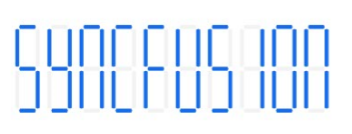

# Character types in SfDigitalGauge

The digital characters can be drawn in the following four different segments:

•	Seven

•	Fourteen

•	Sixteen

•	EightCrossEightDotMatrix

## Seven segment

The seven-segment type is capable of displaying numbers and a few uppercase letters efficiently.





    <gauge:SfDigitalGauge Value="SYNCFUSION" SegmentStrokeWidth="4" 
                          HeightRequest="100"  WidthRequest="340"
                          DisabledSegmentAlpha="25" DisabledSegmentColor="Gray"
                          CharacterHeight="90" CharacterWidth="25" 
                          HorizontalOptions="Center" VerticalOptions="Center"
                          CharacterType="SegmentSeven" 
                         CharacterStrokeColor="#146CED"/>





           SfDigitalGauge digital = new SfDigitalGauge();

            digital.HeightRequest = 100;

            digital.WidthRequest = 340;

            digital.Value = "SYNCFUSION";

            digital.CharacterHeight = 90;

            digital.CharacterWidth = 25;

            digital.HorizontalOptions = LayoutOptions.Center;

            digital.VerticalOptions = LayoutOptions.Center;

            digital.SegmentStrokeWidth = 4;

            digital.CharacterType = CharacterType.SegmentSeven;

            digital.DisabledSegmentAlpha = 25;

            digital.CharacterStrokeColor = Color.FromRgb(20, 108, 237);

            digital.DisabledSegmentColor = Color.Gray;





## Fourteen segment

The fourteen-segment type is capable of displaying numbers and alphabet efficiently.

## Sixteen segment

The sixteen-segment type is capable of displaying numbers and alphabet clearly.

## EightCrossEightDotMatrix segment

The dot matrix segment type is capable of displaying numbers, alphabet, and special characters efficiently.

