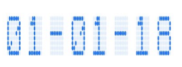

# Customize character segments

The characters of a digital gauge can be customized in terms of [`CharacterWidth`](https://help.syncfusion.com/cr/xamarin/Syncfusion.SfGauge.XForms.SfDigitalGauge.html#Syncfusion_SfGauge_XForms_SfDigitalGauge_CharacterWidth), [`CharacterHeight`](https://help.syncfusion.com/cr/xamarin/Syncfusion.SfGauge.XForms.SfDigitalGauge.html#Syncfusion_SfGauge_XForms_SfDigitalGauge_CharacterHeight), [`CharacterSpacing`](https://help.syncfusion.com/cr/xamarin/Syncfusion.SfGauge.XForms.SfDigitalGauge.html#Syncfusion_SfGauge_XForms_SfDigitalGauge_CharacterSpacing), and [`CharacterStrokeColor`](https://help.syncfusion.com/cr/xamarin/Syncfusion.SfGauge.XForms.SfDigitalGauge.html#Syncfusion_SfGauge_XForms_SfDigitalGauge_CharacterStrokeColor).

## customize character size

The values of digital characters are scaled by altering the height and width of digital characters. It is achieved by setting the [`CharacterHeight`](https://help.syncfusion.com/cr/xamarin/Syncfusion.SfGauge.XForms.SfDigitalGauge.html#Syncfusion_SfGauge_XForms_SfDigitalGauge_CharacterHeight) and [`CharacterWidth`](https://help.syncfusion.com/cr/xamarin/Syncfusion.SfGauge.XForms.SfDigitalGauge.html#Syncfusion_SfGauge_XForms_SfDigitalGauge_CharacterWidth) properties in the digital gauge. Default value of `CharacterHeight` and `CharacterWidth` is 25.





    <gauge:SfDigitalGauge Value="SYNCFUSION" SegmentStrokeWidth="4" 
                          HeightRequest="120"  WidthRequest="330" BackgroundColor="Black"
                          DisabledSegmentAlpha="30" DisabledSegmentColor="#146CED"
                          CharacterHeight="117" CharacterWidth="25" 
                          HorizontalOptions="Center" VerticalOptions="Center"
                          CharacterType="SegmentSeven" 
                          CharacterStrokeColor="#146CED"/>




            SfDigitalGauge digital = new SfDigitalGauge();

            digital.HeightRequest = 120;

            digital.WidthRequest = 330;

            digital.Value = "SYNCFUSION";

            digital.CharacterHeight = 117;

            digital.CharacterWidth = 25;

            digital.HorizontalOptions = LayoutOptions.Center;

            digital.VerticalOptions = LayoutOptions.Center;

            digital.SegmentStrokeWidth = 4;

            digital.CharacterType = CharacterType.SegmentSeven;

            digital.DisabledSegmentAlpha = 30;

            digital.BackgroundColor = Color.Black;

            digital.CharacterStrokeColor = Color.FromRgb(20, 108, 237);

            digital.DisabledSegmentColor = Color.FromRgb(20, 108, 237);





## Setting character spacing

The values of digital characters are spaced by altering the space of digital characters. It is achieved by setting the [`CharacterSpacing`](https://help.syncfusion.com/cr/xamarin/Syncfusion.SfGauge.XForms.SfDigitalGauge.html#Syncfusion_SfGauge_XForms_SfDigitalGauge_CharacterSpacing) property.





     <gauge:SfDigitalGauge Value="01-01-18" SegmentStrokeWidth="3" 
                          HeightRequest="100"  WidthRequest="360" CharacterSpacing="10"
                          DisabledSegmentAlpha="30" DisabledSegmentColor="#146CED"
                          CharacterHeight="90" CharacterWidth="25" 
                          HorizontalOptions="Center" VerticalOptions="Center"
                          CharacterType="EightCrossEightDotMatrix"                
                          CharacterStrokeColor="#146CED"/>




            SfDigitalGauge digital = new SfDigitalGauge();

            digital.HeightRequest = 100;

            digital.WidthRequest = 360;

            digital.Value = "01-01-18";

            digital.CharacterHeight = 90;

            digital.CharacterWidth = 25;

            digital.HorizontalOptions = LayoutOptions.Center;

            digital.VerticalOptions = LayoutOptions.Center;

            digital.SegmentStrokeWidth = 3;

            digital.CharacterSpacing = 10;

            digital.CharacterType = CharacterType.EightCrossEightDotMatrix;

            digital.DisabledSegmentAlpha = 30;

            digital.CharacterStrokeColor = Color.FromRgb(20, 108, 237);

            digital.DisabledSegmentColor = Color.FromRgb(20, 108, 237);





## Customize character segment stroke

The values of digital characters color can be customized using the [`CharacterStrokeColor`](https://help.syncfusion.com/cr/xamarin/Syncfusion.SfGauge.XForms.SfDigitalGauge.html#Syncfusion_SfGauge_XForms_SfDigitalGauge_CharacterStrokeColor) property.





     <gauge:SfDigitalGauge Value="1 2 3 4 5" SegmentStrokeWidth="3" 
                          HeightRequest="100"  WidthRequest="300"
                          DisabledSegmentAlpha="20" DisabledSegmentColor="#146CED"
                          CharacterHeight="90" CharacterWidth="25" 
                          HorizontalOptions="Center" VerticalOptions="Center"
                          CharacterType="SegmentSeven" 
                          CharacterStrokeColor="Purple"/>




            SfDigitalGauge digital = new SfDigitalGauge();

            digital.HeightRequest = 100;

            digital.WidthRequest = 300;

            digital.Value = "1 2 3 4 5";

            digital.CharacterHeight = 90;

            digital.CharacterWidth = 25;

            digital.HorizontalOptions = LayoutOptions.Center;

            digital.VerticalOptions = LayoutOptions.Center;

            digital.SegmentStrokeWidth = 3;

            digital.CharacterType = CharacterType.SegmentSeven;

            digital.DisabledSegmentAlpha = 20;

            digital.CharacterStrokeColor = Color.Purple;

            digital.DisabledSegmentColor = Color.FromRgb(20, 108, 237);





## Customize disabled segment

You can customize the color and opacity of disabled segments using the [`DisabledSegmentColor`](https://help.syncfusion.com/cr/xamarin/Syncfusion.SfGauge.XForms.SfDigitalGauge.html#Syncfusion_SfGauge_XForms_SfDigitalGauge_DisabledSegmentColor) and [`DisabledSegmentAlpha`](https://help.syncfusion.com/cr/xamarin/Syncfusion.SfGauge.XForms.SfDigitalGauge.html#Syncfusion_SfGauge_XForms_SfDigitalGauge_DisabledSegmentAlpha) properties. The width of the digital character value can be customized using the [`SegmentStrokeWidth`](https://help.syncfusion.com/cr/xamarin/Syncfusion.SfGauge.XForms.SfDigitalGauge.html#Syncfusion_SfGauge_XForms_SfDigitalGauge_SegmentStrokeWidth) property.





    <gauge:SfDigitalGauge Value="1 2 3 4 5" SegmentStrokeWidth="5" 
                          HeightRequest="100"  WidthRequest="300"
                          DisabledSegmentAlpha="25" DisabledSegmentColor="LightSkyBlue"
                          CharacterHeight="90" CharacterWidth="25" 
                          HorizontalOptions="Center" VerticalOptions="Center"
                          CharacterType="SegmentSeven" 
                         CharacterStrokeColor="#146CED"/>




            SfDigitalGauge digital = new SfDigitalGauge();

            digital.HeightRequest = 100;

            digital.WidthRequest = 300;

            this.BackgroundColor = Color.White;

            digital.Value = "1 2 3 4 5";

            digital.CharacterHeight = 90;

            digital.CharacterWidth = 25;

            digital.HorizontalOptions = LayoutOptions.Center;

            digital.VerticalOptions = LayoutOptions.Center;

            digital.SegmentStrokeWidth = 5;

            digital.CharacterType = CharacterType.SegmentSeven;

            digital.DisabledSegmentAlpha = 25;

            digital.CharacterStrokeColor = Color.FromRgb(20, 108, 237);

            digital.DisabledSegmentColor = Color.LightSkyBlue;





## Customize background color of digital gauge

You can customize the background color of the digital gauge using the [`BackgroundColor`](https://help.syncfusion.com/cr/xamarin/Syncfusion.SfGauge.XForms.SfDigitalGauge.html) property.





    <gauge:SfDigitalGauge Value="1 2 3 4 5" SegmentStrokeWidth="5" 
                          HeightRequest="100"  WidthRequest="300"
                          DisabledSegmentAlpha="25" DisabledSegmentColor="LightSkyBlue"
                          CharacterHeight="90" CharacterWidth="25" 
                          HorizontalOptions="Center" VerticalOptions="Center"
                          CharacterType="SegmentSeven" BackgroundColor="LightPink"
                         CharacterStrokeColor="#146CED"/>




            SfDigitalGauge digital = new SfDigitalGauge();

            digital.HeightRequest = 100;

            digital.WidthRequest = 300;

            this.BackgroundColor = Color.White;

            digital.Value = "1 2 3 4 5";

            digital.CharacterHeight = 90;

            digital.CharacterWidth = 25;

            digital.HorizontalOptions = LayoutOptions.Center;

            digital.VerticalOptions = LayoutOptions.Center;

            digital.SegmentStrokeWidth = 5;

            digital.CharacterType = CharacterType.SegmentSeven;

            digital.DisabledSegmentAlpha = 25;

            digital.CharacterStrokeColor = Color.FromRgb(20, 108, 237);

            digital.DisabledSegmentColor = Color.LightSkyBlue;

             digital.BackgroundColor = Color.LightPink;





