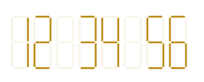
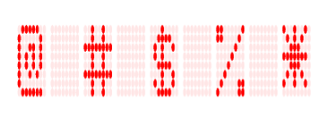

# Display value types in SfDigitalGauge

The digital gauge displays numbers, alphabet, and special characters, which are given in the value property.

## Setting value to number

Numbers can be displayed in digital gauge in different formats using the [`CharacterType`](https://help.syncfusion.com/cr/xamarin/Syncfusion.SfGauge.XForms.SfDigitalGauge.html#Syncfusion_SfGauge_XForms_SfDigitalGauge_CharacterType) property.





    <gauge:SfDigitalGauge Value="12 34 56" SegmentStrokeWidth="3" 
                          HeightRequest="100"  WidthRequest="330"
                          DisabledSegmentAlpha="25" DisabledSegmentColor="DarkGoldenrod"
                          CharacterHeight="90" CharacterWidth="30" 
                          HorizontalOptions="Center" VerticalOptions="Center"
                          CharacterType="SegmentSeven" 
                          CharacterStrokeColor="DarkGoldenrod"/>




            SfDigitalGauge digital = new SfDigitalGauge();

            digital.HeightRequest = 100;

            digital.WidthRequest = 330;

            digital.Value = "12 34 56";

            digital.CharacterHeight = 90;

            digital.CharacterWidth = 30;

            digital.HorizontalOptions = LayoutOptions.Center;

            digital.VerticalOptions = LayoutOptions.Center;

            digital.SegmentStrokeWidth = 3;

            digital.CharacterType = CharacterType.SegmentSeven;

            digital.DisabledSegmentAlpha = 25;

            digital.CharacterStrokeColor = Color.DarkGoldenrod;

            digital.DisabledSegmentColor = Color.DarkGoldenrod;





## Setting value to alphabet

Alphabet can be displayed in digital gauge using any one of the character format types.





    <gauge:SfDigitalGauge Value="SYNCFUSION" SegmentStrokeWidth="3" 
                          HeightRequest="100"  WidthRequest="340"
                          DisabledSegmentAlpha="25" DisabledSegmentColor="Green"
                          CharacterHeight="90" CharacterWidth="25" 
                          HorizontalOptions="Center" VerticalOptions="Center"
                          CharacterType="SegmentSixteen" 
                          CharacterStrokeColor="Green"/>





           SfDigitalGauge digital = new SfDigitalGauge();

            digital.HeightRequest = 100;

            digital.WidthRequest = 340;

            digital.Value = "SYNCFUSION";

            digital.CharacterHeight = 90;

            digital.CharacterWidth = 25;

            digital.HorizontalOptions = LayoutOptions.Center;

            digital.VerticalOptions = LayoutOptions.Center;

            digital.SegmentStrokeWidth = 3;

            digital.CharacterType = CharacterType.SegmentSixteen;

            digital.DisabledSegmentAlpha = 25;

            digital.CharacterStrokeColor = Color.Green;

            digital.DisabledSegmentColor = Color.Green;





## Setting value to special characters

Special characters can also be displayed in digital gauge using the EightCrossEightDotMatrix character format type.





    <gauge:SfDigitalGauge Value="@ # $ % *" SegmentStrokeWidth="3" 
                          HeightRequest="100"  WidthRequest="350"
                          DisabledSegmentAlpha="25" DisabledSegmentColor="Red"
                          CharacterHeight="90" CharacterWidth="30" 
                          HorizontalOptions="Center" VerticalOptions="Center"
                          CharacterType="EightCrossEightDotMatrix" 
                          CharacterStrokeColor="Red"/>





            SfDigitalGauge digital = new SfDigitalGauge();

            digital.HeightRequest = 100;

            digital.WidthRequest = 350;

            digital.Value = "@ # $ % *";

            digital.CharacterHeight = 90;

            digital.CharacterWidth = 30;

            digital.HorizontalOptions = LayoutOptions.Center;

            digital.VerticalOptions = LayoutOptions.Center;

            digital.SegmentStrokeWidth = 3;

            digital.CharacterType = CharacterType.EightCrossEightDotMatrix;

            digital.DisabledSegmentAlpha = 25;

            digital.CharacterStrokeColor = Color.Red;

            digital.DisabledSegmentColor = Color.Red;





