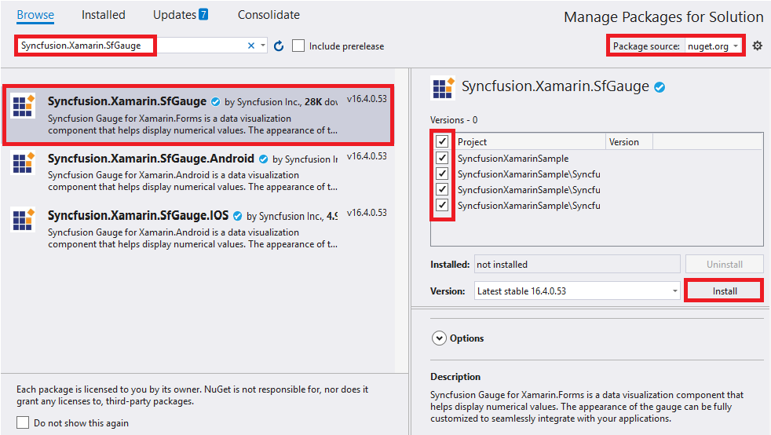

# Getting Started with SfDigitalGauge

This section explains the steps required to configure the [`SfDigitalGauge`](https://help.syncfusion.com/cr/xamarin/Syncfusion.SfGauge.XForms.SfDigitalGauge.html) and add basic elements to it using various APIs.

## Adding SfDigitalGauge reference

You can add SfDigitalGauge reference using one of the following methods:

**Method 1: Adding SfDigitalGauge reference from nuget.org**

Syncfusion Xamarin components are available in [nuget.org](https://www.nuget.org/). To add SfDigitalGauge to your project, open the NuGet package manager in Visual Studio, search for [Syncfusion.Xamarin.SfGauge](https://www.nuget.org/packages/Syncfusion.Xamarin.SfGauge), and then install it.

N> Install the same version of SfDigitalGauge NuGet in all the projects.

**Method 2: Adding SfDigitalGauge reference from toolbox**

Syncfusion also provides Xamarin Toolbox. Using this toolbox, you can drag the SfDigitalGauge control to the XAML page. It will automatically install the required NuGet packages and add the namespace to the page. To install Syncfusion Xamarin Toolbox, refer to [Toolbox](https://help.syncfusion.com/xamarin/utility#toolbox).

**Method 3: Adding SfDigitalGauge assemblies manually from the installed location**

If you prefer to manually reference the assemblies instead referencing from NuGet, add the following assemblies in respective projects.

Location: {Installed location}/{version}/Xamarin/lib

<table>
<tr>
<td>PCL</td>
<td>Syncfusion.SfGauge.XForms.dll Syncfusion.Core.XForms.dll Syncfusion.Licensing.dll </td>
</tr>
<tr>
<td>Android</td>
<td>Syncfusion.SfGauge.Android.dll Syncfusion.SfGauge.XForms.Android.dll Syncfusion.SfGauge.XForms.dll Syncfusion.Core.XForms.dll Syncfusion.Core.XForms.Android.dll Syncfusion.Licensing.dll </td>
</tr>
<tr>
<td>iOS</td>
<td>Syncfusion.SfGauge.iOS.dll Syncfusion.SfGauge.XForms.iOS.dll Syncfusion.SfGauge.XForms.dll Syncfusion.Core.XForms.dll Syncfusion.Core.XForms.iOS.dll Syncfusion.Licensing.dll </td>
</tr>
<tr>
<td>UWP</td>
<td>Syncfusion.SfGauge.UWP.dll Syncfusion.SfGauge.XForms.UWP.dll Syncfusion.SfGauge.XForms.dll Syncfusion.Core.XForms.dll Syncfusion.Core.XForms.UWP.dll Syncfusion.Licensing.dll </td>
</tr>
</table>

N> To know more about obtaining our components, refer to these links for [Mac](https://help.syncfusion.com/xamarin/introduction/download-and-installation/mac/) and [Windows](https://help.syncfusion.com/xamarin/introduction/download-and-installation/windows/).

I> Starting with v16.2.0.x, if you reference Syncfusion assemblies from the trial setup or from the NuGet feed, you also have to include a license key in your projects. Please refer to [Syncfusion license key](https://help.syncfusion.com/common/essential-studio/licensing/license-key/) to know about registering Syncfusion license key in your Xamarin application to use our components.

## Launching an application on each platform with SfDigitalGauge.

To use the SfDigitalGauge control inside an application, each platform requires some additional configurations. The configurations vary from platform to platform and is discussed in the following sections:

N> If you are adding the references from toolbox, this step is not needed.

### iOS

To launch the SfDigitalGauge in iOS, call the `SfDigitalGaugeRenderer.Init()` in the `FinishedLaunching` overridden method of the AppDelegate class after the Xamarin.Forms Framework has been initialized and before the LoadApplication is called, as demonstrated in the following code example.


public override bool FinishedLaunching(UIApplication app, NSDictionary options)
{
    …
    global::Xamarin.Forms.Forms.Init ();
    Syncfusion.SfGauge.XForms.iOS.SfGaugeRenderer.Init();
    LoadApplication (new App ());
    …
}
 

### Universal Windows Platform (UWP)

You need to initialize the digital gauge view assemblies in App.xaml.cs in UWP project as demonstrated in the following code samples. This is required to deploy the application with digital gauge in Release mode in UWP platform.


// In App.xaml.cs

protected override void OnLaunched(LaunchActivatedEventArgs e)
    {
        …
    	    rootFrame.NavigationFailed += OnNavigationFailed;
    
        // Add `using System.Reflection;`
        List<Assembly> assembliesToInclude = new List<Assembly>();
    
        // Now, add all the assemblies your app uses                 
        assembliesToInclude.Add(typeof(Syncfusion.SfGauge.XForms.UWP.SfGaugeRenderer).GetTypeInfo().Assembly);
		
        // Replaces Xamarin.Forms.Forms.Init(e);        
        Xamarin.Forms.Forms.Init(e, assembliesToInclude);	
        …     
    }



### Android

The Android platform does not require any additional configuration to render the digital gauge.

## Adding namespace for the assemblies





xmlns:gauge="clr-namespace:Syncfusion.SfGauge.XForms;assembly=Syncfusion.SfGauge.XForms"





using Syncfusion.SfGauge.XForms;





## Initialize gauge

You can initialize the [`SfDigitalGauge`](https://help.syncfusion.com/cr/xamarin/Syncfusion.SfGauge.XForms.SfDigitalGauge.html) control with a required optimal name using the included namespace.





     <gauge:SfDigitalGauge/> 





SfDigitalGauge sfDigitalGauge = new SfDigitalGauge();

this.Content = sfDigitalGauge;





## Setting value for digital gauge

The [`SfDigitalGauge`](https://help.syncfusion.com/cr/xamarin/Syncfusion.SfGauge.XForms.SfDigitalGauge.html) control provides options to display special characters or values using the [`Value`](https://help.syncfusion.com/cr/xamarin/Syncfusion.SfGauge.XForms.SfDigitalGauge.html#Syncfusion_SfGauge_XForms_SfDigitalGauge_Value) property.





      <gauge:SfDigitalGauge Value="1 2 3 4"/>





SfDigitalGauge sfDigitalGauge = new SfDigitalGauge();

sfDigitalGauge.Value = "11:59:50 PM";





## Setting character type for digital gauge

By using the [`CharacterType`](https://help.syncfusion.com/cr/xamarin/Syncfusion.SfGauge.XForms.SfDigitalGauge.html#Syncfusion_SfGauge_XForms_SfDigitalGauge_CharacterType) property, you can set the segments for digital gauge. The digital characters can be drawn in the following four different segments:

•	EightCrossEightDotMatrix

•	SegmentFourteen

•	SegmentSeven

•	SegmentSixteen





     <gauge:SfDigitalGauge CharacterType="EightCrossEightDotMatrix"/>





SfDigitalGauge digital = new SfDigitalGauge();

digital.CharacterType = CharacterType.EightCrossEightDotMatrix;





## Configuring properties

The [`CharacterHeight`](https://help.syncfusion.com/cr/xamarin/Syncfusion.SfGauge.XForms.SfDigitalGauge.html#Syncfusion_SfGauge_XForms_SfDigitalGauge_CharacterHeight), [`CharacterWidth`](https://help.syncfusion.com/cr/xamarin/Syncfusion.SfGauge.XForms.SfDigitalGauge.html#Syncfusion_SfGauge_XForms_SfDigitalGauge_CharacterWidth), and [`CharacterStroke`](https://help.syncfusion.com/cr/xamarin/Syncfusion.SfGauge.XForms.SfDigitalGauge.html#Syncfusion_SfGauge_XForms_SfDigitalGauge_CharacterStrokeColor)properties are used to display characters, which can be customized as shown in the following code snippets:





       <gauge:SfDigitalGauge  CharacterHeight="60" CharacterWidth="25" 
                                                    
                          CharacterStrokeColor="#146CED"/>





            SfDigitalGauge digital = new SfDigitalGauge();

            digital.CharacterHeight = 60;

            digital.CharacterWidth = 25;

            digital.CharacterStrokeColor = Color.FromRgb(20, 108, 237);





The following code example is the complete code of the previous configurations.





     <?xml version="1.0" encoding="utf-8" ?>
       <ContentPage xmlns="http://xamarin.com/schemas/2014/forms"
             xmlns:x="http://schemas.microsoft.com/winfx/2009/xaml"
             xmlns:local="clr-namespace:GaugeGettingStarted"
             x:Class="GaugeGettingStarted.MainPage"
             xmlns:gauge="clr-namespace:Syncfusion.SfGauge.XForms;assembly=Syncfusion.SfGauge.XForms">

         <gauge:SfDigitalGauge Value="11:59:50 PM" SegmentStrokeWidth="5" BackgroundColor="White"
                               HeightRequest="100"  WidthRequest="375"
                               DisabledSegmentAlpha="25" DisabledSegmentColor="Gray"
                               CharacterHeight="90" CharacterWidth="25" 
                               HorizontalOptions="Center" VerticalOptions="Center"
                               CharacterType="EightCrossEightDotMatrix" 
                               CharacterStrokeColor="#146CED"/>
      </ContentPage>





using Xamarin.Forms;

using Syncfusion.SfGauge.XForms;

namespace GaugeGettingStarted

{

    public partial class MainPage : ContentPage

    {

        public MainPage()
        {
            InitializeComponent();

            //Initialize digital gauge

            SfDigitalGauge digital = new SfDigitalGauge();
            
            digital.BackgroundColor = Color.White;

            digital.HeightRequest = 100;

            digital.WidthRequest = 375;

            digital.Value = "11:59:50 PM";

            digital.CharacterHeight = 90;

            digital.CharacterWidth = 25;

            digital.HorizontalOptions = LayoutOptions.Center;

            digital.VerticalOptions = LayoutOptions.Center;

            digital.SegmentStrokeWidth = 5;

            digital.CharacterType = CharacterType.EightCrossEightDotMatrix;

            digital.DisabledSegmentAlpha = 25;

            digital.CharacterStrokeColor = Color.FromRgb(20, 108, 237);

            digital.DisabledSegmentColor = Color.Gray;

            this.Content = digital;

        }
    }
}





The following screenshot illustrates the result of the previous codes.

You can find the complete getting started sample from this [`link`](http://www.syncfusion.com/downloads/support/directtrac/general/ze/Gauge-GettingStarted-72347847).

## See also

[How to resolve SfCircularGauge not rendering issue in Xamarin.Forms for iOS](https://www.syncfusion.com/kb/7993/how-to-resolve-sfgauge-not-rendering-issue-in-xamarin-forms-for-ios)