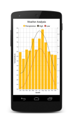
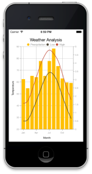
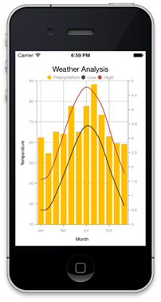

# Getting Started

This section provides a quick overview for working with Essential Chart for Xamarin.Forms. You can walk through the entire process of creating a real world chart.

The goal of this tutorial is to visualize the weather data for Washington, DC during the period 1961-1990. The raw sample data is given below.

<table>
<tr>
<td>
Month</td><td>
High</td><td>
Low</td><td>
Precipitation</td></tr>
<tr>
<td>
January</td><td>
42</td><td>
27</td><td>
3.03</td></tr>
<tr>
<td>
February</td><td>
44</td><td>
28</td><td>
2.48</td></tr>
<tr>
<td>
March</td><td>
53</td><td>
35</td><td>
3.23</td></tr>
<tr>
<td>
April</td><td>
64</td><td>
44</td><td>
3.15</td></tr>
<tr>
<td>
May</td><td>
75</td><td>
54</td><td>
4.13</td></tr>
<tr>
<td>
June</td><td>
83</td><td>
63</td><td>
3.23</td></tr>
<tr>
<td>
July</td><td>
87</td><td>
68</td><td>
4.13</td></tr>
<tr>
<td>
August</td><td>
84</td><td>
66</td><td>
4.88</td></tr>
<tr>
<td>
September</td><td>
78</td><td>
59</td><td>
3.82</td></tr>
<tr>
<td>
October</td><td>
67</td><td>
48</td><td>
3.07</td></tr>
<tr>
<td>
November</td><td>
55</td><td>
38</td><td>
2.83</td></tr>
<tr>
<td>
December</td><td>
45</td><td>
29</td><td>
2.8</td></tr>
</table>

This is how the final output will look like on iOS, Android and Windows Phone devices. You can also download the entire source code of this demo from [here.](http://files2.syncfusion.com/Installs/v12.2.0.40/Samples/Xamarin/Chart_GettingStarted.zip)

## Referencing Essential Studio components in your solution

If you had acquired Essential Studio components through the Xamarin component store interface from within your IDE, then after adding the components to your Xamarin.iOS, Xamarin.Android and Windows Phone projects through the Component manager, you will still need to manually reference the PCL (Portable Class Library) assemblies in the Xamarin.Forms PCL project in your solution. You can do this by manually adding the relevant PCL assembly references to your PCL project contained in the following path inside of your solution folder.  

Components/syncfusionessentialstudio-version/lib/pcl/

Alternatively if you had downloaded Essential Studio from Syncfusion.com or through the Xamarin store web interface then all assembly references need to be added manually.

After installing Essential Studio for Xamarin, all the required assemblies can be found in the installation folders, typically

{Syncfusion Installed location}\Essential Studio\12.2.0.40\lib

Eg: C:\Program Files (x86)\Syncfusion\Essential Studio\12.2.0.40\lib

or after downloading through the Xamarin store web interface, all the required assemblies can be found in the below folder

{download location}\syncfusionessentialstudio-version\lib

You can then add the assembly references to the respective projects as shown below

### PCL project

pcl\Syncfusion.SfChart.XForm.dll 

### Android project

android\Syncfusion.SfChart.Android.dll

android\Syncfusion.SfChart.xForms.Android.dll

### iOS(Classic) project

ios\Syncfusion.SfChart.iOS.dll 

ios\Syncfusion.SfChart.xForms.iOS.dll

ios\Syncfusion.SfChart.XForm.dll

### iOS(Unified) project

ios-unified\Syncfusion.SfChart.iOS.dll 

ios-unified\Syncfusion.SfChart.xForms.iOS.dll

ios-unified\Syncfusion.SfChart.XForm.dll

### Windows Phone project

wp8\Syncfusion.SfChart.WP8.dll

wp8\Syncfusion.SfChart.xForms.WinPhone.dll

N> Essential Chart for Xamarin is compatible with Xamarin. Forms v.1.4.4.6392.

Currently an additional step is required for Windows Phone and iOS projects. We need to create an instance of the chart custom renderer as shown below. 

Create an instance of SfChartRenderer in MainPage constructor in of the Windows Phone project as shown 


  	 public MainPage()

       	 {

           		 new SfChartRenderer();

        		    ...    

     	}


Create an instance of SfChartRenderer in FinishedLaunching overridden method of AppDelegate class in iOS Project as shown below


public override bool FinishedLaunching(UIApplication app, NSDictionary options)

        	{

         		  ...

         		  new SfChartRenderer ();

        		   ...

       	 }	


## Adding and configuring the chart

The chart control can be configured entirely in C# code or using XAML markup.

1. Create an instance of SfChart.
2. Add the primary and secondary axis for the chart as shown below.

   ~~~ csharp

		SfChart chart = new SfChart ();

		_//Initializing Primary Axis_
		CategoryAxis primaryAxis = new CategoryAxis ();
		primaryAxis.Title = new ChartAxisTitle (){ Text = "Month" };

		chart.PrimaryAxis = primaryAxis;

		_//Initializing Secondary Axis_
		NumericalAxis secondaryAxis = new NumericalAxis ();
		secondaryAxis.Title = new ChartAxisTitle (){ Text = "Temperature" };

		chart.SecondaryAxis = secondaryAxis;

		this.Content = chart;
   ~~~ 
   

   ~~~ xaml
	  
	  <chart:SfChart>

		<chart:SfChart.PrimaryAxis>

		  <chart:CategoryAxis>

			<chart:CategoryAxis.Title>

			  <chart:ChartAxisTitle Text="Month"/>

			</chart:CategoryAxis.Title>

		  </chart:CategoryAxis>

		</chart:SfChart.PrimaryAxis>

		<chart:SfChart.SecondaryAxis>

		  <chart:NumericalAxis>

			<chart:NumericalAxis>

			  <chart:ChartAxisTitle Text="Month"/>

			</chart:NumericalAxis>

		  </chart:NumericalAxis>

		</chart:SfChart.SecondaryAxis>
		  
		</chart:SfChart>

   ~~~
   

3. A title for the chart is set using the Title property as shown below,

   ~~~ csharp

		chart.Title = new ChartTitle (){ Text = "Weather Analysis" };
   ~~~
   

   ~~~ xaml

	  <chart:SfChart>

		<chart:SfChart.Title>

		 <chart:ChartTitle Text="Weather Analysis"/>  

		</chart:SfChart.Title>

		…

	  </chart:SfChart>
   ~~~
   

## Add Chart series

In this sample, we will be visualize the temperature over the months using a Column Series. Before creating the series, let’s create a data model representing the climate details data. 

In SfChart, the series itemsource should be a collection of _ChartDataPoint_ objects. Add the following class for generating the datapoints.



    public class DataModel
    {
        public ObservableCollection<ChartDataPoint>  HighTemperature;

        public DataModel ()
        {
            HighTemperature = new ObservableCollection<ChartDataPoint> ();

            HighTemperature.Add (new ChartDataPoint ("Jan", 42));
            HighTemperature.Add (new ChartDataPoint ("Feb", 44));
            HighTemperature.Add (new ChartDataPoint ("Mar", 53));
            HighTemperature.Add (new ChartDataPoint ("Apr", 64));
            HighTemperature.Add (new ChartDataPoint ("May", 75));
            HighTemperature.Add (new ChartDataPoint ("Jun", 83));
            HighTemperature.Add (new ChartDataPoint ("Jul", 87));
            HighTemperature.Add (new ChartDataPoint ("Aug", 84));
            HighTemperature.Add (new ChartDataPoint ("Sep", 78));
            HighTemperature.Add (new ChartDataPoint ("Oct", 67));
            HighTemperature.Add (new ChartDataPoint ("Nov", 55));
            HighTemperature.Add (new ChartDataPoint ("Dec", 45));

        }

   }


Now, you can add the series into the chart and set its ItemsSource as shown below

  

_//Adding the series to the chart_
  chart.Series.Add (new ColumnSeries () {
                ItemsSource = dataModel.HighTemperature
            }); 




 

  <chart:SfChart>

   …

    <chart:SfChart.Series>

      <chart:ColumnSeries 

           ItemsSource = "{Binding HighTemperature}"/>

    </chart:SfChart.Series>

  </chart:SfChart>


## Adding Legends

Legends can be enabled in SfChart by initializing the Legend property with ChartLegend instance as follows.



 

_//Adding Legend_ 
 chart.Legend = new ChartLegend (); 





 

<chart:SfChart>

    <chart:SfChart.Legend>

      <chart:ChartLegend/>

    </chart:SfChart.Legend>

    …

 </chart:SfChart>



Circular legend icons will be displayed for each series by default. Next, we need to provide the labels for the series using the Label property, this information is displayed along the legend icon.

The next step is to add the HighTemperature column series as shown below



_//Adding the column series to the chart_
chart.Series.Add (new ColumnSeries () {
        ItemsSource = dataModel.HighTemperature,
        Label = "Series 1"
});




<chart:SfChart>

    …

    <chart:SfChart.Series>

      <chart:ColumnSeries Label = "Series 1" ItemsSource = "{Binding HighTemperature}"/>

    </chart:SfChart.Series>

  </chart:SfChart>


## Add multiple series to the chart

So far we have visualized just the high temperature data over time. Now let’s visualize other data such as low temperature and precipitation.

Let’s add two SplineSeries for displaying high and low temperatures and a ColumnSeries for displaying the precipitation as shown below



           

     DataModel dataModel = new DataModel ();

_//Adding ColumnSeries to the chart for displaying Precipitation_
     chart.Series.Add (new ColumnSeries () {
     ItemsSource = dataModel.Precipitation,
     Label = "Precipitation"
     });

_//Adding the SplineSeries to the chart for displaying  high temperature_
     chart.Series.Add (new SplineSeries () {
     ItemsSource = dataModel.HighTemperature,
     Label = "High"
     });

_//Adding the SplineSeries to the chart for displaying  low temperature_
     chart.Series.Add (new SplineSeries () {
     ItemsSource = dataModel.LowTemperature,
     Label = "Low"
     });




   

  <chart:SfChart>

…

    <chart:SfChart.Series>

      <chart:ColumnSeries   Label = "Low" ItemsSource = "{Binding Precipitation}"/>

      <chart:SplineSeries  Label = "High" ItemsSource = "{Binding HighTemperature}"/>

      <chart:SplineSeries  Label = "Low" ItemsSource = "{Binding LowTemperature}"/>

    </chart:SfChart.Series>

  </chart:SfChart>


Currently all the data is plotted against a single scale but the precipitation data needs to be plotted against a different scale.

## Add multiple Y-axis

Let’s add a secondary axis(y axis) to the chart as shown below



 

_//Adding ColumnSeries to the chart for displaying  Precipitation_
            chart.Series.Add (new ColumnSeries () {
                ItemsSource = dataModel.Precipitation,
                Label = "Precipitation",
                YAxis = new NumericalAxis(){ OpposedPosition = true }

             );





  <chart:SfChart>

…

      <chart:ColumnSeries   Label = "Low" ItemsSource = "{Binding Precipitation}">

        <chart:ColumnSeries.YAxis>

          <chart:NumericalAxis OpposedPosition ="true"/>

        </chart:ColumnSeries.YAxis>

      </chart:ColumnSeries>

…

  </chart:SfChart>

  
 
The OpposedPosition has been set to true to place the secondary axis on the opposite side.

Here is the complete code sample for creating the Chart.



    

    public class WeatherChartDemo : ContentPage
    {

        public WeatherChartDemo ()
        {

_//Initializing chart_
            SfChart chart = new SfChart ();
            chart.Title = new ChartTitle (){ Text = "Weather Analysis" };

_//Initializing Primary Axis_
            CategoryAxis primaryAxis = new CategoryAxis ();
            primaryAxis.Title = new ChartAxisTitle (){ Text = "Month" };

            chart.PrimaryAxis = primaryAxis;

_//Initializing Secondary Axis_
            NumericalAxis secondaryAxis = new NumericalAxis ();
            secondaryAxis.Title = new ChartAxisTitle (){ Text = "Temperature" };

            chart.SecondaryAxis = secondaryAxis;

            DataModel dataModel = new DataModel ();

_//Adding ColumnSeries to the chart for displaying  Precipitation_
            chart.Series.Add (new ColumnSeries () {
                ItemsSource = dataModel.Precipitation,
                Label = "Precipitation",
                YAxis = new NumericalAxis(){ OpposedPosition = true, 

                                ShowMajorGridLines =  false }
            });

_//Adding the SplineSeries to the chart for displaying high temperature_
            chart.Series.Add (new SplineSeries () {
                ItemsSource = dataModel.HighTemperature,
                Label = "High"
            });

_//Adding the SplineSeries to the chart for displaying low temperature_
            chart.Series.Add (new SplineSeries () {
                ItemsSource = dataModel.LowTemperature,
                Label = "Low"
            });

_//Adding Chart Legend for the Chart_
            chart.Legend = new ChartLegend ();

            this.Content = chart;
        }

    }

    public class DataModel
    {
        public ObservableCollection<ChartDataPoint>  HighTemperature  { get; set; }

        public ObservableCollection<ChartDataPoint>  LowTemperature { get; set; }

        public ObservableCollection<ChartDataPoint>  Precipitation { get; set; }

        public DataModel ()
        {
            HighTemperature = new ObservableCollection<ChartDataPoint> ();

            HighTemperature.Add (new ChartDataPoint ("Jan", 42));
            HighTemperature.Add (new ChartDataPoint ("Feb", 44));
            HighTemperature.Add (new ChartDataPoint ("Mar", 53));
            HighTemperature.Add (new ChartDataPoint ("Apr", 64));
            HighTemperature.Add (new ChartDataPoint ("May", 75));
            HighTemperature.Add (new ChartDataPoint ("Jun", 83));
            HighTemperature.Add (new ChartDataPoint ("Jul", 87));
            HighTemperature.Add (new ChartDataPoint ("Aug", 84));
            HighTemperature.Add (new ChartDataPoint ("Sep", 78));
            HighTemperature.Add (new ChartDataPoint ("Oct", 67));
            HighTemperature.Add (new ChartDataPoint ("Nov", 55));
            HighTemperature.Add (new ChartDataPoint ("Dec", 45));

            LowTemperature = new ObservableCollection<ChartDataPoint> ();

            LowTemperature.Add (new ChartDataPoint ("Jan", 27));
            LowTemperature.Add (new ChartDataPoint ("Feb", 28));
            LowTemperature.Add (new ChartDataPoint ("Mar", 35));
            LowTemperature.Add (new ChartDataPoint ("Apr", 44));
            LowTemperature.Add (new ChartDataPoint ("May", 54));
            LowTemperature.Add (new ChartDataPoint ("Jun", 63));
            LowTemperature.Add (new ChartDataPoint ("Jul", 68));
            LowTemperature.Add (new ChartDataPoint ("Aug", 66));
            LowTemperature.Add (new ChartDataPoint ("Sep", 59));
            LowTemperature.Add (new ChartDataPoint ("Oct", 48));
            LowTemperature.Add (new ChartDataPoint ("Nov", 38));
            LowTemperature.Add (new ChartDataPoint ("Dec", 29));

            Precipitation = new ObservableCollection<ChartDataPoint> ();

            Precipitation.Add (new ChartDataPoint ("Jan", 3.03));
            Precipitation.Add (new ChartDataPoint ("Feb", 2.48));
            Precipitation.Add (new ChartDataPoint ("Mar", 3.23));
            Precipitation.Add (new ChartDataPoint ("Apr", 3.15));
            Precipitation.Add (new ChartDataPoint ("May", 4.13));
            Precipitation.Add (new ChartDataPoint ("Jun", 3.23));
            Precipitation.Add (new ChartDataPoint ("Jul", 4.13));
            Precipitation.Add (new ChartDataPoint ("Aug", 4.88));
            Precipitation.Add (new ChartDataPoint ("Sep", 3.82));
            Precipitation.Add (new ChartDataPoint ("Oct", 3.07));
            Precipitation.Add (new ChartDataPoint ("Nov", 2.83));
            Precipitation.Add (new ChartDataPoint ("Dec", 2.8));
        }
    }




<chart:SfChart>

    <chart:SfChart.Legend>

      <chart:ChartLegend/>

    </chart:SfChart.Legend>

    <chart:SfChart.Title>

      <chart:ChartTitle Text="Weather Analysis"/>

    </chart:SfChart.Title>

    <chart:SfChart.PrimaryAxis>

      <chart:CategoryAxis>

        <chart:CategoryAxis.Title>

          <chart:ChartAxisTitle Text="Month"/>

        </chart:CategoryAxis.Title>

      </chart:CategoryAxis>

    </chart:SfChart.PrimaryAxis>

    <chart:SfChart.SecondaryAxis>

      <chart:NumericalAxis>

        <chart:NumericalAxis.Title>

          <chart:ChartAxisTitle Text="Month"/>

        </chart:NumericalAxis.Title>

      </chart:NumericalAxis>

    </chart:SfChart.SecondaryAxis>

    <chart:SfChart.Series>

      <chart:ColumnSeries   Label = "Low" ItemsSource = "{Binding Precipitation}">

        <chart:ColumnSeries.YAxis>

          <chart:NumericalAxis OpposedPosition="true" ShowMajorGridLines="false"/>

        </chart:ColumnSeries.YAxis>

      </chart:ColumnSeries>

      <chart:SplineSeries  Label = "High" ItemsSource = "{Binding HighTemperature}"/>

      <chart:SplineSeries  Label = "Low" ItemsSource = "{Binding LowTemperature}"/>

    </chart:SfChart.Series>

  </chart:SfChart>


## Create your first Chart in Xamarin.Android

This section provides a quick overview for working with Essential Chart for Xamarin.Android. It guides you to the entire process of creating a real-world chart.

This section enables you to visualize the weather data for Washington, DC, during the period 1961-1990. The raw sample data is given as follows.

<table>
<tr>
<td>
Month</td><td>
High</td><td>
Low</td><td>
Precipitation</td></tr>
<tr>
<td>
January</td><td>
42</td><td>
27</td><td>
3.03</td></tr>
<tr>
<td>
February</td><td>
44</td><td>
28</td><td>
2.48</td></tr>
<tr>
<td>
March</td><td>
53</td><td>
35</td><td>
3.23</td></tr>
<tr>
<td>
April</td><td>
64</td><td>
44</td><td>
3.15</td></tr>
<tr>
<td>
May</td><td>
75</td><td>
54</td><td>
4.13</td></tr>
<tr>
<td>
June</td><td>
83</td><td>
63</td><td>
3.23</td></tr>
<tr>
<td>
July</td><td>
87</td><td>
68</td><td>
4.13</td></tr>
<tr>
<td>
August</td><td>
84</td><td>
66</td><td>
4.88</td></tr>
<tr>
<td>
September</td><td>
78</td><td>
59</td><td>
3.82</td></tr>
<tr>
<td>
October</td><td>
67</td><td>
48</td><td>
3.07</td></tr>
<tr>
<td>
November</td><td>
55</td><td>
38</td><td>
2.83</td></tr>
<tr>
<td>
December</td><td>
45</td><td>
29</td><td>
2.8</td></tr>
</table>

### Reference Essential Studio components in your solution

After installing Essential Studio for Xamarin, you can find all the required assemblies in the installation folders, 

{Syncfusion Installed location}\Essential Studio\12.4.0.24\lib

N> Assemblies are available in unzipped package location in Mac.

Add the following assembly references to the Android project,

android\Syncfusion.SfChart.Android.dll

### Add and configure the Chart

The following steps explain on how to create a Chart and configure its elements,

1. Create an instance of SfChart.
2. Add the primary and secondary axis for the chart as follows.



SfChart chart = new SfChart (this);

_//Initializing Primary Axis_
CategoryAxis primaryAxis = new CategoryAxis ();
primaryAxis.Title.Text = "Month";

chart.PrimaryAxis = primaryAxis;

_//Initializing Secondary Axis_
NumericalAxis secondaryAxis = new NumericalAxis ();
secondaryAxis.Title.Text = "Temperature";

chart.SecondaryAxis = secondaryAxis;

SetContentView(chart);


You can set a title for the chart using the Title.Text property as follows.

 chart.Title.Text = "Weather Analysis";

Add a Chart series

In this sample, you can display the temperature over the months using a Column Series. Before creating the series, create a data model representing the climate details data.

In SfChart, the series itemsource should to be a collection of ChartDataPoint objects. Add the following class for generating the datapoints.

    public class DataModel
    {
        public ObservableArrayList  HighTemperature;

        public DataModel ()
        {
            HighTemperature = new ObservableArrayList ();

            HighTemperature.Add (new ChartDataPoint ("Jan", 42));
            HighTemperature.Add (new ChartDataPoint ("Feb", 44));
            HighTemperature.Add (new ChartDataPoint ("Mar", 53));
            HighTemperature.Add (new ChartDataPoint ("Apr", 64));
            HighTemperature.Add (new ChartDataPoint ("May", 75));
            HighTemperature.Add (new ChartDataPoint ("Jun", 83));
            HighTemperature.Add (new ChartDataPoint ("Jul", 87));
            HighTemperature.Add (new ChartDataPoint ("Aug", 84));
            HighTemperature.Add (new ChartDataPoint ("Sep", 78));
            HighTemperature.Add (new ChartDataPoint ("Oct", 67));
            HighTemperature.Add (new ChartDataPoint ("Nov", 55));
            HighTemperature.Add (new ChartDataPoint ("Dec", 45));

        }

   }

Now, add the series to the chart and set its DataSource as follows.

_//Adding the series to the chart_
  chart.Series.Add (new ColumnSeries () {
                DataSource= dataModel.HighTemperature
            }); 


### Add Legends

You can enable the Legends in SfChart by setting legend visibility to visible as follows.

_//Adding Chart Legend for the Chart_
 chart.Legend.Visibility = Visibility.Visible;  


Circular legend icons are displayed for each series by default. Next, provide the labels for the series using the Label property, this information is displayed along with the legend icon.

The next step is to add the HighTemperature column series as follows.

_//Adding the column series to the chart_
chart.Series.Add (new ColumnSeries () {
        DataSource = dataModel.HighTemperature,
        Label = "Series 1" 
});


### Add multiple series to the SfChart

So far, only the high temperature data is displayed over time. Now, you can display other data such as low temperature and precipitation.

Add two SplineSeries for displaying high and low temperatures and a ColumnSeries for displaying the precipitation as follows.

            DataModel dataModel = new DataModel ();

_//Adding ColumnSeries to the chart for Precipitation_
     chart.Series.Add (new ColumnSeries () {
     DataSource = dataModel.Precipitation,
     Label = "Precipitation"
     });

_//Adding the SplineSeries to the chart for high temperature_
     chart.Series.Add (new SplineSeries () {
     DataSource = dataModel.HighTemperature,
     Label = "High"
     });

_//Adding the SplineSeries to the chart for low temperature_
     chart.Series.Add (new SplineSeries () {
     DataSource = dataModel.LowTemperature,
     Label = "Low"
     });

Currently, all the data is plotted against a single scale but the precipitation data should be plotted against a different scale.

### Add multiple Y-axis

Add a secondary axis(y axis) to the chart as follows.



_//Adding ColumnSeries to the chart for Precipitation_
            chart.Series.Add (new ColumnSeries () {
                DataSource = dataModel.Precipitation,
                Label = "Precipitation",
                YAxis = new NumericalAxis(){ OpposedPosition = true }

             );


The OpposedPosition is set to true to place the secondary axis on the opposite side.

The following is the complete code example for creating the Chart.


    public class WeatherActivity : Activity

    {

        protected override void OnCreate (Bundle bundle)

        {

	base.OnCreate (bundle);          

             _//Initializing chart_
            SfChart chart = new SfChart (this); 
            chart.Title.Text = "Weather Analysis" ;

_//Initializing Primary Axis_
            CategoryAxis primaryAxis = new CategoryAxis ();
            primaryAxis.Title.Text = “Month”;

            chart.PrimaryAxis = primaryAxis;

_//Initializing Secondary Axis_
            NumericalAxis secondaryAxis = new NumericalAxis ();
            secondaryAxis.Title.Text  = "Temperature" ;

            chart.SecondaryAxis = secondaryAxis;

            DataModel dataModel = new DataModel ();

_//Adding ColumnSeries to the chart for Precipitation_
            chart.Series.Add (new ColumnSeries () {
                DataSource = dataModel.Precipitation,
                Label = "Precipitation",
                YAxis = new NumericalAxis(){ OpposedPosition = true, 

                                ShowMajorGridLines=  false }
            });

_//Adding the SplineSeries to the chart for high temperature_
            chart.Series.Add (new SplineSeries () {
                DataSource = dataModel.HighTemperature,
                Label = "High"
            });

_//Adding the SplineSeries to the chart for low temperature_
            chart.Series.Add (new SplineSeries () {
                DataSource = dataModel.LowTemperature,
                Label = "Low"
            });

_//Adding Chart Legend for the Chart_
            chart.Legend.Visibility = Visibility.Visible; 

            SetContentView(chart);

        }

    }

    public class DataModel
    {
        public ObservableArrayList  HighTemperature;

        public ObservableArrayList  LowTemperature;

        public ObservableArrayList  Precipitation;

        public DataModel ()
        {
            HighTemperature = new ObservableArrayList ();

            HighTemperature.Add (new ChartDataPoint ("Jan", 42));
            HighTemperature.Add (new ChartDataPoint ("Feb", 44));
            HighTemperature.Add (new ChartDataPoint ("Mar", 53));
            HighTemperature.Add (new ChartDataPoint ("Apr", 64));
            HighTemperature.Add (new ChartDataPoint ("May", 75));
            HighTemperature.Add (new ChartDataPoint ("Jun", 83));
            HighTemperature.Add (new ChartDataPoint ("Jul", 87));
            HighTemperature.Add (new ChartDataPoint ("Aug", 84));
            HighTemperature.Add (new ChartDataPoint ("Sep", 78));
            HighTemperature.Add (new ChartDataPoint ("Oct", 67));
            HighTemperature.Add (new ChartDataPoint ("Nov", 55));
            HighTemperature.Add (new ChartDataPoint ("Dec", 45));

            LowTemperature = new ObservableArrayList ();

            LowTemperature.Add (new ChartDataPoint ("Jan", 27));
            LowTemperature.Add (new ChartDataPoint ("Feb", 28));
            LowTemperature.Add (new ChartDataPoint ("Mar", 35));
            LowTemperature.Add (new ChartDataPoint ("Apr", 44));
            LowTemperature.Add (new ChartDataPoint ("May", 54));
            LowTemperature.Add (new ChartDataPoint ("Jun", 63));
            LowTemperature.Add (new ChartDataPoint ("Jul", 68));
            LowTemperature.Add (new ChartDataPoint ("Aug", 66));
            LowTemperature.Add (new ChartDataPoint ("Sep", 59));
            LowTemperature.Add (new ChartDataPoint ("Oct", 48));
            LowTemperature.Add (new ChartDataPoint ("Nov", 38));
            LowTemperature.Add (new ChartDataPoint ("Dec", 29));

            Precipitation = new ObservableArrayList ();

            Precipitation.Add (new ChartDataPoint ("Jan", 3.03));
            Precipitation.Add (new ChartDataPoint ("Feb", 2.48));
            Precipitation.Add (new ChartDataPoint ("Mar", 3.23));
            Precipitation.Add (new ChartDataPoint ("Apr", 3.15));
            Precipitation.Add (new ChartDataPoint ("May", 4.13));
            Precipitation.Add (new ChartDataPoint ("Jun", 3.23));
            Precipitation.Add (new ChartDataPoint ("Jul", 4.13));
            Precipitation.Add (new ChartDataPoint ("Aug", 4.88));
            Precipitation.Add (new ChartDataPoint ("Sep", 3.82));
            Precipitation.Add (new ChartDataPoint ("Oct", 3.07));
            Precipitation.Add (new ChartDataPoint ("Nov", 2.83));
            Precipitation.Add (new ChartDataPoint ("Dec", 2.8));
        }
    }



The following screenshot illustrates the output.

## Create your first Chart in Xamarin.iOS

This section provides a quick overview for working with Essential Chart for Xamarin.iOS. It walks you through the entire process of creating a real-world Chart.

This section is to help you visualize the weather data for Washington, DC, during the period 1961-1990. The raw sample data is given as follows.

Table 3: Weather Data Sample

<table>
<tr>
<td>
Month</td><td>
High</td><td>
Low</td><td>
Precipitation</td></tr>
<tr>
<td>
January</td><td>
42</td><td>
27</td><td>
3.03</td></tr>
<tr>
<td>
February</td><td>
44</td><td>
28</td><td>
2.48</td></tr>
<tr>
<td>
March</td><td>
53</td><td>
35</td><td>
3.23</td></tr>
<tr>
<td>
April</td><td>
64</td><td>
44</td><td>
3.15</td></tr>
<tr>
<td>
May</td><td>
75</td><td>
54</td><td>
4.13</td></tr>
<tr>
<td>
June</td><td>
83</td><td>
63</td><td>
3.23</td></tr>
<tr>
<td>
July</td><td>
87</td><td>
68</td><td>
4.13</td></tr>
<tr>
<td>
August</td><td>
84</td><td>
66</td><td>
4.88</td></tr>
<tr>
<td>
September</td><td>
78</td><td>
59</td><td>
3.82</td></tr>
<tr>
<td>
October</td><td>
67</td><td>
48</td><td>
3.07</td></tr>
<tr>
<td>
November</td><td>
55</td><td>
38</td><td>
2.83</td></tr>
<tr>
<td>
December</td><td>
45</td><td>
29</td><td>
2.8</td></tr>
</table>

This is how the final output looks like on iOS devices.

### Reference Essential Studio Components in your Solution

After installing Essential Studio for Xamarin, you can find all the required assemblies in the installation folders, typically:

{Syncfusion Installed location}\Essential Studio\{version number}\lib

N> Assemblies are available in unzipped package location in Mac.

You have to add the following assembly reference to the iOS classic project

ios\Syncfusion.SfChart.iOS.dll

and below assembly reference to the iOS unified project.

ios-unified\Syncfusion.SfChart.iOS.dll

### Add and Configure Chart

The following steps explain how to create a Chart and configure its elements.

1. Create an instance of SfChart.

   ~~~ csharp

	   public override void ViewDidLoad ()
	       {
	              base.ViewDidLoad ();

		_//Initialize the Chart with required frame. This frame can be any rectangle, which bounds inside the view._
	              SFChart chart                             = new SFChart ();
	              chart.Frame                                = this.View.Frame;
				}

   ~~~
   

2. Add the primary and secondary axes for the Chart as follows.

   ~~~ csharp

		_//Adding Primary Axis for the Chart._
		            SFCategoryAxis primaryAxis     = new SFCategoryAxis ();
		            primaryAxis.Title.Text                = "Month";
		            chart.PrimaryAxis                        = primaryAxis;

		_//Adding Secondary Axis for the Chart._
		            SFNumericalAxis secondaryAxis = new SFNumericalAxis ();
		            secondaryAxis.Title.Text              = "Temperature";
		            chart.SecondaryAxis                     = secondaryAxis; 

   ~~~
   

3. A title for the Chart is set using the Title property as follows.

   ~~~ csharp

		_//Define the title for the Chart._
		            chart.Title.Text                           = "Weather Analysis";

   ~~~
   

### Add a Chart series

In this example is visualized the temperature over the months using a Spline Series. Before creating the series, you have to create the data source representing the climate details. 

In SFChart, series, the data source must be the collection of SfChartDataPoint__objects. Add the following class by inheriting from SfChartDataSource, for generating the data points.



_/// 
_

    _/// Class acts as a data model for the chart by inheriting 'SFChartDataSource'._

    _/// 
_

    public class ChartDataModel : SFChartDataSource
    {
        NSMutableArray highTemperature;
        NSMutableArray lowTemperature;
        NSMutableArray precipitation;
        public ChartDataModel ()
        {
            highTemperature   = new NSMutableArray ();
            lowTemperature    = new NSMutableArray ();
            precipitation          = new NSMutableArray ();

            AddDataPointsForChart ("Jan", 42, 27, 3.03);
            AddDataPointsForChart ("Feb", 44, 28, 2.48);
            AddDataPointsForChart ("Mar", 53, 35, 3.23);
            AddDataPointsForChart ("Apr", 64, 44, 3.15);
            AddDataPointsForChart ("May", 75, 54, 4.13);
            AddDataPointsForChart ("Jun", 83, 63, 3.23);
            AddDataPointsForChart ("Jul", 87, 68, 4.13);
            AddDataPointsForChart ("Aug", 84, 66, 4.88);
            AddDataPointsForChart ("Sep", 78, 59, 3.82);
            AddDataPointsForChart ("Oct", 67, 48, 3.07);
            AddDataPointsForChart ("Nov", 55, 38, 2.83);
            AddDataPointsForChart ("Dec", 45, 29, 2.80);
        }

        void AddDataPointsForChart (String month, Double high, Double low, Double ppt)
        {
            highTemperature.Add (new SFChartDataPoint (NSObject.FromObject (month), 

                                                                                         NSObject.FromObject (high)));

            lowTemperature.Add (new SFChartDataPoint (NSObject.FromObject (month), 

                                                                                        NSObject.FromObject (low)));

            precipitation.Add (new SFChartDataPoint (NSObject.FromObject (month), 

                                                                                  NSObject.FromObject (ppt)));
        }



Then you need to override the following four methods to generate series for the Chart.

* NumberOfSeriesInChart- Returns an integer that represents the number of series to be added to SfChart.
* GetSeries- Returns a series object, like the SfSeries, for the Chart at a particular index.
* GetDataPoint- Returns each data point to be plotted in the series.
* GetNumberOfDataPoints- Returns the number of data points required.

There is also an optional method.

* GetDataPoints- Returns an array of data points to be plotted in the series based on series index.

The following is the code example to implement the SfChartDataSource.

 


       [Export ("numberOfSeriesInChart:")]
        public override int NumberOfSeriesInChart (SFChart chart)
        {
            return 3; _//returns no of series required for the chart._
        }

        [Export ("chart:seriesAtIndex:")]
        public override SFSeries GetSeries (SFChart chart, int index)
        {
_//returns the series for the chart._
            SFSplineSeries series       = new SFSplineSeries ();
            series.Label                       = "High";
            return series;

        }

        [Export ("chart:dataPointAtIndex:forSeriesAtIndex:")]
        public override SFChartDataPoint GetDataPoint (SFChart chart, int index, int seriesIndex)
        {
_//returns the datapoint for each series._
            return highTemperature.GetItem<SFChartDataPoint> (index);
        }

        [Export ("chart:numberOfDataPointsForSeriesAtIndex:")]
        public override int GetNumberOfDataPoints (SFChart chart, int index)
        {
            return 12;_//No of datapoints needed for each series._
        }



Since the ChartDataModel class implements SfChartDataSource, you can create the new instance of ChartDataModel class and then set the instance of ChartDataModel to data source for SfChart. Also, SfChart can be added as sub-view of View Controller’s view as follows.



_//Defining the data source for the Chart._
     ChartDataModel dataModel  = new ChartDataModel ();
     chart.DataSource                   = dataModel as SFChartDataSource;

_//Adding our Chart as a sub view._
     this.View.AddSubview (chart);



### Add Legend 

Legend can be enabled in SfChart by setting the Legend Visible property to True as follows.



_//Adding legend to the Chart._
      chart.Legend.Visible = true;


### Add Multiple Series to the Chart

You can add two SfSplineSeries for displaying high and low temperatures and a SfColumnSeries for displaying the precipitation.

Visualized so far, is the high temperature data over time. You can visualize other data such as low temperature and precipitation.


        [Export ("chart:seriesAtIndex:")]
        public override SFSeries GetSeries (SFChart chart, int index)
        {
_//returns the series for the chart._
            if (index == 1) {
                SFSplineSeries series   = new SFSplineSeries ();
                series.Label                   = "High";
                return series;
            } else if (index == 2) {
                SFSplineSeries series   = new SFSplineSeries ();
                series.Label                   = "Low";
                return series;
            } else {
                SFColumnSeries series = new SFColumnSeries ();
                series.Label                   = "Precipitation";
                return series;
            }
        }



From the data source implementation methods you need to change the number of series to be added to SfChart as follows.



        [Export ("numberOfSeriesInChart:")]
        public override int NumberOfSeriesInChart (SFChart chart)
        {
            return 3; _//returns no of series required for the chart._
        }


Then you need to add SfSeries objects for low temperature and precipitation to SfChart by using the chart:seriesAtIndex method as follows.


        [Export ("chart:seriesAtIndex:")]
        public override SFSeries GetSeries (SFChart chart, int index)
        {
_//returns the series for the chart._
            if (index == 1) {
                SFSplineSeries series        = new SFSplineSeries ();
                series.Label                       = "High";
                return series;
            } else if (index == 2) {
                SFSplineSeries series        = new SFSplineSeries ();
                series.Label                        = "Low";
                return series;
            } else {
                SFColumnSeries series      = new SFColumnSeries ();
                series.Label                        = "Precipitation";

                SFNumericalAxis axis       = new SFNumericalAxis ();
                axis.OpposedPosition         = true;
                axis.ShowMajorGridLines = false;
                series.YAxis = axis;

                return series;
            }
        }


Finally, you need to set low temperature data points and precipitation data points, to the series, based on series index as follows.


        [Export ("chart:dataPointAtIndex:forSeriesAtIndex:")]
        public override SFChartDataPoint GetDataPoint (SFChart chart, int index, int seriesIndex)
        {
_//returns the datapoint for each series._
            if (seriesIndex == 1) {
                return highTemperature.GetItem<SFChartDataPoint> (index);
            } else if (seriesIndex == 2) {
                return lowTemperature.GetItem<SFChartDataPoint> (index);
            } else {
                return precipitation.GetItem<SFChartDataPoint> (index);
            }
        }


### Add Multiple Axes to the Chart

You can add a secondary axis, y-axis, to the chart by setting the yAxis property of SfSeries. In the above code example, you can add axis to the series as follows.


_// Adding the SFColumnSeries with different scale_ 

SFColumnSeries series      = new SFColumnSeries ();
series.Label                        = "Precipitation";

SFNumericalAxis axis       = new SFNumericalAxis ();
axis.OpposedPosition         = true;
axis.ShowMajorGridLines = false;
series.YAxis                       = axis; 



The opposedPosition is set to True to place the secondary axis on the opposite side.

The following is the code example for creating the Chart.


     public partial class GettingStarted_iOSViewController : UIViewController
    {

        public GettingStarted_iOSViewController (IntPtr handle) : base (handle)
        {
        }

        public override void DidReceiveMemoryWarning ()
        {
_// Releases the view if it doesn't have a super view._
            base.DidReceiveMemoryWarning ();

_// Release any cached data, images, etc that aren't in use._
        }

        #region View life cycle

        public override void ViewDidLoad ()
        {
            base.ViewDidLoad ();
_//Initialize the Chart with required frame. This frame can be any rectangle, which bounds inside the view._
            SFChart chart                             = new SFChart ();
            chart.Frame                                = this.View.Frame;

_//Define the title for the Chart._
            chart.Title.Text                           = "Weather Analysis";

_//Adding legend to the Chart._
            chart.Legend.Visible                   = true;

_//Adding Primary Axis for the Chart._
            SFCategoryAxis primaryAxis     = new SFCategoryAxis ();
            primaryAxis.Title.Text                = "Month";

            chart.PrimaryAxis                        = primaryAxis;

_//Adding Secondary Axis for the Chart._
            SFNumericalAxis secondaryAxis = new SFNumericalAxis ();
            secondaryAxis.Title.Text              = "Temperature";

            chart.SecondaryAxis                     = secondaryAxis;

_//Defining the data source for the Chart._
            ChartDataModel dataModel          = new ChartDataModel ();
            chart.DataSource                           = dataModel as SFChartDataSource;

_//Adding our Chart as a sub view._
            this.View.AddSubview (chart);

_// Perform any additional setup after loading the view, typically from a nib._
        }

        public override void ViewWillAppear (bool animated)
        {
            base.ViewWillAppear (animated);
        }

        public override void ViewDidAppear (bool animated)
        {
            base.ViewDidAppear (animated);
        }

        public override void ViewWillDisappear (bool animated)
        {
            base.ViewWillDisappear (animated);
        }

        public override void ViewDidDisappear (bool animated)
        {
            base.ViewDidDisappear (animated);
        }

        #endregion
    }

_/// 
_
_/// Class acts as a data model for the chart by inheriting 'SFChartDataSource'._
_/// 
_
    public class ChartDataModel : SFChartDataSource
    {
        NSMutableArray highTemperature;
        NSMutableArray lowTemperature;
        NSMutableArray precipitation;

        public ChartDataModel ()
        {
            highTemperature   = new NSMutableArray ();
            lowTemperature    = new NSMutableArray ();
            precipitation          = new NSMutableArray ();

            AddDataPointsForChart ("Jan", 42, 27, 3.03);
            AddDataPointsForChart ("Feb", 44, 28, 2.48);
            AddDataPointsForChart ("Mar", 53, 35, 3.23);
            AddDataPointsForChart ("Apr", 64, 44, 3.15);
            AddDataPointsForChart ("May", 75, 54, 4.13);
            AddDataPointsForChart ("Jun", 83, 63, 3.23);
            AddDataPointsForChart ("Jul", 87, 68, 4.13);
            AddDataPointsForChart ("Aug", 84, 66, 4.88);
            AddDataPointsForChart ("Sep", 78, 59, 3.82);
            AddDataPointsForChart ("Oct", 67, 48, 3.07);
            AddDataPointsForChart ("Nov", 55, 38, 2.83);
            AddDataPointsForChart ("Dec", 45, 29, 2.80);
        }

_/// 
_
_/// Method to populate the array required for all the series._
_/// 
_
_/// <param name="month">Month.</param>_
_/// <param name="high">High Temperature.</param>_
_/// <param name="low">Low Temperature.</param>_
_/// <param name="ppt">Precipitation.</param>_
        void AddDataPointsForChart (String month, Double high, Double low, Double ppt)
        {
            highTemperature.Add (new SFChartDataPoint (NSObject.FromObject (month), NSObject.FromObject (high)));

            lowTemperature.Add (new SFChartDataPoint (NSObject.FromObject (month), NSObject.FromObject (low)));

            precipitation.Add (new SFChartDataPoint (NSObject.FromObject (month), NSObject.FromObject (ppt)));
        }

        [Export ("numberOfSeriesInChart:")]
        public override int NumberOfSeriesInChart (SFChart chart)
        {
            return 3; _//returns no of series required for the chart._
        }

        [Export ("chart:seriesAtIndex:")]
        public override SFSeries GetSeries (SFChart chart, int index)
        {
_//returns the series for the chart._
            if (index == 1) {
                SFSplineSeries series       = new SFSplineSeries ();
                series.Label                       = "High";
                return series;
            } else if (index == 2) {
                SFSplineSeries series        = new SFSplineSeries ();
                series.Label                       = "Low";
                return series;
            } else {
                SFColumnSeries series      = new SFColumnSeries ();
                series.Label                        = "Precipitation";

                SFNumericalAxis axis       = new SFNumericalAxis ();
                axis.OpposedPosition         = true;
                axis.ShowMajorGridLines = false;
                series.YAxis = axis;

                return series;
            }
        }

        [Export ("chart:dataPointAtIndex:forSeriesAtIndex:")]
        public override SFChartDataPoint GetDataPoint (SFChart chart, int index, int seriesIndex)
        {
_//returns the datapoint for each series._
            if (seriesIndex == 1) {
                return highTemperature.GetItem<SFChartDataPoint> (index);
            } else if (seriesIndex == 2) {
                return lowTemperature.GetItem<SFChartDataPoint> (index);
            } else {
                return precipitation.GetItem<SFChartDataPoint> (index);
            }
        }

        [Export ("chart:numberOfDataPointsForSeriesAtIndex:")]
        public override int GetNumberOfDataPoints (SFChart chart, int index)
        {
            return 12;_//No of datapoints needed for each series._
        }
    } 


### Output:

