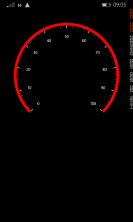
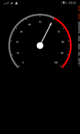
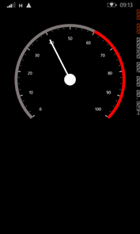
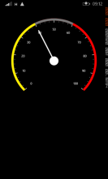

# Create your first Circular Gauge in Xamarin.Forms

This section provides a quick overview for working with Essential Gauge for Xamarin.Forms and takes you on a walk-through along the entire process of creating a real world gauge.

You can also download the entire source code of this demo from the following link: _http://files2.syncfusion.com/Installs/v12.2.0.40/Samples/Xamarin/Gauge_GettingStarted.zip_

## Reference Essential Studio Components in your solution

When you acquire Essential Studio components through the Xamarin Component Store interface from your IDE, then after adding the components to your Xamarin.iOS, Xamarin.Android and WindowsPhone projects through the Component Manager, you need to manually reference the PCL (Portable Class Library) assemblies in the Xamarin.Forms PCL Project in your solution. You can do this by manually adding the relevant PCL assembly references to your PCL project contained in the following path inside your solution folder: 

_Components/syncfusionessentialstudio-version/lib/pcl/_

Alternatively when you download Essential Studio from Syncfusion.com or through the Xamarin Store web interface then all the assembly references need to be added manually.  

After installing Essential Studio for Xamarin, all the required assemblies can be found in the installation folders, typically:

_{Syncfusion Installed location}\Essential Studio\12.2.0.40\lib_

_Example: C:\Program Files (x86)\Syncfusion\Essential Studio\12.2.0.40\lib_

Otherwise, after downloading through the Xamarin Store web interface, all the required assemblies can be found in the following folder:

_{download location}\syncfusionessentialstudio-version\lib_

You can then add the assembly references to the respective projects as follows.

### PCL project

XForms\Syncfusion. SfGauge.XForms.dll  

### Android project

 Android\Syncfusion. SfGauge.Andriod.dll

Android\Syncfusion. SfGauge. XForms.Andriod.dll 

### iOS project

iOS\Syncfusion. SfGauge.iOS.dll   

iOS\Syncfusion. SfGauge.XForms.iOS.dll

### Windows Phone project

WinPhone\Syncfusion. SfGauge.WP8.dll

WinPhone\Syncfusion SfGauge.XForms.WinPhone.dll

_Note: Essential Gauge for Xamarin is compatible with Xamarin.Forms 1.2.3.6257._

Currently an additional step is required for Windows Phone and iOS projects. You need to create an instance of the Gauge custom renderer as mentioned as follows.

Create an instance of the SfGaugeRenderer in MainPage constructor in Windows Phone project as follows.


 
    [C#]

    public MainPage()

       	 {

           		 new SfGaugeRenderer ();

        		    ...    

     	}

 

  	 

Create an instance of the SfGaugeRenderer in FinishedLaunching overridden method of AppDelegate class in iOS Project as follows.

public override bool FinishedLaunching(UIApplication app, NSDictionary options)


 
    [C#]

    {

         		  ...

         		  new SfGaugeRenderer ();

        		   ...

       	 }	

 

        	

## Add and configure the gauge

The gauge control is configured entirely in C# code or using XAML markup.

Create an instance of SfCircularGauge.


 
   [C#]

    SfCircularGauge circularGauge = new SfCircularGauge();

 


 
   [XAML]

<?xml version="1.0" encoding="UTF-8"?>
<ContentPage xmlns="http://xamarin.com/schemas/2014/forms"xmlns:gauge="clr-namespace:Syncfusion.SfGauge.XForms;assembly=Syncfusion.SfGauge.XForms"  xmlns:x="http://schemas.microsoft.com/winfx/2009/xaml" x:Class="GaugeGettingStarted.Sample">

<ContentPage.Content>
<gauge:SfCircularGauge>

  </gauge:SfCircularGauge>

</ContentPage.Content>
</ContentPage>

 

## Insert a Scale

The next step is to add one of more scales.


 
    [C#]

SfCircularGauge circularGauge = new SfCircularGauge();

// to add a scale

Scale scale = new Scale();

scale.StartValue = 0;

scale.EndValue = 100;

scale.Interval = 10;

scale.StartAngle = 135;

scale.SweepAngle = 270;

scale.RimThickness = 10;

scale.RimColor = Color.FromHex("#FB0101");

scale.MinorTicksPerInterval = 3;

scales.Add(scale);

 


 
    [XAML]

<gauge:SfCircularGauge>

    <gauge:SfCircularGauge.Scales>

       <gauge:Scale StartValue="0"

                 EndValue="100" Interval="10"

                 StartAngle="135" SweepAngle="230" 

                 RimColor="#FFFB0101" RimThickness="10"  />

    </gauge:SfCircularGauge.Scales>

  </gauge:SfCircularGauge>

 

## Specify Ranges

You can improve the readability of data by including ranges that quickly show when values fall within specific ranges.


 
    [C#]

…

Range range = new Range();

range.StartValue = 0;

range.EndValue = 80;

range.Color = Color.FromHex("#FF777777");

range.Thickness = 10;

scale.Ranges.Add(range);

…

 


 
    [XAML]

<gauge:SfCircularGauge>

    <gauge:SfCircularGauge.Scales>

      <gauge:Scale StartValue="0" EndValue="100"

                   Interval="10" StartAngle="135"

                   SweepAngle="230" RimColor="#FFFB0101"

                   RimThickness="10" >

        <gauge:Scale.Ranges>

             <gauge:Range StartValue="0" EndValue="80" Color="#FF777777" Thickness="15" />    

        </gauge:Scale.Ranges>

      </gauge:Scale>

    </gauge:SfCircularGauge.Scales>

  </gauge:SfCircularGauge>

 

## Add a Needle Pointer

You can create a needle pointer and associate it with a scale to display the current value.


 
    [C#]

…

NeedlePointer needlePointer = new NeedlePointer();

needlePointer.Value = 60;

needlePointer.Color = Color.White;

needlePointer.KnobColor = Color.White; 

needlePointer.Thickness = 5;

needlePointer.KnobRadius = 20;

needlePointer.LengthFactor = 0.8;

scale.Pointers.Add(needlePointer);  

…

 


 
    [XAML]

  <gauge:SfCircularGauge>

    <gauge:SfCircularGauge.Scales>

      <gauge:Scale StartValue="0" EndValue="100"

                   Interval="10" StartAngle="135"

                   SweepAngle="230" RimColor="#FFFB0101"

                   RimThickness="10" >

        <gauge:Scale.Ranges>

             <gauge:Range StartValue="0" EndValue="80" Color="#FF777777" Thickness="15" />    

        </gauge:Scale.Ranges>

        <gauge:Scale.Pointers>

          <gauge:NeedlePointer Value="60" LengthFactor="0.8"

                               Color="White" Thickness="5" 

                               KnobColor="White" KnobRadius="20"  />

        </gauge:Scale.Pointers>

      </gauge:Scale>

    </gauge:SfCircularGauge.Scales>

  </gauge:SfCircularGauge>

 

## Add a Range Pointer

A range pointer provides an alternative way of indicating the current value.


 
   [C#]

...

RangePointer rangePointer = new RangePointer();

rangePointer.Value = 60;

rangePointer.Color = Color.FromHex("#FFA9A9A9");

rangePointer.Thickness = 10;

scale.Pointers.Add(rangePointer);

...

 


 
   [XAML]

<gauge:SfCircularGauge>

    <gauge:SfCircularGauge.Scales>

      <gauge:Scale StartValue="0" EndValue="100"

                   Interval="10" StartAngle="135"

                   SweepAngle="230" RimColor="#FFFB0101"

                   RimThickness="10" >

        <gauge:Scale.Ranges>

             <gauge:Range StartValue="0" EndValue="80" Color="#FF777777" Thickness="15" />    

        </gauge:Scale.Ranges>

        <gauge:Scale.Pointers>

          <gauge:NeedlePointer Value="60" LengthFactor="0.8"

                               Color="White" Thickness="5" 

                               KnobColor="White" KnobRadius="20"  />

          <gauge:RangePointer Value="60" Color="White" 

                              Thickness="10" />

        </gauge:Scale.Pointers>

      </gauge:Scale>

    </gauge:SfCircularGauge.Scales>

  </gauge:SfCircularGauge>

 

<table>
<tr>
<td>
{{' ' | markdownify }}
</td><td>
{{' ' | markdownify }}
</td><td>
{{' ' | markdownify }}
</td><td>
{{' ' | markdownify }}
</td></tr>
</table>

