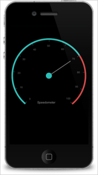
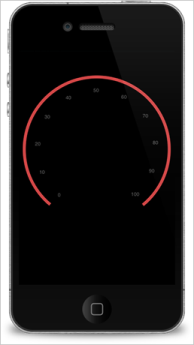
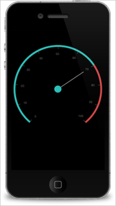

#### Create your first Circular Gauge in Xamarin.iOS

Essential Gauge for Xamarin iOS allows you to visualize numeric values over a circular scale. You can fully customize the appearance of the gauge to seamlessly integrate with your applications.

This section provides a quick overview for working with Essential Gauge for Xamarin iOS. It walks through the entire process of creating a real world gauge.

{:.image }

Reference Essential Studio Components in your Solution

After installing Essential Studio for Xamarin, you can find all the required assemblies in the installation folders, typically:

{Syncfusion Installed location}\Essential Studio\{version number}\lib

> 
{:.image }
_Note: You can find assemblies in unzipped package location in Mac._

You have to add the following assembly references to the Xamarin.iOS project.

 iOS\Syncfusion.SfGauge.iOS.dll

Initialize the CircularGauge

Create a CircularGauge object in the UIViewController and add CircularGauge as SubView in ViewDidLoad override method.

You can create a CircularGauge object by using the following code example.

public override void ViewDidLoad ()

{

base.ViewDidLoad ();

            // creating new instance for circular Gauge  

            SFCircularGauge _circularGauge = new SFCircularGauge();

            View.AddSubview(_circularGauge);

View.BackgroundColor = UIColor.Black;

}

Insert a Scale to the Gauge

Next, add one of more scales.

             // creating new instance for circular Gauge  

            SFCircularGauge _circularGauge = new SFCircularGauge();

            //adding new Scale

            NSMutableArray scales = new NSMutableArray();

            SFCircularScale scale = new SFCircularScale();

            scale.StartValue = 0;

            scale.EndValue = 100;

            scale.StartAngle = 40;

            scale.SweepAngle = 320;

            scale.RimWidth = 6;

            scale.Interval = 10;

            scale.ShowTicks = true;

            scale.RimColor = UIColor.FromRGBA(0.82f, 0.275f, 0.275f, 1f);/*#d14646*/

            scale.MinorTicksPerInterval = 0;

            scale.LabelOffset = 0.1f;

            _circularGauge.Scales.Add(scale);

            View.AddSubview(_circularGauge);

        	View.BackgroundColor = UIColor.Black;

 The following screenshot illustrates the output of the above code.

{:.image }

Customize the ticks

You can customize the major and minor ticks using the Tick settings as follows.

             // creating new instance for circular Gauge  

            SFCircularGauge _circularGauge = new SFCircularGauge();

            //adding new Scale

            NSMutableArray scales = new NSMutableArray();

            SFCircularScale scale = new SFCircularScale();

            scale.StartValue = 0;

            scale.EndValue = 100;

            scale.StartAngle = 40;

            scale.SweepAngle = 320;

            scale.RimWidth = 6;

            scale.Interval = 10;

            scale.ShowTicks = true;

            scale.RimColor = UIColor.FromRGBA(0.82f, 0.275f, 0.275f, 1f);/*#d14646*/

            scale.MinorTicksPerInterval = 0;

            scale.LabelOffset = 0.1f;

            //adding major ticks

            SFTickSettings majorTickSettings = new SFTickSettings();

            majorTickSettings.Color = UIColor.FromRGBA(0.267f, 0.267f, 0.267f, 1f); /*#444444*/;

            majorTickSettings.Size = 7;

            majorTickSettings.Offset = 0.041f;

            majorTickSettings.Width = 1.5f;

            scale.MajorTickSettings = majorTickSettings;

            //adding minor ticks

            SFTickSettings minorTicksSettings = new SFTickSettings();

            minorTicksSettings.Color = UIColor.FromRGBA(0.267f, 0.267f, 0.267f, 1); /*#444444*/

            minorTicksSettings.Size = 8;

            minorTicksSettings.Offset = 0.5f;

            scale.MinorTickSettings = minorTicksSettings;

            _circularGauge.Scales.Add(scale);

            View.AddSubview(_circularGauge);

       	View.BackgroundColor = UIColor.Black;

 The following screenshot illustrates the output of the above code.

{:.image }

Add Pointers to the Scale

Now, add needle pointer and range pointer and associate it with a scale.

                            // creating new instance for circular Gauge  

            SFCircularGauge _circularGauge = new SFCircularGauge();

            //adding new Scale

            NSMutableArray scales = new NSMutableArray();

            SFCircularScale scale = new SFCircularScale();

            scale.StartValue = 0;

            scale.EndValue = 100;

            scale.StartAngle = 40;

            scale.SweepAngle = 320;

            scale.RimWidth = 6;

            scale.Interval = 10;

            scale.ShowTicks = true;

            scale.RimColor = UIColor.FromRGBA(0.82f, 0.275f, 0.275f, 1f);/*#d14646*/

            scale.MinorTicksPerInterval = 0;

            scale.LabelOffset = 0.1f;

            //adding major ticks

            SFTickSettings majorTickSettings = new SFTickSettings();

            majorTickSettings.Color = UIColor.FromRGBA(0.267f, 0.267f, 0.267f, 1f); /*#444444*/;

            majorTickSettings.Size = 7;

            majorTickSettings.Offset = 0.041f;

            majorTickSettings.Width = 1.5f;

            scale.MajorTickSettings = majorTickSettings;

            //adding minor ticks

            SFTickSettings minorTicksSettings = new SFTickSettings();

            minorTicksSettings.Color = UIColor.FromRGBA(0.267f, 0.267f, 0.267f, 1); /*#444444*/

            minorTicksSettings.Size = 8;

            minorTicksSettings.Offset = 0.5f;

            scale.MinorTickSettings = minorTicksSettings;

            //adding needle pointer

            SFNeedlePointer needlePointer = new SFNeedlePointer();

            needlePointer.Value = 70;

            needlePointer.KnobColor = UIColor.FromRGBA(0.169f, 0.749f, 0.722f, 1f); /*#2bbfb8*/;

            needlePointer.KnobRadius = 12;

            needlePointer.PointerType = PointerType.Bar;

            needlePointer.Width = 2;

            needlePointer.LengthFactor = 0.7f;

            needlePointer.Color = UIColor.Gray;

            scale.Pointers.Add(needlePointer);

            //adding range pointer

            SFRangePointer rangePointer = new SFRangePointer();

            rangePointer.Value = 70;

            rangePointer.Width = 6;

            rangePointer.Color = UIColor.FromRGBA(0.169f, 0.749f, 0.722f, 1); /*#2bbfb8*/;

            scale.Pointers.Add(rangePointer);

            _circularGauge.Scales.Add(scale);

            View.AddSubview(_circularGauge);

View.BackgroundColor = UIColor.Black;

 The following screenshot illustrates the output of the above code.

{:.image }

Add Header to the Gauge

You can add custom labels in the gauge and position it.

            // creating new instance for circular Gauge  

            SFCircularGauge _circularGauge = new SFCircularGauge();

            //adding new Scale

            NSMutableArray scales = new NSMutableArray();

            SFCircularScale scale = new SFCircularScale();

            scale.StartValue = 0;

            scale.EndValue = 100;

            scale.StartAngle = 40;

            scale.SweepAngle = 320;

            scale.RimWidth = 6;

            scale.Interval = 10;

            scale.ShowTicks = true;

            scale.RimColor = UIColor.FromRGBA(0.82f, 0.275f, 0.275f, 1f);/*#d14646*/

            scale.MinorTicksPerInterval = 0;

            scale.LabelOffset = 0.1f;

            //adding major ticks

            SFTickSettings majorTickSettings = new SFTickSettings();

            majorTickSettings.Color = UIColor.FromRGBA(0.267f, 0.267f, 0.267f, 1f); /*#444444*/;

            majorTickSettings.Size = 7;

            majorTickSettings.Offset = 0.041f;

            majorTickSettings.Width = 1.5f;

            scale.MajorTickSettings = majorTickSettings;

            //adding minor ticks

            SFTickSettings minorTicksSettings = new SFTickSettings();

            minorTicksSettings.Color = UIColor.FromRGBA(0.267f, 0.267f, 0.267f, 1); /*#444444*/

            minorTicksSettings.Size = 8;

            minorTicksSettings.Offset = 0.5f;

            scale.MinorTickSettings = minorTicksSettings;

            //adding needle pointer

            SFNeedlePointer needlePointer = new SFNeedlePointer();

            needlePointer.Value = 70;

            needlePointer.KnobColor = UIColor.FromRGBA(0.169f, 0.749f, 0.722f, 1f); /*#2bbfb8*/;

            needlePointer.KnobRadius = 12;

            needlePointer.PointerType = PointerType.Bar;

            needlePointer.Width = 2;

            needlePointer.LengthFactor = 0.7f;

            needlePointer.Color = UIColor.Gray;

            scale.Pointers.Add(needlePointer);

            //adding range pointer

            SFRangePointer rangePointer = new SFRangePointer();

            rangePointer.Value = 70;

            rangePointer.Width = 6;

            rangePointer.Color = UIColor.FromRGBA(0.169f, 0.749f, 0.722f, 1); /*#2bbfb8*/;

            scale.Pointers.Add(rangePointer);

            _circularGauge.Scales.Add(scale);

            //adding  new header

            SFGaugeHeader header = new SFGaugeHeader();

            header.Text = (NSString)"Speedometer";

            header.TextColor = UIColor.Gray;

            header.Position = new CGPoint(140, 250);

            _circularGauge.Headers.Add(header);

            View.AddSubview(_circularGauge);

View.BackgroundColor = UIColor.Black;

 The following screenshot illustrates the output of the above code.

{:.image }

