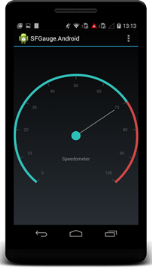
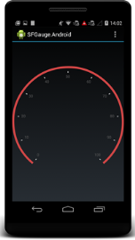
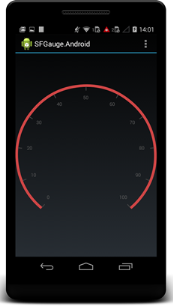
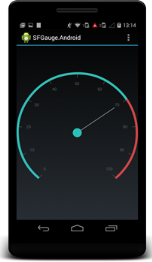
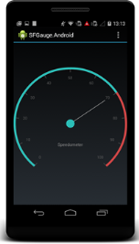

#### Create your first Circular Gauge in Xamarin.Android

You can configure an Essential Gauge for Xamarin Android in simple steps. In this section, you can learn how to configure a Circular Gauge control in a real-time scenario and also provides a walk-through on some of the customization features available in Circular Gauge control.

{:.image }

Reference Essential Studio components in your solution

After installing Essential Studio for Xamarin, you can find all the required assemblies in the installation folders,

{Syncfusion Installed location}\Essential Studio\12.4.0.24\lib

> 
{:.image }
_Note: Assemblies are available in unzipped package location in Mac_

Add the following assembly references to the Android project,

 android\Syncfusion.SfGauge.Andriod.dll

Add and configure the Gauge

Create a Circular Gauge instance in Main Activity and set Circular Gauge as a ContentView in onCreate() overridden method.

   public class MainActivity : Activity

    {

        protected override void OnCreate(Bundle bundle)

        {

            base.OnCreate(bundle);

            // creating new instance for circular Gauge

            SfCircularGauge circularGauge = new SfCircularGauge(this);

            SetContentView(circularGauge); 

        }

     }

Insert a Scale to the Gauge

Now, add the scale to the Circular Gauge.

            // creating new instance for circular Gauge

            SfCircularGauge circularGauge = new SfCircularGauge(this);

            List<CircularScale> _circularScales = new List<CircularScale>();

            // adding  new CircularScale

            CircularScale circularScale = new CircularScale();

            circularScale.StartValue = 0;

            circularScale.EndValue = 100;

            circularScale.StartAngle =130;

            circularScale.SweepAngle =280 ;

            circularScale.RimWidth =10;

            circularScale.RimColor = Color.ParseColor("#D14646");

            circularScale.MinorTicksPerInterval = 2;

            circularScale.LabelOffset = 0.1;

            circularScale.LabelTextSize = 18;

            _circularScales.Add(circularScale);

            circularGauge.CircularScales =_circularScales;

            SetContentView(circularGauge); 

The following screenshot illustrates the output of the above code.

{:.image }

Customize the ticks

You can customize the major and minor ticks using the Tick settings, as illustrated in the following code example.

            // creating new instance for circular Gauge

            SfCircularGauge circularGauge = new SfCircularGauge(this);

            List<CircularScale> _circularScales = new List<CircularScale>();

            // adding  new CircularScale

            CircularScale circularScale = new CircularScale();

            circularScale.StartValue = 0;

            circularScale.EndValue = 100;

            circularScale.StartAngle =130;

            circularScale.SweepAngle =280 ;

            circularScale.RimWidth =10;

            circularScale.RimColor = Color.ParseColor("#D14646");

            circularScale.MinorTicksPerInterval = 2;

            circularScale.LabelOffset = 0.1;

            circularScale.LabelTextSize = 18;

            //adding major ticks

            TickSetting majorTicksSettings = new TickSetting();

            majorTicksSettings.Color = Color.ParseColor("#444444");

            majorTicksSettings.Size = 15;

            majorTicksSettings.Offset = 0.04;

            circularScale.MajorTickSettings = majorTicksSettings ;

            //adding minor ticks

            TickSetting minorTicksSettings = new TickSetting();

            minorTicksSettings.Color = Color.Gray;

            circularScale.MinorTickSettings = minorTicksSettings ;

            _circularScales.Add(circularScale);

            circularGauge.CircularScales =_circularScales;

            SetContentView(circularGauge); 

 The following screenshot illustrates the output of the above code example.

{:.image }

Add Pointers to the Scale

Add needle and range pointers and associate them with a scale.

            // creating new instance for circular Gauge

            SfCircularGauge circularGauge = new SfCircularGauge(this);

            List<CircularScale> _circularScales = new List<CircularScale>();

            List<CircularPointer> _circularPointers = new List<CircularPointer>();

            // adding  new CircularScale

            CircularScale circularScale = new CircularScale();

            circularScale.StartValue = 0;

            circularScale.EndValue = 100;

            circularScale.StartAngle =130;

            circularScale.SweepAngle =280 ;

            circularScale.RimWidth =10;

            circularScale.RimColor = Color.ParseColor("#D14646");

            circularScale.MinorTicksPerInterval = 2;

            circularScale.LabelOffset = 0.1;

            circularScale.LabelTextSize = 18;

            //adding major ticks

            TickSetting majorTicksSettings = new TickSetting();

            majorTicksSettings.Color = Color.ParseColor("#444444");

            majorTicksSettings.Size = 15;

            majorTicksSettings.Offset = 0.04;

            circularScale.MajorTickSettings = majorTicksSettings ;

            //adding minor ticks

            TickSetting minorTicksSettings = new TickSetting();

            minorTicksSettings.Color = Color.Gray;

            circularScale.MinorTickSettings = minorTicksSettings ;

            // adding needle Pointer

            NeedlePointer needlePointer = new NeedlePointer();

            needlePointer.Value = 70;

            needlePointer.KnobColor = Color.ParseColor("#2BBFB8");

            needlePointer.KnobRadius =20;

            needlePointer.Type = NeedleType.Bar;

            needlePointer.LengthFactor = 0.8 ;

            needlePointer.Width = 3;

            needlePointer.Color = Color.Gray;

            _circularPointers.Add(needlePointer);

            // adding range Pointer

            RangePointer rangePointer = new RangePointer();

            rangePointer.Value = 70;

            rangePointer.Color = Color.ParseColor("#2BBFB8");

            rangePointer.Width = 10;

            _circularPointers.Add(rangePointer);

            circularScale.CircularPointers = _circularPointers;

            _circularScales.Add(circularScale);

            circularGauge.CircularScales =_circularScales; 

            SetContentView(circularGauge); 

 The following screenshot illustrates the output of the above code example.

{:.image }

Add Header to the Gauge

You can add custom labels in the gauge and position it.

            // creating new instance for circular Gauge

            SfCircularGauge circularGauge = new SfCircularGauge(this);

            List<CircularScale> _circularScales = new List<CircularScale>();

            List<CircularPointer> _circularPointers = new List<CircularPointer>();

            List<Header> _gaugeHeaders = new List<Header>();

            // adding  new CircularScale

            CircularScale circularScale = new CircularScale();

            circularScale.StartValue = 0;

            circularScale.EndValue = 100;

            circularScale.StartAngle =130;

            circularScale.SweepAngle =280 ;

            circularScale.RimWidth =10;

            circularScale.RimColor = Color.ParseColor("#D14646");

            circularScale.MinorTicksPerInterval = 2;

            circularScale.LabelOffset = 0.1;

            circularScale.LabelTextSize = 18;

            //adding major ticks

            TickSetting majorTicksSettings = new TickSetting();

            majorTicksSettings.Color = Color.ParseColor("#444444");

            majorTicksSettings.Size = 15;

            majorTicksSettings.Offset = 0.04;

            circularScale.MajorTickSettings = majorTicksSettings ;

            //adding minor ticks

            TickSetting minorTicksSettings = new TickSetting();

            minorTicksSettings.Color = Color.Gray;

            circularScale.MinorTickSettings = minorTicksSettings ;

            // adding needle Pointer

            NeedlePointer needlePointer = new NeedlePointer();

            needlePointer.Value = 70;

            needlePointer.KnobColor = Color.ParseColor("#2BBFB8");

            needlePointer.KnobRadius =20;

            needlePointer.Type = NeedleType.Bar;

            needlePointer.LengthFactor = 0.8 ;

            needlePointer.Width = 3;

            needlePointer.Color = Color.Gray;

            _circularPointers.Add(needlePointer);

            // adding range Pointer

            RangePointer rangePointer = new RangePointer();

            rangePointer.Value = 70;

            rangePointer.Color = Color.ParseColor("#2BBFB8");

            rangePointer.Width = 10;

            _circularPointers.Add(rangePointer);

            circularScale.CircularPointers = _circularPointers;

            _circularScales.Add(circularScale);

            circularGauge.CircularScales =_circularScales;

            //adding header

            Header circularGaugeHeader = new Header();

            circularGaugeHeader.Text = "Speedometer";

            circularGaugeHeader.TextColor = Color.Gray;

            circularGaugeHeader.Position = new PointF((float)0.4, (float)0.7);         

            circularGaugeHeader.TextSize = 20;

            _gaugeHeaders.Add(circularGaugeHeader);

            circularGauge.Headers = _gaugeHeaders;

            SetContentView(circularGauge); 

The following screenshot illustrates the output of the above code example.

{:.image }

