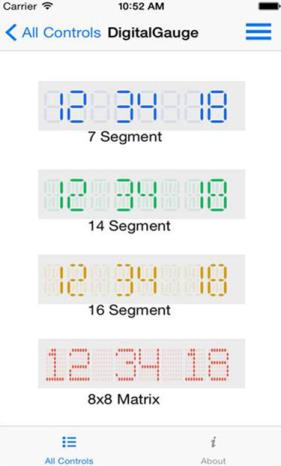

# Create your first Digital Gauge in Xamarin.iOS

This section provides a quick overview for working with the Essential Digital Gauge for Xamarin iOS. It guides you to the entire process of creating a real-world chart. You can learn how to create a Digital Gauge to display time similar to the digital clock with different Character types.

## Reference Essential Studio components in your solution

When the Essential Studio for Xamarin is installed, all the required assemblies can be found in the installation folders: {Syncfusion Installed location}\Essential Studio\13.1.0.21\lib

_Note: Assemblies are available in unzipped package location in Mac._

Add the following assembly references to the iOS project.

[iOS\Syncfusion.SfGauge.iOS.dll]

## Create a Digital Gauge

To develop an application with the XamariniOS Digital Gauge is simple. 

 Create an instance of the SfDigitalGauge.


 
    [C#]

   SFDigitalGauge digitalGauge1= new SFDigitalGauge ();

 

## Add values to display

You can set the value for the gauge by using the Value in the DigitalGauge. It can be Alphabet, Numers, or Special Characters.


 
    [C#]

    NSDate date = new NSDate ();

NSString currentDateandTime = (NSString)date.ToString ();

//Sets the gauge value.

digitalGauge1.Value = currentDateandTime;

 

 

The above code example explains how the values are assigned to the Digital Gauge. You can obtain the Time by using the SimpleDateFormat and that is assigned to the Digital Gauge. 

## Set the Digital Gauge customizations

The Digital Gauge is customized by setting the properties as explained in the following code example.


 
    [C#]

   digitalGauge1.CharacterHeight = 36;

digitalGauge1.CharacterWidth = 18;

digitalGauge1.SegmentWidth = 3;

digitalGauge1.VerticalPadding = 10;

digitalGauge1.CharacterType = SFDigitalGaugeCharacterType.SFDigitalGaugeCharacterTypeSegmentSeven;

digitalGauge1.StrokeType = SFDigitalGaugeStrokeType.SFDigitalGaugeStrokeTypeTriangleEdge;

digitalGauge1.DimmedSegmentAlpha = nfloat.Parse("0.11");

digitalGauge1.BackgroundColor = UIColor.FromRGB(248,248,248);

digitalGauge1.CharacterColor = UIColor.FromRGB(20,108,237);

digitalGauge1.DimmedSegmentColor = UIColor.FromRGB(20,108,237);

 

## To add multiple Digital Gauge

You can add Multiple Gauges in the preferred layout. The following code example explains how Multiple Gauges are added by using the View.AddSubView.


 
    [C#]

   View.AddSubview (digitalGauge1);

View.AddSubview (digitalGauge2);

View.AddSubview (digitalGauge3);

View.AddSubview(digitalGauge4);

layout.AddView(digitalGauge1);

 

