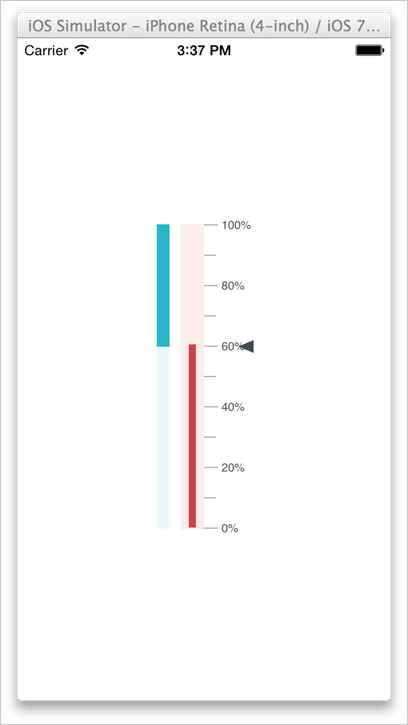

#### Create your first Linear Gauge in Xamarin.iOS

This section encompasses how to create the Linear Gauge for your business requirements in mobility that is required to be displayed in Xamarin iOS. You can also pass the required data to the default Linear Gauge and customize it according to your requirements. The following example demonstrates how to create a Linear Gauge representing the Memory usage.

{:.image }

Reference Essential Studio components in your solution

When the Essential Studio for Xamarin is installed, you can find all the required assemblies in the installation folders,

{Syncfusion Installed location}\Essential Studio\13.1.0.21\lib

> 
{:.image }
_Note: Assemblies are available in unzipped package location in Mac_

Add the following assembly references to the iOS project.

 iOS\Syncfusion.SfGauge.iOS.dll

Create a Linear Gauge

To develop an application with the XamariniOS Linear Gauge is simple. 

Create an instance of SfLinearGauge.

SFLinearGauge linearGauge = new SFLinearGauge();

//Initializing the Orientation

linearGauge.Orientation = SFLinearGaugeOrientation.SFLinearGaugeOrientationVertical;

Add a Scale

To add the scale for the Linear Gauge, the memory usage is displayed in percentage. Before adding the scale to the Linear Gauge, create your own values to the scale. Assign the scale to the Linear Gauge as follows.

SFLinearScale scale = new SFLinearScale ();

scale.Minimum = 0;

scale.Maximum = 100;

scale.Interval = 20;

scale.ScaleBarLength = 100;

scale.LabelPostfix = "%";

scale.ScaleBarColor =UIColor.FromRGB (250, 236, 236);

scale.LabelColor = UIColor.FromRGB (84, 84, 84); 

scale.MinorTicksPerInterval = 1;

scale.ScaleBarSize = 13;

scale.ScalePosition = SFLinearGaugeScalePosition.SFLinearGaugeScalePositionForward;

The above code example illustrates the minimum and maximum values for the scale and assigns the size and length of the scale. The interval denotes the gap between the Main ticks that is represented in the scale. Likewise the MinorTicksPerInterval denotes the number of ticks that needs to be in between the MajorTicks.

Add Ticks for the SfLinearGauge

There are two kinds of Ticks. They are major ticks and minor ticks. Major ticks are the primary scale indicators and Minor ticks are the secondary scale indicators that fall between the major ticks. The major ticks and minor ticks are customized and assigned to the scale by using the following code example.

 //Minor Ticks setting

SFLinearTickSettings minor = new SFLinearTickSettings ();

minor.Length = 10;

minor.Color = UIColor.FromRGB (175, 175, 175);

minor.Thickness = 1;

scale.MinorTickSettings = minor;

//Major Ticks setting

SFLinearTickSettings major = new SFLinearTickSettings ();

major.Length = 10;

major.Color = UIColor.FromRGB (175, 175, 175);

major.Thickness = 1;

scale.MajorTickSettings = major;

scale.Pointers.Add (symbolPointer);

scale.Pointers.Add (rangePointer);

linearGauge.Scales.Add (scale);
scale_minorTicksSettings.StrokeWidth = 5;
Scale_minorTicksSettings.Offset = 0;
scale.MinorTickSettings = scale_minorTicksSettings;

The above code example displays the majorticks and minorticks for the scale assigned to the Linear Gauge.

Add Pointers

Pointer is a key element of the linear scale that points a value or measure on that scale. A linear scale can have one or more pointers that can be used to measure different values for different criteria. Each pointer has a Value property that specifies the current value of the linear scale based upon its measurement.

There are two types of Pointers. They are BarPointer and SymbolPointer. Refer to the following code example to add theSymbolPointers and BarPointer to the scale.

  //SymbolPointer

SFSymbolPointer symbolPointer = new SFSymbolPointer ();

symbolPointer.Value = 50;

symbolPointer.Offset = 0;

symbolPointer.Thickness = 3;

symbolPointer.Color = UIColor.FromRGB (65, 77, 79);

//BarPointer

SFBarPointer rangePointer = new SFBarPointer ();

rangePointer.Value = 50;

rangePointer.Color = UIColor.FromRGB (206, 69, 69);

rangePointer.Thickness = 10;

 The pointers are displayed at the defined value in the scale with the respective color and width. You are required to add this pointer to a collection and assign it to the scale.

   //Adding the pointers to the linear gauge

scale.Pointers.Add (symbolPointer);

scale.Pointers.Add (rangePointer);

Add Range

Scale contains one or more Ranges. Range displays the start and end values of the inner divisions within the linear scale’s whole range. Each range displays different zones or regions of the same metrics: high, low and average temperature range.

//Adding ranges
//Range

SFLinearRange range = new SFLinearRange ();

range.StartValue = 0;

range.EndValue = 50;

range.Color = UIColor.FromRGB (234, 248, 249);

range.StartWidth = 10;

range.EndWidth = 10;

range.Offset = nfloat.Parse("-0.17");

scale.Ranges.Add (range);

The above code example explains how to add multiple range to a scale. Add this ranges to a collection and assign it to the scale. Refer to the following code example.

  //Adding the range to a scale

scale.Ranges.Add (range);

scale.Ranges.Add (range2);

Finally, add this scale to a Collection and assign it to the Linear Gauge by using the following code example.

  //Adding a scale to the LinearGauge

linearGauge.Scales.Add (scale);

 Now, the scales are added successfully to the Linear Gauge.

{:.image }

