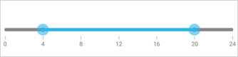
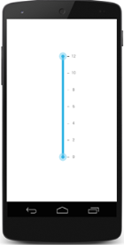

# Getting Started

This section provides a quick overview for working with Essential RangeSlider for Xamarin.Forms.

## Add Syncfusion assembly reference

Add the required Syncfusionassembly references to the respective projects as follows. Refer to the following installed location for the required assemblies.

_{Syncfusion Installed location}\Essential Studio\12.4.0.34\lib_

_Eg: C:\Program Files (x86)\Syncfusion\Essential Studio\12.4.0.34\lib_

### PCL project

XForms\Syncfusion. SfRangeSlider.XForms.dll 

### Android project

Android\Syncfusion. SfRangeSlider.Andriod.dll

Android\Syncfusion. SfRangeSlider. XForms.Andriod.dll

### iOS project

iOS\Syncfusion. SfRangeSlider.iOS.dll  

iOS\Syncfusion. SfRangeSlider.XForms.iOS.dll

### Windows Phone project

WinPhone\Syncfusion. SfRangeSlider.WP8.dll

WinPhone\Syncfusion. SfRangeSlider.XForms.WinPhone.dll

_Note: Essential BusyIndicator for Xamarin is compatible with Xamarin Forms 1.3._

An additional step is required for Windows Phone and iOS projects. Create an instance of the RangeSlider custom renderer as follows.

Create an instance of the SfRangeSliderRenderer in MainPage constructor in Windows Phone project as follows.

  

public MainPage()

       	 {

           		 new SfRangeSliderRenderer ();

        		    ...    

     	}



Create an instance of the SfRangeSliderRenderer in FinishedLaunching overridden method of AppDelegate class in iOS Project as follows

  

public override bool FinishedLaunching(UIApplication app, NSDictionary options)

        	{

         		  ...

         		  new SfRangeSliderRenderer ();

        		   ...

       	 }
		 


## Add and configure the RangeSlider

The RangeSlider control is configured entirely in C# code or using XAML markup.

Create an instance of SfRangeSlider

   

 [C#]
// Update App.cs source in this file.

using Syncfusion.XForms.SfRangeSlider;

…

…

public class App : Application
    {
        public App()
        {
            MainPage = new RangeSliderPage ();
        }

    }

public class RangeSliderPage : ContentPage

{
        SfRangeSlider sfrangeslider;
        public BusyIndicatorPage ()
        {
            sfrangeslider = new SfRangeSlider();

        }

}



 

[XAML]

Use this in App.CS source.

< ?xml version="1.0" encoding="UTF-8"? >

<ContentPage xmlns="http://xamarin.com/schemas/2014/forms" 
BackgroundColor="White"  
xmlns:x="http://schemas.microsoft.com/winfx/2009/xaml" 
x:Class="RangeSliderGettingStarted.RadialSliderPage"  
xmlns:syncfusion="clr-namespace:Syncfusion.SfRangeSlider.XForms;
assembly=Syncfusion.SfRangeSlider.XForms" >

    < ContentPage.Content > 
            < syncfusion:SfRangeSlider/ >
    < /ContentPage.Content >
< /ContentPage > < /ContentPage.Content >
< /ContentPage >

 

### Configure the RangeSlider Properties

Add the RangeSlider properties in your application.

   

 [C#]
 
SfBusyIndicator sfbusyindicator = new SfBusyIndicator();
sfbusyindicator.AnimationType = AnimationTypes.Battery;
sfbusyindicator.ViewBoxWidth = 150;
sfbusyindicator.ViewBoxHeight = 150;
sfbusyindicator.BackgroundColor = Color.White;

 

 

[XAML]

< syncfusion:SfRangeSlider HeightRequest="100" TickFrequency="2" Minimum="0" Maximum="12" TickPlacement="BottomRight" ShowRange="True" RangeStart="4" RangeEnd="8" Orientation="Horizontal" WidthRequest="400" >
        </syncfusion:SfRangeSlider>

 

The following screenshot illustrates the output.

## Create your first RangeSlider in Xamarin.iOS

This section encompasses how to create the RangeSlider that lets you to choose values over a high interactive way. You can also display special characters in different character types. In this instance, how to create a RangeSlider and to use its several features are demonstrated.

### Reference Essential Studio Components in your Solution

After installing Essential Studio for Xamarin, you can find all the required assemblies in the following installated folders:

{Syncfusion Installed location}\Essential Studio\{version number}\lib

_Note: Assemblies are available in unzipped package location in Mac._

Add the following assembly references to the iOS project.

iOS\Syncfusion.SfRangeSlider.iOS.dll

### Create a Rangeslider

To develop an application with the iOS RangeSlider is simple. The following steps explain how to create and configure its properties.

Create an instance for SfRangeSlider and add the SfRangeSlider as subview in the viewdidload override method.

  

 [C#]
public override void ViewDidLoad ()

{
    base.ViewDidLoad ();

    SFRangeSlider rangeSlider= new SFRangeSlider ();

    View.AddSubview (rangeSlider);

 

### Add values and scale

You can set the minimum and maximum values for the slider by using the minimum and maximum in the Rangeslider. It can be Numerical values.

 

 [C#]
  rangeSlider.Maximum = 12;
  rangeSlider.Minimum = 0;
  rangeSlider.RangeStart = 0;
  rangeSlider.RangeEnd = 12; 

 

The above code example illustrates the Minimum and Maximum value for the Slider. Similarly, RangeStart and RangeEnd is used to set the start range and end range values when you use dual thumb. The ShowRange property is used to switch between single thumb and double thumb.

### Add Ticks and Labels for the RangeSlider

The ticks can be set by using the TickFrequency and TickPlacement. Similarly, value labels can be set by using the ShowValueLabel property to true. The position of label can be varied by the LabelPlacement property.

  

 [C#]
  rangeSlider1.TickPlacement = SFTickPlacement.SFTickPlacementBottomRight;
  rangeSlider1.TickFrequency = 2;
  rangeSlider1.ValuePlacement = SFValuePlacement.SFValuePlacementBottomRight;

 

The above code example illustrates on setting the Tick and ValuePlcaements. The TickFrequency determines the interval between the ticks. 

### Add Snapping type for RangeSlider

The movement of the thumb can be varied in different ways. This is achieved by setting the SnapsTo property.

  

[C#]
rangeSlider.SnapsTo = SFSnapsTo.SFSnapsToTicks;

 

The movement of the thumb is based on Ticks / StepFrequency / none. When it is set to Tick, the Thumb is moved to next / nearby tick and on setting to none, the Thumb is moved independently.

## Create your first RangeSlider in Xamarin

This section encompasses how to create the RangeSlider that lets you to choose values over a high interactive way. In this instance, how to create a RangeSlider and to use its several features are demonstrated.

### Reference Essential Studio components in your solution

After installing Essential StudioforXamarin, you can find all the required assemblies in the following installated folders,

{Syncfusion Installed location}\Essential Studio\13.1.0.21\lib

_Note: Assemblies are available in unzipped package location in Mac_

Add the following assembly references to the Xamarin project,

android\Syncfusion.SfRangeSlider.Andriod.dll

### Create a Rangeslider

To develop an application with the Xamarin RangeSlider is simple. The following steps explain how to create and configure its properties.

1. Create an instance for the SfRangeslider in the constructor and set that SfRangeslider as content view of Activity.



SfRangeslider range = new SfRangeSlider (this); 
setContentView(range);

 

### Add values and scale

You can set the minimum and maximum values for the slider by using the Minimum and Maximum properties in the RangeSlider. It can be Numerical values.



        range.Minimum=0;

        range.Maximum=24;       

        range.RangeEnd=20;

        range.RangeStart=4;

        range.ShowRange=true;

        range.Orientation=Orientation.Horizontal;

 

The above code example illustrates the minimum and maximum values for the slider. Similarly, RangeStart and RangeEnd is used to set the start range and end range values when you use dual thumb. The ShowRange property is used to switch between a single thumb and double thumb. The orientation property sets the type of orientation.

Add Ticks and Labels for the RangeSlider

The ticks can be set by setting the TickFrequency and TickPlacement. Similarly, value labels is set by setting the ShowValueLabel property to true. The position of label can be varied by the LabelPlacement property.



     range.TickFrequency=4;

     range.ShowValueLabel=true;  

     range.ValuePlacement=ValuePlacement.TopLeft;

     range.TickPlacement=TickPlacement.BottomRight;

 

The above code example illustrates on setting the Tick and LabelPlacements. The TickFrequency determines the interval between the ticks.

### Add Snapping type for RangeSlider

The movement of the thumb can be varied in different ways. This is achieved by setting the SnapsTo property.



range.SnapsTo=SnapsTo.Ticks;

range.StepFrequency=6;

 

The movement of the thumb is based on the Ticks / StepFrequency / none. When it is set to Tick, the Thumb is moved to next / nearby tick and on setting to none,Thumb is moved independently.

