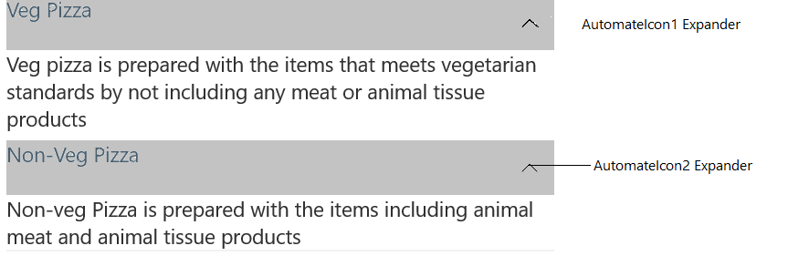

# Accessibility in Xamarin Expander (SfExpander)

The Expander control has built-in `AutomationId` for inner elements. The [AutomationId](https://help.syncfusion.com/cr/xamarin/Syncfusion.XForms.Expander.SfExpander.html) API allows the automation framework to find and interact with the inner elements of the Expander control. To keep unique AutomationId, these inner element's AutomationIds are updated based on the Expander control `AutomationId`. 

For example, if we set Expander's AutomationId as "Automation", then Automation framework will interact with expander icon of Expander Header  as `Automation Expander`. 

<table>
<tr>
<th align="center" >View</th>
<th align="center" >AutomationId Format</th>
<th align="center" >Example</th>
</tr>

<tr>
<td>Expander Icon</td>
<td>ControlAutomationId Expander</td>
<td>AutomationItem1 Expander  
where <b>AutomationItem1</b> represents Control AutomationId and <b>Expander</b> represents the expander dropdown icon. 
</td>
</tr>
</table>

The following image denotes the AutomationIds of inner elements.

## See also

[How to access a named Expander inside a XAML DataTemplate in Xamarin.Forms (SfExpander)](https://www.syncfusion.com/kb/11374/)
