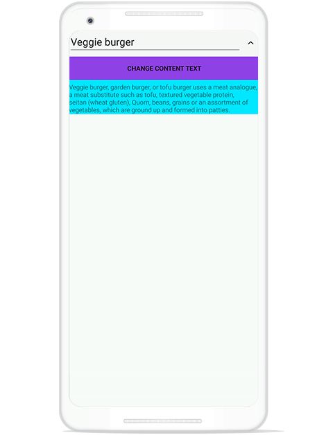
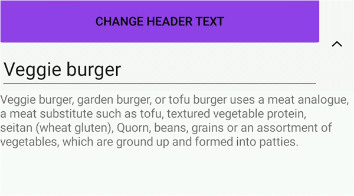

# Item Size Customization in Xamarin Expander (SfExpander)

This section explains how to customize the item size in the SfExpander.

## AutoFit the expander based on content

You can dynamically resize the `SfExpander` content based on the content size using the [DynamicSizeMode](https://help.syncfusion.com/cr/xamarin/Syncfusion.XForms.Expander.DynamicSizeMode.html) property.

The control contains three types of `DynamicSizeMode,` they are:

 * Content: Autofit the content based on the content size.
 * Header: Autofit the header based on the header content size.
 * None: The dynamic changes of header and the content of a `SfExpander` will not be considered. It is a default value of `DynamicSizeMode`.
 
### DynamicSizeMode as Content
 
The content and layout of `SfExpander` get re-measured when its size is updated at runtime. You can add the `Label` control to expander content and set the DynamicSizeMode to `Content` to change the content size dynamically.



<StackLayout>
<Button Text="DynamicSizeMode as Content" FontAttributes="Bold" Clicked="Button_Clicked"/>
<syncfusion:SfExpander DynamicSizeMode="Content" IsExpanded="True">
    <syncfusion:SfExpander.Header>
        <Grid>
            <Image Source="menu.png" Margin="3" Aspect="AspectFit"/>
            <Label x:Name="label1" TextColor="#495F6E" Text="Items" FontSize="16" VerticalOptions="CenterAndExpand"/>
        </Grid>
    </syncfusion:SfExpander.Header>

    <syncfusion:SfExpander.Content>
        <Grid>
		    <Label x:Name="veg" TextColor="#303030" FontSize="16" Text="Veggie burger" IsVisible="True"/>
            <Label x:Name="garden"  TextColor="#303030" FontSize="16" Text="Garden burger" Grid.Row="1" IsVisible="True"/>
			<Label x:Name="tofu" TextColor="#303030" FontSize="16" Text="Tofu burger" IsVisible="False" Grid.Row="2"/>
            <Label x:Name="total" TextColor="#303030" FontSize="16" Text="Total Amount Paid" IsVisible="False"  FontAttributes="Bold" Grid.Row="3"/>
			<Label x:Name="vegrate"  TextColor="#303030" FontSize="16" HorizontalOptions="End" Text="₹200.00" Grid.Column="1" IsVisible="True"/>
            <Label x:Name="gardenrate" TextColor="#303030" FontSize="16" HorizontalOptions="End" Text="₹300.00" Grid.Row="1" IsVisible="True" Grid.Column="1"/>
			<Label x:Name="tofurate"  TextColor="#303030" FontSize="16" HorizontalOptions="End" IsVisible="False" Text="₹450.00" Grid.Row="2" Grid.Column="1"/>
            <Label x:Name="amount"  TextColor="#303030" FontSize="16" HorizontalOptions="End" IsVisible="False" Text="₹950.00" FontAttributes="Bold" Grid.Row="3" Grid.Column="1"/>
        </Grid>
    </syncfusion:SfExpander.Content>
</syncfusion:SfExpander>  
</StackLayout>    


expander.DynamicSizeMode = DynamicSizeMode.Content;
private void Button_Clicked(object sender, EventArgs e)
{
    if (!tofu.IsVisible)
    {
        tofu.IsVisible = true;
        tofurate.IsVisible = true;
    }
    else if (!total.IsVisible)
    {
        total.IsVisible = true;
        amount.IsVisible = true;
    }
    else
    {
        total.IsVisible = false;
        amount.IsVisible = false;
        tofu.IsVisible = false;
        tofurate.IsVisible = false;
    }
}



### DynamicSizeMode as Header

The header and layout of the `SfExpander` get re-measured when its size is updated at runtime. You can add the `Label` control to the expander header and set the DynamicSizeMode to `Header` to change the header size dynamically.



<StackLayout>
<Button Text="DynamicSizeMode as Header" FontAttributes="Bold" Clicked="Button_Clicked"/>
<syncfusion:SfExpander DynamicSizeMode="Content" IsExpanded="True">
    <syncfusion:SfExpander.Header>
        <Grid>
            <Image Source="menu.png" Margin="3" Aspect="AspectFit"/>
            <Label x:Name="label1" TextColor="#495F6E" Text="Items" FontSize="16" VerticalOptions="CenterAndExpand"/>
        </Grid>
    </syncfusion:SfExpander.Header>

    <syncfusion:SfExpander.Content>
        <Grid>
		    <Label x:Name="veg" TextColor="#303030" FontSize="16" Text="Veggie burger" IsVisible="True"/>
            <Label x:Name="garden"  TextColor="#303030" FontSize="16" Text="Garden burger" Grid.Row="1" IsVisible="True"/>
			<Label x:Name="vegrate"  TextColor="#303030" FontSize="16" HorizontalOptions="End" Text="₹200.00" Grid.Column="1" IsVisible="True"/>
            <Label x:Name="gardenrate" TextColor="#303030" FontSize="16" HorizontalOptions="End" Text="₹300.00" Grid.Row="1" IsVisible="True" Grid.Column="1"/>
        </Grid>
    </syncfusion:SfExpander.Content>
</syncfusion:SfExpander>  
</StackLayout>    


expander.DynamicSizeMode = DynamicSizeMode.Header;
private void Button_Clicked(object sender, EventArgs e)
{
    if (label1.FontSize == 16)
    {
        label1.FontSize = 28;
    }
    else if (label1.FontSize == 28)
    {
        label1.FontSize = 35;
    }
}

	

