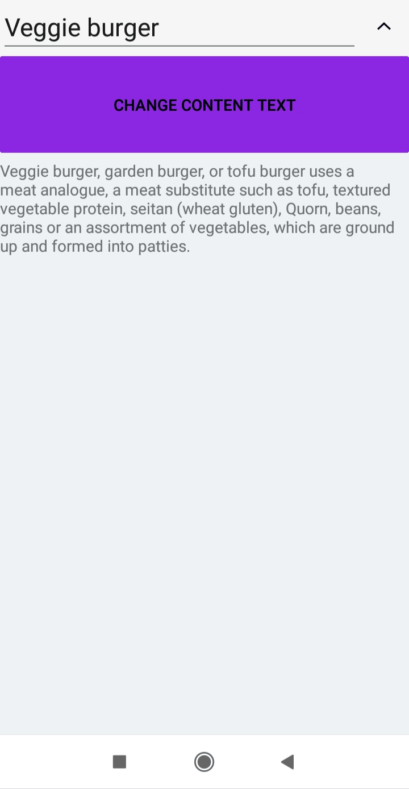
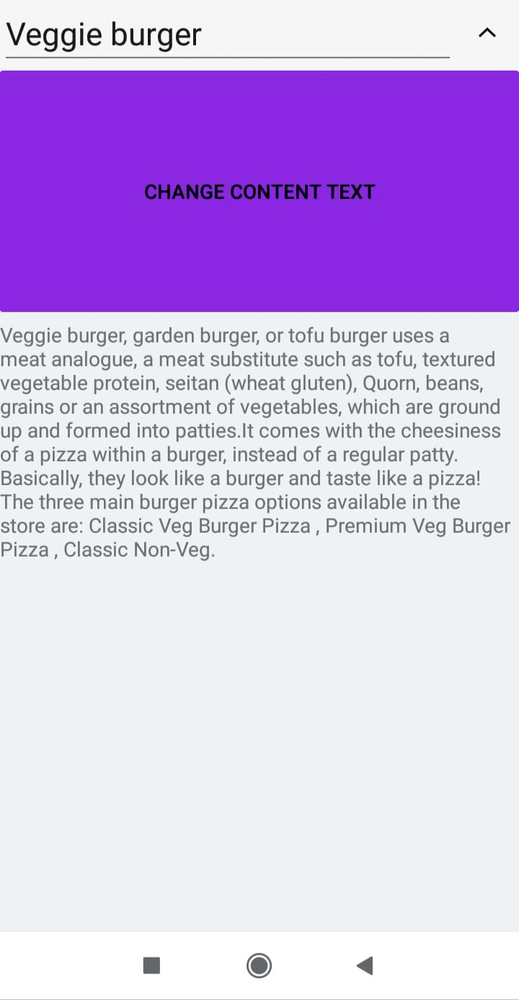
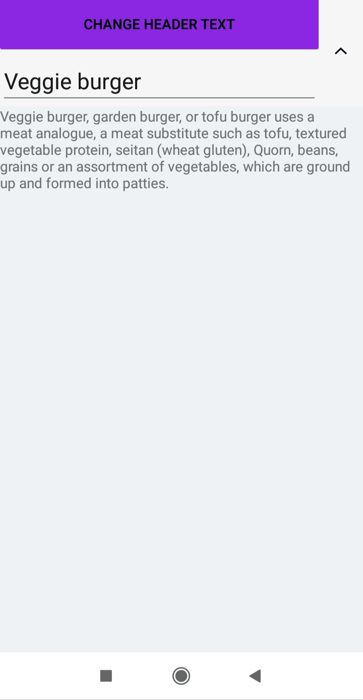
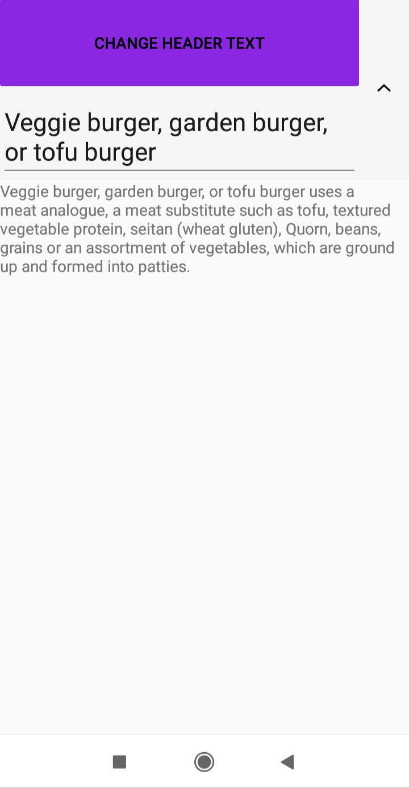

# Item Size Customization in Xamarin Expander (SfExpander)

This section explains how to customize the item size in the SfExpander.

## AutoFit the expander based on content

You can dynamically resize the `SfExpander` content based on the content size by using the [DynamicSizeMode](https://help.syncfusion.com/cr/cref_files/xamarin/Syncfusion.Expander.XForms~Syncfusion.XForms.Expander.DynamicSizeMode.html) property.

The control contains the following three types of `DynamicSizeMode`:

 * Content: Autofit the content based on the content size.
 * Header: Autofit the header based on the header content size.
 * None: The dynamic changes of header and content of a `SfExpander` will not be considered. It is a default value of `DynamicSizeMode`.
 
### DynamicSizeMode as Content
 
The Content of the `SfExpander` gets re-measured and layout when its size is updated at runtime. You can add the `Editor` control to Expander content and set DynamicSizeMode to `Content` to change the content size dynamically.



  <syncfusion:SfExpander DynamicSizeMode="Content" IsExpanded="True">
                    <syncfusion:SfExpander.Header>
                        <Grid HeightRequest="50">
                            <Label Text="Veggie burger" VerticalTextAlignment="Center"/>
                        </Grid>
                    </syncfusion:SfExpander.Header>

                    <syncfusion:SfExpander.Content>
                        <Grid>
                            <Editor AutoSize="TextChanges" Text="Veggie burger, garden burger, or tofu burger uses a meat analogue, a meat substitute such as tofu, textured vegetable protein, seitan (wheat gluten), Quorn, beans, grains or an assortment of vegetables, which are ground up and formed into patties."/>
                        </Grid>
                    </syncfusion:SfExpander.Content>
    </syncfusion:SfExpander>      


     expander.DynamicSizeMode = DynamicSizeMode.Content;



### DynamicSizeMode as Header

The Header of the `SfExpander` gets re-measured and layout when its size is updated at runtime. You can add the `Editor` control to Expander header and set DynamicSizeMode to `Header` to change the header size dynamically.



<syncfusion:SfExpander DynamicSizeMode="Content" IsExpanded="True">
                    <syncfusion:SfExpander.Header>
                        <Grid HeightRequest="50">
                            <Editor Text="Veggie burger" AutoSize="TextChanges" FontSize="Large"/>
                        </Grid>
                    </syncfusion:SfExpander.Header>

                    <syncfusion:SfExpander.Content>
                        <Grid>
                            <Label Text="Veggie burger, garden burger, or tofu burger uses a meat analogue, a meat substitute such as tofu, textured vegetable protein, seitan (wheat gluten), Quorn, beans, grains or an assortment of vegetables, which are ground up and formed into patties."/>
                        </Grid>
                    </syncfusion:SfExpander.Content>
</syncfusion:SfExpander> 


     expander.DynamicSizeMode = DynamicSizeMode.Header;

	

