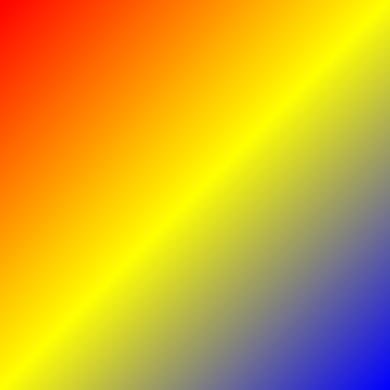
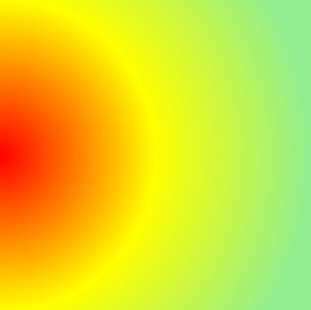

# Customization of SfGradientView

The SfGradientView control supports customizing the following properties:

* The `GradientStops` for both linear and radial gradients.
* The `StartPoint` and `EndPoint` for linear gradient brush.
* The `Center` and `Radius` for radial gradient brush.

## GradientStops

`GradientStops` is a collection of `SfGradientStop` for both linear gradient and radial gradient; it is used for smooth color transition by specifying the `Color` and `Offset` properties of `SfGradientStop`. An `Offset` ranges from 0 to 1.

## SfLinearGradientBrush

You can customize the linear gradient using the `StartPoint` and `EndPoint` properties of `SfLinearGradientBrush`. By default, the value of StartPoint is (0,0) and the value of EndPoint is (1,1).




<gradient:SfGradientView>
    <gradient:SfGradientView.BackgroundBrush>
        <gradient:SfLinearGradientBrush>
            <gradient:SfLinearGradientBrush.GradientStops>
                <gradient:SfGradientStop Color="Red" Offset="0.0" />
                <gradient:SfGradientStop Color="Yellow" Offset="0.5" />
                <gradient:SfGradientStop Color="Blue" Offset="1.0" />  
            </gradient:SfLinearGradientBrush.GradientStops>
        </gradient:SfLinearGradientBrush>
    </gradient:SfGradientView.BackgroundBrush>
</gradient:SfGradientView>




SfGradientView gradientView = new SfGradientView();
SfLinearGradientBrush linearGradient = new SfLinearGradientBrush();
linearGradient.GradientStops = new GradientStopCollection()
{
    new SfGradientStop(){ Color = Color.Red, Offset = 0.0 },
    new SfGradientStop(){ Color = Color.Yellow, Offset = 0.5 },
    new SfGradientStop(){ Color = Color.Blue, Offset = 1.0 }
};
gradientView.BackgroundBrush = linearGradient




### Horizontal linear gradient

You can use the values of `StartPoint` and `EndPoint` properties of `SfLinearGradientBrush` as (0, 0.5) and (1, 0.5), respectively to align the gradient of background horizontally.




<gradient:SfGradientView>
    <gradient:SfGradientView.BackgroundBrush>
        <gradient:SfLinearGradientBrush StartPoint="0, 0.5" EndPoint="1, 0.5">
            <gradient:SfLinearGradientBrush.GradientStops>
                <gradient:SfGradientStop Color="Red" Offset="0.0" />
                <gradient:SfGradientStop Color="Yellow" Offset="0.5" />
                <gradient:SfGradientStop Color="Blue" Offset="1.0" />         
            </gradient:SfLinearGradientBrush.GradientStops>
        </gradient:SfLinearGradientBrush>
    </gradient:SfGradientView.BackgroundBrush>                
</gradient:SfGradientView>




SfGradientView gradientView = new SfGradientView();

SfLinearGradientBrush linearGradient = new SfLinearGradientBrush();
linearGradient.StartPoint = new Point(0, 0.5);
linearGradient.EndPoint = new Point(1, 0.5);
linearGradient.GradientStops = new GradientStopCollection()
{
    new SfGradientStop(){ Color = Color.Red, Offset = 0.0 },
    new SfGradientStop(){ Color = Color.Yellow, Offset = 0.5 },
    new SfGradientStop(){ Color = Color.Blue, Offset = 1.0 }
};

gradientView.BackgroundBrush = linearGradient;  




### Vertical linear gradient

You can use the values of `StartPoint` and `EndPoint` properties of `SfLinearGradientBrush` as (0.5, 0) and (0.5, 1), respectively to align the gradient of background vertically.




<gradient:SfGradientView>
    <gradient:SfGradientView.BackgroundBrush>
        <gradient:SfLinearGradientBrush StartPoint="0.5, 0" EndPoint="0.5, 1">
            <gradient:SfLinearGradientBrush.GradientStops>
                <gradient:SfGradientStop Color="Red" Offset="0.0" />
                <gradient:SfGradientStop Color="Yellow" Offset="0.5" />
                <gradient:SfGradientStop Color="Blue" Offset="1.0" />         
            </gradient:SfLinearGradientBrush.GradientStops>
        </gradient:SfLinearGradientBrush>
    </gradient:SfGradientView.BackgroundBrush>                
</gradient:SfGradientView>




SfLinearGradientBrush linearGradient = new SfLinearGradientBrush();
linearGradient.StartPoint = new Point(0.5, 0);
linearGradient.EndPoint = new Point(0.5, 1);
linearGradient.GradientStops = new GradientStopCollection()
{
    new SfGradientStop(){ Color = Color.Red, Offset = 0.0 },
    new SfGradientStop(){ Color = Color.Yellow, Offset = 0.5 },
    new SfGradientStop(){ Color = Color.Blue, Offset = 1.0 }
};

gradientView.BackgroundBrush = linearGradient;        




## SfRadialGradientBrush

You can customize the following properties of `SfRadialGradientBrush`:

* Center 
* Radius 

By default, the value of center is (0.5, 0.5) and value of radius is 0.5.




<gradient:SfGradientView>
    <gradient:SfGradientView.BackgroundBrush>
        <gradient:SfRadialGradientBrush>
            <gradient:SfRadialGradientBrush.GradientStops>
                <gradient:SfGradientStop Color="Red" Offset="0.0" />
                <gradient:SfGradientStop Color="Yellow" Offset="0.5" />
                <gradient:SfGradientStop Color="LightGreen" Offset="1.0" />  
            </gradient:SfRadialGradientBrush.GradientStops>
        </gradient:SfRadialGradientBrush>
    </gradient:SfGradientView.BackgroundBrush>                
</gradient:SfGradientView>




SfGradientView gradientView = new SfGradientView();

SfRadialGradientBrush radialGradient = new SfRadialGradientBrush();
radialGradient.GradientStops = new GradientStopCollection()
{
    new SfGradientStop(){ Color = Color.Red, Offset = 0.0 },
    new SfGradientStop(){ Color = Color.Yellow, Offset = 0.5 },
    new SfGradientStop(){ Color = Color.LightGreen, Offset = 1.0 }
};

gradientView.BackgroundBrush = radialGradient;     




### Customize the center

You can customize the center point of radial gradient brush using the `Center` property of `SfRadialGradientBrush`.




<gradient:SfGradientView>
    <gradient:SfGradientView.BackgroundBrush>
        <gradient:SfRadialGradientBrush Center="0, 0.5">
            <gradient:SfRadialGradientBrush.GradientStops>
                <gradient:SfGradientStop Color="Red" Offset="0.0" />
                <gradient:SfGradientStop Color="Yellow" Offset="0.5" />
                <gradient:SfGradientStop Color="LightGreen" Offset="1.0" />   
            </gradient:SfRadialGradientBrush.GradientStops>
        </gradient:SfRadialGradientBrush>
    </gradient:SfGradientView.BackgroundBrush>                
</gradient:SfGradientView>




SfGradientView gradientView = new SfGradientView();

SfRadialGradientBrush radialGradient = new SfRadialGradientBrush();
radialGradient.Center = new Point(0, 0.5);
radialGradient.GradientStops = new GradientStopCollection()
{
    new SfGradientStop(){ Color = Color.Red, Offset = 0.0 },
    new SfGradientStop(){ Color = Color.Yellow, Offset = 0.5 },
    new SfGradientStop(){ Color = Color.LightGreen, Offset = 1.0 }
};

gradientView.BackgroundBrush = radialGradient;




### Customize the radius

You can customize the radius of the radial gradient brush using `Radius` property of `SfRadialGradientBrush`. The `Radius` property ranges from 0 to 1.




<gradient:SfGradientView>
    <gradient:SfGradientView.BackgroundBrush>
        <gradient:SfRadialGradientBrush Center="0, 0.5" Radius="1">
            <gradient:SfRadialGradientBrush.GradientStops>
                <gradient:SfGradientStop Color="Red" Offset="0.0" />
                <gradient:SfGradientStop Color="Yellow" Offset="0.5" />
                <gradient:SfGradientStop Color="LightGreen" Offset="1.0" />    
            </gradient:SfRadialGradientBrush.GradientStops>
        </gradient:SfRadialGradientBrush>
    </gradient:SfGradientView.BackgroundBrush>                
</gradient:SfGradientView>




SfGradientView gradientView = new SfGradientView();

SfRadialGradientBrush radialGradient = new SfRadialGradientBrush();
radialGradient.Center = new Point(0, 0.5);
radialGradient.Radius = 1;
radialGradient.GradientStops = new GradientStopCollection()
{
    new SfGradientStop(){ Color = Color.Red, Offset = 0.0 },
    new SfGradientStop(){ Color = Color.Yellow, Offset = 0.5 },
    new SfGradientStop(){ Color = Color.LightGreen, Offset = 1.0 }
};

gradientView.BackgroundBrush = radialGradient;




You can find the sample from [this](https://github.com/SyncfusionExamples/SfGradientView_CustomizationSample) link.