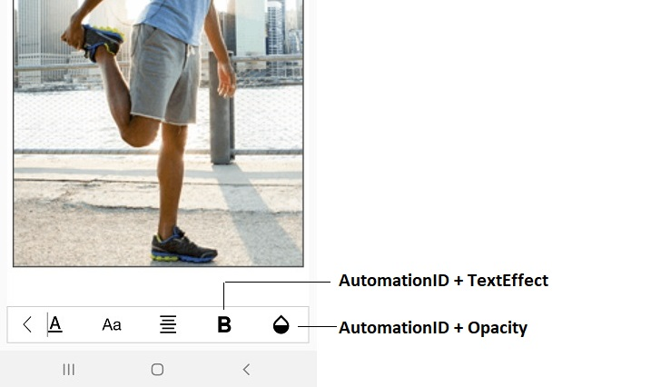
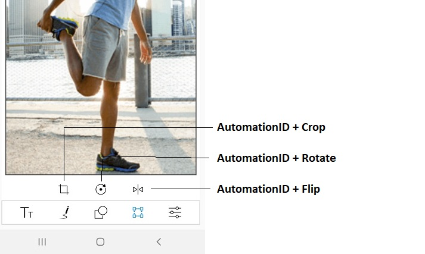

# AutomationId in SfImageEditor

The SfImageEditor control has built-in automation Id for inner elements. The [`AutomationId`](https://help.syncfusion.com/cr/xamarin/Syncfusion.SfImageEditor.XForms.SfImageEditor.html) API allows the automation framework to find and interact with the inner elements of the SfImageEditor control. To keep unique AutomationId, these inner elements' AutomationIds are updated based on the control's `AutomationId`. For example, if you set automationId as `ImageEditor`, then the automation framework will interact with the Undo button as `ImageEditorUndo`. The following screenshot illustrates the AutomationIds  for toolbar elements.

