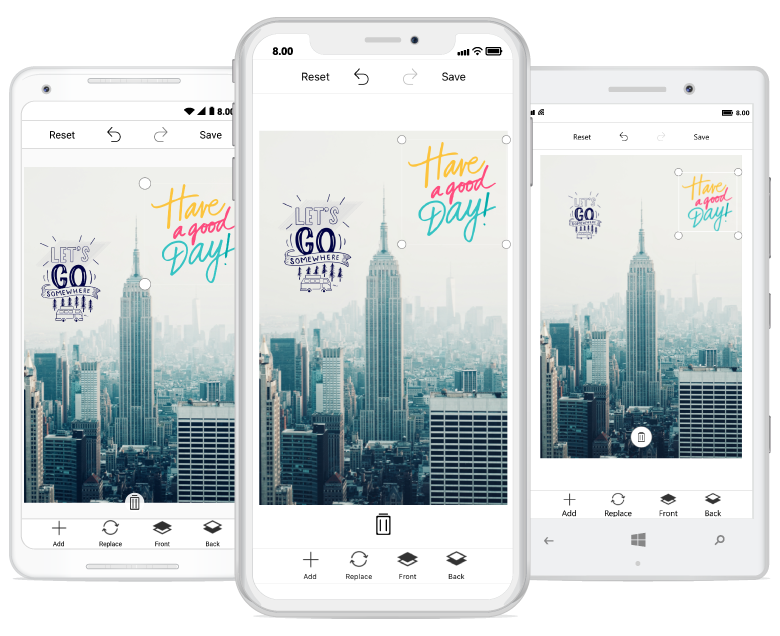

# CustomView in SfImageEditor

You can add any custom shapes or views to an image using the [`AddCustomView`](https://help.syncfusion.com/cr/xamarin/Syncfusion.SfImageEditor.XForms.SfImageEditor.html#Syncfusion_SfImageEditor_XForms_SfImageEditor_AddCustomView_System_Object_Syncfusion_SfImageEditor_XForms_CustomViewSettings_) method in the image editor control. To add a custom view, specify the view and its desired [`CustomViewSettings`](https://help.syncfusion.com/cr/xamarin/Syncfusion.SfImageEditor.XForms.CustomViewSettings.html) as shown in the following code snippet.



        Image customImage = new Image() { HeightRequest = 200, WidthRequest = 200  };
        Assembly assembly = Assembly.GetAssembly(typeof(Sample));
        customImage.Source = ImageSource.FromResource("sample_namespace.CustomImage.png", assembly);
        imageEditor.AddCustomView(customImage, new CustomViewSettings());
  


N> If you add the custom view when the SfImageEditor loaded in a view without image, then you need to call the [`AddCustomView`](https://help.syncfusion.com/cr/xamarin/Syncfusion.SfImageEditor.XForms.SfImageEditor.html#Syncfusion_SfImageEditor_XForms_SfImageEditor_AddCustomView_System_Object_Syncfusion_SfImageEditor_XForms_CustomViewSettings_) method after some time delay. If you add the custom view when the SfImageEditor loaded in a view with image, then you need to call the [`AddCustomView`](https://help.syncfusion.com/cr/xamarin/Syncfusion.SfImageEditor.XForms.SfImageEditor.html#Syncfusion_SfImageEditor_XForms_SfImageEditor_AddCustomView_System_Object_Syncfusion_SfImageEditor_XForms_CustomViewSettings_) method in the [`ImageLoaded`](https://help.syncfusion.com/cr/xamarin/Syncfusion.SfImageEditor.XForms.SfImageEditor.html#Syncfusion_SfImageEditor_XForms_SfImageEditor_ImageLoaded) event as shown in the following code sample.



        imageEditor.ImageLoaded += (Object sender, ImageLoadedEventArgs args) =>
          {
              
            Image customImage = new Image() { HeightRequest = 200, WidthRequest = 200  };
            Assembly assembly = Assembly.GetAssembly(typeof(Sample));
            customImage.Source = ImageSource.FromResource("sample_namespace.CustomImage.png", assembly);
            imageEditor.AddCustomView(customImage, new CustomViewSettings());
    
          };



## CustomViewSettings

The CustomViewSettings is defined to set the values for [`CanMaintainAspectRatio`](https://help.syncfusion.com/cr/xamarin/Syncfusion.SfImageEditor.XForms.CustomViewSettings.html#Syncfusion_SfImageEditor_XForms_CustomViewSettings_CanMaintainAspectRatio), [`Bounds`](https://help.syncfusion.com/cr/xamarin/Syncfusion.SfImageEditor.XForms.CustomViewSettings.html#Syncfusion_SfImageEditor_XForms_CustomViewSettings_Bounds) and [`Angle`](https://help.syncfusion.com/cr/xamarin/Syncfusion.SfImageEditor.XForms.CustomViewSettings.html#Syncfusion_SfImageEditor_XForms_CustomViewSettings_Angle).

* The CanMaintainAspectRatio property is used to decide whether the aspect ratio value needs to be maintained when resizing the custom view.

* Bounds property is used to set the bounds of the custom view. Using this property, you can position the custom view wherever you want on the image. In percentage, the value should fall between 0 and 100.

* Angle property is used to set the angle of the custom view. Using this property, you can rotate the custom view at desired angle.

* `EnableDrag` - Controls the dragging of selected view over the image.



CustomViewSettings customViewSettings = new CustomViewSettings()
{
    CanMaintainAspectRatio = false,
    Bounds = new Rectangle(0, 0, 100, 100),
    Angle=45
};



## CustomView Rotation

You can rotate and resize the custom view by enabling the [`RotatableElements`](https://help.syncfusion.com/cr/xamarin/Syncfusion.SfImageEditor.XForms.SfImageEditor.html#Syncfusion_SfImageEditor_XForms_SfImageEditor_RotatableElements) property of image editor. [`ImageEditorElements`](https://help.syncfusion.com/cr/xamarin/Syncfusion.SfImageEditor.XForms.ImageEditorElements.html) is an enum type with values Text, CustomView and None as shown in the following code snippet.





    editor.RotatableElements = ImageEditorElements.CustomView;   





N> The default value for RotatableElements is `None`.

You can rotate both the text and the custom view by enabling the [`RotatableElements`](https://help.syncfusion.com/cr/xamarin/Syncfusion.SfImageEditor.XForms.SfImageEditor.html#Syncfusion_SfImageEditor_XForms_SfImageEditor_RotatableElements) property of image editor as shown in the following code sample.





    editor.RotatableElements = ImageEditorElements.Text | ImageEditorElements.CustomView;   





You can rotate the custom view based on a particular angle using the [`Angle`](https://help.syncfusion.com/cr/xamarin/Syncfusion.SfImageEditor.XForms.CustomViewSettings.html#Syncfusion_SfImageEditor_XForms_CustomViewSettings_Angle) property in [`CustomViewSettings`](https://help.syncfusion.com/cr/xamarin/Syncfusion.SfImageEditor.XForms.CustomViewSettings.html) as shown in the following code sample. 





        imageEditor.AddCustomView(customImage, new CustomViewSettings(){Angle = 45});    





## Restricting the custom view resize

You can restrict the custom view resizing using the [`IsResizable`](https://help.syncfusion.com/cr/xamarin/Syncfusion.SfImageEditor.XForms.CustomViewSettings.html#Syncfusion_SfImageEditor_XForms_CustomViewSettings_IsResizable) property. By default, the value of the IsResizable property is true, so you can resize the custom view added on an image. When the [`IsResizable`](https://help.syncfusion.com/cr/xamarin/Syncfusion.SfImageEditor.XForms.CustomViewSettings.html#Syncfusion_SfImageEditor_XForms_CustomViewSettings_IsResizable) property is disabled, custom view added on an image cannot be resized and you can only drag the custom view over an image as shown in the following code sample.



        Image customImage = new Image() { HeightRequest = 200, WidthRequest = 200  };
        Assembly assembly = Assembly.GetAssembly(typeof(Sample));
        customImage.Source = ImageSource.FromResource("sample_namespace.CustomImage.png", assembly);
        imageEditor.AddCustomView(customImage, new CustomViewSettings() { IsResizable = false });



## See also

[How to add custom view with bounds in the Xamarin.Forms SfImageEditor control](https://www.syncfusion.com/kb/10620/how-to-add-custom-view-with-bounds-in-the-xamarin-forms-sfimageeditor-control)
