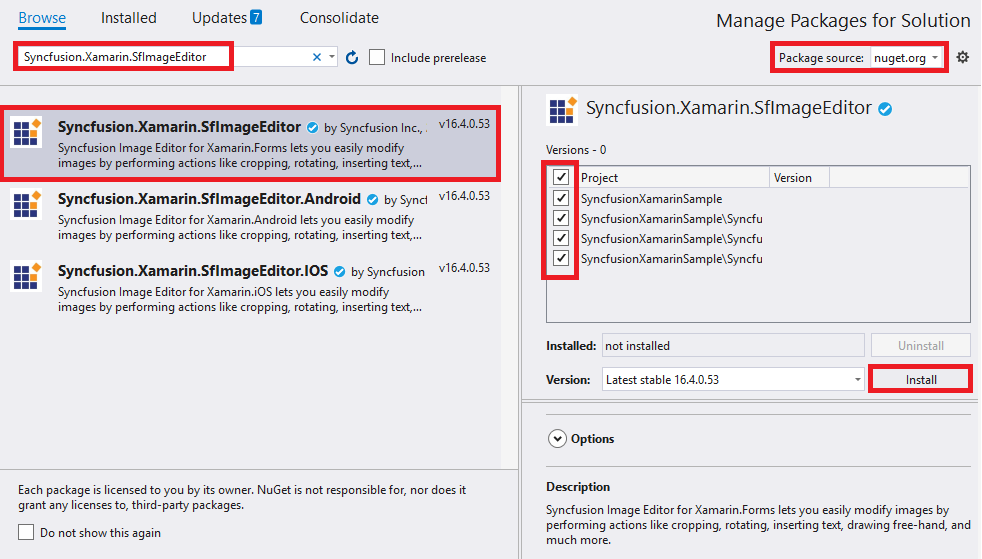

# Getting Started with SfImageEditor

This section explains the steps required to load an image to the image editor control.

To get start quickly with Xamarin Image Editor control, you can check on this video:

<iframe id='xamarinImageEditorVideoTutorial' src='https://www.youtube.com/embed/SW1fsk7YbeA'></iframe>

## Adding SfImageEditor reference

You can add SfImageEditor reference using one of the following methods:

**Method 1: Adding SfImageEditor reference from nuget.org**

Syncfusion Xamarin components are available in [nuget.org](https://www.nuget.org/). To add SfImageEditor to your project, open the NuGet package manager in Visual Studio, search for [Syncfusion.Xamarin.SfImageEditor](https://www.nuget.org/packages/Syncfusion.Xamarin.SfImageEditor), and then install it.

N> Install the same version of SfImageEditor NuGet in all the projects.

**Method 2: Adding SfImageEditor reference from toolbox**

Syncfusion also provides Xamarin Toolbox. Using this toolbox, you can drag the SfImageEditor control to the XAML page. It will automatically install the required NuGet packages and add the namespace to the page. To install Syncfusion Xamarin Toolbox, refer to [Toolbox](https://help.syncfusion.com/xamarin/utility#toolbox).

**Method 3: Adding SfImageEditor assemblies manually from the installed location**

If you prefer to manually reference the assemblies instead referencing from NuGet, add the following assemblies in respective projects.

Location: {Installed location}/{version}/Xamarin/lib

<table>
<tr>
<td>PCL</td>
<td>Syncfusion.SfImageEditor.XForms.dll Syncfusion.Core.XForms.dll </td>
</tr>
<tr>
<td>Android</td>
<td>Syncfusion.SfImageEditor.XForms.Android.dll Syncfusion.SfImageEditor.XForms.dll Syncfusion.Core.XForms.dll Syncfusion.Core.XForms.Android.dll </td>
</tr>
<tr>
<td>iOS</td>
<td>Syncfusion.SfImageEditor.XForms.iOS.dll Syncfusion.SfImageEditor.XForms.dll Syncfusion.Core.XForms.dll Syncfusion.Core.XForms.iOS.dll </td>
</tr>
<tr>
<td>UWP</td>
<td>Syncfusion.SfImageEditor.UWP.dll Syncfusion.SfImageEditor.XForms.UWP.dll Syncfusion.SfImageEditor.XForms.dll Syncfusion.Core.XForms.dll Syncfusion.Core.XForms.UWP.dll </td>
</tr>
</table>

N> To know more about obtaining our components, refer to these links for [Mac](https://help.syncfusion.com/xamarin/introduction/download-and-installation/mac/) and [Windows](https://help.syncfusion.com/xamarin/introduction/download-and-installation/windows/).

I> Starting with v16.2.0.x, if you reference Syncfusion assemblies from the trial setup or from the NuGet feed, you also have to include a license key in your projects. Please refer to [Syncfusion license key](https://help.syncfusion.com/common/essential-studio/licensing/license-key/) to know about registering Syncfusion license key in your Xamarin application to use our components.

N> If you are adding the references from toolbox, this step is not needed.

## Launching the application in iOS

To launch the image editor in iOS, call the `SfImageEditorRenderer.Init()` method in the FinishedLaunching overridden method of the AppDelegate class after the Xamarin.Forms framework has been initialized and before the LoadApplication method is called as shown in the following code sample.

 

 public override bool FinishedLaunching(UIApplication app, NSDictionary options) 

 { 
     … 

     global::Xamarin.Forms.Forms.Init();

     Syncfusion.SfImageEditor.XForms.iOS.SfImageEditorRenderer.Init();

     LoadApplication(new App()); 
     …
 }



### Universal Windows Platform (UWP)

You need to initialize the image editor view assemblies in App.xaml.cs in UWP project as demonstrated in the following code samples. This is required to deploy the application with image editor in Release mode in UWP platform.


// In App.xaml.cs

protected override void OnLaunched(LaunchActivatedEventArgs e)
    {
        …
    	    rootFrame.NavigationFailed += OnNavigationFailed;
    
        // Add `using System.Reflection;`
        List<Assembly> assembliesToInclude = new List<Assembly>();
    
        // Now, add all the assemblies your app uses                 
        assembliesToInclude.Add(typeof(Syncfusion.SfImageEditor.XForms.UWP.SfImageEditorRenderer).GetTypeInfo().Assembly);
		
        // Replaces Xamarin.Forms.Forms.Init(e);        
        Xamarin.Forms.Forms.Init(e, assembliesToInclude);	
        …     
    }



### Android

The Android platform does not require any additional configuration to render the image editor.

## Initializing image editor

1. Import SfImageEditor control namespace as `xmlns:syncfusion="clr-namespace:Syncfusion.SfImageEditor.XForms;assembly=Syncfusion.SfImageEditor.XForms` in XAML page.

2. Set the SfImageEditor control as content to the ContentPage.





            <?xml version="1.0" encoding="UTF-8"?>
            <ContentPage xmlns="http://xamarin.com/schemas/2014/forms"
                xmlns:x="http://schemas.microsoft.com/winfx/2009/xaml" x:Class="ImageEditor_GettingStarted.ImageEditor_GettingStartedPage"
                xmlns:imageeditor="clr-namespace:Syncfusion.SfImageEditor.XForms;assembly=Syncfusion.SfImageEditor.XForms">
                <ContentPage.Content>
                    <imageeditor:SfImageEditor />
                 </ContentPage.Content>
            </ContentPage> 





    using Syncfusion.SfImageEditor.XForms;
    using Xamarin.Forms;

    public class App : Application
        {
            public App()
            {
                MainPage = new ImageEditor_GettingStartedPage();
            }

        }
    Public class ImageEditor_GettingStartedPage : ContentPage
    {
        public ImageEditor_GettingStartedPage()
        {
            InitializeComponent();
            SfImageEditor editor = new SfImageEditor();
            this.Content = editor;
        }
    }



* If image is not set to the `Source` property, the appearance of the image will be shown as white canvas. You can perform editing action using built-in toolbar.

## Loading an image to image editor

Refer to the following steps to add an image to the pcl project:

1. Right-click your pcl project. 
2. Select **Add Files** submenu from **Add** menu, and a dialog box will appear.
3. Choose and import the desired image to the pcl project.
4. After the image has been imported, ensure whether the image Build Action has been set to `EmbeddedResource`.

N> Image formats such as JPEG and PNG can be loaded to the image editor.

The following code shows adding an image to the image editor control with the format as "JPEG" and name as "image".





    <?xml version="1.0" encoding="UTF-8"?>
      <ContentPage xmlns="http://xamarin.com/schemas/2014/forms"
            xmlns:x="http://schemas.microsoft.com/winfx/2009/xaml" x:Class="ImageEditor_GettingStarted.ImageEditor_GettingStartedPage"
            xmlns:imageeditor="clr-namespace:Syncfusion.SfImageEditor.XForms;assembly=Syncfusion.SfImageEditor.XForms">
            <ContentPage.Content>
                <imageeditor:SfImageEditor Source="{Binding Image}" />
             </ContentPage.Content>
      </ContentPage> 





    using Syncfusion.SfImageEditor.XForms;
    using Xamarin.Forms;

    public class App : Application
        {
            public App()
            {
                MainPage = new ImageEditor_GettingStartedPage();
            }

        }
    Public class ImageEditor_GettingStartedPage : ContentPage
    {
        public ImageEditor_GettingStartedPage()
        {
            InitializeComponent();
            BindingContext = new ImageModel();
            SfImageEditor editor = new SfImageEditor();
            this.Content = editor;
        }
    }

    class ImageModel
    {
        public ImageSource Image { get; set; }

        public ImageModel()
        {
            Image = ImageSource.FromResource("ImageEditor_GettingStarted.Image.jpg");
        }
    }




N> Refer to this [link](https://docs.microsoft.com/en-us/xamarin/xamarin-forms/user-interface/images?tabs=vswin#displaying-images) to know more about loading an image to the image editor source property in different formats.

* The following screenshot depicts loading an image to the image editor. You can edit the image using built-in toolbar.

You can find the complete getting started sample from this [link.](http://www.syncfusion.com/downloads/support/directtrac/general/ze/IESample-621789615)

## See also

[How to create signature pad using SfImageEditor](https://www.syncfusion.com/kb/9811/how-to-create-signature-pad-using-imageeditor)

[How to refer the NuGet package from local directory in mac?](https://www.syncfusion.com/kb/9497/how-to-refer-the-nuget-package-from-local-directory-in-mac)

[How to resize the image with SfImageEditor](https://www.syncfusion.com/kb/9400/how-to-resize-the-image-with-imageeditor)

[How to load image from camera and gallery in SfImageEditor](https://www.syncfusion.com/kb/9368/how-to-load-image-from-camera-and-gallery-in-xamarin-image-editor-sfimageeditor)

[How to override original image with edited image in Xamarin.Forms](https://www.syncfusion.com/kb/8910/how-to-override-original-image-with-edited-image-in-xamarin-forms)

[How to convert images to stream and byte array](https://www.syncfusion.com/kb/8887/how-to-convert-images-to-stream-and-byte-array)

[How to load SVG images in SfImageEditor](https://www.syncfusion.com/kb/8881/how-to-load-svg-images-in-imageeditor)

[How to include content for UseSafeArea for Xamarin.Forms.iOS project](https://www.syncfusion.com/kb/8879/how-to-include-content-for-usesafearea-for-forms-ios-project)

[How to customize the back button in SfImageEditor](https://www.syncfusion.com/kb/8873/how-to-customise-the-back-button-in-imageeditor)

[How to resolve image is not appearing in Release mode in SfImageEditor Xamarin.Forms.UWP](https://www.syncfusion.com/kb/8869/how-to-resolve-image-is-not-appearing-in-release-mode-in-sfimageeditor-xforms-uwp)

[How to use Xamarin.Forms as signature](https://www.syncfusion.com/kb/8303/how-to-use-image-editor-as-signature)

[How to resolve out of memory exception when loading large images in Android](https://www.syncfusion.com/kb/8301/how-to-resolve-out-of-memory-exception-when-loading-large-images-in-android)

[How to resolve “UWP Getting Exception "Could not find Windows Runtime type 'Microsoft.Graphics.Canvas.CanvasDevice'" When trying to save in UWP](syncfusion.com/kb/8290/how-to-resolve-uwp-getting-exception-could-not-find-windows-runtime-type-microsoft-graphics)

[How to resolve SfImageEditor not rendering issue in Xamarin.Forms.iOS](https://www.syncfusion.com/kb/7772/how-to-resolve-sfimageeditor-not-rendering-issue-in-xamarin-forms-ios)