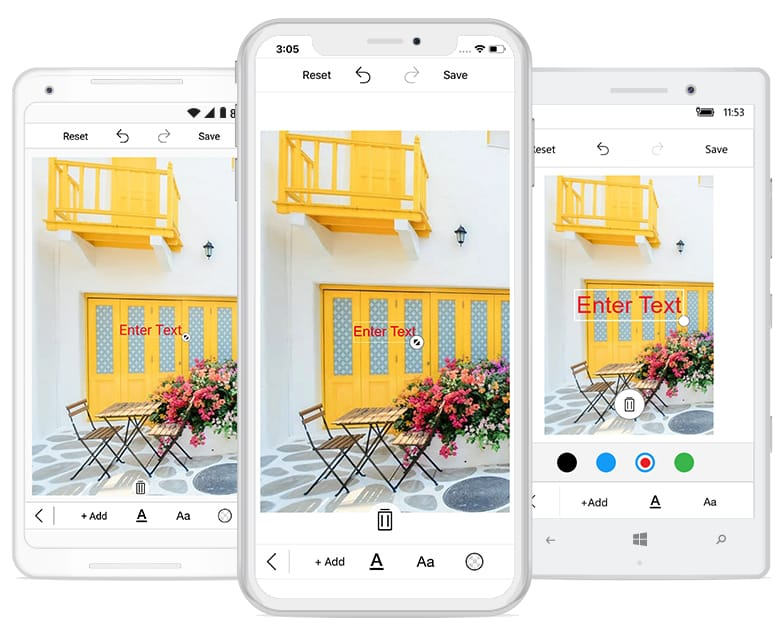
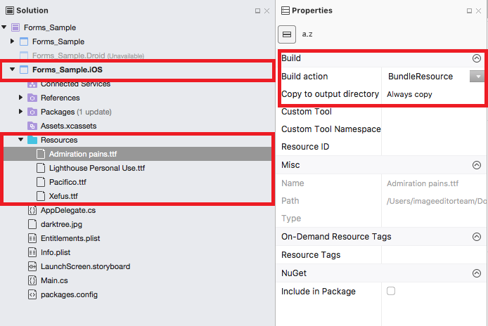
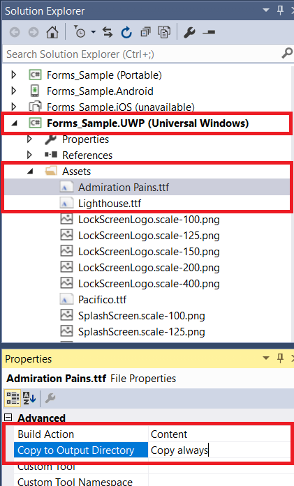
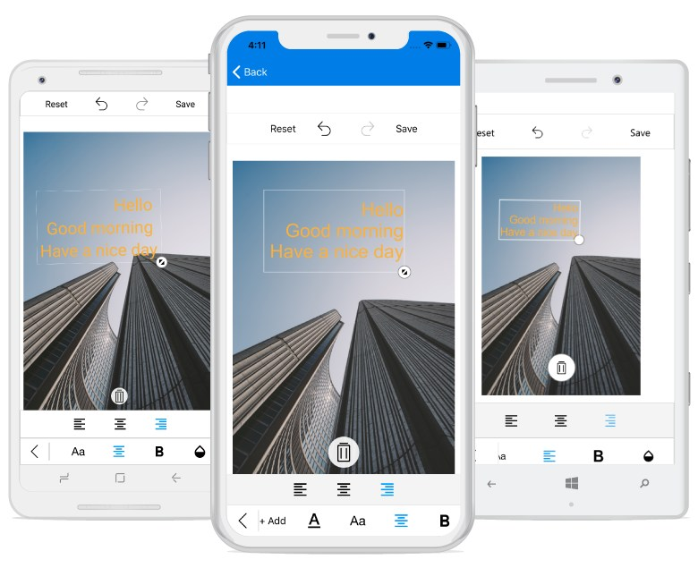

# Text in SfImageEditor

You can annotate the desired text elements to an image using the [`AddText`](https://help.syncfusion.com/cr/xamarin/Syncfusion.SfImageEditor.XForms.SfImageEditor.html#Syncfusion_SfImageEditor_XForms_SfImageEditor_AddText_System_String_Syncfusion_SfImageEditor_XForms_TextSettings_): method with customization options.



    editor.AddText("New Text");



## Customize text with TextSettings

You can customize the appearance of the text using the [`TextSettings`](https://help.syncfusion.com/cr/xamarin/Syncfusion.SfImageEditor.XForms.TextSettings.html): property.

The `TextSettings` property consists of the following properties:

* [`Color`](https://help.syncfusion.com/cr/xamarin/Syncfusion.SfImageEditor.XForms.TextSettings.html#Syncfusion_SfImageEditor_XForms_TextSettings_Color): Defines the color of the desired text.
* [`FontSize`](https://help.syncfusion.com/cr/xamarin/Syncfusion.SfImageEditor.XForms.TextSettings.html#Syncfusion_SfImageEditor_XForms_TextSettings_FontSize): Specifies the desired font size of the text under text settings.
* [`FontFamily`](https://help.syncfusion.com/cr/xamarin/Syncfusion.SfImageEditor.XForms.TextSettings.html#Syncfusion_SfImageEditor_XForms_TextSettings_FontFamily): Specifies the desired font family for text. Six types of font families are available in toolbar: `Arial`, `Noteworthy`, `Marker Felt`, `SignPainter`, `Bradley Hand`, `Snell Round hand`.
* [`Bounds`](https://help.syncfusion.com/cr/xamarin/Syncfusion.SfImageEditor.XForms.TextSettings.html#Syncfusion_SfImageEditor_XForms_TextSettings_Bounds): Allows to set frame for the newly added `Text`. You can position the text wherever you want on the image. In percentage, the value of the text frame should fall between 0 and 100.
* [`Opacity`](https://help.syncfusion.com/cr/xamarin/Syncfusion.SfImageEditor.XForms.TextSettings.html#Syncfusion_SfImageEditor_XForms_TextSettings_Opacity): Changes the opacity of text.
* [`Angle`](https://help.syncfusion.com/cr/xamarin/Syncfusion.SfImageEditor.XForms.TextSettings.html#Syncfusion_SfImageEditor_XForms_TextSettings_Angle): Changes the angle of text.
* [`TextEffects`](https://help.syncfusion.com/cr/xamarin/Syncfusion.SfImageEditor.XForms.TextSettings.html#Syncfusion_SfImageEditor_XForms_TextSettings_TextEffects): Changes the effects of the text such as `Bold`, `Italic` and `Underline`.





    editor.AddText("New Text", new TextSettings(){Color = Color.Black, FontSize = 16d, FontFamily="Arial", Bounds = new Rectangle(20, 20, 35, 35), Opacity=0.5f, Angle=45, TextEffects = TextEffects.Bold | TextEffects.Italic | TextEffects.Underline});





## Custom font family

Using a font that is not in the built-in typeface requires some platform-specific coding. The steps required for each platform are shown as follows.

Download the custom fonts in ttf file format, and add these fonts to required folder in particular project file.

### Android

Add the custom fonts to Assets folder in sample.Droid project.

Right-click the font file, and open properties. In properties, change the "Build Action" property of every font file to `AndroidAsset` and "Copy to output directory" to `Copy Always`.
    

    
### iOS

Add custom fonts to resource file in sample.iOS project.

Change the "Build Action" property of every font file to `BundleResource` and "Copy to output directory" to `Copy Always`.

    
Open the `info.plist` file, and select "Source" at the bottom of the file.

After opened the source file, add "Fonts provided by application" to source file, and add the downloaded custom fonts name with .ttf extension.

### UWP

Add custom fonts to Assets folder in sample.UWP project.

Right-click the font file, and open properties. In properties, change the  "Build Action" property of every font file to `Content` and "Copy to output directory" to `Copy Always`.
    

The following code snippet shows applying custom font family. In forms, Android, and iOS, give the font family name, but in UWP, you should mention font file name with .ttf extension and "#" symbol
with font family name.





    if((Device.OS == TargetPlatform.Android)||(Device.OS == TargetPlatform.iOS))
        editor.AddText("New Text", new TextSettings(){FontFamily="Pacifico"});
    else
        editor.AddText("New Text", new TextSettings(){FontFamily="Assets/Pacifico.ttf#Pacifico"});




## Multiline text and text alignment

### Multiline text
You can annotate multiple line text over an image with the help of text preview window.

### Text alignment
[`TextAlignment`](https://help.syncfusion.com/cr/xamarin/Syncfusion.SfImageEditor.XForms.TextAlignment.html) is an enum type and text can be aligned with the help of text alignment enum values such as left, right and center. 

N> The default text alignment is `Left` and text alignment is not applicable for single line text.



    editor.AddText("Hello\nGood morning\nHave a nice day", new TextSettings() {TextAlignment = TextAlignment.Right });



## Text Rotation

You can rotate and resize the text by enabling the [`RotatableElements`](https://help.syncfusion.com/cr/xamarin/Syncfusion.SfImageEditor.XForms.SfImageEditor.html#Syncfusion_SfImageEditor_XForms_SfImageEditor_RotatableElements) property of image editor. [`ImageEditorElements`](https://help.syncfusion.com/cr/xamarin/Syncfusion.SfImageEditor.XForms.ImageEditorElements.html) is an enum type with values Text, CustomView and None as shown in the following code snippet.





    editor.RotatableElements = ImageEditorElements.Text;   





N> The default value for RotatableElements is `None`.

You can rotate the text based on a particular angle using [`Angle`](https://help.syncfusion.com/cr/xamarin/Syncfusion.SfImageEditor.XForms.TextSettings.html#Syncfusion_SfImageEditor_XForms_TextSettings_Angle) property in [`TextSettings`](https://help.syncfusion.com/cr/xamarin/Syncfusion.SfImageEditor.XForms.TextSettings.html) as shown in the following code snippet. 





    editor.AddText("Good morning", new TextSettings(){Angle = 45});    





## Restricting the edit text box pop-up window

You can restrict the edit text box pop-up window using the [`IsEditable`](https://help.syncfusion.com/cr/xamarin/Syncfusion.SfImageEditor.XForms.TextSettings.html#Syncfusion_SfImageEditor_XForms_TextSettings_IsEditable) property. By Default, the value of the IsEditable property is true, so you can edit the text in edit text box pop-up window. When setting the IsEditable property to false, the edit text box pop-up window will not be displayed, and you are restricted to edit the text in the edit text box. 



 editor.AddText("text", new TextSettings { IsEditable=false });



## See also

[How to add text after image is loaded in SfImageEditor](https://www.syncfusion.com/kb/10034/how-to-add-text-after-image-is-loaded-in-sfimageeditor)

[How to add custom toolbar to add shapes or text dynamically in Xamarin.Forms SfImageEditor](https://www.syncfusion.com/kb/10621/how-to-add-custom-toolbar-to-add-shapes-or-text-dynamically-in-xamarin-forms-sfimageeditor)

[How to rotate the text programmatically in SfImageEditor](https://www.syncfusion.com/kb/9735/how-to-rotate-the-text-programmatically-in-image-editor)
