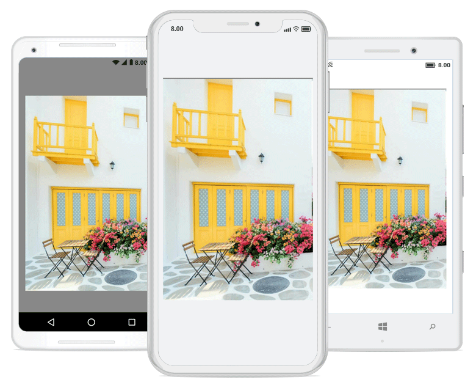
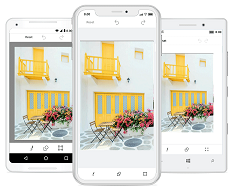
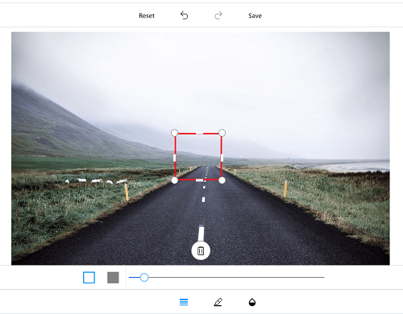
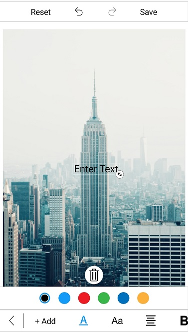
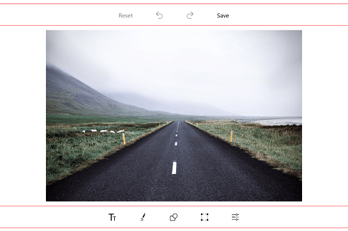

# Toolbar customization

You can customize the color palette, visibility, and appearance of each toolbar item.

## Customize toolbar items

The image editor control provides support to customize and configure the appearance of toolbar menu. You can customize the toolbar by adding respective FooterToolbarItem and HeaderToolbarItem.

### Toolbar item

You can customize each toolbar item using the [`Text`](https://help.syncfusion.com/cr/xamarin/Syncfusion.SfImageEditor.XForms.ToolbarItem.html#Syncfusion_SfImageEditor_XForms_ToolbarItem_Text) and [`Icon`](https://help.syncfusion.com/cr/xamarin/Syncfusion.SfImageEditor.XForms.ToolbarItem.html#Syncfusion_SfImageEditor_XForms_ToolbarItem_Icon) properties.

### Name

You can get or set the names of built-in toolbar and dynamically added toolbar items using the [`Name`](https://help.syncfusion.com/cr/xamarin/Syncfusion.SfImageEditor.XForms.ToolbarItem.html#Syncfusion_SfImageEditor_XForms_ToolbarItem_Name) property.



            public MainPage()
            {			
                InitializeComponent();
                SfImageEditor editor = new SfImageEditor();
                var itemName = editor.ToolbarSettings.ToolbarItems[2].Name;
            }



N> The following built-in toolbar item names are available in image editor: `Back`, `Text`, `Add`, `TextColor`, `FontFamily`, `Arial`, `Noteworthy`, `Marker Felt`, `Bradley Hand`, `SignPainter`, `Opacity`, `Path`, `StrokeThickness`, `Colors`, `Opacity`, `Shape`, `Rectangle`, `StrokeThickness`, `Circle`, `Arrow`, `Transform`, `Crop`, `free`, `original`, `square`, `3:1`, `3:2`, `4:3`, `5:4`, `16:9`, `Rotate`, `Flip`, `Reset`, `Undo`, `Redo`, `Save`, `Effects`, `Hue`, `Saturation`, `Brightness`, `Contrast`, `Blur` and `Sharpen`.

N> You cannot modify the names of existing built-in toolbar items and cannot create toolbar item with these list.

The toolbar menu contains a set of header and footer menu items that help to perform editing actions. This can be categorized into the following types:

1. HeaderToolbarItem
2. FooterToolbarItem
3. SubItems

## Adding HeaderToolbarItem

The [`HeaderToolbarItem`](https://help.syncfusion.com/cr/xamarin/Syncfusion.SfImageEditor.XForms.HeaderToolbarItem.html) is placed on the top of the image editor, and you can customize the header toolbar item using the [`Icon`](https://help.syncfusion.com/cr/xamarin/Syncfusion.SfImageEditor.XForms.ToolbarItem.html#Syncfusion_SfImageEditor_XForms_ToolbarItem_Icon) and [`Text`](https://help.syncfusion.com/cr/xamarin/Syncfusion.SfImageEditor.XForms.ToolbarItem.html#Syncfusion_SfImageEditor_XForms_ToolbarItem_Text) properties:



            editor.ToolbarSettings.ToolbarItems.Add(new HeaderToolbarItem() { Icon = ImageSource.FromResource("ImageEditor.share.png"), Text="Share" });



## Adding FooterToolbarItem   

The [`FooterToolbarItem`](https://help.syncfusion.com/cr/xamarin/Syncfusion.SfImageEditor.XForms.FooterToolbarItem.html) is placed on the bottom of the image editor, and you can customize the footer toolbar item using the [`Icon`](https://help.syncfusion.com/cr/xamarin/Syncfusion.SfImageEditor.XForms.ToolbarItem.html#Syncfusion_SfImageEditor_XForms_ToolbarItem_Icon) and [`Text`](https://help.syncfusion.com/cr/xamarin/Syncfusion.SfImageEditor.XForms.ToolbarItem.html#Syncfusion_SfImageEditor_XForms_ToolbarItem_Text) properties.

Refer to the following code snippet to customize footer toolbar item.



            editor.ToolbarSettings.ToolbarItems.Add(new FooterToolbarItem() { Icon = ImageSource.FromResource("ImageEditor.delete.png"), Text="Delete" });
            editor.ToolbarSettings.ToolbarItems.Add(new FooterToolbarItem() { Icon = ImageSource.FromResource("ImageEditor.more.png"), Text="More" });



## Adding SubItems to the FooterToolbarItem

The [`SubItems`](https://help.syncfusion.com/cr/xamarin/Syncfusion.SfImageEditor.XForms.FooterToolbarItem.html#Syncfusion_SfImageEditor_XForms_FooterToolbarItem_SubItems) is only applicable for [`FooterToolbarItem`](https://help.syncfusion.com/cr/xamarin/Syncfusion.SfImageEditor.XForms.FooterToolbarItem.html), and it represents grouped action of respective footer toolbar item. The SubItems will be placed above the footer toolbar item layout, and you can also customize the appearance of sub items as main toolbar items.

Refer to the following code snippet to customize sub items of footer toolbar item.



 	editor.ToolbarSettings.ToolbarItems.Add(new FooterToolbarItem()
            {
                Text = "More",
                Icon = ImageSource.FromResource("ImageEditor.Image.more.png"),
                SubItems = new ObservableCollection<ToolbarItem>()
                {
                   new ToolbarItem() {
                Icon = ImageSource.FromResource("ImageEditor.Image.download.png")
                },
                   new ToolbarItem() {
                Icon = ImageSource.FromResource("ImageEditor.Image.share.png")
                } }
            });



N> You can remove the existing toolbar items [names](/xamarin/sfimageeditor/toolbarcustomization#name) from image editor toolbarItems collection based on the index value and change the icon and text values dynamically for any of the already added toolbar item based on the index as shown in the following code snippet.



editor.ToolbarSettings.ToolbarItems[5].Text = "new item";
editor.ToolbarSettings.ToolbarItems[3].Icon = ImageSource.FromResource("ImageEditor.Image.jpg");



## ToolbarItemSelected event 

Whenever you tap the toolbar menu item, the [`ToolbarItemSelected`](https://help.syncfusion.com/cr/xamarin/Syncfusion.SfImageEditor.XForms.ToolbarSettings.html) event will be triggered, and you can get the respective tapped toolbar item as an argument as shown in the following code snippet. 



        public MainPage()
        {
            editor.ToolbarSettings.ToolbarItemSelected += ToolbarSettings_ToolbarItemSelected;
        }

        private void ToolbarSettings_ToolbarItemSelected(object sender, ToolbarItemSelectedEventArgs e)
        {
           DisplayAlert("Selected ToolbarItem is  " + e.ToolbarItem.Text, "Ok", "Cancel");
        }



### MoveSubItemsToFooterToolbar 

The [`MoveSubItemsToFooterToolbar`](https://help.syncfusion.com/cr/xamarin/Syncfusion.SfImageEditor.XForms.ToolbarItemSelectedEventArgs.html#Syncfusion_SfImageEditor_XForms_ToolbarItemSelectedEventArgs_MoveSubItemsToFooterToolbar) is boolean property of the ToolbarItemSelected event argument; it decides the placement of each sub items of respective footer toolbar item. 

If you set the value to `true`, the respective sub items of footer item will be placed on footer toolbar layout. If you set `false`, then the sub items will be placed above the footer toolbar layout.



    public MainPage()
            {
                        . . .

                SfImageEditor edit = new SfImageEditor();
                edit.ToolbarSettings.ToolbarItems.Add(new FooterToolbarItem()
                    {
                        Text = "NewFooterItem",
                        SubItems = new ObservableCollection<ToolbarItem>()
                        {
                            new ToolbarItem(){ Text= "Subitem1"},
                            new ToolbarItem(){ Text= "Subitem2"},
                            new ToolbarItem(){ Text= "Subitem3"},
                        }
                    });
                edit.ToolbarSettings.ToolbarItemSelected += ToolbarSettings_ToolbarItemSelected;
                        
                        . . .
            }

    private void ToolbarSettings_ToolbarItemSelected(object sender, ToolbarItemSelectedEventArgs e)
            {
                if(e.ToolbarItem != null && e.ToolbarItem is FooterToolbarItem)
                {
                    if(e.ToolbarItem.Text == "NewFooterItem")
                    {
                        e.MoveSubItemsToFooterToolbar = false;
                    }
                }
            }



N> This is not applicable for built-in footer toolbar items.

## To hide/show toolbar

To show or hide the toolbar, set the [`IsVisible`](https://help.syncfusion.com/cr/xamarin/Syncfusion.SfImageEditor.XForms.ToolbarSettings.html#Syncfusion_SfImageEditor_XForms_ToolbarSettings_IsVisible) property of toolbar to either true or false. By default, the `IsVisible` property is set to true.




  
     <imageeditor:SfImageEditor.ToolbarSettings>
			<imageeditor:ToolbarSettings IsVisible="false" />
		</imageeditor:SfImageEditor.ToolbarSettings>
      




      editor.ToolbarSettings.IsVisible = false;
     





## To hide/show the toolbar item

You can hide or show the toolbar items by specifying their icon names and setting the boolean values to true or false.

N> You can customize an icon by specifying its [names](/xamarin/sfimageeditor/toolbarcustomization#name).





    editor.SetToolbarItemVisibility("text,save", false);





## To hide or show the delete button

You can show or hide the delete button, which employed in deleting the selected shapes added in image editor with the help of [`IsDeleteButtonVisible`](https://help.syncfusion.com/cr/xamarin/Syncfusion.SfImageEditor.XForms.ToolbarSettings.html#Syncfusion_SfImageEditor_XForms_ToolbarSettings_IsDeleteButtonVisible) property in [`ToolbarSettings`](https://help.syncfusion.com/cr/xamarin/Syncfusion.SfImageEditor.XForms.ToolbarSettings.html).

Setting false for this property will never show the delete button. On setting true, delete button will get enabled by selecting the shapes.





       <editor:SfImageEditor Source="{Binding Image}">
                <editor:SfImageEditor.ToolbarSettings>
                    <editor:ToolbarSettings IsDeleteButtonVisible="True"></editor:ToolbarSettings>
                </editor:SfImageEditor.ToolbarSettings>                
            </editor:SfImageEditor>





            SfImageEditor editor = new SfImageEditor();
            editor.Source = ImageSource.FromResource("XFormsUG.RoadView.jpeg");
            editor.ToolbarSettings = new ToolbarSettings()
            {
                IsDeleteButtonVisible = true,
            };
            this.Content = editor;





## To customize the ColorPalette

You can change the default colors of the [`ColorPalette`](https://help.syncfusion.com/cr/xamarin/Syncfusion.SfImageEditor.XForms.SfImageEditor.html#Syncfusion_SfImageEditor_XForms_SfImageEditor_ColorPalette) in toolbar.




  
    <imageeditor:SfImageEditor.ColorPalette>
			<Color>Yellow</Color>
			<Color>Pink</Color>
			<Color>Violet</Color>
		</imageeditor:SfImageEditor.ColorPalette>  
      




    ObservableCollection<Color> CustomColorPalette = new ObservableCollection<Color>()
	{
				Color.Yellow,
				Color.Pink,
				Color.Violet
	};

			editor.ColorPalette = CustomColorPalette;





## Default Color Selected Index

You can change the default index of the color palette in toolbar. By default, color palette index value is 2.




  
    <imageeditor:SfImageEditor x:Name="editor" DefaultSelectedColorIndex="0"/>
      




    editor.DefaultSelectedColorIndex = 0;





## ToolbarHeight Customization

You can customize `height of the toolbar` and toolbar items `icon` and `text`.

### Customize toolbar height 

The image editor control supports to customize the default height of the `Header`, `Footer`, and `Sub item` using the following properties:

1. [`HeaderToolbarHeight`](https://help.syncfusion.com/cr/xamarin/Syncfusion.SfImageEditor.XForms.ToolbarSettings.html#Syncfusion_SfImageEditor_XForms_ToolbarSettings_HeaderToolbarHeight)
2. [`FooterToolbarHeight`](https://help.syncfusion.com/cr/xamarin/Syncfusion.SfImageEditor.XForms.ToolbarSettings.html#Syncfusion_SfImageEditor_XForms_ToolbarSettings_FooterToolbarHeight) 
3. [`SubItemToolbarHeight`](https://help.syncfusion.com/cr/xamarin/Syncfusion.SfImageEditor.XForms.ToolbarSettings.html#Syncfusion_SfImageEditor_XForms_ToolbarSettings_SubItemToolbarHeight)

The toolbar items will be resized based on the height. To change the height of the toolbar, refer to the following code snippet.





         <imageeditor:SfImageEditor.ToolbarSettings>
                    <imageeditor:ToolbarSettings 
                        HeaderToolbarHeight="70"
                        FooterToolbarHeight="70"                          
                        SubItemToolbarHeight="70"/>
                </imageeditor:SfImageEditor.ToolbarSettings>





    editor.ToolbarSettings.HeaderToolbarHeight = 70;
    editor.ToolbarSettings.FooterToolbarHeight = 70;
    editor.ToolbarSettings.SubItemToolbarHeight = 70;





### Individual toolbar item height customization

You can arrange the toolbar items based on the toolbar height using the following properties:

1.  [`TextHeight`](https://help.syncfusion.com/cr/xamarin/Syncfusion.SfImageEditor.XForms.ToolbarItem.html#Syncfusion_SfImageEditor_XForms_ToolbarItem_TextHeight)
2.  [`IconHeight`](https://help.syncfusion.com/cr/xamarin/Syncfusion.SfImageEditor.XForms.ToolbarItem.html#Syncfusion_SfImageEditor_XForms_ToolbarItem_IconHeight)

To change the toolbar item Text and Icon height, refer to the following code snippet.





     FooterToolbarItem footerItem = new FooterToolbarItem()
            {
                IconHeight=40,
                TextHeight=20,
                Icon = ImageSource.FromResource("ImageEditor.share.png"),
                Text = "Share"
            };

            editor.ToolbarSettings.ToolbarItems.Add(footerItem);
    




## Toolbar color customization

Border color of the toolbar can be customized with the help of [`BorderColor`](https://help.syncfusion.com/cr/xamarin/Syncfusion.SfImageEditor.XForms.ToolbarSettings.html#Syncfusion_SfImageEditor_XForms_ToolbarSettings_BorderColor) property in [`ToolbarSettings`](https://help.syncfusion.com/cr/xamarin/Syncfusion.SfImageEditor.XForms.ToolbarSettings.html).





    <editor:SfImageEditor x:Name="editor" Source="{Binding Image}" >
                <editor:SfImageEditor.ToolbarSettings>
                    <editor:ToolbarSettings BorderColor="Red"></editor:ToolbarSettings>
                </editor:SfImageEditor.ToolbarSettings>        
            </editor:SfImageEditor>





         SfImageEditor editor = new SfImageEditor();
            editor.Source = ImageSource.FromResource("XFormsUG.RoadView.jpeg");
            editor.ToolbarSettings = new ToolbarSettings()
            {
                BorderColor = Color.Red,
            };
            this.Content = editor;





## See also

[How to add custom toolbar to add shapes or text dynamically in SfImageEditor](https://www.syncfusion.com/kb/10621/how-to-add-custom-toolbar-to-add-shapes-or-text-dynamically-in-xamarin-forms-sfimageeditor)

[How to get toolbar item and change icon using name in SfImageEditor](https://www.syncfusion.com/kb/9367/how-to-get-toolbar-item-and-change-icon-using-name-in-sfimageeditor)
	
[How to disable toolbar menu in SfImageEditor](https://www.syncfusion.com/kb/8277/how-to-disable-toolbar-menu)

[How to show or hide SfImageEditor toolbar items](https://www.syncfusion.com/kb/8258/how-to-show-or-hide-image-editor-toolbar-items)
