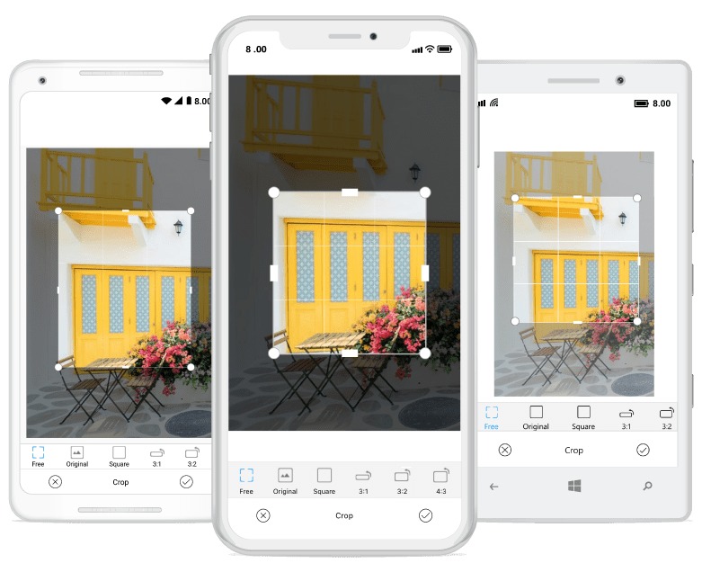

# Crop in SfImageEditor

You can crop the desired portion of an image using the cropping tool.

## Image cropping ratio

You can crop the image with various aspect ratios. The following cropping ratios are available in built-in toolbar: "`Free`, `Original`, `Square`, `3:1`, `1:3`, `3:2`, `2:3`, `4:3`, `3:4`, `5:4`, `4:5`, `16:9`, `9:16`".

Cropping operation can be done in the following two ways:

* Enabling cropping and selecting the crop region visually.
* Entering the cropping area manually.

### Handling the cropping tool

The [`ToggleCropping`](https://help.syncfusion.com/cr/xamarin/Syncfusion.SfImageEditor.XForms.SfImageEditor.html#Syncfusion_SfImageEditor_XForms_SfImageEditor_ToggleCropping) method in the image editor control allows users to enable or disable the cropping region placed over the image to visually choose the area for cropping.

* The following code shows cropping the image to any desired size.



// For free hand cropping.

editor.ToggleCropping();    



* The following code shows cropping an image based on its original width and height.



// For cropping a image with its original width and height.

editor.ToggleCropping(float.NaN,float.NaN);    



* The following code shows cropping an image in square format.



// To crop an image as a square dimension.

editor.ToggleCropping(1,1);



* The following code shows cropping an image based on specific ratio.



// For cropping the image with ratio, x value as 9, and y value as 17.

editor.ToggleCropping(9,17);    

 

* To position the cropping window with custom location, pass the desired rectangle in ToggleCropping method. Each value in the rectangle should be in offset value(0 to 100).



Rectangle rect = new Rectangle(20,20,50,50);

editor.ToggleCropping(rect);    

 

After the cropping area has been selected, the [`Crop`](https://help.syncfusion.com/cr/xamarin/Syncfusion.SfImageEditor.XForms.SfImageEditor.html#Syncfusion_SfImageEditor_XForms_SfImageEditor_Crop_Xamarin_Forms_Rectangle_) method is called, which in turn crops the selected region and displays the cropped image on the image editor.



editor.Crop();



### Entering the cropping area manually

To manually enter the cropping area without enabling the cropping functionality, use the overloaded Crop(Rectangle rect) method. It can be done by defining a rectangle and passing it to the Crop(rect) method.





editor.Crop(new Rectangle(100,100,150,200));





## See also

[How to detect cropping window is enabled or not](https://www.syncfusion.com/kb/9750/how-to-detect-cropping-window-is-enabled-or-not)

[How to save the image after cropping in SfImageEditor](https://www.syncfusion.com/kb/9734/how-to-save-the-image-after-cropping-in-imageeditor)

[How to include custom cropping aspect in toolbar](https://www.syncfusion.com/kb/8854/how-to-include-custom-cropping-aspect-in-toolbar)

[How to avoid crop sluggishness in MasterDetailPage](syncfusion.com/kb/9634/how-to-avoid-crop-sluggishness-in-masterdetailpage)

[How can we set default cropping in SfImageEditor](https://www.syncfusion.com/kb/9369/how-can-we-set-default-cropping-in-image-editor)

[How to enable toggle cropping in ImageLoaded event](https://www.syncfusion.com/kb/8933/how-to-enable-toggle-cropping-in-imageloaded-event)

