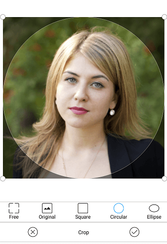
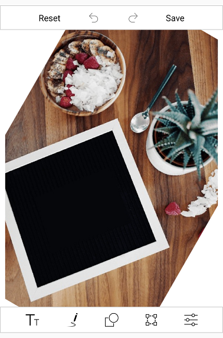
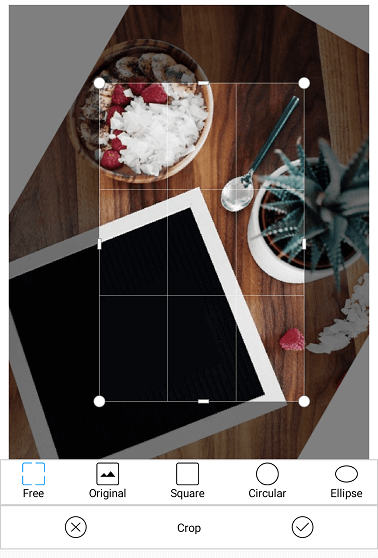

# Crop in Xamarin Image Editor (SfImageEditor)

You can crop the desired portion of an image using the cropping tool.

## Image cropping ratio

You can crop the image to various aspect ratios. The following cropping ratios are available in built-in toolbar: "`Free`, `Original`, `Square`, `Circular`, `Ellipse`, `3:1`, `1:3`, `3:2`, `2:3`, `4:3`, `3:4`, `5:4`, `4:5`, `16:9`, `9:16`".

Cropping operation can be done in the following two ways:

* Enabling cropping and selecting the crop region visually.
* Entering the cropping area manually.

N> You can enable the cropping in the zoomed area and crop the specific position from the zoomed area. 

### Handling the cropping tool

The [`ToggleCropping`](https://help.syncfusion.com/cr/xamarin/Syncfusion.SfImageEditor.XForms.SfImageEditor.html#Syncfusion_SfImageEditor_XForms_SfImageEditor_ToggleCropping) method in the image editor control allows users to enable or disable the cropping region placed over the image to visually choose the area for cropping.

* The following code shows cropping the image to any desired size.



// For free hand cropping.

editor.ToggleCropping();    



* The following code shows cropping an image based on its original width and height.



// For cropping a image with its original width and height.

editor.ToggleCropping(float.NaN,float.NaN);    



* The following code shows cropping an image in square format.



// To crop an image as a square dimension.

editor.ToggleCropping(1,1);



* The following code shows cropping an image based on specific ratio.



// For cropping the image with ratio, x value as 9, and y value as 17.

editor.ToggleCropping(9,17);    

 

* To position the cropping window with custom location, pass the desired rectangle in [`ToggleCropping`](https://help.syncfusion.com/cr/xamarin/Syncfusion.SfImageEditor.XForms.SfImageEditor.html#Syncfusion_SfImageEditor_XForms_SfImageEditor_ToggleCropping_Xamarin_Forms_Rectangle_System_Boolean_) method. Each value in the rectangle should be in offset value(0 to 100).



Rectangle rect = new Rectangle(20,20,50,50);

editor.ToggleCropping(rect);    

 

After the cropping area has been selected, the [`Crop`](https://help.syncfusion.com/cr/xamarin/Syncfusion.SfImageEditor.XForms.SfImageEditor.html#Syncfusion_SfImageEditor_XForms_SfImageEditor_Crop_Xamarin_Forms_Rectangle_System_Boolean_) method is called, which in turn crops the selected region and displays the cropped image on the image editor.



editor.Crop();



### Circle cropping

An image can be cropped in circle or elliptical format, which could be perfect for using it as a profile picture.

Specify the [`ToggleCropping`](https://help.syncfusion.com/cr/xamarin/Syncfusion.SfImageEditor.XForms.SfImageEditor.html#Syncfusion_SfImageEditor_XForms_SfImageEditor_ToggleCropping_Xamarin_Forms_Rectangle_System_Boolean_) parameter as shown in the below code sample.

N> When an empty rect is specified in the parameter, a rounded rect will be formed covering the entire image and it will be either in circle or ellipse shape based on the image bounds.



// To crop an image as a circular dimension.

            var size = editor.ActualImageRenderedBounds;
            var minSize = Math.Min(size.Width, size.Height);
            var leftX = (size.Width - minSize) / 2;
            var topY = (size.Height - minSize) / 2 ;

            var x = (leftX * 100) / size.Width;
            var y = (topY * 100) / size.Height;
            var width = (minSize * 100) / size.Width;
            var height = (minSize * 100) / size.Height;

            editor.ToggleCropping(new Rectangle(x, y, width, height), true);



The following image show cases the circularly cropped image.

 The following code shows cropping an image in elliptical format.



// To crop an image as a elliptical dimension.

editor.ToggleCropping(new Rectangle(), true);



### Entering the cropping area manually

To manually enter the cropping area without enabling the cropping functionality, use the overloaded [`Crop(Rectangle rect)`](https://help.syncfusion.com/cr/xamarin/Syncfusion.SfImageEditor.XForms.SfImageEditor.html#Syncfusion_SfImageEditor_XForms_SfImageEditor_Crop_Xamarin_Forms_Rectangle_System_Boolean_) method. It can be done by defining a rectangle and passing it to the [`Crop(rect)`](https://help.syncfusion.com/cr/xamarin/Syncfusion.SfImageEditor.XForms.SfImageEditor.html#Syncfusion_SfImageEditor_XForms_SfImageEditor_Crop_Xamarin_Forms_Rectangle_System_Boolean_) method.





editor.Crop(new Rectangle(100,100,150,200));





### Selecting the cropping ratio programmatically

Programmatically, you can select the desired cropping ratio from the various aspect ratios available in the built-in cropping toolbar by specifying the corresponding index of the toolbar item using the [`ToggleCropping`](https://help.syncfusion.com/cr/xamarin/Syncfusion.SfImageEditor.XForms.SfImageEditor.html#Syncfusion_SfImageEditor_XForms_SfImageEditor_ToggleCropping_System_Boolean_System_Int32_) method.

The following code sample will add the cropping preview on the image in square shape.





 editor.ToggleCropping(true, 2);





## Tilt the image

You can tilt the image from -45 to +45 degree by using the [`Tilt()`](https://help.syncfusion.com/cr/xamarin/Syncfusion.SfImageEditor.XForms.SfImageEditor.html#Syncfusion_SfImageEditor_XForms_SfImageEditor_Tilt_System_Int32_) method. When calling the tilt method, the image will be in preview state. You can zoom and pan the image in preview state. To apply this effect to the image, you can call the [`Crop()`](https://help.syncfusion.com/cr/xamarin/Syncfusion.SfImageEditor.XForms.SfImageEditor.html#Syncfusion_SfImageEditor_XForms_SfImageEditor_Crop_Xamarin_Forms_Rectangle_System_Boolean_) method programmatically or can crop from footer toolbar cropping options.

N> Any action performed when the image is in Tilt preview state will reset the tilt effect of that image.





editor.Tilt(30);

 // To apply the tilt effect to the image.
 editor.Crop();





The following screenshot depicts the tilt preview state.

After tilt preview, cropping can be performed using the available cropping options from footer toolbar.

## See also

[How to detect cropping window is enabled or not](https://www.syncfusion.com/kb/9750/how-to-detect-cropping-window-is-enabled-or-not)

[How to save the image after cropping in SfImageEditor](https://www.syncfusion.com/kb/9734/how-to-save-the-image-after-cropping-in-imageeditor)

[How to include custom cropping aspect in toolbar](https://www.syncfusion.com/kb/8854/how-to-include-custom-cropping-aspect-in-toolbar)

[How to avoid crop sluggishness in MasterDetailPage](syncfusion.com/kb/9634/how-to-avoid-crop-sluggishness-in-masterdetailpage)

[How can we set default cropping in SfImageEditor](https://www.syncfusion.com/kb/9369/how-can-we-set-default-cropping-in-image-editor)

[How to enable toggle cropping in ImageLoaded event](https://www.syncfusion.com/kb/8933/how-to-enable-toggle-cropping-in-imageloaded-event)

