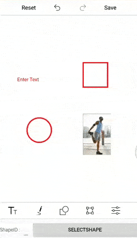

# Select annotations programmatically in Image Editor (SfImageEditor)

In ImageEditor, the Unique ID has been generated for all annotations (Text, Shapes, Paths, CustomViews) while adding it to the image editor and we can get this Unique ID from the ItemsSelected event arguments or from the serialized JSON. By passing this Unique ID to the SelectShape method of SfImageEditor, we can select the particular annotation programmatically.

The following code sample demonstrates this.



<Grid>
    <Grid.RowDefinitions>
        <RowDefinition Height="*" />
        <RowDefinition Height="Auto" />
    </Grid.RowDefinitions>
    <imageEditor:SfImageEditor x:Name="imageEditor"
                               Source="{Binding Image}"
                               ItemSelected="imageEditor_ItemSelected" />
    <StackLayout Grid.Row="1"
                 Orientation="Horizontal">
        <Label Text="ShapeID :" />
        <Entry x:Name="shapeID" />
        <Button Text="SelectShape"
                Clicked="SelectShape_Clicked"
                HorizontalOptions="FillAndExpand"/>
    </StackLayout>
</Grid>





public MainPage()
{
    InitializeComponent();
    this.imageEditor.ToolbarSettings.ToolbarItemSelected += this.ToolbarSettings_ToolbarItemSelected;
    this.imageEditor.ToolbarSettings.ToolbarItems.Add(new FooterToolbarItem
    {
        Name = "Custom View",
        Text = "Custom View"
    });
}

private void ToolbarSettings_ToolbarItemSelected(object sender, ToolbarItemSelectedEventArgs e)
{
    if (e.ToolbarItem.Name == "Custom View")
    {
        Image customImage = new Image() { HeightRequest = 200, WidthRequest = 200 };
        customImage.Source = ImageSource.FromResource("XFIEUniqueID.EditedImage.jpg");
        imageEditor.AddCustomView(customImage, new CustomViewSettings());
    }
}

private void imageEditor_ItemSelected(object sender, ItemSelectedEventArgs args)
{
    int uniqueID;
    PenSettings penSettings = args.Settings as PenSettings;
    TextSettings textSettings = args.Settings as TextSettings;
    CustomViewSettings customViewSettings = args.Settings as CustomViewSettings;
    if (penSettings != null)
    {
        uniqueID = penSettings.ShapeID;
    }
    else if (textSettings != null)
    {
        uniqueID = textSettings.ShapeID;
    }
    else
    {
        uniqueID = customViewSettings.ShapeID;
    }
}

private void SelectShape_Clicked(object sender, EventArgs e)
{
    int shapeId;
    if (int.TryParse(this.shapeID.Text, out shapeId))
    {
        this.imageEditor.SelectShape(shapeId);
    }
}



