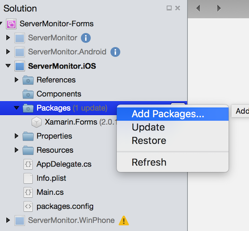
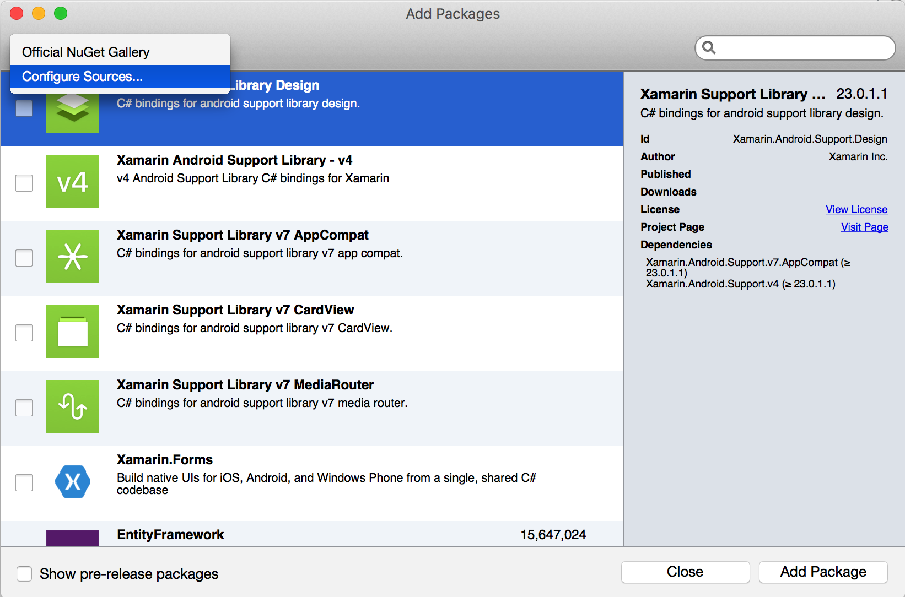
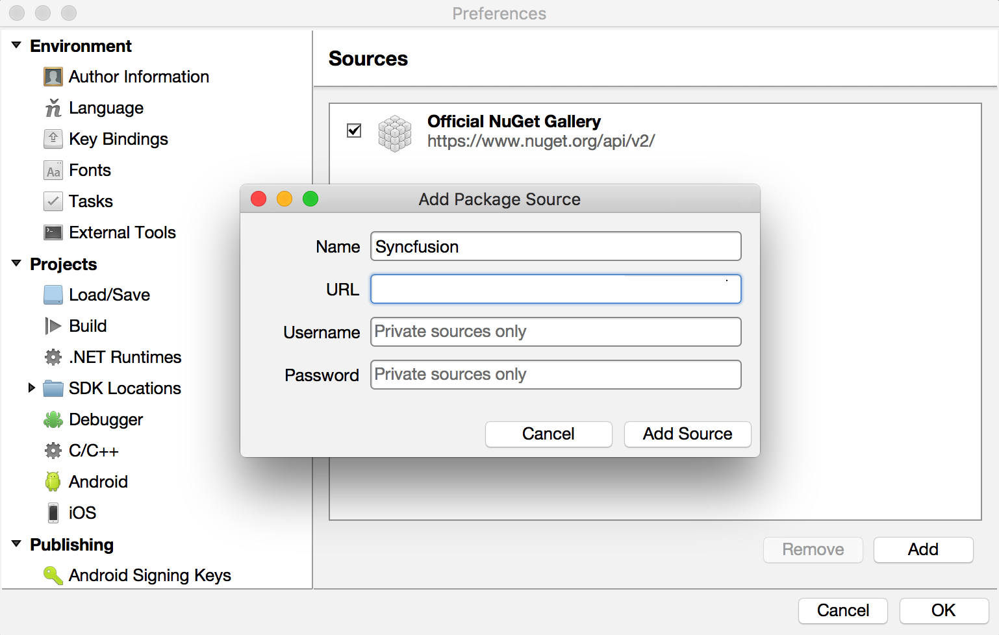
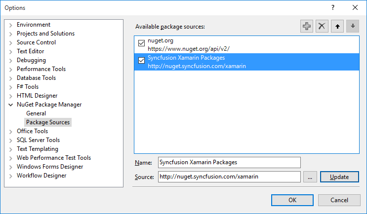
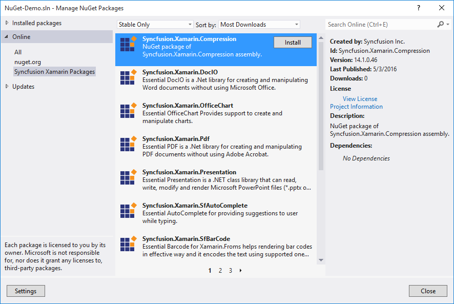
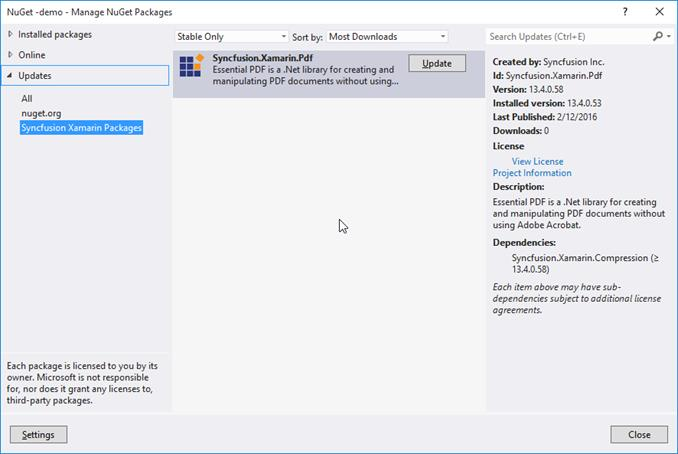

# Download and Installation

## Install from Xamarin Component Store

Refer to [this](https://developer.xamarin.com/guides/cross-platform/application_fundamentals/components_walkthrough) article to know how to add a Xamarin Component Store component to Xamarin.Forms application.

## Install Syncfusion’s NuGet package in Xamarin.Studio

Following are the step by step instructions for configuring Syncfusion Nuget packages within Xamarin studio,

1. Click on the drop-down tool at the right corner of the Packages item in your project, then select Add Packages…

   

2. Next, in the drop-down that appears in the left corner of Add Packages window, select Configure Sources.

   

3. Next, click on the Add button in the window that appears now. Enter the following details in the Add Package Source dialog.

    *	**Name** – enter the name (For Ex., Syncfusion)
    *	**URL** – enter the following URL — http://nuget.syncfusion.com/xamarin

    Now click Add Source and then click Ok.

    N> If you have already downloaded the NuGet package from Syncfusion website, enter the local path in the **URL** field. 

    

4. Next, open Add Packages window by following step 1 and 2, then select Syncfusion (The package name specified in Step 3) as the source from the drop-down that appears at the top-left corner of the window.  You can now select from the list of Syncfusion’s components displayed in the window.

   

# Configuring Syncfusion NuGet Packages in Visual Studio 

Syncfusion Xamarin NuGet packages are available [here](http://nuget.syncfusion.com/xamarin# "").

### NuGet Configuration  

The steps to install the Syncfusion Xamarin NuGet Packages in Visual Studio are as follows,

1. In Visual Studio, navigate to `Tools | NuGet Package Manager | Package Manager Settings`, the options dialog will appear on the screen as shows below,

   

2. Select `NuGet Package Manager | Package Sources` and click `Add` button to add the `Package Name` and `Package Source` of Syncfusion NuGet Packages.    

   **Name**: Name of the package that listed in Available package sources  
   **Source**: Syncfusion Xamarin NuGet Package feed url 
   [http://nuget.syncfusion.com/xamarin](http://nuget.syncfusion.com/xamarin# "")
    
   

   N> The `Source` text box in the above image denotes the location of the NuGet packages and the `Name` section, allows you to provide a unique name for NuGet Packages Source.
    
I> Syncfusion other platforms NuGet packages feed links are available [here](http://nuget.syncfusion.com/# "")

### NuGet installation

Syncfusion Xamarin NuGet can install once configured the package source. The NuGet installation steps as below,

1. Once configured the Package source with Syncfusion NuGet Packages, right click on project and choose `Manage NuGet Packages | Online | &lt;Package Source Name&gt;`.

   

2. The NuGet Packages are listed which are available in package source location. Install the required packages to your application by clicking `Install` button.

   N> NuGet packages can be install directly through the **command line** (Package Manager Console). Further details click [here](http://help.syncfusion.com/extension/syncfusion-nuget-packages/nuget-install-and-configuration#install-from-package-manager-console "")

## Updating a NuGet Package

Using the `Manage NuGet Packages` in Visual Studio, NuGet packages can be update.
 
1. Right click on Project and Navigate to the `Manage NuGet Packages` and click on the `Updates` tab to check for updates.

2. Select the `Updates -> &lt;Syncfusion Package Source&gt;`. Refer to the following screenshot for more information.

   

3. If there is a new version of NuGet you will see it in the list of available updates.

4. Select NuGet Package in the list and click `Update`. When the update is complete, close and re-open all open instances of Visual Studio.

   N> By clicking `Update All` button, all NuGet packages are getting update. When the update is complete, close and re-open all open instances of Visual Studio.

## Download directly from Website

You can also download the complete Xamarin.Forms component from [here](http://www.syncfusion.com/products/xamarin). You may be asked to choose the windows installer or zip file to download.

**Windows** **Installer** **(****exe****)**

The following procedure illustrates how to install the installer of Syncfusion Xamarin components in Windows.

1. Double-click the Syncfusion Essential Studio for Xamarin Setup file. The Self-Extractor wizard opens and extracts the package automatically.
2. Enter User Name, Organization and Unlock Key in the corresponding text boxes provided.
3. Click Next.
4. After reading the terms, click "I accept the terms and conditions" check box.
5. Click Next and choose the installation location and samples installation.
6. To install it in the displayed default location, click Install.
7. Click Finish. The library and samples locations are launched automatically.

## Exploring the package

You can find the following folders when extracting the downloaded zip package or from the installed location in Windows.

* **Lib** - Contains Syncfusion assemblies for Xamarin.Forms, Xamarin.Android and Xamarin.iOS.
* **Samples** - Contains demo samples for Xamarin.Forms, Xamarin.Android and Xamarin.iOS.

## Add reference to the project

You can then add the assembly references to the respective projects. The following is the location where you can locate dll for Chart control and you can find assemblies for the other controls also from the same location.

**PCL** **project**

pcl\Syncfusion.SfChart.XForm.dll

**Android** **project**

android\Syncfusion.SfChart.Andriod.dll

android\Syncfusion.SfChart.XForms.Andriod.dll

android\Syncfusion.SfChart.XForm.dll

**iOS****(****Classic****)** **project**

ios\Syncfusion.SfChart.iOS.dll

ios\Syncfusion.SfChart.XForms.iOS.dll

ios\Syncfusion.SfChart.XForm.dll

**iOS****(****Unified****)** **project**

ios-unified\Syncfusion.SfChart.iOS.dll

ios-unified\Syncfusion.SfChart.XForms.iOS.dll

ios-unified\Syncfusion.SfChart.XForm.dll

**Windows** **Phone** **project**

wp8\Syncfusion.SfChart.WP8.dll

wp8\Syncfusion.SfChart.XForms.WinPhone.dll

wp8\Syncfusion.SfChart.XForm.dll

**Windows** **Phone** **8****.****1** **project**

wp81\Syncfusion.SfChart.WP.dll

wp81\Syncfusion.SfChart.XForms.WinPhone.dll

wp81\Syncfusion.SfChart.XForm.dll

**WinRT** **project**

winrt\Syncfusion.SfChart.WinRT.dll

winrt\Syncfusion.SfChart.XForms.WinRT.dll

winrt\Syncfusion.SfChart.XForm.dll

After you have added assemblies to the respective projects, you have to follow an additional step for loading our components in Windows Phone, WinRT and iOS projects. 

The following is an example for Chart component. create an instance of the SfChartRenderer in MainPage constructor of the Windows Phone and WinRT project as follows.



public MainPage() 
{
     new SfChartRenderer();
     ...
}



Create an instance of SfChartRenderer in FinishedLaunching overridden method of AppDelegate class in iOS Project as follows.

 

public override bool FinishedLaunching(UIApplication app, NSDictionary options) 
{
   ... 
   new SfChartRenderer (); 
   ... 
}



N> If you do not add the above line, controls will not be loaded in WP, WinRT and iOS platforms, and it will look blank. 