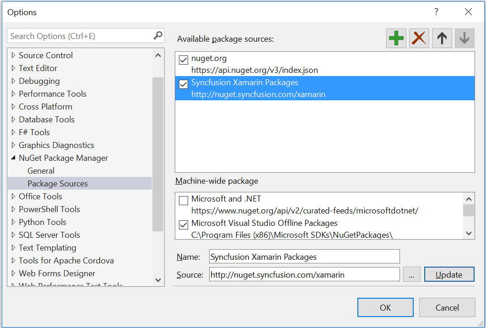
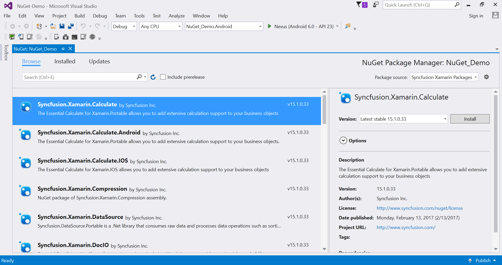
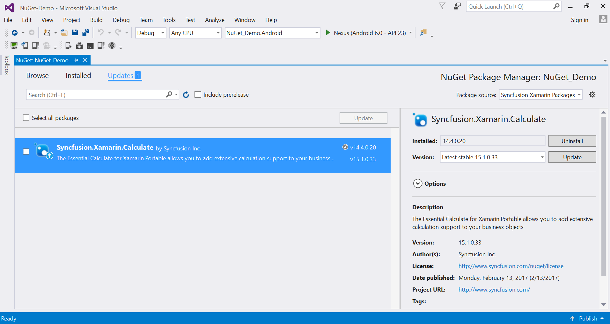
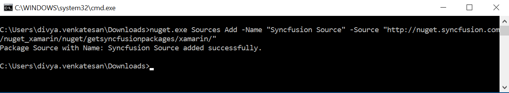
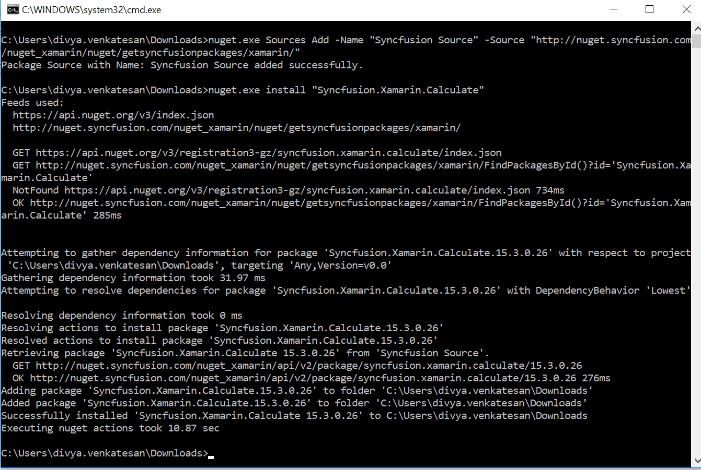

# Windows

## Install NuGet from NuGet Package Manager

### Configuring and Installing Syncfusion NuGet Packages in Visual Studio

Syncfusion Xamarin NuGet packages are available [`here`](http://nuget.syncfusion.com/package/xamarin).

**NuGet Configuration**

The steps to install the Syncfusion Xamarin NuGet Packages in Visual Studio are as follows,

1. In Visual Studio, navigate to Tools | NuGet Package Manager | Package Manager Settings, the options dialog will appear on the screen as shows below,

2. Select NuGet Package Manager | Package Sources and click Add button to add the Package Name and Package Source of Syncfusion NuGet Packages.

   **Name** - Name of the package that listed in available package sources 
   **Source** - Syncfusion Xamarin NuGet Package feed URL - http://nuget.syncfusion.com/nuget_xamarin/nuget/getsyncfusionpackages/xamarin/ 
   
   N> If you have already downloaded the NuGet package from Syncfusion website, enter the local path in the **URL** field.

**NuGet Installation**

Syncfusion Xamarin NuGet can install once configured the package source. The NuGet installation steps as below,

1.	Once configured the Package source with Syncfusion NuGet Packages, right click on project and choose Manage NuGet Packages and select Syncfusion Xamarin Packages from Package source.

2.	The NuGet Packages are listed which are available in package source location. Install the required packages to your application by clicking Install button.

3.	Repeat the above steps in PCL, XForms.Droid, XForms.iOS, XForms.UWP projects.  

### Updating a NuGet Package

Using the Manage NuGet Packages in Visual Studio, NuGet packages can be updated.

1.	Right click on Project and Navigate to the Manage NuGet Packages and click on the Updates tab to check for updates.

2.	Select the Updates -> < Syncfusion Xamarin Packages >. Refer to the following screenshot for more information.

3.	If there is a new version of NuGet you will see it in the list of available updates.

4.	Select NuGet Package in the list and click Update. 

## Download directly from website

You can also download the complete Xamarin.Forms component from [`here`](https://www.syncfusion.com/downloads/latest-version). You may be asked to choose the windows installer or zip file to download.

**Windows Installer (exe)**

The following procedure illustrates how to install the installer of Syncfusion Xamarin components in Windows.

1. Double-click the Syncfusion Essential Studio for Xamarin Setup file. The Self-Extractor wizard opens and extracts the package automatically.
2. Enter User Name, Organization and Unlock Key in the corresponding text boxes provided.
3. Click Next.
4. After reading the terms, click “I accept the terms and conditions” check box.
5. Click Next and choose the installation location and samples installation.
6. To install it in the displayed default location, click Install.
7. Click Finish. The **NuGet and samples** locations are launched automatically.

## Explore the libraries package

You can find the Syncfusion libraries, samples and NuGet when extracting the downloaded zip package or from the installed location in Windows.

{Essential studio installed location}\Syncfusion\Essential Studio\15.3.0.29\Xamarin

For example,

* **lib** - C:\Program Files (x86)\Syncfusion\Essential Studio\15.3.0.29\Xamarin\lib
* **sample** - C:\Users\labuser\AppData\Local\Syncfusion\EssentialStudio\15.3.0.29\Xamarin\sample
* **nuget** - C:\Users\labuser\AppData\Local\Syncfusion\EssentialStudio\15.3.0.29\Xamarin\nuget

For configuring this NuGet, please refer [`this`](https://help.syncfusion.com/xamarin/introduction/download-and-installation#configuring-and-installing-syncfusion-nuget-packages-in-visual-studio) section.

### Add reference to the project

You can then add the assembly references to the respective projects such as PCL, XForms.Droid, XForms.iOS and XForms.UWP. You can find the dependencies for each control from this [`link`](https://help.syncfusion.com/xamarin/introduction/control-dependencies).

I> After adding the reference, currently, an additional step is required for iOS and UWP projects. For example, if we are using SfKanban, we need to call the Init method of SfKanbanRenderer as shown in this [`KB article`](https://www.syncfusion.com/kb/7171).

I> For UWP alone, one more additional step is required if the project is built in release mode with .NET Native tool chain enabled. For example, if we are using SfKanban, you can refer the [`KB article`](https://www.syncfusion.com/kb/7170) for more details.

## Install NuGet from command line

### NuGet Configuration

1. Download the latest NuGet executable from [`here`](https://dist.nuget.org/win-x86-commandline/latest/nuget.exe).

2. Open the downloaded executable location in command window and run the following command,

   nuget.exe Sources Add –Name [Source name] –Source [source location]

   For Ex: nuget.exe Sources Add –Name “Syncfusion Source” –Source “http://nuget.syncfusion.com/nuget_xamarin/nuget/getsyncfusionpackages/xamarin/”

3. Once the Source gets added successfully the confirmation message will be shown like below.

### NuGet Installation

Once the NuGet source has been added, then install the NuGet package which is available in that source by using following command.

nuget.exe install [Package name]

For Ex: nuget.exe install “Syncfusion.Xamarin.Calculate” 

## Install from Xamarin Component Store

Refer to [`this`](https://developer.xamarin.com/guides/cross-platform/xamarin-studio/components_walkthrough/) article to know how to add a Xamarin Component Store component to Xamarin.Forms application.

