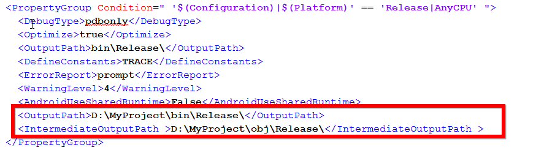
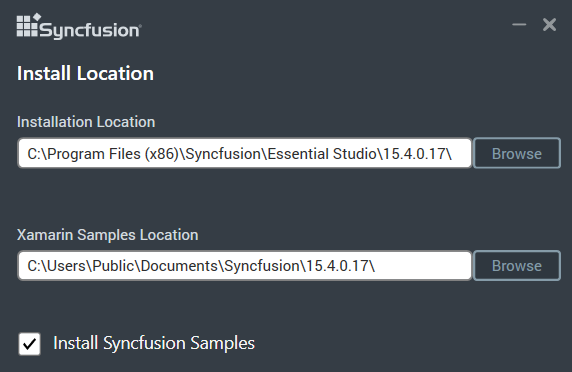

# System.IO.PathTooLongException occurs during sample browser compilation

Sometimes this kind of error may occur while compiling the sample browser project due to the paths of intermediate output files and the nuget packages are too long.

<table>
<tr>
<td>

<b>Error 1: The "CreateLibraryResourceArchive" task failed unexpectedly.</b>
 

<b>System.IO.PathTooLongException: The specified path, file name, or both are too long. The fully qualified file name must be less than 260 characters, and the directory name must be less than 248 characters.</b>
</td>
</tr>
</table>

You can resolve this issue by using anyone of the following steps.

1. If you are facing this issue while building the application, change the OutputPath and IntermediateOutputPath to a shorter path in the respective project’s .csproj under the required configuration.

   

2. You can also change the samples location while installing Syncfusion setup. The window, which allows you to change the installation path during installation is illustrated in the following screenshot. 

   

3. If the above steps did not resolve the error, move the Xamarin folder to a shorter path, manually. You can find the folder under (if you have not moved the samples folder during installation),
   
   {C:\Users\Public\Documents\Syncfusion\{version}\}

