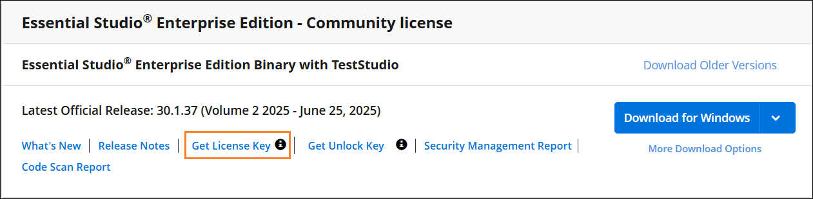
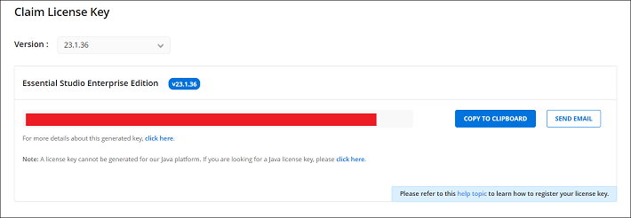
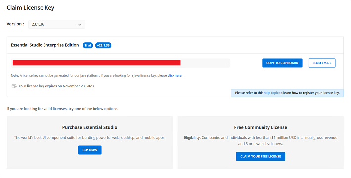
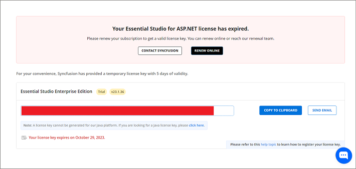
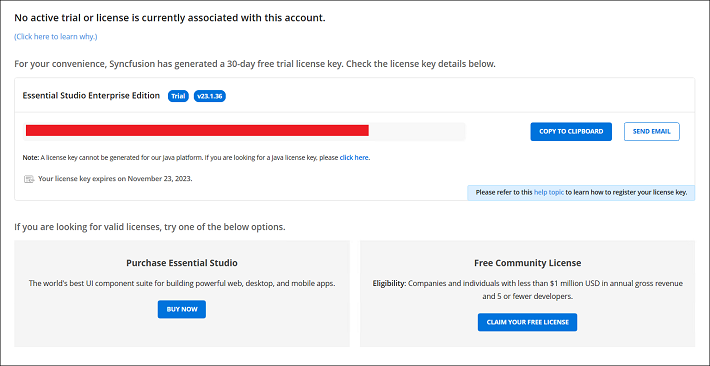

# Generate Syncfusion® Xamarin License key

License keys for Xamarin can be generated from the [License & Downloads](https://syncfusion.com/account/downloads) or [Trial & Downloads](https://www.syncfusion.com/account/manage-trials/downloads) section from your Syncfusion account. 

I> * Syncfusion® license keys are **version and platform specific**, refer to the [KB](https://support.syncfusion.com/kb/article/7898/how-to-generate-license-key-for-licensed-products) to generate the license key for the required version and platform.
* Refer this [KB](https://support.syncfusion.com/kb/article/7865/which-version-syncfusion-license-key-should-i-use-in-my-application) to know about which version of the Syncfusion® license key should be used in the application.

## Claim License key

Syncfusion® License keys can also be generated from the **"Claim License Key"** page based on the trial or valid license associated with your Syncfusion® account.

You can get the license key, based on license availability in your Syncfusion® account.

### Active License

If you have a Syncfusion® account associated with valid license, license key will be generated from claim license key page.

### Active Trial

If you have a Syncfusion® account associated with valid trial license, license key will be generated from claim license key page with expiry date.

### Expired License

If you have a Syncfusion® account with an expired license, your license subscription must be renewed in order to obtain a valid license key for the latest Essential Studio® version. Meanwhile, a temporary license key with a 5-day validity period will be generated.

### No Trial or No License or Expired trial

If the Syncfusion® account is not associated with a trial, license, or expired trial, you can try to claim either a trial or a valid license from claim license page.

## See Also

* [How to Register Syncfusion® License Key in Xamarin Application?](https://help.syncfusion.com/xamarin/licensing/how-to-register-in-an-application)