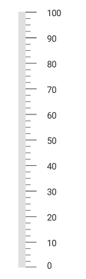

# Change Orientation in SfLinearGauge

[`SfLinearGauge`](https://help.syncfusion.com/cr/xamarin/Syncfusion.SfGauge.XForms.SfLinearGauge.html) supports horizontal and vertical orientations. By default, [`SfLinearGauge`](https://help.syncfusion.com/cr/xamarin/Syncfusion.SfGauge.XForms.SfLinearGauge.html) is rendered with horizontal orientation. You can the change the orientation by using the [`Orientation`](https://help.syncfusion.com/cr/xamarin/Syncfusion.SfGauge.XForms.SfLinearGauge.html#Syncfusion_SfGauge_XForms_SfLinearGauge_OrientationProperty) property. 





	 <gauge:SfLinearGauge Orientation="OrientationVertical">
       <gauge:SfLinearGauge.Scales>
                <gauge:LinearScale Interval="10" ScaleBarLength="350" ScaleBarColor="#e0e0e0" LabelColor="#424242">
                 <gauge:LinearScale.MajorTickSettings>
                      <gauge:LinearTickSettings Thickness="1" />
                    </gauge:LinearScale.MajorTickSettings>
             </gauge:LinearScale>
        </gauge:SfLinearGauge.Scales>
       </gauge:SfLinearGauge>

	




            SfLinearGauge linearGauge = new SfLinearGauge();
            linearGauge.Orientation = Orientation.OrientationVertical;
            LinearScale linearScale = new LinearScale();
            linearScale.Interval = 10;
            linearScale.ScaleBarLength = 350;
            linearScale.MajorTickSettings.Thickness = 1;
            linearScale.ScaleBarColor = Color.FromHex("#e0e0e0");
            linearScale.LabelColor = Color.FromHex("#424242");
            linearGauge.Scales.Add(linearScale);





