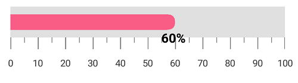
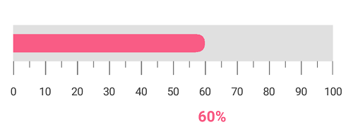
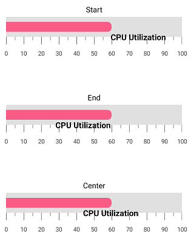
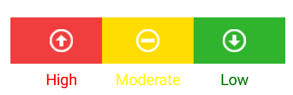

---

layout: post
title: Annotations in Syncfusion SfLinearGauge control for Xamarin.Forms
description: This section describes how to set the annotations in SfLinearGauge control for Xamarin.Forms platform
platform: Xamarin
control: LinearGauge
documentation: ug

---

# Annotations in SfLinearGauge

[`SfLinearGauge`](https://help.syncfusion.com/cr/xamarin/Syncfusion.SfGauge.XForms.SfLinearGauge.html) supports [`Annotations`](https://help.syncfusion.com/cr/xamarin/Syncfusion.SfGauge.XForms.SfLinearGauge.html#Syncfusion_SfGauge_XForms_SfLinearGauge_Annotations), which is used to mark the specific area of interest in the gauge area with texts, shapes, or images. You can add any number of annotations to the gauge.

##  Annotation

By using the [`View`](https://help.syncfusion.com/cr/xamarin/Syncfusion.SfGauge.XForms.LinearGaugeAnnotation.html#Syncfusion_SfGauge_XForms_LinearGaugeAnnotation_View) property of annotation object, you can specify the new element that needs to be displayed in the gauge area.





          <gauge:SfLinearGauge>

         <gauge:SfLinearGauge.Annotations>
                <gauge:LinearGaugeAnnotation OffsetX = "0.5" OffsetY ="0.45">
                    <gauge:LinearGaugeAnnotation.View>
                        <Label Text="CPU Utilization" TextColor="Black" FontSize ="20"/>
                    </gauge:LinearGaugeAnnotation.View>
                </gauge:LinearGaugeAnnotation>
            </gauge:SfLinearGauge.Annotations>

            <gauge:SfLinearGauge.Scales>
                <gauge:LinearScale ScaleBarColor="#e0e0e0" LabelColor="#424242" MinorTicksPerInterval ="1">
                    <gauge:LinearScale.MajorTickSettings>
                        <gauge:LinearTickSettings Thickness="1"  Color="Gray" Length="15"/>
                    </gauge:LinearScale.MajorTickSettings>
                    <gauge:LinearScale.MinorTickSettings>
                        <gauge:LinearTickSettings Thickness="1"  Color="Gray" Length="7"/>
                    </gauge:LinearScale.MinorTickSettings>
                </gauge:LinearScale>
            </gauge:SfLinearGauge.Scales>

        </gauge:SfLinearGauge>
	



    
            SfLinearGauge linearGauge = new SfLinearGauge();
            LinearGaugeAnnotation linearGaugeAnnotation = new LinearGaugeAnnotation();
            linearGaugeAnnotation.OffsetX = 0.5;
            linearGaugeAnnotation.OffsetY = 0.45;
            linearGaugeAnnotation.View = new Label() { Text = "CPU Utilization", TextColor = Color.Black, FontSize = 20 };
            linearGauge.Annotations.Add(linearGaugeAnnotation);
            LinearScale linearScale = new LinearScale();
            linearScale.ScaleBarColor = Color.FromHex("#e0e0e0");
            linearScale.LabelColor = Color.FromHex("#424242");
             linearScale.MajorTickSettings.Thickness = 1;
             linearScale.MajorTickSettings.Length = 15;
             linearScale.MajorTickSettings.Color = Color.Gray;
             linearScale.MinorTickSettings.Color = Color.Gray;
             linearScale.MinorTickSettings.Length = 7;
            linearScale.MinorTickSettings.Thickness = 1;
            linearScale.MinorTicksPerInterval = 1;
            linearGauge.Scales.Add(linearScale);
    




##  Positioning the annotation

You can place the annotation anywhere in gauge area by using the `Offset` or `ScaleValue` property.

### Change annotation position by using offset

You can position the annotation anywhere in the linear gauge by using the [`OffsetX`](https://help.syncfusion.com/cr/xamarin/Syncfusion.SfGauge.XForms.LinearGaugeAnnotation.html#Syncfusion_SfGauge_XForms_LinearGaugeAnnotation_OffsetX) and [`OffsetY`](https://help.syncfusion.com/cr/xamarin/Syncfusion.SfGauge.XForms.LinearGaugeAnnotation.html#Syncfusion_SfGauge_XForms_LinearGaugeAnnotation_OffsetY) properties. It ranges from 0 to 1.





     <gauge:SfLinearGauge>

          <gauge:SfLinearGauge.Annotations>
                <gauge:LinearGaugeAnnotation OffsetX = "0.5" OffsetY ="0.6">
                    <gauge:LinearGaugeAnnotation.View>
                        <Label Text="CPU Utilization" TextColor="Black" FontSize ="20"/>
                    </gauge:LinearGaugeAnnotation.View>
                </gauge:LinearGaugeAnnotation>
            </gauge:SfLinearGauge.Annotations>

              <gauge:SfLinearGauge.Scales>
                <gauge:LinearScale ScaleBarColor="#e0e0e0" LabelColor="#424242" MinorTicksPerInterval ="1">
                   <gauge:LinearScale.MajorTickSettings>
                        <gauge:LinearTickSettings Thickness="1"  Color="Gray" Length="15"/>
                    </gauge:LinearScale.MajorTickSettings>
                    <gauge:LinearScale.MinorTickSettings>
                        <gauge:LinearTickSettings Thickness="1"  Color="Gray" Length="7"/>
                    </gauge:LinearScale.MinorTickSettings>
                </gauge:LinearScale>
            </gauge:SfLinearGauge.Scales>
        </gauge:SfLinearGauge>
  
	



    
            SfLinearGauge linearGauge = new SfLinearGauge();
            LinearGaugeAnnotation linearGaugeAnnotation = new LinearGaugeAnnotation();
            linearGaugeAnnotation.OffsetX = 0.5;
            linearGaugeAnnotation.OffsetY = 0.6;
            linearGaugeAnnotation.View = new Label() { Text = "CPU Utilization", TextColor = Color.Black, FontSize = 20 };
            linearGauge.Annotations.Add(linearGaugeAnnotation);
            LinearScale linearScale = new LinearScale();
            linearScale.ScaleBarColor = Color.FromHex("#e0e0e0");
            linearScale.LabelColor = Color.FromHex("#424242");
             linearScale.MajorTickSettings.Thickness = 1;
             linearScale.MajorTickSettings.Length = 15;
             linearScale.MajorTickSettings.Color = Color.Gray;
             linearScale.MinorTickSettings.Color = Color.Gray;
             linearScale.MinorTickSettings.Length = 7;
            linearScale.MinorTickSettings.Thickness = 1;
            linearScale.MinorTicksPerInterval = 1;
            linearGauge.Scales.Add(linearScale);    
    




### Change annotation position by using scale value

You can also place the annotation by specifying the [`ScaleValue`](https://help.syncfusion.com/cr/xamarin/Syncfusion.SfGauge.XForms.LinearGaugeAnnotation.html#Syncfusion_SfGauge_XForms_LinearGaugeAnnotation_ScaleValue) property.





    <gauge:SfLinearGauge>

        <gauge:SfLinearGauge.Annotations>
                <gauge:LinearGaugeAnnotation ScaleValue ="60">
                    <gauge:LinearGaugeAnnotation.View>
                        <Label Text="60%" FontAttributes = "Bold" TextColor="Black" FontSize ="15"/>
                    </gauge:LinearGaugeAnnotation.View>
                </gauge:LinearGaugeAnnotation>
            </gauge:SfLinearGauge.Annotations>

              <gauge:SfLinearGauge.Scales>
                <gauge:LinearScale ScaleBarColor="#e0e0e0" LabelColor="#424242" MinorTicksPerInterval ="1" ScaleBarSize ="40">
                     <gauge:LinearScale.MajorTickSettings>
                        <gauge:LinearTickSettings Thickness="1"  Color="Gray" Length="15"/>
                    </gauge:LinearScale.MajorTickSettings>
                    <gauge:LinearScale.MinorTickSettings>
                        <gauge:LinearTickSettings Thickness="1"  Color="Gray" Length="7"/>
                    </gauge:LinearScale.MinorTickSettings>
                    <gauge:LinearScale.Pointers>
					<gauge:BarPointer  Value="60" Color = "#f95c85" Thickness = "20" CornerRadius ="10" CornerRadiusType ="End"/>
				</gauge:LinearScale.Pointers>
                </gauge:LinearScale>
            </gauge:SfLinearGauge.Scales>
        </gauge:SfLinearGauge>
  



    
            SfLinearGauge linearGauge = new SfLinearGauge();
            LinearGaugeAnnotation linearGaugeAnnotation = new LinearGaugeAnnotation();
            linearGaugeAnnotation.ScaleValue = 60;
            linearGaugeAnnotation.View = new Label() { Text = "60%", FontAttributes = FontAttributes.Bold, TextColor = Color.Black, FontSize = 15 };
            linearGauge.Annotations.Add(linearGaugeAnnotation);

            LinearScale linearScale = new LinearScale();
            linearScale.ScaleBarColor = Color.FromHex("#e0e0e0");
            linearScale.LabelColor = Color.FromHex("#424242");
             linearScale.MajorTickSettings.Thickness = 1;
             linearScale.MajorTickSettings.Length = 15;
             linearScale.MajorTickSettings.Color = Color.Gray;
             linearScale.MinorTickSettings.Color = Color.Gray;
             linearScale.MinorTickSettings.Length = 7;
            linearScale.MinorTickSettings.Thickness = 1;
            linearScale.ScaleBarSize = 40;
            linearScale.MinorTicksPerInterval = 1;
            linearGauge.Scales.Add(linearScale);

            BarPointer barPointer = new BarPointer();
            barPointer.Value = 60;
            barPointer.Thickness = 20;
            barPointer.CornerRadius = 10;
            barPointer.CornerRadiusType = CornerRadiusType.End;
            barPointer.Color = Color.FromRgb(249, 92, 133);
            linearScale.Pointers.Add(barPointer);
    




## Set margin to the annotation

You can adjust the annotation by specifying the [`ViewMargin`](https://help.syncfusion.com/cr/xamarin/Syncfusion.SfGauge.XForms.LinearGaugeAnnotation.html#Syncfusion_SfGauge_XForms_LinearGaugeAnnotation_ViewMargin) property in pixel, which adjusts the annotation element from its current position. 





     <gauge:SfLinearGauge>
  
     <gauge:SfLinearGauge.Annotations>
                <gauge:LinearGaugeAnnotation ScaleValue ="60" ViewMargin ="10,60">
                    <gauge:LinearGaugeAnnotation.View>
                        <Label Text="60%" FontAttributes = "Bold" TextColor= "#F95C85" FontSize ="15"/>
                    </gauge:LinearGaugeAnnotation.View>
                </gauge:LinearGaugeAnnotation>
            </gauge:SfLinearGauge.Annotations>

              <gauge:SfLinearGauge.Scales>
                <gauge:LinearScale ScaleBarColor="#e0e0e0" LabelColor="#424242" MinorTicksPerInterval ="1" ScaleBarSize ="40">
                    <gauge:LinearScale.MajorTickSettings>
                        <gauge:LinearTickSettings Thickness="1"  Color="Gray" Length="15"/>
                    </gauge:LinearScale.MajorTickSettings>
                    <gauge:LinearScale.MinorTickSettings>
                        <gauge:LinearTickSettings Thickness="1"  Color="Gray" Length="7"/>
                    </gauge:LinearScale.MinorTickSettings>
                    <gauge:LinearScale.Pointers>
					<gauge:BarPointer  Value="60" Color = "#F95C85" Thickness = "20" CornerRadius ="10" CornerRadiusType ="End"/>
				</gauge:LinearScale.Pointers>
                </gauge:LinearScale>
            </gauge:SfLinearGauge.Scales>
        </gauge:SfLinearGauge>
	



    
            SfLinearGauge linearGauge = new SfLinearGauge();
            LinearGaugeAnnotation linearGaugeAnnotation = new LinearGaugeAnnotation();
            linearGaugeAnnotation.ScaleValue = 60;
            linearGaugeAnnotation.ViewMargin = new Point(10, 60);
            linearGaugeAnnotation.View = new Label() { Text = "60%", FontAttributes = FontAttributes.Bold, TextColor = Color.FromHex("#F95C85"), FontSize = 15 };
            linearGauge.Annotations.Add(linearGaugeAnnotation);

            LinearScale linearScale = new LinearScale();
            linearScale.ScaleBarColor = Color.FromHex("#e0e0e0");
            linearScale.LabelColor = Color.FromHex("#424242");
             linearScale.MajorTickSettings.Thickness = 1;
             linearScale.MajorTickSettings.Length = 15;
             linearScale.MajorTickSettings.Color = Color.Gray;
             linearScale.MinorTickSettings.Color = Color.Gray;
             linearScale.MinorTickSettings.Length = 7;
            linearScale.MinorTickSettings.Thickness = 1;
            linearScale.ScaleBarSize = 40;
            linearScale.MinorTicksPerInterval = 1;
            linearGauge.Scales.Add(linearScale);

            BarPointer barPointer = new BarPointer();
            barPointer.Value = 60;
            barPointer.Thickness = 20;
            barPointer.CornerRadius = 10;
            barPointer.CornerRadiusType = CornerRadiusType.End;
            barPointer.Color = Color.FromRgb(249, 92, 133);
            linearScale.Pointers.Add(barPointer);
    




## Alignment of annotation

You can align the annotation using the [`HorizontalViewAlignment`](https://help.syncfusion.com/cr/xamarin/Syncfusion.SfGauge.XForms.LinearGaugeAnnotation.html#Syncfusion_SfGauge_XForms_LinearGaugeAnnotation_HorizontalViewAlignment) and [`VerticalViewAlignment`](https://help.syncfusion.com/cr/xamarin/Syncfusion.SfGauge.XForms.LinearGaugeAnnotation.html#Syncfusion_SfGauge_XForms_LinearGaugeAnnotation_VerticalViewAlignment) properties.

### Setting horizontal view alignment




  
    <gauge:SfLinearGauge>
  
     <gauge:SfLinearGauge.Annotations>
                <gauge:LinearGaugeAnnotation ScaleValue ="60" HorizontalViewAlignment ="Start">
                    <gauge:LinearGaugeAnnotation.View>
                        <Label Text="60%" FontAttributes = "Bold" TextColor= "Black" FontSize ="15"/>
                    </gauge:LinearGaugeAnnotation.View>
                </gauge:LinearGaugeAnnotation>
            </gauge:SfLinearGauge.Annotations>

              <gauge:SfLinearGauge.Scales>
                <gauge:LinearScale ScaleBarColor="#e0e0e0" LabelColor="#424242" MinorTicksPerInterval ="1" ScaleBarSize ="40">
                     <gauge:LinearScale.MajorTickSettings>
                        <gauge:LinearTickSettings Thickness="1"  Color="Gray" Length="15"/>
                    </gauge:LinearScale.MajorTickSettings>
                    <gauge:LinearScale.MinorTickSettings>
                        <gauge:LinearTickSettings Thickness="1"  Color="Gray" Length="7"/>
                    </gauge:LinearScale.MinorTickSettings>
                    <gauge:LinearScale.Pointers>
					<gauge:BarPointer  Value="60" Color = "#f95c85" Thickness = "20" CornerRadius ="10" CornerRadiusType ="End"/>
				</gauge:LinearScale.Pointers>
                </gauge:LinearScale>
            </gauge:SfLinearGauge.Scales>

        </gauge:SfLinearGauge>
	



    
           SfLinearGauge linearGauge = new SfLinearGauge();

            LinearGaugeAnnotation linearGaugeAnnotation = new LinearGaugeAnnotation();
            linearGaugeAnnotation.ScaleValue = 60;
            linearGaugeAnnotation.HorizontalViewAlignment = ViewAlignment.Start;
            linearGaugeAnnotation.View = new Label() { Text = "60%", FontAttributes = FontAttributes.Bold, TextColor = Color.Black, FontSize = 15 };
            linearGauge.Annotations.Add(linearGaugeAnnotation);

            LinearScale linearScale = new LinearScale();
            linearScale.ScaleBarColor = Color.FromHex("#e0e0e0");
            linearScale.LabelColor = Color.FromHex("#424242");
             linearScale.MajorTickSettings.Thickness = 1;
             linearScale.MajorTickSettings.Length = 15;
             linearScale.MajorTickSettings.Color = Color.Gray;
             linearScale.MinorTickSettings.Color = Color.Gray;
             linearScale.MinorTickSettings.Length = 7;
            linearScale.MinorTickSettings.Thickness = 1;
            linearScale.ScaleBarSize = 40;
            linearScale.MinorTicksPerInterval = 1;
            linearGauge.Scales.Add(linearScale);

            BarPointer barPointer = new BarPointer();
            barPointer.Value = 60;
            barPointer.Thickness = 20;
            barPointer.CornerRadius = 10;
            barPointer.CornerRadiusType = CornerRadiusType.End;
            barPointer.Color = Color.FromRgb(249, 92, 133);
            linearScale.Pointers.Add(barPointer);
    




### Setting vertical view alignment




  
    <gauge:SfLinearGauge>
  
        <gauge:SfLinearGauge.Annotations>
                    <gauge:LinearGaugeAnnotation ScaleValue ="60" VerticalViewAlignment ="Start">
                        <gauge:LinearGaugeAnnotation.View>
                            <Label Text="60%" FontAttributes = "Bold" TextColor= "Black" FontSize ="15"/>
                        </gauge:LinearGaugeAnnotation.View>
                    </gauge:LinearGaugeAnnotation>
                </gauge:SfLinearGauge.Annotations>

                <gauge:SfLinearGauge.Scales>
                    <gauge:LinearScale ScaleBarColor="#e0e0e0" LabelColor="#424242" MinorTicksPerInterval ="1" ScaleBarSize ="40">
                        <gauge:LinearScale.MajorTickSettings>
                            <gauge:LinearTickSettings Thickness="1"  Color="Gray" Length="15"/>
                        </gauge:LinearScale.MajorTickSettings>
                        <gauge:LinearScale.MinorTickSettings>
                            <gauge:LinearTickSettings Thickness="1"  Color="Gray" Length="7"/>
                        </gauge:LinearScale.MinorTickSettings>
                        <gauge:LinearScale.Pointers>
                        <gauge:BarPointer  Value="60" Color = "#f95c85" Thickness = "20" CornerRadius ="10" CornerRadiusType ="End"/>
                    </gauge:LinearScale.Pointers>
                    </gauge:LinearScale>
                </gauge:SfLinearGauge.Scales>

        </gauge:SfLinearGauge>
	



    
           SfLinearGauge linearGauge = new SfLinearGauge();

            LinearGaugeAnnotation linearGaugeAnnotation = new LinearGaugeAnnotation();
            linearGaugeAnnotation.ScaleValue = 60;
            linearGaugeAnnotation.VerticalViewAlignment = ViewAlignment.Start;
            linearGaugeAnnotation.View = new Label() { Text = "60%", FontAttributes = FontAttributes.Bold, TextColor = Color.Black, FontSize = 15 };
            linearGauge.Annotations.Add(linearGaugeAnnotation);

            LinearScale linearScale = new LinearScale();
            linearScale.ScaleBarColor = Color.FromHex("#e0e0e0");
            linearScale.LabelColor = Color.FromHex("#424242");
            linearScale.MajorTickSettings.Thickness = 1;
             linearScale.MajorTickSettings.Length = 15;
             linearScale.MajorTickSettings.Color = Color.Gray;
             linearScale.MinorTickSettings.Color = Color.Gray;
             linearScale.MinorTickSettings.Length = 7;
            linearScale.MinorTickSettings.Thickness = 1;
            linearScale.ScaleBarSize = 40;
            linearScale.MinorTicksPerInterval = 1;
            linearGauge.Scales.Add(linearScale);

            BarPointer barPointer = new BarPointer();
            barPointer.Value = 60;
            barPointer.Thickness = 20;
            barPointer.CornerRadius = 10;
            barPointer.CornerRadiusType = CornerRadiusType.End;
            barPointer.Color = Color.FromRgb(249, 92, 133);
            linearScale.Pointers.Add(barPointer);
    




## Setting scale index for annotation

You can set the index for the scale by using [`ScaleIndex`](https://help.syncfusion.com/cr/xamarin/Syncfusion.SfGauge.XForms.LinearGaugeAnnotation.html#Syncfusion_SfGauge_XForms_LinearGaugeAnnotation_ScaleIndex)




  
      <gauge:SfLinearGauge>

          <gauge:SfLinearGauge.Annotations>
                <gauge:LinearGaugeAnnotation OffsetX = "0.5" OffsetY ="0.45" ScaleIndex = "0">
                    <gauge:LinearGaugeAnnotation.View>
                        <Label Text="CPU Utilization" TextColor="Black" FontSize ="20"/>
                    </gauge:LinearGaugeAnnotation.View>
                </gauge:LinearGaugeAnnotation>
                <gauge:LinearGaugeAnnotation OffsetX = "0.5" OffsetY ="0.6" ScaleIndex ="1">
                    <gauge:LinearGaugeAnnotation.View>
                        <Label Text="Thermometer" TextColor="Black" FontSize ="20"/>
                    </gauge:LinearGaugeAnnotation.View>
                </gauge:LinearGaugeAnnotation>
            </gauge:SfLinearGauge.Annotations>

            <gauge:SfLinearGauge.Scales>
                <gauge:LinearScale ScaleBarColor="#e0e0e0" LabelColor="#424242" MinorTicksPerInterval ="1">
                    <gauge:LinearScale.MajorTickSettings>
                        <gauge:LinearTickSettings Thickness="1"  Color="Gray" Length="15"/>
                    </gauge:LinearScale.MajorTickSettings>
                    <gauge:LinearScale.MinorTickSettings>
                        <gauge:LinearTickSettings Thickness="1"  Color="Gray" Length="7"/>
                    </gauge:LinearScale.MinorTickSettings>
                </gauge:LinearScale>

                <gauge:LinearScale ScaleBarColor="#e0e0e0" LabelColor="#424242" MinorTicksPerInterval ="1" Offset ="100">
                    <gauge:LinearScale.MajorTickSettings>
                        <gauge:LinearTickSettings Thickness="1"  Color="Gray" Length="15"/>
                    </gauge:LinearScale.MajorTickSettings>
                    <gauge:LinearScale.MinorTickSettings>
                        <gauge:LinearTickSettings Thickness="1"  Color="Gray" Length="7"/>
                    </gauge:LinearScale.MinorTickSettings>
                </gauge:LinearScale>

            </gauge:SfLinearGauge.Scales>

        </gauge:SfLinearGauge>
	




           SfLinearGauge linearGauge = new SfLinearGauge();

            LinearGaugeAnnotation linearGaugeAnnotation = new LinearGaugeAnnotation();
            linearGaugeAnnotation.OffsetX = 0.5;
            linearGaugeAnnotation.OffsetY = 0.45;
            linearGaugeAnnotation.ScaleIndex = 0;
            linearGaugeAnnotation.View = new Label() { Text = "CPU Utilization", TextColor = Color.Black, FontSize = 18 };
            linearGauge.Annotations.Add(linearGaugeAnnotation);

            LinearGaugeAnnotation linearGaugeAnnotation1 = new LinearGaugeAnnotation();
            linearGaugeAnnotation1.OffsetX = 0.5;
            linearGaugeAnnotation1.OffsetY = 0.6;
            linearGaugeAnnotation1.ScaleIndex = 1;
            linearGaugeAnnotation1.View = new Label() { Text = "Thermometer", TextColor = Color.Black, FontSize = 18 };
            linearGauge.Annotations.Add(linearGaugeAnnotation1);

            LinearScale linearScale = new LinearScale();
            linearScale.MinimumValue = 0;
            linearScale.MaximumValue = 100;
            linearScale.ScaleBarColor = Color.FromHex("#e0e0e0");
            linearScale.LabelColor = Color.FromHex("#424242");
            linearScale.MajorTickSettings.Thickness = 1;
             linearScale.MajorTickSettings.Length = 15;
             linearScale.MajorTickSettings.Color = Color.Gray;
             linearScale.MinorTickSettings.Color = Color.Gray;
             linearScale.MinorTickSettings.Length = 7;
            linearScale.MinorTickSettings.Thickness = 1;
            linearScale.MinorTicksPerInterval = 1;
            linearGauge.Scales.Add(linearScale);

            LinearScale linearScale1 = new LinearScale();
            linearScale1.MinimumValue = 0;
            linearScale1.MaximumValue = 100;
            linearScale1.ScaleBarColor = Color.FromHex("#e0e0e0");
            linearScale1.LabelColor = Color.FromHex("#424242");
            linearScale1.MajorTickSettings.Thickness = 1;
             linearScale1.MajorTickSettings.Length = 15;
             linearScale1.MajorTickSettings.Color = Color.Gray;
             linearScale1.MinorTickSettings.Color = Color.Gray;
             linearScale1.MinorTickSettings.Length = 7;
            linearScale1.MinorTickSettings.Thickness = 1;
            linearScale1.Offset = 100;
            linearScale1.MinorTicksPerInterval = 1;
            linearGauge.Scales.Add(linearScale1);
    




## Multiple annotations

You can add multiple annotations to the gauge as demonstrated below.





     <gauge:SfLinearGauge>
            <gauge:SfLinearGauge.Annotations>
                <gauge:LinearGaugeAnnotation  ScaleValue="15" ViewMargin ="0,30" >
                    <gauge:LinearGaugeAnnotation.View>
                        <Image Source="Low.png" WidthRequest="30" HeightRequest="30"/>
                    </gauge:LinearGaugeAnnotation.View>
                </gauge:LinearGaugeAnnotation>

                <gauge:LinearGaugeAnnotation ScaleValue="45" ViewMargin ="0,30">
                    <gauge:LinearGaugeAnnotation.View>
                        <Image Source="Moderate.png" WidthRequest="30" HeightRequest="30"/>
                    </gauge:LinearGaugeAnnotation.View>
                </gauge:LinearGaugeAnnotation>

                <gauge:LinearGaugeAnnotation ScaleValue="75" ViewMargin ="0,30">
                    <gauge:LinearGaugeAnnotation.View>
                        <Image Source="High.png" WidthRequest="30" HeightRequest="30"/>
                    </gauge:LinearGaugeAnnotation.View>
                </gauge:LinearGaugeAnnotation>

                <gauge:LinearGaugeAnnotation ScaleValue="15" ViewMargin ="0,80">
                    <gauge:LinearGaugeAnnotation.View>
                        <Label Text="Low" TextColor="#30b32d" FontSize ="18"></Label>
                    </gauge:LinearGaugeAnnotation.View>
                </gauge:LinearGaugeAnnotation>

                <gauge:LinearGaugeAnnotation ScaleValue="45" ViewMargin ="0,80">
                    <gauge:LinearGaugeAnnotation.View>
                        <Label Text="Moderate" TextColor="#ffdd00" FontSize ="18"></Label>
                    </gauge:LinearGaugeAnnotation.View>
                </gauge:LinearGaugeAnnotation>

                <gauge:LinearGaugeAnnotation ScaleValue="75" ViewMargin ="0,80">
                    <gauge:LinearGaugeAnnotation.View>
                        <Label Text="High" TextColor="#f03e3e" FontSize ="18"></Label>
                    </gauge:LinearGaugeAnnotation.View>
                </gauge:LinearGaugeAnnotation>
            </gauge:SfLinearGauge.Annotations>

            <gauge:SfLinearGauge.Scales>
                <gauge:LinearScale MinimumValue="0" MaximumValue="90"
                                ShowLabels="False" ScaleBarColor="Transparent"
              MinorTicksPerInterval="1" ScaleBarSize="13" ScalePosition="BackWard" ShowTicks ="False">
                    <gauge:LinearScale.Ranges>
                        <gauge:LinearRange StartValue="0" Color="#30b32d" EndValue="30" StartWidth="60" EndWidth="60" />
                        <gauge:LinearRange StartValue="30" Color="#ffdd00" EndValue="60" StartWidth="60" EndWidth="60" />
                        <gauge:LinearRange StartValue="60" Color="#f03e3e" EndValue="90" StartWidth="60" EndWidth="60" />
                    </gauge:LinearScale.Ranges>
                    <gauge:LinearScale.Pointers>
                        <gauge:SymbolPointer Color="Red" MarkerShape="InvertedTriangle" Value="35" Thickness="12" />
                    </gauge:LinearScale.Pointers>
                    <gauge:LinearScale.MajorTickSettings>
                        <gauge:LinearTickSettings Thickness="1" Color="Transparent" Length="0"></gauge:LinearTickSettings>
                    </gauge:LinearScale.MajorTickSettings>
                    <gauge:LinearScale.MinorTickSettings>
                        <gauge:LinearTickSettings Thickness="1" Color="Transparent" Length="0"></gauge:LinearTickSettings>
                    </gauge:LinearScale.MinorTickSettings>
                </gauge:LinearScale>
            </gauge:SfLinearGauge.Scales>
        </gauge:SfLinearGauge>
  




            SfLinearGauge linearGauge = new SfLinearGauge();
            LinearGaugeAnnotation linearGaugeAnnotation = new LinearGaugeAnnotation();
            linearGaugeAnnotation.ScaleValue = 75;
            linearGaugeAnnotation.ViewMargin = new Point(0, 30);
            linearGaugeAnnotation.View = new Image() { Source = "High.png", HeightRequest = 30, WidthRequest = 30 };
            linearGauge.Annotations.Add(linearGaugeAnnotation);

            LinearGaugeAnnotation linearGaugeAnnotation1 = new LinearGaugeAnnotation();
            linearGaugeAnnotation1.ScaleValue = 45;
            linearGaugeAnnotation1.ViewMargin = new Point(0, 30);
            linearGaugeAnnotation1.View = new Image() { Source = "Moderate.png", HeightRequest = 30, WidthRequest = 30 };
            linearGauge.Annotations.Add(linearGaugeAnnotation1);

            LinearGaugeAnnotation linearGaugeAnnotation2 = new LinearGaugeAnnotation();
            linearGaugeAnnotation2.ScaleValue = 15;
            linearGaugeAnnotation2.ViewMargin = new Point(0, 30);
            linearGaugeAnnotation2.View = new Image() { Source = "Low.png", HeightRequest = 30, WidthRequest = 30 };
            linearGauge.Annotations.Add(linearGaugeAnnotation2);

            LinearGaugeAnnotation linearGaugeAnnotation3 = new LinearGaugeAnnotation();
            linearGaugeAnnotation3.ScaleValue = 75;
            linearGaugeAnnotation3.ViewMargin = new Point(0, 80);
            linearGaugeAnnotation3.View = new Label() { Text = "High", TextColor = Color.Red, FontSize = 18 };
            linearGauge.Annotations.Add(linearGaugeAnnotation3);

            LinearGaugeAnnotation linearGaugeAnnotation4 = new LinearGaugeAnnotation();
            linearGaugeAnnotation4.ScaleValue = 45;
            linearGaugeAnnotation4.ViewMargin = new Point(0, 80);
            linearGaugeAnnotation4.View = new Label() { Text = "Moderate", TextColor = Color.Yellow, FontSize = 18 };
            linearGauge.Annotations.Add(linearGaugeAnnotation4);

            LinearGaugeAnnotation linearGaugeAnnotation5 = new LinearGaugeAnnotation();
            linearGaugeAnnotation5.ScaleValue = 15;
            linearGaugeAnnotation5.ViewMargin = new Point(0, 80);
            linearGaugeAnnotation5.View = new Label() { Text = "Low", TextColor = Color.Green, FontSize = 18 };
            linearGauge.Annotations.Add(linearGaugeAnnotation5);

            LinearScale linearScale = new LinearScale();
            linearScale.MinimumValue = 0;
            linearScale.MaximumValue = 90;
            linearScale.ShowLabels = false;
            linearScale.ScaleBarColor = Color.Transparent;
            linearScale.MinorTicksPerInterval = 1;
            linearScale.ShowTicks = false;
            linearScale.ScalePosition = ScalePosition.BackWard;
            linearGauge.Scales.Add(linearScale);

            LinearRange linearRange = new LinearRange();
            linearRange.StartValue = 0;
            linearRange.Color = Color.FromHex("#30b32d");
            linearRange.EndValue = 30;
            linearRange.StartWidth = 60;
            linearRange.EndWidth = 60;
            linearScale.Ranges.Add(linearRange);

            LinearRange linearRange1 = new LinearRange();
            linearRange1.StartValue = 30;
            linearRange1.Color = Color.FromHex("#ffdd00");
            linearRange1.EndValue = 60;
            linearRange1.StartWidth = 60;
            linearRange1.EndWidth = 60;
            linearScale.Ranges.Add(linearRange1);

            LinearRange linearRange2 = new LinearRange();
            linearRange2.StartValue = 60;
            linearRange2.Color = Color.FromHex("#f03e3e");
            linearRange2.EndValue = 90;
            linearRange2.StartWidth = 60;
            linearRange2.EndWidth = 60;
            linearScale.Ranges.Add(linearRange2);
    




