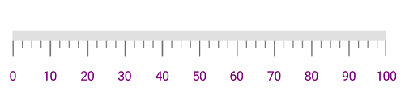
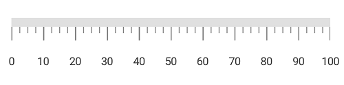
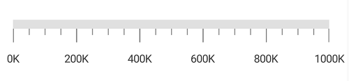
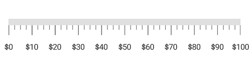
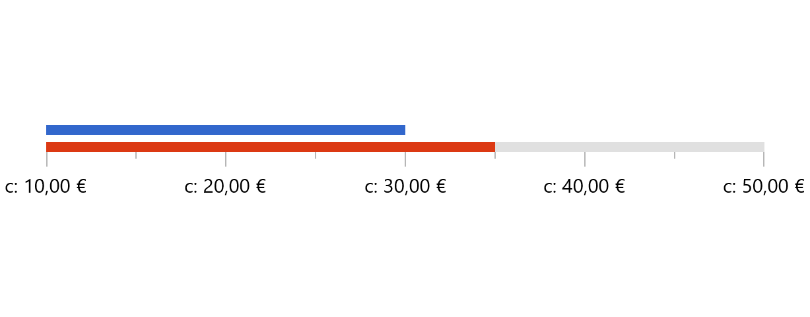

---

layout: post
title: Labels in Syncfusion LinearGauge control for Xamarin.Forms
description:  This section describes how to set labels and customize the labels in Syncfusion LinearGauge control for Xamarin.Forms
platform: xamarin
control: LinearGauge
documentation: ug

---

# Labels in SfLinearGauge

[`LinearScale`](https://help.syncfusion.com/cr/xamarin/Syncfusion.SfGauge.XForms.LinearScale.html) labels associate a numeric value with major scale tick marks.

## Label color customization

The label color can be changed using the [`LabelColor`](https://help.syncfusion.com/cr/xamarin/Syncfusion.SfGauge.XForms.LinearScale.html#Syncfusion_SfGauge_XForms_LinearScale_LabelColor) property.





     <gauge:SfLinearGauge>
               <gauge:SfLinearGauge.Scales>
                <gauge:LinearScale ScaleBarColor="#e0e0e0" LabelColor="Purple">
                    <gauge:LinearScale.MajorTickSettings>
                     <gauge:LinearTickSettings Thickness="1"  Color="Gray" Length="15"/>
                      </gauge:LinearScale.MajorTickSettings>
                      <gauge:LinearScale.MinorTickSettings>
                      <gauge:LinearTickSettings Thickness="1"  Color="Gray" Length="7"/>
                       </gauge:LinearScale.MinorTickSettings>
                </gauge:LinearScale>
            </gauge:SfLinearGauge.Scales>
        </gauge:SfLinearGauge>      





            SfLinearGauge linearGauge = new SfLinearGauge();
            LinearScale linearScale = new LinearScale();
            linearScale.ScaleBarColor = Color.FromHex("#e0e0e0");
            linearScale.MajorTickSettings.Thickness = 1;
            linearScale.MajorTickSettings.Length = 15;
            linearScale.MajorTickSettings.Color = Color.Gray;
            linearScale.MinorTickSettings.Color = Color.Gray;
            linearScale.MinorTickSettings.Length = 7;
            linearScale.MinorTickSettings.Thickness = 1;
            linearScale.LabelColor = Color.Purple;
            linearGauge.Scales.Add(linearScale);

    




## Label font customization

The label font can be customized using the [`LabelFontSize`](https://help.syncfusion.com/cr/xamarin/Syncfusion.SfGauge.XForms.LinearScale.html#Syncfusion_SfGauge_XForms_LinearScale_LabelFontSize), [`FontAttribute`](https://help.syncfusion.com/cr/xamarin/Syncfusion.SfGauge.XForms.LinearScale.html#Syncfusion_SfGauge_XForms_LinearScale_FontAttributes), and [`FontFamily`](https://help.syncfusion.com/cr/xamarin/Syncfusion.SfGauge.XForms.LinearScale.html#Syncfusion_SfGauge_XForms_LinearScale_FontFamily) properties.





    <gauge:SfLinearGauge>

            <gauge:SfLinearGauge.Scales>
                <gauge:LinearScale ScaleBarColor="#e0e0e0" LabelColor="#424242" LabelFontSize ="15" FontAttributes="Bold">
                    <gauge:LinearScale.FontFamily>
                        <OnPlatform x:TypeArguments="x:String" iOS="Chalkduster" Android="algerian.ttf" WinPhone="Chiller" />
                    </gauge:LinearScale.FontFamily>
                    <gauge:LinearScale.MajorTickSettings>
                 <gauge:LinearTickSettings Thickness="1"  Color="Gray" Length="15"/>
                   </gauge:LinearScale.MajorTickSettings>
                   <gauge:LinearScale.MinorTickSettings>
                    <gauge:LinearTickSettings Thickness="1"  Color="Gray" Length="7"/>
                    </gauge:LinearScale.MinorTickSettings>
                </gauge:LinearScale>
            </gauge:SfLinearGauge.Scales>

        </gauge:SfLinearGauge>           
 





            SfLinearGauge linearGauge = new SfLinearGauge();
            LinearScale linearScale = new LinearScale();
            linearScale.LabelFontSize = 15;
            linearScale.ScaleBarColor = Color.FromHex("#e0e0e0");
            linearScale.FontAttributes = FontAttributes.Bold;
            linearScale.MajorTickSettings.Thickness = 1;
            linearScale.MajorTickSettings.Length = 15;
            linearScale.MajorTickSettings.Color = Color.Gray;
            linearScale.MinorTickSettings.Color = Color.Gray;
            linearScale.MinorTickSettings.Length = 7;
            linearScale.MinorTickSettings.Thickness = 1;
            linearScale.LabelColor = Color.FromHex("#424242");
            linearScale.FontFamily = Device.RuntimePlatform == Device.iOS ? "Chalkduster" : Device.RuntimePlatform == Device.Android ? "algerian.ttf" : "Chiller";
            linearGauge.Scales.Add(linearScale);
    




## Setting a position for labels

The labels can be positioned far away from the ticks using the [`LabelOffset`](https://help.syncfusion.com/cr/xamarin/Syncfusion.SfGauge.XForms.Scale.html#Syncfusion_SfGauge_XForms_Scale_LabelOffset) property in pixel.





        <gauge:SfLinearGauge>
             <gauge:SfLinearGauge.Scales>
                <gauge:LinearScale ScaleBarColor="#e0e0e0" LabelColor="#424242" LabelOffset ="5">
                    <gauge:LinearScale.MajorTickSettings>
                          <gauge:LinearTickSettings Thickness="1"  Color="Gray" Length="15"/>
                    </gauge:LinearScale.MajorTickSettings>
                     <gauge:LinearScale.MinorTickSettings>
                            <gauge:LinearTickSettings Thickness="1"  Color="Gray" Length="7"/>
                      </gauge:LinearScale.MinorTickSettings>
                </gauge:LinearScale>
            </gauge:SfLinearGauge.Scales>
        </gauge:SfLinearGauge>      





            SfLinearGauge linearGauge = new SfLinearGauge();
            LinearScale linearScale = new LinearScale();
            linearScale.ScaleBarColor = Color.FromHex("#e0e0e0");
            linearScale.MajorTickSettings.Thickness = 1;
            linearScale.MajorTickSettings.Length = 15;
            linearScale.MajorTickSettings.Color = Color.Gray;
            linearScale.MinorTickSettings.Color = Color.Gray;
            linearScale.MinorTickSettings.Length = 7;
            linearScale.MinorTickSettings.Thickness = 1;
            linearScale.LabelColor = Color.FromHex("#424242");
            linearScale.LabelOffset = 5;
            linearGauge.Scales.Add(linearScale);
   




### Setting postfix and prefix for labels

You can  postfix or prefix values to the scale labels using the [`LabelPostfix`](https://help.syncfusion.com/cr/xamarin/Syncfusion.SfGauge.XForms.LinearScale.html#Syncfusion_SfGauge_XForms_LinearScale_LabelPostfix) and [`LabelPrefix`](https://help.syncfusion.com/cr/xamarin/Syncfusion.SfGauge.XForms.LinearScale.html#Syncfusion_SfGauge_XForms_LinearScale_LabelPrefix) properties, respectively.

### Setting a label postfix

The [`LabelPostfix`](https://help.syncfusion.com/cr/xamarin/Syncfusion.SfGauge.XForms.LinearScale.html#Syncfusion_SfGauge_XForms_LinearScale_LabelPostfix) property allows you to postfix the values to scale labels.





       <gauge:SfLinearGauge>
            <gauge:SfLinearGauge.Scales>
                <gauge:LinearScale MinimumValue = "0" MaximumValue ="1000" Interval ="200" LabelPostfix ="K" ScaleBarColor="#e0e0e0" LabelColor="#424242">
                    <gauge:LinearScale.MajorTickSettings>
                        <gauge:LinearTickSettings Thickness="1"  Color="Gray" Length="15"/>
                    </gauge:LinearScale.MajorTickSettings>
                    <gauge:LinearScale.MinorTickSettings>
                        <gauge:LinearTickSettings Thickness="1"  Color="Gray" Length="7"/>
                    </gauge:LinearScale.MinorTickSettings>
                </gauge:LinearScale>
            </gauge:SfLinearGauge.Scales>
        </gauge:SfLinearGauge>    





            SfLinearGauge linearGauge = new SfLinearGauge();
            LinearScale linearScale = new LinearScale();
            linearScale.MinimumValue = 0;
            linearScale.MaximumValue = 1000;
            linearScale.Interval = 200;
            linearScale.ScaleBarColor = Color.FromHex("#e0e0e0");
             linearScale.MajorTickSettings.Thickness = 1;
            linearScale.MajorTickSettings.Length = 15;
            linearScale.MajorTickSettings.Color = Color.Gray;
            linearScale.MinorTickSettings.Color = Color.Gray;
            linearScale.MinorTickSettings.Length = 7;
            linearScale.MinorTickSettings.Thickness = 1;
            linearScale.LabelColor = Color.FromHex("#424242");
            linearScale.LabelPostfix = "K";
            linearGauge.Scales.Add(linearScale);
    




### Setting a label prefix

The [`LabelPrefix`](https://help.syncfusion.com/cr/xamarin/Syncfusion.SfGauge.XForms.LinearScale.html#Syncfusion_SfGauge_XForms_LinearScale_LabelPrefix) property allows you to prefix the values to scale labels.





       <gauge:SfLinearGauge>
            <gauge:SfLinearGauge.Scales>
                <gauge:LinearScale  ScaleBarColor="#e0e0e0" LabelColor="#424242" LabelPrefix ="$">
                    <gauge:LinearScale.MajorTickSettings>
                        <gauge:LinearTickSettings Thickness="1"  Color="Gray" Length="15"/>
                    </gauge:LinearScale.MajorTickSettings>
                    <gauge:LinearScale.MinorTickSettings>
                        <gauge:LinearTickSettings Thickness="1"  Color="Gray" Length="7"/>
                    </gauge:LinearScale.MinorTickSettings>
                </gauge:LinearScale>
            </gauge:SfLinearGauge.Scales>
        </gauge:SfLinearGauge>      





             SfLinearGauge linearGauge = new SfLinearGauge();
            LinearScale linearScale = new LinearScale();
            linearScale.ScaleBarColor = Color.FromHex("#e0e0e0");
            linearScale.LabelColor = Color.FromHex("#424242");
            linearScale.MajorTickSettings.Thickness = 1;
            linearScale.MajorTickSettings.Length = 15;
            linearScale.MajorTickSettings.Color = Color.Gray;
            linearScale.MinorTickSettings.Color = Color.Gray;
            linearScale.MinorTickSettings.Length = 7;
            linearScale.MinorTickSettings.Thickness = 1;
            linearScale.LabelPrefix = "$";
            linearGauge.Scales.Add(linearScale);
   
    




## Custom labels

Linear scale supports custom label format using the [`CustomLabels`](https://help.syncfusion.com/cr/xamarin/Syncfusion.SfGauge.XForms.LinearScale.html#Syncfusion_SfGauge_XForms_LinearScale_CustomLabels) property. 
You can give labels in an array that you want to place in scale.





Namespace:

xmlns:sys="clr-namespace:System;assembly=mscorlib"
...

<gauge:SfLinearGauge>
    <gauge:SfLinearGauge.Scales>
        <gauge:LinearScale ScaleBarColor="#e0e0e0" LabelColor="#424242" >
            <gauge:LinearScale.CustomLabels>
                <x:Array Type="{x:Type x:Double}">
                    <sys:Double>0</sys:Double>
                    <sys:Double>23</sys:Double>
                    <sys:Double>45</sys:Double>
                    <sys:Double>67</sys:Double>
                    <sys:Double>85</sys:Double>
                    <sys:Double>100</sys:Double>
                </x:Array>
            </gauge:LinearScale.CustomLabels>
            <gauge:LinearScale.MajorTickSettings>
                <gauge:LinearTickSettings Thickness="1"  Color="Gray" Length="15"/>
            </gauge:LinearScale.MajorTickSettings>
            <gauge:LinearScale.MinorTickSettings>
                <gauge:LinearTickSettings Thickness="1"  Color="Gray" Length="7"/>
            </gauge:LinearScale.MinorTickSettings>
        </gauge:LinearScale>
    </gauge:SfLinearGauge.Scales>
</gauge:SfLinearGauge>





SfLinearGauge linearGauge = new SfLinearGauge();
LinearScale linearScale = new LinearScale();
linearScale.ScaleBarColor = Color.FromHex("#e0e0e0");
linearScale.MajorTickSettings.Thickness = 1;
linearScale.MajorTickSettings.Length = 15;
linearScale.MajorTickSettings.Color = Color.Gray;
linearScale.MinorTickSettings.Color = Color.Gray;
linearScale.MinorTickSettings.Length = 7;
linearScale.MinorTickSettings.Thickness = 1;
linearScale.LabelColor = Color.FromHex("#424242");
linearScale.CustomLabels = new double[] { 0, 23, 45, 67, 85, 100};
linearGauge.Scales.Add(linearScale);
Content = linearGauge;  
    




## Labels visibility

Labels visibility can be customized using the [`ShowLabels`](https://help.syncfusion.com/cr/xamarin/Syncfusion.SfGauge.XForms.LinearScale.html#Syncfusion_SfGauge_XForms_LinearScale_ShowLabels) property of linear scale.





       <gauge:SfLinearGauge>
            <gauge:SfLinearGauge.Scales>
                <gauge:LinearScale ScaleBarColor="#e0e0e0" ShowLabels = "False" ScaleBarSize ="40">
                <gauge:LinearScale.MajorTickSettings>
                    <gauge:LinearTickSettings Thickness="1" Color ="Black" Length ="40" Offset ="-40" />
                </gauge:LinearScale.MajorTickSettings>
                <gauge:LinearScale.MinorTickSettings>
                    <gauge:LinearTickSettings Color ="Black" Length = "20" Offset ="-20" />
                </gauge:LinearScale.MinorTickSettings>
            </gauge:LinearScale>
            </gauge:SfLinearGauge.Scales>
        </gauge:SfLinearGauge>





            SfLinearGauge linearGauge = new SfLinearGauge();
            LinearScale linearScale = new LinearScale();
            linearScale.ScaleBarSize = 40;
            linearScale.ScaleBarColor= Color.FromHex("#e0e0e0");
            linearScale.MajorTickSettings.Color = Color.Black;
            linearScale.MinorTickSettings.Color = Color.Black;
            linearScale.MajorTickSettings.Length = 40;
            linearScale.MinorTickSettings.Offset = -20;
            linearScale.MajorTickSettings.Offset = -40;
            linearScale.MajorTickSettings.Thickness = 1;
            linearScale.MinorTickSettings.Length = 20;
            linearScale.MinorTicksPerInterval = 4;
            linearScale.ShowLabels = false;
            linearGauge.Scales.Add(linearScale);
   
    




## Customize the scale labels
 
The scale labels are customized using the `LabelFormat` and `Culture` properties of linear scale.

`LabelFormat` property is used to change the format of labels.
`Culture` property is used to set the default format of currency values, numbers, casing conventions, and string comparisons, etc.. to the scale labels.





       <gauge:SfLinearGauge>
            <gauge:SfLinearGauge.Scales>
                <gauge:LinearScale x:Name="scale" MaximumLabels="4"  ScaleOffset="50" MinimumValue="10" MaximumValue="50" Interval="10" ScaleBarColor="#E0E0E0" 
                               MinorTicksPerInterval ="1" LabelColor="#000000" LabelFontSize="20" LabelFormat="{}{0:C}" LabelOffset="10">
                    <gauge:LinearScale.Pointers>
                        <gauge:BarPointer Value="35" Color="#DC3913" />
                    </gauge:LinearScale.Pointers>
                    <gauge:LinearScale.Ranges>
                        <gauge:LinearRange  StartValue="10" EndValue="30" Color="#3267CC" Offset = "-55" />
                    </gauge:LinearScale.Ranges>
                </gauge:LinearScale>
            </gauge:SfLinearGauge.Scales>
        </gauge:SfLinearGauge>





            SfLinearGauge linearGauge = new SfLinearGauge();
            LinearScale linearScale = new LinearScale();
            linearScale.MaximumLabels = 4;
            linearScale.ScaleOffset = 50;
            linearScale.MinimumValue = 10;
            linearScale.MaximumValue = 50;
            linearScale.Interval = 10;
            linearScale.ScaleBarColor = Color.FromHex("#E0E0E0");
            linearScale.MinorTicksPerInterval = 1;
            linearScale.LabelColor = Color.FromHex("#000000");
            linearScale.LabelFontSize = 20;
            linearScale.LabelFormat = "{0:C}";
            linearScale.LabelOffset = 10;
            BarPointer barPointer = new BarPointer();
            barPointer.Value = 35;
            barPointer.Color = Color.FromHex("#DC3913");
            linearScale.Pointers.Add(barPointer);
            LinearRange linearRange = new LinearRange();
            linearRange.StartValue = 10;
            linearRange.EndValue = 30;
            linearRange.Color = Color.FromHex("#3267CC");
            linearRange.Offset = -55;
            linearScale.Ranges.Add(linearRange);
            linearScale.Culture = new System.Globalization.CultureInfo("fr-FR");
            linearGauge.Scales.Add(linearScale);
    




