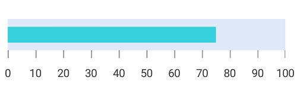
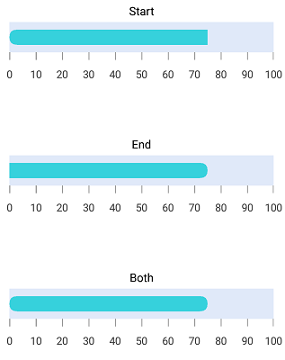
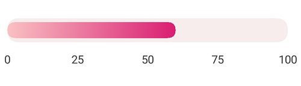
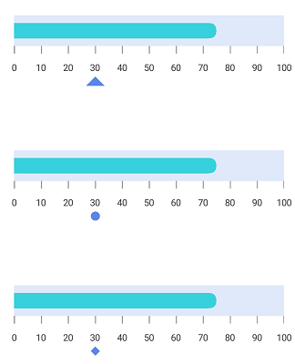
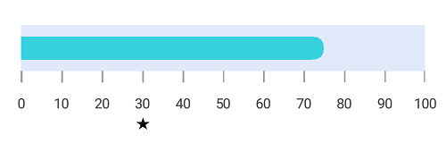
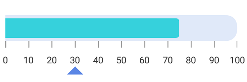

# Pointers in SfLinearGauge

[`SfLinearGauge`](https://help.syncfusion.com/cr/xamarin/Syncfusion.SfGauge.XForms.SfLinearGauge.html) provides support to mark the values using [`BarPointer`](https://help.syncfusion.com/cr/xamarin/Syncfusion.SfGauge.XForms.BarPointer.html) and [`SymbolPointer`](https://help.syncfusion.com/cr/xamarin/Syncfusion.SfGauge.XForms.SymbolPointer.html).

## Adding bar pointer to scale

[`BarPointer`](https://help.syncfusion.com/cr/xamarin/Syncfusion.SfGauge.XForms.BarPointer.html) is used to mark the scale values. It starts at the beginning of gauge and ends at the pointer value.





        <gauge:SfLinearGauge>

             <gauge:SfLinearGauge.Scales>
                <gauge:LinearScale ScaleBarColor="#e0e9f9" LabelColor="#424242" ScaleBarSize = "20" LabelFontSize ="14" MinorTicksPerInterval ="0">
                    <gauge:LinearScale.MajorTickSettings>
                        <gauge:LinearTickSettings Thickness="1" Color ="#9E9E9E" Length = "10"/>
                    </gauge:LinearScale.MajorTickSettings>
                    <gauge:LinearScale.Pointers>
                        <gauge:BarPointer  Value="75" EnableAnimation = "false" Color = "#36d1dc" />
                    </gauge:LinearScale.Pointers>
                </gauge:LinearScale>
            </gauge:SfLinearGauge.Scales>

        </gauge:SfLinearGauge>
	



	
		    SfLinearGauge linearGauge = new SfLinearGauge();
            LinearScale linearScale = new LinearScale();
            linearScale.ScaleBarColor = Color.FromHex("#e0e9f9");
            linearScale.LabelColor = Color.FromHex("#424242");
            linearScale.ScaleBarSize = 20;
            linearScale.LabelFontSize = 14;
            linearScale.MinorTicksPerInterval = 0;
            linearScale.MajorTickSettings.Color = Color.FromHex("#9E9E9E");
            linearScale.MajorTickSettings.Thickness = 1;
            linearScale.MajorTickSettings.Length = 10;

            BarPointer barPointer = new BarPointer();
            barPointer.Value = 75;
            barPointer.EnableAnimation = false;
            barPointer.Color = Color.FromHex("#36d1dc");
            linearScale.Pointers.Add(barPointer);
            linearGauge.Scales.Add(linearScale);





## Bar pointer customization

The bar pointer’s UI is customized by using the [`Color`](https://help.syncfusion.com/cr/xamarin/Syncfusion.SfGauge.XForms.LinearPointer.html#Syncfusion_SfGauge_XForms_LinearPointer_Color) and [`Thickness`](https://help.syncfusion.com/cr/xamarin/Syncfusion.SfGauge.XForms.LinearPointer.html#Syncfusion_SfGauge_XForms_LinearPointer_Thickness) properties.





        <gauge:SfLinearGauge>

           <gauge:SfLinearGauge.Scales>
                <gauge:LinearScale ScaleBarColor="#e0e9f9" LabelColor="#424242" ScaleBarSize = "40" LabelFontSize ="14" MinorTicksPerInterval ="0">
                    <gauge:LinearScale.MajorTickSettings>
                        <gauge:LinearTickSettings Thickness="1" Color ="#9E9E9E" Length = "10"/>
                    </gauge:LinearScale.MajorTickSettings>
                    <gauge:LinearScale.Pointers>
                        <gauge:BarPointer  Value="75" EnableAnimation = "false" Color = "#36d1dc" Thickness = "20"/>
                    </gauge:LinearScale.Pointers>
                </gauge:LinearScale>
            </gauge:SfLinearGauge.Scales>

        </gauge:SfLinearGauge>
	



	
		    SfLinearGauge linearGauge = new SfLinearGauge();
            LinearScale linearScale = new LinearScale();
            linearScale.ScaleBarColor = Color.FromHex("#e0e9f9");
            linearScale.LabelColor = Color.FromHex("#424242");
            linearScale.ScaleBarSize = 40;
            linearScale.LabelFontSize = 14;
            linearScale.MinorTicksPerInterval = 0;
            linearScale.MajorTickSettings.Color = Color.FromHex("#9E9E9E");
            linearScale.MajorTickSettings.Thickness = 1;
            linearScale.MajorTickSettings.Length = 10;

            BarPointer barPointer = new BarPointer();
            barPointer.Value = 75;
			barPointer.Thickness = 20;
            barPointer.EnableAnimation = false;
            barPointer.Color = Color.FromHex("#36d1dc");
            linearScale.Pointers.Add(barPointer);
            linearGauge.Scales.Add(linearScale);





## Setting corner radius type for bar pointer

Corners of the [`BarPointer`](https://help.syncfusion.com/cr/xamarin/Syncfusion.SfGauge.XForms.BarPointer.html) can be customized by setting the value to the [`CornerRadiusType`](https://help.syncfusion.com/cr/xamarin/Syncfusion.SfGauge.XForms.BarPointer.html#Syncfusion_SfGauge_XForms_BarPointer_CornerRadiusType) property. All corners of bar pointer can be customized using the `Start`, `End`, `Both`, and `None` options.
[`CornerRadius`](https://help.syncfusion.com/cr/xamarin/Syncfusion.SfGauge.XForms.BarPointer.html#Syncfusion_SfGauge_XForms_BarPointer_CornerRadius) property used to reduce the radius of the corners.





     <gauge:SfLinearGauge>
	         <gauge:SfLinearGauge.Scales>
                <gauge:LinearScale ScaleBarColor="#e0e9f9" LabelColor="#424242" ScaleBarSize = "40" LabelFontSize ="14" MinorTicksPerInterval ="0">
                    <gauge:LinearScale.MajorTickSettings>
                        <gauge:LinearTickSettings Thickness="1" Color ="#9E9E9E" Length = "10"/>
                    </gauge:LinearScale.MajorTickSettings>
                    <gauge:LinearScale.Pointers>
                        <gauge:BarPointer  Value="75" EnableAnimation = "false" Color = "#36d1dc" Thickness = "20" CornerRadiusType = "Start" CornerRadius = "10"/>
                    </gauge:LinearScale.Pointers>
                </gauge:LinearScale>
            </gauge:SfLinearGauge.Scales>
        </gauge:SfLinearGauge>





            SfLinearGauge linearGauge = new SfLinearGauge();

            LinearScale linearScale = new LinearScale();
            linearScale.ScaleBarColor = Color.FromHex("#e0e9f9");
            linearScale.LabelColor = Color.FromHex("#424242");
            linearScale.ScaleBarSize = 40;
            linearScale.LabelFontSize = 14;
            linearScale.MinorTicksPerInterval = 0;
            linearScale.MajorTickSettings.Color = Color.FromHex("#9E9E9E");
            linearScale.MajorTickSettings.Thickness = 1;
            linearScale.MajorTickSettings.Length = 10;

            BarPointer barPointer = new BarPointer();
            barPointer.Value = 75;
            barPointer.Thickness = 20;
            barPointer.CornerRadiusType = CornerRadiusType.Start;
            barPointer.CornerRadius = 10;
            barPointer.EnableAnimation = false;
            barPointer.Color = Color.FromHex("#36d1dc");
            linearScale.Pointers.Add(barPointer);

            linearGauge.Scales.Add(linearScale);





## Setting gradient color for bar pointer

You can give smooth color transition to bar pointer to specifying the different colors based on bar pointer’s value by using [`GradientStops`](https://help.syncfusion.com/cr/xamarin/Syncfusion.SfGauge.XForms.BarPointer.html#Syncfusion_SfGauge_XForms_BarPointer_GradientStops) property.





     <gauge:SfLinearGauge>

         <gauge:SfLinearGauge.Scales>
                <gauge:LinearScale ScaleBarColor="#F7EDED"  LabelColor="Black" ScaleBarSize="40" CornerRadius="20" CornerRadiusType="Both"
                               LabelFontSize="14" MinimumValue="0" MaximumValue="100" Interval="25" LabelOffset="-10" ShowTicks="False">
                    <gauge:LinearScale.Pointers>
                        <gauge:BarPointer Value="75" CornerRadiusType="Both" CornerRadius="15" Thickness="30" EnableAnimation="False">
                            <gauge:BarPointer.GradientStops>
                                <gauge:GaugeGradientStop Value="10" Color="#f8babf"/>
                                <gauge:GaugeGradientStop Value="40" Color="#ee89a7"/>
                                <gauge:GaugeGradientStop Value="50" Color="#e4548c"/>
                                <gauge:GaugeGradientStop Value="60" Color="#db2575"/>
                            </gauge:BarPointer.GradientStops>
                        </gauge:BarPointer>
                    </gauge:LinearScale.Pointers>
                </gauge:LinearScale>
            </gauge:SfLinearGauge.Scales>

      </gauge:SfLinearGauge>





            SfLinearGauge linearGauge = new SfLinearGauge();
            LinearScale linearScale = new LinearScale();
            linearScale.ScaleBarColor = Color.FromRgb(247, 237, 237);
            linearScale.LabelColor = Color.Black;
            linearScale.ScaleBarSize = 40;
            linearScale.CornerRadius = 20;
            linearScale.CornerRadiusType = CornerRadiusType.Both;
            linearScale.LabelFontSize = 14;
            linearScale.MinimumValue = 0;
            linearScale.MaximumValue = 100;
            linearScale.Interval = 25;
            linearScale.LabelOffset = -10;
            linearScale.ShowTicks = false;

            BarPointer barPointer = new BarPointer();
            barPointer.Value = 75;
            barPointer.CornerRadiusType = CornerRadiusType.Both;
            barPointer.CornerRadius = 15;
            barPointer.Thickness = 30;
            barPointer.EnableAnimation = false;

            GaugeGradientStop gaugeGradientStop = new GaugeGradientStop();
            gaugeGradientStop.Value = 10;
            gaugeGradientStop.Color = Color.FromRgb(248, 186, 191);
            barPointer.GradientStops.Add(gaugeGradientStop);

            GaugeGradientStop gaugeGradientStop1 = new GaugeGradientStop();
            gaugeGradientStop1.Value = 40;
            gaugeGradientStop1.Color = Color.FromRgb(238, 137, 167);
            barPointer.GradientStops.Add(gaugeGradientStop1);

            GaugeGradientStop gaugeGradientStop2 = new GaugeGradientStop();
            gaugeGradientStop2.Value = 50;
            gaugeGradientStop2.Color = Color.FromRgb(228, 84, 140);
            barPointer.GradientStops.Add(gaugeGradientStop2);

            GaugeGradientStop gaugeGradientStop3 = new GaugeGradientStop();
            gaugeGradientStop3.Value = 60;
            gaugeGradientStop3.Color = Color.FromRgb(219, 37, 117);
            barPointer.GradientStops.Add(gaugeGradientStop3);

            linearScale.Pointers.Add(barPointer);
            linearGauge.Scales.Add(linearScale);





## Adding symbol pointer to scale

In [`SymbolPointer`](https://help.syncfusion.com/cr/xamarin/Syncfusion.SfGauge.XForms.SymbolPointer.html), the value is pointed by a symbol on the scale.





       <gauge:SfLinearGauge>

            <gauge:SfLinearGauge.Scales>
                <gauge:LinearScale ScaleBarColor="#e0e9f9" LabelColor="#424242" ScaleBarSize = "40" LabelFontSize ="14" MinorTicksPerInterval ="0">
                    <gauge:LinearScale.MajorTickSettings>
                        <gauge:LinearTickSettings Thickness="1" Color ="#9E9E9E" Length = "10"/>
                    </gauge:LinearScale.MajorTickSettings>
                    <gauge:LinearScale.Pointers>
                        <gauge:BarPointer  Value="75" CornerRadiusType="End" CornerRadius = "10" EnableAnimation = "false" Color = "#36d1dc" Thickness = "20"/>
                        <gauge:SymbolPointer Value ="30" EnableAnimation ="False" Color= "#5b86e5"/>
                    </gauge:LinearScale.Pointers>
                </gauge:LinearScale>
            </gauge:SfLinearGauge.Scales>

        </gauge:SfLinearGauge>
	




            SfLinearGauge linearGauge = new SfLinearGauge();
            LinearScale linearScale = new LinearScale();
            linearScale.ScaleBarColor = Color.FromHex("#e0e9f9");
            linearScale.LabelColor = Color.FromHex("#424242");
            linearScale.ScaleBarSize = 40;
            linearScale.LabelFontSize = 14;
            linearScale.MinimumValue = 0;
            linearScale.MaximumValue = 100;
            linearScale.Interval = 10;
            linearScale.MinorTicksPerInterval = 0;
            linearScale.MajorTickSettings.Color = Color.FromHex("#9E9E9E");
            linearScale.MajorTickSettings.Thickness = 1;
            linearScale.MajorTickSettings.Length = 10;

            BarPointer barPointer = new BarPointer();
            barPointer.Value = 75;
            barPointer.Thickness = 20;
            barPointer.CornerRadiusType = CornerRadiusType.End;
            barPointer.CornerRadius = 10;
            barPointer.EnableAnimation = false;
            barPointer.Color = Color.FromHex("#36d1dc");
            linearScale.Pointers.Add(barPointer);

            SymbolPointer symbolPointer = new SymbolPointer();
            symbolPointer.Value = 30;
            symbolPointer.EnableAnimation = false;
            symbolPointer.Color = Color.FromHex("#5b86e5");
            linearScale.Pointers.Add(symbolPointer);

            linearGauge.Scales.Add(linearScale);





## Symbol pointer customization

You can modify the symbol pointer’s size using the [`Thickness`](https://help.syncfusion.com/cr/xamarin/Syncfusion.SfGauge.XForms.LinearPointer.html#Syncfusion_SfGauge_XForms_LinearPointer_Thickness) property. The color of the symbol pointer is changed using the [`Color`](https://help.syncfusion.com/cr/xamarin/Syncfusion.SfGauge.XForms.LinearPointer.html#Syncfusion_SfGauge_XForms_LinearPointer_Color) property.





      <gauge:SfLinearGauge>

              <gauge:SfLinearGauge.Scales>
                <gauge:LinearScale ScaleBarColor="#e0e0e0" LabelColor="#424242">
                    <gauge:LinearScale.MajorTickSettings>
                           <gauge:LinearTickSettings Thickness="1"  Color="Gray" Length="15"/>
                    </gauge:LinearScale.MajorTickSettings>
                   <gauge:LinearScale.MinorTickSettings>
                           <gauge:LinearTickSettings Thickness="1"  Color="Gray" Length="7"/>
                   </gauge:LinearScale.MinorTickSettings>
                    <gauge:LinearScale.Pointers>
                        <gauge:SymbolPointer Value="70" Color="DeepSkyBlue" Thickness="15"/>
                    </gauge:LinearScale.Pointers>
                </gauge:LinearScale>
            </gauge:SfLinearGauge.Scales>

        </gauge:SfLinearGauge>





           SfLinearGauge linearGauge = new SfLinearGauge();
            LinearScale linearScale = new LinearScale();
            linearScale.ScaleBarColor = Color.FromHex("#e0e0e0");
            linearScale.LabelColor = Color.FromHex("#424242");
            linearScale.MajorTickSettings.Thickness = 1;
            linearScale.MajorTickSettings.Length = 15;
            linearScale.MajorTickSettings.Color = Color.Gray;
            linearScale.MinorTickSettings.Color = Color.Gray;
            linearScale.MinorTickSettings.Length = 7;
            linearScale.MinorTickSettings.Thickness = 1;
            SymbolPointer symbolPointer = new SymbolPointer();
            symbolPointer.Value = 70;
            symbolPointer.Color = Color.DeepSkyBlue;
            symbolPointer.Thickness = 15;
            linearScale.Pointers.Add(symbolPointer);
            linearGauge.Scales.Add(linearScale);





## Positioning symbol pointer

You can position the [`SymbolPointer`](https://help.syncfusion.com/cr/xamarin/Syncfusion.SfGauge.XForms.SymbolPointer.html) by using the following two ways:

## Setting symbol pointer position

You can customize the position of the [`SymbolPointer`](https://help.syncfusion.com/cr/xamarin/Syncfusion.SfGauge.XForms.SymbolPointer.html) by using the [`SymbolPointerPosition`](https://help.syncfusion.com/cr/xamarin/Syncfusion.SfGauge.XForms.SymbolPointer.html#Syncfusion_SfGauge_XForms_SymbolPointer_SymbolPointerPosition). The default symbol pointer position is `Far`.





     <gauge:SfLinearGauge>

           <gauge:SfLinearGauge.Scales>
                <gauge:LinearScale ScaleBarColor="#e0e9f9" LabelColor="#424242" ScaleBarSize = "40" LabelFontSize ="14" MinorTicksPerInterval ="0">
                    <gauge:LinearScale.MajorTickSettings>
                        <gauge:LinearTickSettings Thickness="1" Color ="#9E9E9E" Length = "10"/>
                    </gauge:LinearScale.MajorTickSettings>
                    <gauge:LinearScale.Pointers>
                        <gauge:BarPointer  Value="75" CornerRadiusType="End" CornerRadius = "10" EnableAnimation = "false" Color = "#36d1dc" Thickness = "20"/>
                        <gauge:SymbolPointer Value ="30" EnableAnimation ="False" Color= "#5b86e5" SymbolPointerPosition = "Away"/>
                    </gauge:LinearScale.Pointers>
                </gauge:LinearScale>
            </gauge:SfLinearGauge.Scales>

        </gauge:SfLinearGauge>





            SfLinearGauge linearGauge = new SfLinearGauge();
            LinearScale linearScale = new LinearScale();
            linearScale.ScaleBarColor = Color.FromHex("#e0e9f9");
            linearScale.LabelColor = Color.FromHex("#424242");
            linearScale.ScaleBarSize = 40;
            linearScale.LabelFontSize = 14;
            linearScale.MinorTicksPerInterval = 0;
            linearScale.MajorTickSettings.Color = Color.FromHex("#9E9E9E");
            linearScale.MajorTickSettings.Thickness = 1;
            linearScale.MajorTickSettings.Length = 10;

            BarPointer barPointer = new BarPointer();
            barPointer.Value = 75;
            barPointer.Thickness = 20;
            barPointer.CornerRadiusType = CornerRadiusType.End;
            barPointer.CornerRadius = 10;
            barPointer.EnableAnimation = false;
            barPointer.Color = Color.FromHex("#36d1dc");
            linearScale.Pointers.Add(barPointer);

            SymbolPointer symbolPointer = new SymbolPointer();
            symbolPointer.Value = 30;
            symbolPointer.EnableAnimation = false;
            symbolPointer.SymbolPointerPosition = SymbolPointerPosition.Away;
            symbolPointer.Color = Color.FromHex("#5b86e5");
            linearScale.Pointers.Add(symbolPointer);

            linearGauge.Scales.Add(linearScale);





## Setting offset for symbol pointer

You can move  the [`SymbolPointer`](https://help.syncfusion.com/cr/xamarin/Syncfusion.SfGauge.XForms.SymbolPointer.html) by using the [`Offset`](https://help.syncfusion.com/cr/xamarin/Syncfusion.SfGauge.XForms.SymbolPointer.html#Syncfusion_SfGauge_XForms_SymbolPointer_Offset) property. 





     <gauge:SfLinearGauge>
            <gauge:SfLinearGauge.Scales>
                <gauge:LinearScale ScaleBarColor="#e0e9f9" LabelColor="#424242" ScaleBarSize = "40" LabelFontSize ="14" MinorTicksPerInterval ="0">
                    <gauge:LinearScale.MajorTickSettings>
                      <gauge:LinearTickSettings Thickness="1" Color ="#9E9E9E" Length = "10"/>
                    </gauge:LinearScale.MajorTickSettings>
					<gauge:LinearScale.Pointers>
					<gauge:BarPointer  Value="75" CornerRadiusType="End" CornerRadius = "10" EnableAnimation = "false" Color = "#36d1dc" Thickness = "20"/>
					<gauge:SymbolPointer Value ="30" EnableAnimation ="False" Color= "#5b86e5" Offset ="40"/>
				</gauge:LinearScale.Pointers>
                </gauge:LinearScale>
            </gauge:SfLinearGauge.Scales>
        </gauge:SfLinearGauge>





            SfLinearGauge linearGauge = new SfLinearGauge();
            LinearScale linearScale = new LinearScale();
            linearScale.ScaleBarColor = Color.FromHex("#e0e9f9");
            linearScale.LabelColor = Color.FromHex("#424242");
            linearScale.ScaleBarSize = 40;
            linearScale.LabelFontSize = 14;
            linearScale.MinorTicksPerInterval = 0;
            linearScale.MajorTickSettings.Color = Color.FromHex("#9E9E9E");
            linearScale.MajorTickSettings.Thickness = 1;
            linearScale.MajorTickSettings.Length = 10;

            BarPointer barPointer = new BarPointer();
            barPointer.Value = 75;
            barPointer.Thickness = 20;
            barPointer.CornerRadiusType = CornerRadiusType.End;
            barPointer.CornerRadius = 10;
            barPointer.EnableAnimation = false;
            barPointer.Color = Color.FromHex("#36d1dc");
            linearScale.Pointers.Add(barPointer);

            SymbolPointer symbolPointer = new SymbolPointer();
            symbolPointer.Value = 30;
            symbolPointer.EnableAnimation = false;
            symbolPointer.Offset = 40;
            symbolPointer.Color = Color.FromHex("#5b86e5");
            linearScale.Pointers.Add(symbolPointer);

            linearGauge.Scales.Add(linearScale);





## Change symbol pointer shapes

Different types of shapes are used in [`SymbolPointer`](https://help.syncfusion.com/cr/xamarin/Syncfusion.SfGauge.XForms.SymbolPointer.html) to mark the pointer value in scale. You can change the shape of [`SymbolPointer`](https://help.syncfusion.com/cr/xamarin/Syncfusion.SfGauge.XForms.SymbolPointer.html) by using the [`MarkerShape`](https://help.syncfusion.com/cr/xamarin/Syncfusion.SfGauge.XForms.SymbolPointer.html#Syncfusion_SfGauge_XForms_SymbolPointer_MarkerShape) property in pointer. 





     <gauge:SfLinearGauge>

            <gauge:SfLinearGauge.Scales>
                <gauge:LinearScale ScaleBarColor="#e0e9f9" LabelColor="#424242" ScaleBarSize = "40" LabelFontSize ="14" MinorTicksPerInterval ="0">
                    <gauge:LinearScale.MajorTickSettings>
                        <gauge:LinearTickSettings Thickness="1" Color ="#9E9E9E" Length = "10"/>
                    </gauge:LinearScale.MajorTickSettings>
                    <gauge:LinearScale.Pointers>
                        <gauge:BarPointer  Value="75" CornerRadiusType="End" CornerRadius = "10" EnableAnimation = "false" Color = "#36d1dc" Thickness = "20"/>
                        <gauge:SymbolPointer Value ="30" EnableAnimation ="False" Color= "#5b86e5" SymbolPointerPosition="Away" MarkerShape = "Circle"/>
                    </gauge:LinearScale.Pointers>
                </gauge:LinearScale>
            </gauge:SfLinearGauge.Scales>

        </gauge:SfLinearGauge>





            SfLinearGauge linearGauge = new SfLinearGauge();
            LinearScale linearScale = new LinearScale();
            linearScale.ScaleBarColor = Color.FromHex("#e0e9f9");
            linearScale.LabelColor = Color.FromHex("#424242");
            linearScale.ScaleBarSize = 40;
            linearScale.LabelFontSize = 14;
            linearScale.MinorTicksPerInterval = 0;
            linearScale.MajorTickSettings.Color = Color.FromHex("#9E9E9E");
            linearScale.MajorTickSettings.Thickness = 1;
            linearScale.MajorTickSettings.Length = 10;

            BarPointer barPointer = new BarPointer();
            barPointer.Value = 75;
            barPointer.Thickness = 20;
            barPointer.CornerRadiusType = CornerRadiusType.End;
            barPointer.CornerRadius = 10;
            barPointer.EnableAnimation = false;
            barPointer.Color = Color.FromHex("#36d1dc");
            linearScale.Pointers.Add(barPointer);

            SymbolPointer symbolPointer = new SymbolPointer();
            symbolPointer.Value = 30;
            symbolPointer.EnableAnimation = false;
            symbolPointer.Thickness = 12;
            symbolPointer.MarkerShape = MarkerShape.Circle;
            symbolPointer.SymbolPointerPosition = SymbolPointerPosition.Away;
            symbolPointer.Color = Color.FromHex("#5b86e5");
            linearScale.Pointers.Add(symbolPointer);

            linearGauge.Scales.Add(linearScale);





## Setting image shape for symbol pointer

You can achieve the image shape  by setting the [`MarkerShape`](https://help.syncfusion.com/cr/xamarin/Syncfusion.SfGauge.XForms.SymbolPointer.html#Syncfusion_SfGauge_XForms_SymbolPointer_MarkerShape) property to `Image` and setting image path to [`ImageSource`](https://help.syncfusion.com/cr/xamarin/Syncfusion.SfGauge.XForms.SymbolPointer.html#Syncfusion_SfGauge_XForms_SymbolPointer_ImageSource) property in [`SymbolPointer`](https://help.syncfusion.com/cr/xamarin/Syncfusion.SfGauge.XForms.SymbolPointer.html).





     <gauge:SfLinearGauge>
            <gauge:SfLinearGauge.Scales>
                <gauge:LinearScale ScaleBarColor="#e0e9f9" LabelColor="#424242" ScaleBarSize = "40" LabelFontSize ="14" MinorTicksPerInterval ="0">
                    <gauge:LinearScale.MajorTickSettings>
                      <gauge:LinearTickSettings Thickness="1" Color ="#9E9E9E" Length = "10"/>
                    </gauge:LinearScale.MajorTickSettings>
					<gauge:LinearScale.Pointers>
					<gauge:BarPointer  Value="75" CornerRadiusType="End" CornerRadius = "10" EnableAnimation = "false" Color = "#36d1dc" Thickness = "20"/>
					<gauge:SymbolPointer Value ="30" EnableAnimation ="False" Color= "#5b86e5" Offset ="40" MarkerShape ="Image" ImageSource="location.png"/>
				</gauge:LinearScale.Pointers>
                </gauge:LinearScale>
            </gauge:SfLinearGauge.Scales>
        </gauge:SfLinearGauge>





            SfLinearGauge linearGauge = new SfLinearGauge();
            LinearScale linearScale = new LinearScale();
            linearScale.ScaleBarColor = Color.FromHex("#e0e9f9");
            linearScale.LabelColor = Color.FromHex("#424242");
            linearScale.ScaleBarSize = 40;
            linearScale.LabelFontSize = 14;
            linearScale.MinorTicksPerInterval = 0;
            linearScale.MajorTickSettings.Color = Color.FromHex("#9E9E9E");
            linearScale.MajorTickSettings.Thickness = 1;
            linearScale.MajorTickSettings.Length = 10;

            BarPointer barPointer = new BarPointer();
            barPointer.Value = 75;
            barPointer.Thickness = 20;
            barPointer.CornerRadiusType = CornerRadiusType.End;
            barPointer.CornerRadius = 10;
            barPointer.EnableAnimation = false;
            barPointer.Color = Color.FromHex("#36d1dc");
            linearScale.Pointers.Add(barPointer);

            SymbolPointer symbolPointer = new SymbolPointer();
            symbolPointer.Value = 30;
            symbolPointer.EnableAnimation = false;
            symbolPointer.Thickness = 12;
            symbolPointer.MarkerShape = MarkerShape.Image;
			symbolPointer.ImageSource = "location.png";
            symbolPointer.Offset = 40;
            symbolPointer.Color = Color.FromHex("#5b86e5");
            linearScale.Pointers.Add(symbolPointer);

            linearGauge.Scales.Add(linearScale);





## Adding multiple pointers

In addition to the default pointer, you can add n number of pointers to a linear scale by using the [`Pointers`](https://help.syncfusion.com/cr/xamarin/Syncfusion.SfGauge.XForms.LinearScale.html#Syncfusion_SfGauge_XForms_LinearScale_Pointers) property.





     <gauge:SfLinearGauge>
     
            <gauge:SfLinearGauge.Scales>
                <gauge:LinearScale ScaleBarColor="#e0e9f9" LabelColor="#424242" CornerRadiusType="End" CornerRadius="20" ScaleBarSize = "40" LabelFontSize ="14" MinorTicksPerInterval ="0">
                    <gauge:LinearScale.MajorTickSettings>
                        <gauge:LinearTickSettings Thickness="1" Color ="#9E9E9E" Length = "10"/>
                    </gauge:LinearScale.MajorTickSettings>
                    <gauge:LinearScale.Pointers>
                        <gauge:BarPointer  Value="75" CornerRadiusType="End" EnableAnimation = "false" Color = "#36d1dc" Thickness = "30"/>
                        <gauge:SymbolPointer Value ="30" EnableAnimation ="False" Color= "#5b86e5" SymbolPointerPosition="Away" MarkerShape="Triangle"/>
                    </gauge:LinearScale.Pointers>
                </gauge:LinearScale>
            </gauge:SfLinearGauge.Scales>

        </gauge:SfLinearGauge>





            SfLinearGauge linearGauge = new SfLinearGauge();
            LinearScale linearScale = new LinearScale();
            linearScale.ScaleBarColor = Color.FromHex("#e0e9f9");
            linearScale.LabelColor = Color.FromHex("#424242");
            linearScale.ScaleBarSize = 40;
            linearScale.CornerRadius = 20;
            linearScale.CornerRadiusType = CornerRadiusType.End;
            linearScale.LabelFontSize = 14;
            linearScale.MinorTicksPerInterval = 0;
            linearScale.MajorTickSettings.Color = Color.FromHex("#9E9E9E");
            linearScale.MajorTickSettings.Thickness = 1;
            linearScale.MajorTickSettings.Length = 10;

            BarPointer barPointer = new BarPointer();
            barPointer.Value = 75;
            barPointer.CornerRadiusType = CornerRadiusType.End;
            barPointer.Thickness = 30;
            barPointer.EnableAnimation = false;
            barPointer.Color = Color.FromHex("#36d1dc");
            linearScale.Pointers.Add(barPointer);

            SymbolPointer symbolPointer = new SymbolPointer();
            symbolPointer.Value = 30;
            symbolPointer.Thickness = 12;
            symbolPointer.EnableAnimation = false;
            symbolPointer.Color = Color.FromHex("#5b86e5");
            symbolPointer.MarkerShape = MarkerShape.Triangle;
            symbolPointer.SymbolPointerPosition = SymbolPointerPosition.Away;
            linearScale.Pointers.Add(symbolPointer);
            linearGauge.Scales.Add(linearScale);





