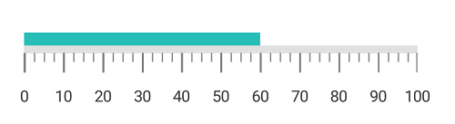
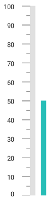
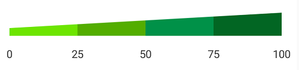

---

layout: post
title: Ranges in Syncfusion LinearGauge control for Xamarin.Forms
description: This section describes how to set ranges and customize the range in the SfLinearGauge control for Xamarin.Forms
platform: Xamarin
control: LinearGauge
documentation: ug

---

# Ranges in SfLinearGauge

Range is a visual element, which begins and ends at specified values within a scale. You can add any number of range for a scale by using the array of range objects.

## Setting start and end values for range

Start and end values of ranges are set by using the [`StartValue`](https://help.syncfusion.com/cr/xamarin/Syncfusion.SfGauge.XForms.LinearRange.html#Syncfusion_SfGauge_XForms_LinearRange_StartValue) and [`EndValue`](https://help.syncfusion.com/cr/xamarin/Syncfusion.SfGauge.XForms.LinearRange.html#Syncfusion_SfGauge_XForms_LinearRange_EndValue) properties.




  
      <gauge:SfLinearGauge>

            <gauge:SfLinearGauge.Scales>
                <gauge:LinearScale ScaleBarColor="#e0e0e0" LabelColor="#424242">
                    <gauge:LinearScale.MajorTickSettings>
                        <gauge:LinearTickSettings Thickness="1"  Color="Gray" Length="15"/>
                    </gauge:LinearScale.MajorTickSettings>
                    <gauge:LinearScale.MinorTickSettings>
                        <gauge:LinearTickSettings Thickness="1"  Color="Gray" Length="7"/>
                    </gauge:LinearScale.MinorTickSettings>
                    <gauge:LinearScale.Ranges>
                        <gauge:LinearRange StartValue="0" EndValue="60" Color="#27beb7" Offset = "-20"/>
                    </gauge:LinearScale.Ranges>
                </gauge:LinearScale>
            </gauge:SfLinearGauge.Scales>

      </gauge:SfLinearGauge>





            SfLinearGauge linearGauge = new SfLinearGauge();
            LinearScale linearScale = new LinearScale();
            linearScale.ScaleBarColor = Color.FromHex("#e0e0e0");
            linearScale.LabelColor = Color.FromHex("#424242");
            linearScale.MajorTickSettings.Thickness = 1;
            linearScale.MajorTickSettings.Length = 15;
            linearScale.MajorTickSettings.Color = Color.Gray;
            linearScale.MinorTickSettings.Color = Color.Gray;
            linearScale.MinorTickSettings.Length = 7;
            linearScale.MinorTickSettings.Thickness = 1;
            LinearRange linearRange = new LinearRange();
            linearRange.StartValue = 0;
            linearRange.EndValue = 60;
            linearRange.Color = Color.FromHex("#27beb7");
            linearRange.Offset = -20;
            linearScale.Ranges.Add(linearRange);
            linearGauge.Scales.Add(linearScale);





## Range customization

To change the range’s background color, use the [`Color`](https://help.syncfusion.com/cr/xamarin/Syncfusion.SfGauge.XForms.LinearRange.html#Syncfusion_SfGauge_XForms_LinearRange_Color) property of linear range. The thickness of the range can be changed using the [`StartWidth`](https://help.syncfusion.com/cr/xamarin/Syncfusion.SfGauge.XForms.LinearRange.html#Syncfusion_SfGauge_XForms_LinearRange_StartWidth) and [`EndWidth`](https://help.syncfusion.com/cr/xamarin/Syncfusion.SfGauge.XForms.LinearRange.html#Syncfusion_SfGauge_XForms_LinearRange_EndWidth) properties. 




  
    <gauge:SfLinearGauge>

             <gauge:SfLinearGauge.Scales>
                <gauge:LinearScale ScaleBarColor="#e0e0e0" LabelColor="#424242">
                    <gauge:LinearScale.MajorTickSettings>
                        <gauge:LinearTickSettings Thickness="1"  Color="Gray" Length="15"/>
                    </gauge:LinearScale.MajorTickSettings>
                    <gauge:LinearScale.MinorTickSettings>
                        <gauge:LinearTickSettings Thickness="1"  Color="Gray" Length="7"/>
                    </gauge:LinearScale.MinorTickSettings>
                    <gauge:LinearScale.Ranges>
                        <gauge:LinearRange StartValue="0" EndValue="50" Color="#f95c85" Offset = "-30" StartWidth ="-5" EndWidth ="-20"/>
                    </gauge:LinearScale.Ranges>
                </gauge:LinearScale>
            </gauge:SfLinearGauge.Scales>

      </gauge:SfLinearGauge>





            SfLinearGauge linearGauge = new SfLinearGauge();
            LinearScale linearScale = new LinearScale();
            linearScale.ScaleBarColor = Color.FromHex("#e0e0e0");
            linearScale.LabelColor = Color.FromHex("#424242");
            linearScale.MajorTickSettings.Thickness = 1;
            linearScale.MajorTickSettings.Length = 15;
            linearScale.MajorTickSettings.Color = Color.Gray;
            linearScale.MinorTickSettings.Color = Color.Gray;
            linearScale.MinorTickSettings.Length = 7;
            linearScale.MinorTickSettings.Thickness = 1;
            linearGauge.Scales.Add(linearScale);
            LinearRange linearRange = new LinearRange();
            linearRange.StartValue = 0;
            linearRange.Color = Color.FromRgb(249, 92, 133);
            linearRange.EndValue = 50;
            linearRange.StartWidth = -5;
            linearRange.EndWidth = -20;
            linearRange.Offset = -30;
            linearScale.Ranges.Add(linearRange);
            linearGauge.Scales.Add(linearScale);





## Setting position for range

The range can be adjusted above or below the scale by using the [`Offset`](https://help.syncfusion.com/cr/xamarin/Syncfusion.SfGauge.XForms.LinearRange.html#Syncfusion_SfGauge_XForms_LinearRange_Offset) value in pixels.




  
     <gauge:SfLinearGauge Orientation = "OrientationVertical">

            <gauge:SfLinearGauge.Scales>
                <gauge:LinearScale ScaleBarColor="#e0e0e0" LabelColor="#424242" OpposedPosition ="True" Interval ="10" ScaleBarLength="350" MinorTicksPerInterval ="1">
                 <gauge:LinearScale.MajorTickSettings>
                        <gauge:LinearTickSettings Thickness="1"  Color="Gray" Length="15"/>
                    </gauge:LinearScale.MajorTickSettings>
                    <gauge:LinearScale.MinorTickSettings>
                        <gauge:LinearTickSettings Thickness="1"  Color="Gray" Length="7"/>
                    </gauge:LinearScale.MinorTickSettings>
                    <gauge:LinearScale.Ranges>
                        <gauge:LinearRange StartValue="0" EndValue="50" Color="#27beb7" Offset = "30"/>
                    </gauge:LinearScale.Ranges>
                </gauge:LinearScale>
            </gauge:SfLinearGauge.Scales>

      </gauge:SfLinearGauge>





           SfLinearGauge linearGauge = new SfLinearGauge();
            linearGauge.Orientation = Orientation.OrientationVertical;
            LinearScale linearScale = new LinearScale();
            linearScale.ScaleBarColor = Color.FromHex("#e0e0e0");
             linearScale.MajorTickSettings.Thickness = 1;
            linearScale.MajorTickSettings.Length = 15;
            linearScale.MajorTickSettings.Color = Color.Gray;
            linearScale.MinorTickSettings.Color = Color.Gray;
            linearScale.MinorTickSettings.Length = 7;
            linearScale.MinorTickSettings.Thickness = 1;
            linearScale.MinorTicksPerInterval = 1;   
            linearScale.OpposedPosition = true;
            linearScale.Interval = 10;
            linearScale.ScaleBarLength = 350;
            linearScale.LabelColor = Color.FromHex("#424242");
            LinearRange linearRange = new LinearRange();
            linearRange.StartValue = 0;
            linearRange.EndValue = 50;
            linearRange.Color = Color.FromHex("#27beb7");
            linearRange.Offset = 30;
            linearScale.Ranges.Add(linearRange);
            linearGauge.Scales.Add(linearScale);





## Setting multiple ranges

You can add n number of ranges to a scale by using the [`LinearRange`](https://help.syncfusion.com/cr/xamarin/Syncfusion.SfGauge.XForms.LinearRange.html) property of range as demonstrated below.




  
    <gauge:SfLinearGauge>
      
            <gauge:SfLinearGauge.Scales>
                <gauge:LinearScale ScaleBarColor="Transparent" ShowTicks="False" LabelColor="#424242" Interval="25" LabelFontSize ="14" LabelOffset="-10" MinorTicksPerInterval ="0">
                    <gauge:LinearScale.Ranges>
                        <gauge:LinearRange StartValue="0" EndValue="25" Color="#6de500" StartWidth ="-10" EndWidth="-15"/>
                        <gauge:LinearRange StartValue="25" EndValue="50" Color="#53ad00" StartWidth ="-15" EndWidth="-20"/>
                        <gauge:LinearRange StartValue="50" EndValue="75" Color="#009148" StartWidth ="-20" EndWidth="-25"/>
                        <gauge:LinearRange StartValue="75" EndValue="100" Color="#026623" StartWidth ="-25" EndWidth="-30"/>
                    </gauge:LinearScale.Ranges>
                </gauge:LinearScale>
            </gauge:SfLinearGauge.Scales>

      </gauge:SfLinearGauge>





            SfLinearGauge linearGauge = new SfLinearGauge();

            LinearScale linearScale = new LinearScale();
            linearScale.ScaleBarColor = Color.Transparent;
            linearScale.LabelColor = Color.FromHex("#424242");
            linearScale.LabelFontSize = 14;
            linearScale.LabelOffset = -10;
            linearScale.Interval = 25;
            linearScale.MinorTicksPerInterval = 0;
            linearScale.ShowTicks = false;

            LinearRange linearRange = new LinearRange();
            linearRange.StartValue = 0;
            linearRange.EndValue = 25;
            linearRange.Color = Color.FromHex("#6de500");
            linearRange.StartWidth = -10;
            linearRange.EndWidth = -15;
            linearScale.Ranges.Add(linearRange);

            LinearRange linearRange1 = new LinearRange();
            linearRange1.StartValue = 25;
            linearRange1.EndValue = 50;
            linearRange1.Color = Color.FromHex("#53ad00");
            linearRange1.StartWidth = -15;
            linearRange1.EndWidth = -20;
            linearScale.Ranges.Add(linearRange1);

            LinearRange linearRange2 = new LinearRange();
            linearRange2.StartValue = 50;
            linearRange2.EndValue = 75;
            linearRange2.Color = Color.FromHex("#009148");
            linearRange2.StartWidth = -20;
            linearRange2.EndWidth = -25;
            linearScale.Ranges.Add(linearRange2);

            LinearRange linearRange3 = new LinearRange();
            linearRange3.StartValue = 75;
            linearRange3.EndValue = 100;
            linearRange3.Color = Color.FromHex("#026623");
            linearRange3.StartWidth = -25;
            linearRange3.EndWidth = -30;
            linearScale.Ranges.Add(linearRange3);
            linearGauge.Scales.Add(linearScale);





## Setting gradient color for range

You can give smooth color transition to range to specifying the different colors based on range value by using [`GradientStops`](https://help.syncfusion.com/cr/xamarin/Syncfusion.SfGauge.XForms.LinearRange.html#Syncfusion_SfGauge_XForms_LinearRange_GradientStops) property.   




  
    <gauge:SfLinearGauge>

            <gauge:SfLinearGauge.Scales>
                <gauge:LinearScale ScaleBarColor="Transparent" ScaleBarSize ="20" ShowTicks="False" LabelColor="#424242" Interval="25" LabelFontSize ="14" LabelOffset="10" MinorTicksPerInterval ="0">
                    <gauge:LinearScale.Ranges>
                        <gauge:LinearRange StartWidth="20" EndWidth="20" StartValue="0" EndValue="100">
                            <gauge:LinearRange.GradientStops>
                                <gauge:GaugeGradientStop Value="0" Color="#FFF9C2C3"/>
                                <gauge:GaugeGradientStop Value="100" Color="#FFD91D71"/>
                            </gauge:LinearRange.GradientStops>
                        </gauge:LinearRange>
                        </gauge:LinearScale.Ranges>
                </gauge:LinearScale>
            </gauge:SfLinearGauge.Scales>

      </gauge:SfLinearGauge>





            SfLinearGauge linearGauge = new SfLinearGauge();
            LinearScale linearScale = new LinearScale();
            linearScale.ScaleBarColor = Color.Transparent;
            linearScale.LabelColor = Color.FromHex("#424242");
            linearScale.LabelFontSize = 14;
            linearScale.LabelOffset = 10;
            linearScale.Interval = 25;
            linearScale.MinorTicksPerInterval = 0;
            linearScale.ShowTicks = false;
            linearScale.ScaleBarSize = 20;

            LinearRange linearRange = new LinearRange();
            linearRange.StartValue = 0;
            linearRange.EndValue = 100;
            linearRange.StartWidth = 20;
            linearRange.EndWidth = 20;
            ObservableCollection<GaugeGradientStop> gradientColor = new ObservableCollection<GaugeGradientStop>()
            {
                new GaugeGradientStop() {Value = 0, Color = Color.FromHex("#FFF9C2C3") },
                new GaugeGradientStop() {Value = 100 ,Color = Color.FromHex("#FFD91D71") }
            };
            linearRange.GradientStops = gradientColor;
            linearScale.Ranges.Add(linearRange);
            linearGauge.Scales.Add(linearScale);





