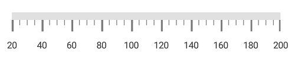
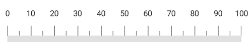

---

layout: post
title: Scales in Syncfusion LinearGauge control for Xamarin.Forms
description:  This section describes how to set scales and customize the scales in the SfLinearGauge control for Xamarin.Forms
platform: Xamarin
control: LinearGauge
documentation: ug

---

# Scales in SfLinearGauge

Scales is a collection of [`LinearScale`](https://help.syncfusion.com/cr/xamarin/Syncfusion.SfGauge.XForms.LinearScale.html), which integrates labels, tick marks, ranges, and pointers to customize the basic look and feel of the [`SfLinearGauge`](https://help.syncfusion.com/cr/xamarin/Syncfusion.SfGauge.XForms.SfLinearGauge.html).

## Linear scale

[`LinearScale`](https://help.syncfusion.com/cr/xamarin/Syncfusion.SfGauge.XForms.LinearScale.html) contains sub elements such as ticks, labels, [`Ranges`](https://help.syncfusion.com/cr/xamarin/Syncfusion.SfGauge.XForms.LinearScale.html#Syncfusion_SfGauge_XForms_LinearScale_Ranges), and [`Pointers`](https://help.syncfusion.com/cr/xamarin/Syncfusion.SfGauge.XForms.LinearScale.html#Syncfusion_SfGauge_XForms_LinearScale_Pointers). 





      <gauge:SfLinearGauge>

            <gauge:SfLinearGauge.Scales>
                <gauge:LinearScale ScaleBarColor="#e0e0e0" LabelColor="#424242">
                </gauge:LinearScale>
            </gauge:SfLinearGauge.Scales>

      </gauge:SfLinearGauge>





      SfLinearGauge linearGauge = new SfLinearGauge();
      LinearScale linearScale = new LinearScale();
      linearScale.ScaleBarColor = Color.FromHex("#e0e0e0");
      linearScale.LabelColor = Color.FromHex("#424242");
      linearGauge.Scales.Add(linearScale);
  




## Setting minimum and maximum values for scale

To change minimum and maximum values of linear scale, use the [`MinimumValue`](https://help.syncfusion.com/cr/xamarin/Syncfusion.SfGauge.XForms.LinearScale.html#Syncfusion_SfGauge_XForms_LinearScale_MinimumValue) and [`MaximumValue`](https://help.syncfusion.com/cr/xamarin/Syncfusion.SfGauge.XForms.LinearScale.html#Syncfusion_SfGauge_XForms_LinearScale_MaximumValue) properties as shown in the following code snippet.





      <gauge:SfLinearGauge>

            <gauge:SfLinearGauge.Scales>
                <gauge:LinearScale MinimumValue="20" MaximumValue="200" ScaleBarColor="#e0e0e0" LabelColor="#424242">
                </gauge:LinearScale>
            </gauge:SfLinearGauge.Scales>

      </gauge:SfLinearGauge>





      SfLinearGauge linearGauge = new SfLinearGauge();
      LinearScale linearScale = new LinearScale();
      linearScale.ScaleBarColor = Color.FromHex("#e0e0e0");
      linearScale.LabelColor = Color.FromHex("#424242");
      linearScale.MinimumValue = 20;
      linearScale.MaximumValue = 200;
      linearGauge.Scales.Add(linearScale);
  




## Setting interval for scale

The [`Interval`](https://help.syncfusion.com/cr/xamarin/Syncfusion.SfGauge.XForms.LinearScale.html#Syncfusion_SfGauge_XForms_LinearScale_Interval) property allows  you to set the intervals for scale. The default [`Interval`](https://help.syncfusion.com/cr/xamarin/Syncfusion.SfGauge.XForms.LinearScale.html#Syncfusion_SfGauge_XForms_LinearScale_Interval) property of scale is auto interval. Auto interval defines the count of the scale labels as 3 for 100 pixels.





     <gauge:SfLinearGauge>

            <gauge:SfLinearGauge.Scales>
                <gauge:LinearScale MinimumValue="0" MaximumValue="500" Interval="100" ScaleBarColor="#e0e0e0" LabelColor="#424242">
                </gauge:LinearScale>
            </gauge:SfLinearGauge.Scales>

     </gauge:SfLinearGauge>





    SfLinearGauge linearGauge = new SfLinearGauge();
    LinearScale linearScale = new LinearScale();
    linearScale.ScaleBarColor = Color.FromHex("#e0e0e0");
    linearScale.LabelColor = Color.FromHex("#424242");
    linearScale.MinimumValue = 0;
    linearScale.MaximumValue = 500;
    linearScale.Interval = 100;
    linearGauge.Scales.Add(linearScale);
  




## Setting maximum labels

The [`MaximumLabels`](https://help.syncfusion.com/cr/xamarin/Syncfusion.SfGauge.XForms.LinearScale.html#Syncfusion_SfGauge_XForms_LinearScale_MaximumLabels) property defines the count of the scale labels in the 100 pixels. By default, the maximum labels for 100 pixels is 3.





    <gauge:SfLinearGauge>

           <gauge:SfLinearGauge.Scales>
                <gauge:LinearScale MaximumLabels="4" ScaleBarColor="#e0e0e0" LabelColor="#424242" MinorTicksPerInterval ="1">
				 <gauge:LinearScale.MajorTickSettings>
                        <gauge:LinearTickSettings Thickness="1"  Color="Gray" Length="15"/>
                    </gauge:LinearScale.MajorTickSettings>
                    <gauge:LinearScale.MinorTickSettings>
                        <gauge:LinearTickSettings Thickness="1"  Color="Gray" Length="7"/>
                    </gauge:LinearScale.MinorTickSettings>
                </gauge:LinearScale>
            </gauge:SfLinearGauge.Scales>

    </gauge:SfLinearGauge>





     SfLinearGauge linearGauge = new SfLinearGauge();
     LinearScale linearScale = new LinearScale();
     linearScale.ScaleBarColor = Color.FromHex("#e0e0e0");
     linearScale.LabelColor = Color.FromHex("#424242");
     linearScale.MajorTickSettings.Thickness = 1;
       linearScale.MajorTickSettings.Length = 15;
       linearScale.MajorTickSettings.Color = Color.Gray;
       linearScale.MinorTickSettings.Color = Color.Gray;
       linearScale.MinorTickSettings.Length = 7;
       linearScale.MinorTickSettings.Thickness = 1;
     linearScale.MinorTicksPerInterval = 1;
     linearScale.MaximumLabels = 4;
     linearGauge.Scales.Add(linearScale);





## Scale customization

You can customize the color, length, size, and position of the [`LinearScale`](https://help.syncfusion.com/cr/xamarin/Syncfusion.SfGauge.XForms.LinearScale.html) by using the [`ScaleBarColor`](https://help.syncfusion.com/cr/xamarin/Syncfusion.SfGauge.XForms.LinearScale.html#Syncfusion_SfGauge_XForms_LinearScale_ScaleBarColor), [`ScaleBarLength`](https://help.syncfusion.com/cr/xamarin/Syncfusion.SfGauge.XForms.LinearScale.html#Syncfusion_SfGauge_XForms_LinearScale_ScaleBarLength), [`ScaleBarSize`](https://help.syncfusion.com/cr/xamarin/Syncfusion.SfGauge.XForms.LinearScale.html#Syncfusion_SfGauge_XForms_LinearScale_ScaleBarSize), and [`Offset`](https://help.syncfusion.com/cr/xamarin/Syncfusion.SfGauge.XForms.LinearScale.html#Syncfusion_SfGauge_XForms_LinearScale_Offset) properties, respectively.





     <gauge:SfLinearGauge Orientation="OrientationVertical">

         <gauge:SfLinearGauge.Scales>
                <gauge:LinearScale ScaleBarColor="#4c88dc" LabelOffset="-5" MinorTicksPerInterval="1" Offset="10" ScaleBarLength="300" ScaleBarSize="5" LabelColor="#424242">
                    <gauge:LinearScale.MajorTickSettings>
                        <gauge:LinearTickSettings Length= "25" Color="Gray"/>
                    </gauge:LinearScale.MajorTickSettings>
                    <gauge:LinearScale.MinorTickSettings>
                        <gauge:LinearTickSettings Length="10" Color="Gray"/>
                    </gauge:LinearScale.MinorTickSettings>
                </gauge:LinearScale>
            </gauge:SfLinearGauge.Scales>

     </gauge:SfLinearGauge>





      SfLinearGauge linearGauge = new SfLinearGauge();
      linearGauge.Orientation = Orientation.OrientationVertical;
      LinearScale linearScale = new LinearScale();
      linearScale.ScaleBarColor = Color.FromRgb(76, 136, 220);
      linearScale.LabelColor = Color.FromHex("#424242");
      linearScale.MinorTicksPerInterval = 1;
      linearScale.MajorTickSettings.Length = 25;
      linearScale.MinorTickSettings.Length = 10;
      linearScale.MajorTickSettings.Color = Color.Gray;
      linearScale.MinorTickSettings.Color = Color.Gray;
      linearScale.LabelOffset = -5;
      linearScale.Offset = 10;
      linearScale.ScaleBarLength = 300;
      linearScale.ScaleBarSize = 5;
      linearGauge.Scales.Add(linearScale);





## Scale Offset
The space between the control and linear scale can be customized using the [`ScaleOffset`](https://help.syncfusion.com/cr/xamarin/Syncfusion.SfGauge.XForms.LinearScale.html#Syncfusion_SfGauge_XForms_LinearScale_ScaleOffset) property.


<gauge:SfLinearGauge>
            <gauge:SfLinearGauge.Scales>
                <gauge:LinearScale ScaleOffset="40"  ScaleBarSize="20" CornerRadiusType="Start"  CornerRadius="10" ScaleBarColor="#e0e0e0" LabelColor="#424242">
                    <gauge:LinearScale.MajorTickSettings>
                        <gauge:LinearTickSettings Thickness="1"  Color="Gray" Length="15"/>
                    </gauge:LinearScale.MajorTickSettings>
                    <gauge:LinearScale.MinorTickSettings>
                        <gauge:LinearTickSettings Thickness="1"  Color="Gray" Length="7"/>
                    </gauge:LinearScale.MinorTickSettings>
                </gauge:LinearScale>
            </gauge:SfLinearGauge.Scales>
        </gauge:SfLinearGauge>



public MainPage()
            {               
            SfLinearGauge linearGauge = new SfLinearGauge();
            LinearScale linearScale = new LinearScale();
            linearScale.ScaleBarSize = 20;
            linearScale.ScaleBarColor = Color.FromHex("#e0e0e0");
            linearScale.CornerRadiusType = CornerRadiusType.Start;
            linearScale.CornerRadius = 10;
            linearScale.ScaleOffset = 40;
            linearScale.MajorTickSettings.Thickness = 1;
            linearScale.MajorTickSettings.Length = 15;
            linearScale.MajorTickSettings.Color = Color.Gray;
            linearScale.MinorTickSettings.Color = Color.Gray;
            linearScale.MinorTickSettings.Length = 7;
            linearScale.MinorTickSettings.Thickness = 1;
            linearScale.LabelColor = Color.FromHex("#424242");
            linearGauge.Scales.Add(linearScale);
            }
        }



## Setting opposite position

To place the scale at opposite to its original position, set the [`OpposedPosition`](https://help.syncfusion.com/cr/xamarin/Syncfusion.SfGauge.XForms.LinearScale.html#Syncfusion_SfGauge_XForms_LinearScale_OpposedPosition) property to true in the scale.





     <gauge:SfLinearGauge>

             <gauge:SfLinearGauge.Scales>
                <gauge:LinearScale OpposedPosition="True" ScaleBarColor="#e0e0e0" LabelColor="#424242" MinorTicksPerInterval="1">
                    <gauge:LinearScale.MajorTickSettings>
                        <gauge:LinearTickSettings Thickness="1"  Color="Gray" Length="15"/>
                    </gauge:LinearScale.MajorTickSettings>
                    <gauge:LinearScale.MinorTickSettings>
                        <gauge:LinearTickSettings Thickness="1"  Color="Gray" Length="7"/>
                    </gauge:LinearScale.MinorTickSettings>
                </gauge:LinearScale>
            </gauge:SfLinearGauge.Scales>

     </gauge:SfLinearGauge>





       SfLinearGauge linearGauge = new SfLinearGauge();
       LinearScale linearScale = new LinearScale();
       linearScale.ScaleBarColor = Color.FromHex("#e0e0e0");
       linearScale.LabelColor = Color.FromHex("#424242");
       linearScale.MajorTickSettings.Thickness = 1;
       linearScale.MajorTickSettings.Length = 15;
       linearScale.MajorTickSettings.Color = Color.Gray;
       linearScale.MinorTickSettings.Color = Color.Gray;
       linearScale.MinorTickSettings.Length = 7;
       linearScale.MinorTickSettings.Thickness = 1;
       linearScale.MinorTicksPerInterval = 1;
       linearScale.OpposedPosition = true;
       linearGauge.Scales.Add(linearScale); 





## Setting scale direction

You can set the scale position to its forward and backward using the [`ScalePosition`](https://help.syncfusion.com/cr/xamarin/Syncfusion.SfGauge.XForms.LinearScale.html#Syncfusion_SfGauge_XForms_LinearScale_ScalePosition) property.





    <gauge:SfLinearGauge>

            <gauge:SfLinearGauge.Scales>
                <gauge:LinearScale ScaleBarColor="#e0e0e0" LabelColor="#424242" MinorTicksPerInterval="1" ScalePosition="BackWard">
                 <gauge:LinearScale.MajorTickSettings>
                        <gauge:LinearTickSettings Thickness="1"  Color="Gray" Length="15"/>
                    </gauge:LinearScale.MajorTickSettings>
                    <gauge:LinearScale.MinorTickSettings>
                        <gauge:LinearTickSettings Thickness="1"  Color="Gray" Length="7"/>
                    </gauge:LinearScale.MinorTickSettings>
                </gauge:LinearScale>
            </gauge:SfLinearGauge.Scales>

     </gauge:SfLinearGauge>





        SfLinearGauge linearGauge = new SfLinearGauge();
        LinearScale linearScale = new LinearScale();
        linearScale.ScaleBarColor = Color.FromHex("#e0e0e0");
        linearScale.LabelColor = Color.FromHex("#424242");
        linearScale.MajorTickSettings.Thickness = 1;
        linearScale.MajorTickSettings.Length = 15;
        linearScale.MajorTickSettings.Color = Color.Gray;
        linearScale.MinorTickSettings.Color = Color.Gray;
        linearScale.MinorTickSettings.Length = 7;
        linearScale.MinorTickSettings.Thickness = 1;
        linearScale.MinorTicksPerInterval = 1;
        linearScale.ScalePosition = ScalePosition.BackWard;
        linearGauge.Scales.Add(linearScale);
	

    


## Setting corner radius type for scale

Corners of the [`LinearScale`](https://help.syncfusion.com/cr/xamarin/Syncfusion.SfGauge.XForms.LinearScale.html) can be customized by setting the value to the [`CornerRadiusType`](https://help.syncfusion.com/cr/xamarin/Syncfusion.SfGauge.XForms.LinearScale.html#Syncfusion_SfGauge_XForms_LinearScale_CornerRadiusType) property. All corners of linear scale can be customized using the `Start`, `End`, `Both`, and `None` options.
 [`CornerRadius`](https://help.syncfusion.com/cr/xamarin/Syncfusion.SfGauge.XForms.LinearScale.html#Syncfusion_SfGauge_XForms_LinearScale_CornerRadius) property used to reduce the radius of the corners.





        <gauge:SfLinearGauge>

            <gauge:SfLinearGauge.Scales>
                <gauge:LinearScale ScaleBarSize="20" CornerRadiusType="Start"  CornerRadius="10" ScaleBarColor="#e0e0e0" LabelColor="#424242">
                    <gauge:LinearScale.MajorTickSettings>
                        <gauge:LinearTickSettings Thickness="1"  Color="Gray" Length="15"/>
                    </gauge:LinearScale.MajorTickSettings>
                    <gauge:LinearScale.MinorTickSettings>
                        <gauge:LinearTickSettings Thickness="1"  Color="Gray" Length="7"/>
                    </gauge:LinearScale.MinorTickSettings>
                </gauge:LinearScale>
            </gauge:SfLinearGauge.Scales>

        </gauge:SfLinearGauge>





         SfLinearGauge linearGauge = new SfLinearGauge();
         LinearScale linearScale = new LinearScale();
         linearScale.ScaleBarSize = 20;
         linearScale.ScaleBarColor = Color.FromHex("#e0e0e0");
         linearScale.CornerRadiusType = CornerRadiusType.Start;
         linearScale.CornerRadius = 10;
         linearScale.MajorTickSettings.Thickness = 1;
         linearScale.MajorTickSettings.Length = 15;
         linearScale.MajorTickSettings.Color = Color.Gray;
         linearScale.MinorTickSettings.Color = Color.Gray;
         linearScale.MinorTickSettings.Length = 7;
         linearScale.MinorTickSettings.Thickness = 1;
         linearScale.LabelColor = Color.FromHex("#424242");
         linearGauge.Scales.Add(linearScale);
	

    


## Multiple scales 

It helps you to add multiple scales to the same linear gauge and customize all the scales in a [`Scales`](https://help.syncfusion.com/cr/xamarin/Syncfusion.SfGauge.XForms.SfLinearGauge.html#Syncfusion_SfGauge_XForms_SfLinearGauge_Scales) collection.





    <gauge:SfLinearGauge Orientation="OrientationVertical">

            <gauge:SfLinearGauge.Scales>
                <gauge:LinearScale ScaleBarLength="500" MinimumValue="0" Interval="10" MaximumValue="100" Offset="9"
                                   ScaleBarColor="Gray" ScaleBarSize="5" LabelColor="Gray" MinorTicksPerInterval="1"
                                   LabelPostfix="°F" LabelOffset="-6">
                    <gauge:LinearScale.MajorTickSettings>
                        <gauge:LinearTickSettings Color="Gray" Thickness="1"/>
                    </gauge:LinearScale.MajorTickSettings>
                    <gauge:LinearScale.MinorTickSettings>
                        <gauge:LinearTickSettings Color="Gray"/>
                    </gauge:LinearScale.MinorTickSettings>
                </gauge:LinearScale>

                <gauge:LinearScale MinimumValue="0" ScaleBarLength="500" Interval="10" MaximumValue="100"
                                   ShowTicks="False" ShowLabels="False" ScaleBarSize="5" ScaleBarColor="Transparent"
                                   CornerRadiusType="Both" LabelColor="Black" >
                    <gauge:LinearScale.MajorTickSettings>
                        <gauge:LinearTickSettings Color="Black"/>
                    </gauge:LinearScale.MajorTickSettings>
                    <gauge:LinearScale.MinorTickSettings>
                        <gauge:LinearTickSettings Color="Black"/>
                    </gauge:LinearScale.MinorTickSettings>
                    <gauge:LinearScale.Pointers>
                        <gauge:BarPointer Value="45" Thickness="7" CornerRadiusType="End" CornerRadius="3"
                                          Color="#f95c85"/>
                    </gauge:LinearScale.Pointers>
                </gauge:LinearScale>

                <gauge:LinearScale MinimumValue="0" ScaleBarLength="500" MinorTicksPerInterval="1"
                                   MaximumValue="38" Interval="2" ScaleBarColor="Gray" ScaleBarSize="5"
                                   LabelColor="Gray" OpposedPosition="True" Offset="-9" LabelPostfix="°C">
                    <gauge:LinearScale.MajorTickSettings>
                        <gauge:LinearTickSettings Color="Gray" Thickness="1"/>
                    </gauge:LinearScale.MajorTickSettings>
                    <gauge:LinearScale.MinorTickSettings>
                        <gauge:LinearTickSettings Color="Gray"/>
                    </gauge:LinearScale.MinorTickSettings>

                </gauge:LinearScale>

            </gauge:SfLinearGauge.Scales>

      </gauge:SfLinearGauge>





        SfLinearGauge linearGauge = new SfLinearGauge();
        linearGauge.Orientation = Orientation.OrientationVertical;
        LinearScale linearScale = new LinearScale();
        linearScale.ScaleBarLength = 500;
        linearScale.MinimumValue = 0;
        linearScale.Interval = 10;
        linearScale.MaximumValue = 100;
        linearScale.Offset = 9;
        linearScale.ScaleBarColor = Color.Gray;
        linearScale.ScaleBarSize = 5;
        linearScale.MajorTickSettings.Color = Color.Gray;
        linearScale.MinorTickSettings.Color = Color.Gray;
        linearScale.MajorTickSettings.Thickness = 1;
        linearScale.LabelColor = Color.Gray;
        linearScale.MinorTicksPerInterval = 1;
        linearScale.LabelPostfix = "°F";
        linearScale.LabelOffset = -6;
        linearGauge.Scales.Add(linearScale);
 
        LinearScale scale = new LinearScale();
        scale.MinimumValue = 0;
        scale.ScaleBarLength = 500;
        scale.Interval = 10;
        scale.MaximumValue = 100;
        scale.ShowTicks = false;
        scale.ShowLabels = false;
        scale.ScaleBarSize = 5;
        scale.ScaleBarColor = Color.Transparent;
        scale.CornerRadiusType = CornerRadiusType.Both;
        scale.MajorTickSettings.Color = Color.Black;
        scale.MinorTickSettings.Color = Color.Black;
        scale.LabelColor = Color.Black;
        BarPointer barPointer = new BarPointer();
        barPointer.Value = 45;
        barPointer.Thickness = 7; 
        barPointer.CornerRadiusType = CornerRadiusType.End;
        barPointer.CornerRadius = 3;
        barPointer.Color = Color.FromRgb(249, 92, 133);
        scale.Pointers.Add(barPointer);
        linearGauge.Scales.Add(scale);

        LinearScale linearScale1 = new LinearScale();
        linearScale1.MinimumValue = 0;
        linearScale1.ScaleBarLength = 500;
        linearScale1.MinorTicksPerInterval = 1;
        linearScale1.MaximumValue = 38;
        linearScale1.Interval = 2;
        linearScale1.ScaleBarColor = Color.Gray;
        linearScale1.ScaleBarSize = 5;
        linearScale1.MajorTickSettings.Color = Color.Gray;
        linearScale1.MinorTickSettings.Color = Color.Gray;
        linearScale1.LabelColor = Color.Gray;
        linearScale1.OpposedPosition = true;
        linearScale1.Offset = -9;
        linearScale1.MajorTickSettings.Thickness = 1;
        linearScale1.LabelOffset = -5;
        linearScale1.LabelPostfix = "°C";

        linearGauge.Scales.Add(linearScale1);
	

    


## Setting gradient color for scale

You can give smooth color transition to scale to specifying the different colors based on scale value by using [`GradientStops`](https://help.syncfusion.com/cr/xamarin/Syncfusion.SfGauge.XForms.LinearScale.html#Syncfusion_SfGauge_XForms_LinearScale_GradientStops) property.





    <gauge:SfLinearGauge>

            <gauge:SfLinearGauge.Scales>
                <gauge:LinearScale ScaleBarSize="15" MinorTicksPerInterval="1" LabelColor="Black">

                    <gauge:LinearScale.MajorTickSettings>
                        <gauge:LinearTickSettings Thickness="1"  Color="Black" Length="15"/>
                    </gauge:LinearScale.MajorTickSettings>
                    <gauge:LinearScale.MinorTickSettings>
                        <gauge:LinearTickSettings Thickness="1"  Color="Black" Length="7"/>
                    </gauge:LinearScale.MinorTickSettings>
                    
                    <gauge:LinearScale.GradientStops>
                        <gauge:GaugeGradientStop Value="10" Color="#51c9e1"/>
                        <gauge:GaugeGradientStop Value="40" Color="#93e9e1"/>
                        <gauge:GaugeGradientStop Value="50" Color="#c5e692"/>
                        <gauge:GaugeGradientStop Value="60" Color="#fedd2b"/>
                        <gauge:GaugeGradientStop Value="100" Color="#e87813"/>

                    </gauge:LinearScale.GradientStops>
                </gauge:LinearScale>
            </gauge:SfLinearGauge.Scales>

       </gauge:SfLinearGauge>





     SfLinearGauge linearGauge = new SfLinearGauge();
     LinearScale linearScale = new LinearScale();

     GaugeGradientStop gaugeGradientStop = new GaugeGradientStop();
     gaugeGradientStop.Value = 10;
     gaugeGradientStop.Color = Color.FromRgb(81, 201, 225);
     linearScale.GradientStops.Add(gaugeGradientStop);

      GaugeGradientStop gaugeGradientStop1 = new GaugeGradientStop();
      gaugeGradientStop1.Value = 40;
      gaugeGradientStop1.Color = Color.FromRgb(147, 233, 225);
      linearScale.GradientStops.Add(gaugeGradientStop1);

      GaugeGradientStop gaugeGradientStop2 = new GaugeGradientStop();
      gaugeGradientStop2.Value = 50;
      gaugeGradientStop2.Color = Color.FromRgb(197, 230, 146);
      linearScale.GradientStops.Add(gaugeGradientStop2);

      GaugeGradientStop gaugeGradientStop3 = new GaugeGradientStop();
      gaugeGradientStop3.Value = 60;
      gaugeGradientStop3.Color = Color.FromRgb(254, 221, 43);
      linearScale.GradientStops.Add(gaugeGradientStop3);

      GaugeGradientStop gaugeGradientStop4 = new GaugeGradientStop();
      gaugeGradientStop4.Value = 100;
      gaugeGradientStop4.Color = Color.FromRgb(232, 120, 19);
      linearScale.GradientStops.Add(gaugeGradientStop4);

      linearScale.ScaleBarSize = 15;
      linearScale.MajorTickSettings.Color = Color.Black;
      linearScale.MinorTickSettings.Color = Color.Black;
      linearScale.MajorTickSettings.Thickness = 1;
      linearScale.MajorTickSettings.Length = 15;
      linearScale.MinorTickSettings.Length = 7;
      linearScale.MinorTickSettings.Thickness = 1;
      linearScale.MinorTicksPerInterval = 1;
      linearScale.LabelColor = Color.Black;
      linearGauge.Scales.Add(linearScale);
	

    


