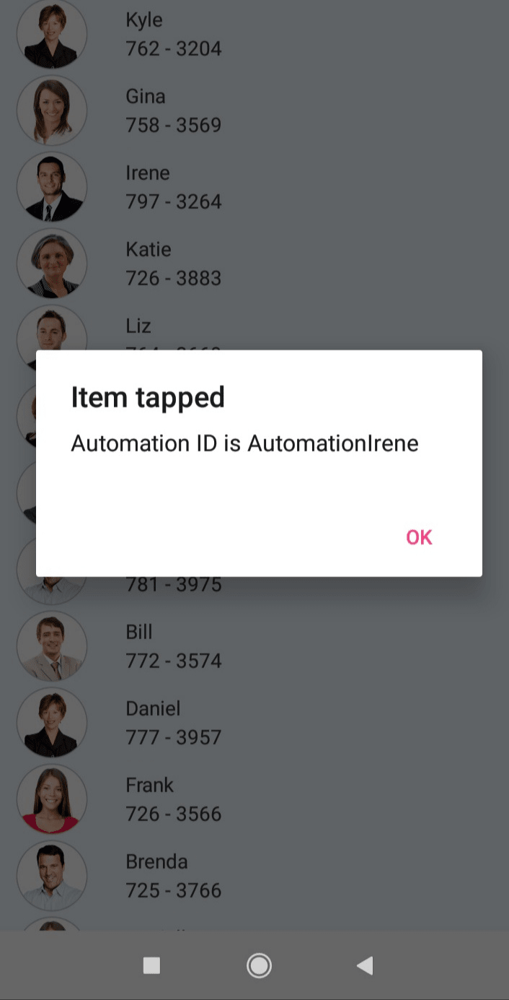

# Accessibility in Xamarin ListView (SfListView)

The ListView control has built-in [AutomationId](https://help.syncfusion.com/cr/xamarin/Syncfusion.ListView.XForms.SfListView.html) for all their inner elements. The `AutomationId` API allows the automation framework to find and interact with the inner elements of the ListView control. To keep unique `AutomationId`, these inner element's AutomationIds are updated based on ListView control AutomationId.

For example, if we set ListView’s AutomationId as “Automation” then the Automation framework will interact with items of the ListView as `AutomationItem1`. You can get the `AutomationId` of the ListView items by tapping the items using the `TappedCommand` property.



<ContentPage xmlns:syncfusion="clr-namespace:Syncfusion.ListView.XForms;assembly=Syncfusion.SfListView.XForms">
    <ContentPage.Content>
        <StackLayout>
            <syncfusion:SfListView x:Name="listView" ItemsSource="{Binding contactsinfo}">
                <syncfusion:SfListView.ItemTemplate >
                    <DataTemplate>
                        <Grid x:Name="grid" AutomationId="{Binding AutomationID}">
                            <Grid.GestureRecognizers>
                                <TapGestureRecognizer Command="{Binding Source={x:Reference listView}, Path=BindingContext.TapCommand}" CommandParameter="{Binding .}"/>
                            </Grid.GestureRecognizers>
						</Grid>
                    </DataTemplate>
                </syncfusion:SfListView.ItemTemplate>
            </syncfusion:SfListView>
        </StackLayout>
    </ContentPage.Content>					
</ContentPage>


public class ContactsViewModel : INotifyPropertyChanged
{
    public Command<object> TapCommand { get; set; }
    public ObservableCollection<Contacts> contactsinfo { get; set; }

    public ContactsViewModel()
    {
        contactsinfo = new ObservableCollection<Contacts>();
        TapCommand = new Command<object>(OnTapped);
        GenerateInfo();
    }

    private void OnTapped(object obj)
    {
        var item = obj as Contacts;
        App.Current.MainPage.DisplayAlert("Item tapped", "Automation ID is " + item.AutomationID, "Ok");
    }

    public void GenerateInfo()
    {
        Random r = new Random();
        for (int i = 0; i < 50; i++)
        {
            var contact = new Contacts(CustomerNames[i], r.Next(720, 799).ToString() + " - " + r.Next(3010, 3999).ToString());
            contact.ContactImage = ImageSource.FromResource("ListViewXamarin.Images.Image" + r.Next(0, 28) + ".png");
            contact.AutomationID = "Automation" + CustomerNames[i];
            contactsinfo.Add(contact);
        }
    }
}



