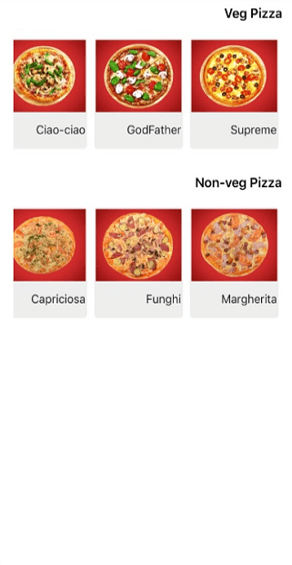

# Right To Left in Xamarin ListView (SfListView)

ListView supports to change the flow of text to the right-to-left direction by setting the [FlowDirection](https://docs.microsoft.com/en-us/dotnet/api/xamarin.forms.visualelement.flowdirection?view=xamarin-forms#Xamarin_Forms_VisualElement_FlowDirection) to `RightToLeft` in both `Vertical` and `Horizontal` orientations. ListView supports RTL in Xamarin.Forms version 3.0 and above. It also supports RTL when device's flow direction is changed.

N> Specific platform setup is required to enable right-to-left localization. For platform settings you can refer [here](https://docs.microsoft.com/en-us/xamarin/xamarin-forms/app-fundamentals/localization/right-to-left#platform-setup).



<ContentPage  xmlns:x="http://schemas.microsoft.com/winfx/2009/xaml"
              xmlns:syncfusion="clr-namespace:Syncfusion.ListView.XForms;assembly=Syncfusion.SfListView.XForms">
    <ContentPage.Content>
       <syncfusion:SfListView x:Name="listView" FlowDirection="RightToLeft"/>
    </ContentPage.Content>
</ContentPage>


listView.FlowDirection = FlowDirection.RightToLeft;



You can download the entire source code of this demo from [here](https://github.com/SyncfusionExamples/Xamarin-ListView-RightToLeft).

N> When a label is loaded in the `ItemTemplate`, the right-to-left direction is not applied due to the framework issue. It has been reported to the Xamarin team; for more details about this, refer to this [link](https://github.com/xamarin/Xamarin.Forms/issues/3611). To overcome this issue, set the `HorizontalOptions` to `StartAndExpand` in Label.

## Limitation

* ListView item does not arrange from right to left direction in `Horizontal` orientation, when the [AutoFitMode](https://help.syncfusion.com/cr/xamarin/Syncfusion.ListView.XForms.SfListView.html#Syncfusion_ListView_XForms_SfListView_AutoFitMode) is `Height`.

## See also

[How to work with swiping with RTL in Xamarin.Forms ListView (SfListview)](https://www.syncfusion.com/kb/11479/)