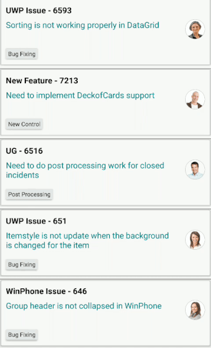

# Selection in Xamarin ListView (SfListView)

This section explains how to perform selection and its related operations in the SfListView.

## UI selection

The SfListView allows selecting items either programmatically or touch interactions by setting the [SfListView.SelectionMode](https://help.syncfusion.com/cr/xamarin/Syncfusion.ListView.XForms.SfListView.html#Syncfusion_ListView_XForms_SfListView_SelectionMode) property value to other than `None`. The control has different selection modes to perform selection operations listed as follows:

 * None: Allows disabling selection.
 * Single: Allows selecting single item only. When clicking the selected item, selection not will not be cleared. This is the default value for `SfListView.SelectionMode`.
 * SingleDeselect: Allows selecting single item only. When clicking the selected item, selection gets cleared.
 * Multiple: Allows selecting more than one item. Selection is not cleared when selecting more than one items. When clicking the selected item, selection gets cleared.

The SfListView allows selecting items on different gestures such as tap, double tap, and hold by setting the [SfListView.SelectionGesture](https://help.syncfusion.com/cr/xamarin/Syncfusion.ListView.XForms.SfListView.html#Syncfusion_ListView_XForms_SfListView_SelectionGesture). The default value for the `SfListView.SelectionGesture` is [TouchGesture.Tap](https://help.syncfusion.com/cr/xamarin/Syncfusion.ListView.XForms.TouchGesture.html).



 <syncfusion:SfListView x:Name="listView"
                        SelectionMode="Multiple"
                        SelectionGesture="Hold"/>
                     

listView.SelectionMode = SelectionMode.Multiple;
listView.SelectionGesture = TouchGesture.Hold;



## Programmatic selection

When the [SfListView.SelectionMode](https://help.syncfusion.com/cr/xamarin/Syncfusion.ListView.XForms.SfListView.html#Syncfusion_ListView_XForms_SfListView_SelectionMode) is other than `None`, the item or items in the SfListView can be selected from the code by setting the [SfListView.SelectedItem](https://help.syncfusion.com/cr/xamarin/Syncfusion.ListView.XForms.SfListView.html#Syncfusion_ListView_XForms_SfListView_SelectedItem), or adding items to the [SfListView.SelectedItems](https://help.syncfusion.com/cr/xamarin/Syncfusion.ListView.XForms.SfListView.html#Syncfusion_ListView_XForms_SfListView_SelectedItems) property based on the `SfListView.SelectionMode`.

When the selection mode is `Single`, programmatically select an item by setting the underlying object to the `SfListView.SelectedItem` property. 



//Perform selection using selected item
listView.SelectedItem = viewModel.Items[5];



When the selection mode is `Multiple`, programmatically select more than one item by adding the underlying object to the `SfListView.SelectedItems` property. 


 

//Perform multiple selection using selected items
public class SelectionViewModel : INotifyPropertyChanged
{
    private ObservableCollection<object> selectedItems;

    public SelectionViewModel()
    {
        GenerateSource();
        SelectedItems = new ObservableCollection<object>();
    }

    public ObservableCollection<object> SelectedItems
    {
        get { return selectedItems; }
        set { this.selectedItems = value; }
    }
    private async void GenerateSource()
    {
        var random = new Random();
        SelectedItems.Add(MusicInfo[0]);
    }
}

listView.SelectedItems.Add (viewModel.Items [4]);
listView.SelectedItems.Add (viewModel.Items[5]);



N> The SfListView.SelectedItems property type is a type of ObservableCollection<Object>. So, you should use generic type as an object for the ViewModel collection property type.



<sync:SfListView x:Name="listView" SelectedItems="{Binding SelectedItems}">
</sync:SfListView>



All items of the SfListView can be selected using the [SelectAll](https://help.syncfusion.com/cr/xamarin/Syncfusion.ListView.XForms.SfListView.html#Syncfusion_ListView_XForms_SfListView_SelectAll) method.


 
listView.SelectAll();



N> When programmatically select an item, then the selection related [events](https://help.syncfusion.com/xamarin/sflistview/selection#events) will not be triggered. It triggers only on UI interactions.
However, get the notification from the SelectedItems collection changed event, which will be triggered when add an item at runtime.

## Selected items

### Get selected items

The SfListView gets all the selected items through the [SfListView.SelectedItems](https://help.syncfusion.com/cr/xamarin/Syncfusion.ListView.XForms.SfListView.html#Syncfusion_ListView_XForms_SfListView_SelectedItems) property  and gets the single item by using the [SfListView.SelectedItem](https://help.syncfusion.com/cr/xamarin/Syncfusion.ListView.XForms.SfListView.html#Syncfusion_ListView_XForms_SfListView_SelectedItem) property.

### Clear selected items

The selected items can be cleared by calling the [SelectedItems.Clear()](https://help.syncfusion.com/cr/xamarin/Syncfusion.ListView.XForms.SfListView.html#Syncfusion_ListView_XForms_SfListView_SelectedItems) method.



listView.SelectedItems.Clear();



### CurrentItem vs SelectedItem

The SfListView gets the selected item by using the [SfListView.SelectedItem](https://help.syncfusion.com/cr/xamarin/Syncfusion.ListView.XForms.SfListView.html#Syncfusion_ListView_XForms_SfListView_SelectedItem) and [SfListView.CurrentItem](https://help.syncfusion.com/cr/xamarin/Syncfusion.ListView.XForms.SfListView.html#Syncfusion_ListView_XForms_SfListView_CurrentItem) properties. Both `SfListView.SelectedItem` and `SfListView.CurrentItem` returns the same data object when selecting single item. When selecting more than one item, the `SfListView.SelectedItem` property returns the first selected item, and the `SfListView.CurrentItem` property returns the last selected item.

W> If you select an item when [SfListView.SelectionMode](https://help.syncfusion.com/cr/xamarin/Syncfusion.ListView.XForms.SfListView.html#Syncfusion_ListView_XForms_SfListView_SelectionMode) is none or if you select multiple items when `SfListView.SelectionMode` is single, exception will be thrown.

## Selected item customization 

The SfListView supports customizing the selection background color for the selected items by using the [SfListView.SelectedItemTemplate](https://help.syncfusion.com/cr/xamarin/Syncfusion.ListView.XForms.SfListView.html#Syncfusion_ListView_XForms_SfListView_SelectedItemTemplate) if the background color is set to view loaded in the [SfListView.ItemTemplate](https://help.syncfusion.com/cr/xamarin/Syncfusion.ListView.XForms.SfListView.html#Syncfusion_ListView_XForms_SfListView_ItemTemplate).



<ContentPage  xmlns:syncfusion="clr-namespace:Syncfusion.ListView.XForms;assembly=Syncfusion.SfListView.XForms">
  <syncfusion:SfListView x:Name="listView">
   <syncfusion:SfListView.SelectedItemTemplate>
    <DataTemplate>
     <Grid x:Name="grid" BackgroundColor="RoyalBlue">
      <Grid.RowDefinitions>
         <RowDefinition Height="*" />
         <RowDefinition Height="*" />
         <RowDefinition Height="1" />
       </Grid.RowDefinitions>
      <Label Text="{Binding SongTitle}" />
      <Label Text="{Binding SongAuther}" Grid.Row="1"/>
      <Frame Grid.Row="2" HasShadow="True" HeightRequest="1"/>
     </Grid>
    </DataTemplate>
   </syncfusion:SfListView.SelectedItemTemplate>
  </syncfusion:SfListView>
</ContentPage>


 listView.SelectedItemTemplate = new DataTemplate(() =>
{
  var grid = new Grid();
  grid.RowDefinitions.Add(new RowDefinition { Height = new GridLength(1, GridUnitType.Star) });
  grid.RowDefinitions.Add(new RowDefinition { Height = new GridLength(1, GridUnitType.Star) });
  grid.RowDefinitions.Add(new RowDefinition { Height = new GridLength(1) });
  grid.BackgroundColor = Color.RoyalBlue;
  var songTitle = new Label();
  songTitle.SetBinding(Label.TextProperty, new Binding("SongTitle"));
  var songAuthor = new Label();
  songAuthor.SetBinding(Label.TextProperty, new Binding("songAuthor"));
  var frame = new Frame()
  {
    HeightRequest = 1,
    HasShadow = true,
  };
  grid.Children.Add(songTitle);
  grid.Children.Add(songAuthor, 0, 1);
  grid.Children.Add(frame, 0, 2);
  return grid;
});



Download the entire sample from GitHub [here](https://github.com/SyncfusionExamples/Customize-selected-item-in-xamarin.forms-listview).

### Show checked circle on selected items 

To customize the appearance of the selected item or items by using the appearance of [SfListView.SelectedItemTemplate](https://help.syncfusion.com/cr/xamarin/Syncfusion.ListView.XForms.SfListView.html#Syncfusion_ListView_XForms_SfListView_SelectedItemTemplate). The following customizations should give an idea to customize the appearance of selected items in the control.



<ContentPage xmlns:syncfusion="clr-namespace:Syncfusion.ListView.XForms;assembly=Syncfusion.SfListView.XForms">
  <syncfusion:SfListView x:Name="listView">
   <syncfusion:SfListView.SelectedItemTemplate>
    <DataTemplate>
     <Grid x:Name="grid">
      <Grid.ColumnDefinitions>
       <ColumnDefinition Width="40" />
       <ColumnDefinition Width="*" />    
       <ColumnDefinition Width="Auto" />
      </Grid.ColumnDefinitions>
      <Image Source="{Binding SongThumbnail}"/>
      <Grid Grid.Column="1">
       <Grid.RowDefinitions>
        <RowDefinition Height="*" />
        <RowDefinition Height="*" />
       </Grid.RowDefinitions>
       <Label Text="{Binding SongTitle}" />
       <Grid Grid.Row="1">
        <Grid.ColumnDefinitions>
         <ColumnDefinition Width="*" />
         <ColumnDefinition Width="*" />
        </Grid.ColumnDefinitions>
        <Label Text="{Binding SongAuther}" />
        <Label Grid.Column="1" Text="{Binding SongSize}"/>
       </Grid>
      </Grid>
      <Image Grid.Column="2" x:Name="selectionImage" IsVisible="True" Source="Selected.png"/>
     </Grid>
    </DataTemplate>
   </syncfusion:SfListView.SelectedItemTemplate>
  </syncfusion:SfListView>
</ContentPage>


listView.SelectedItemTemplate = new DataTemplate(() =>
{
  var grid1 = new Grid();
  grid1.ColumnDefinitions.Add(new ColumnDefinition { Width = new GridLength(40) });
  grid1.ColumnDefinitions.Add(new ColumnDefinition { Width = new GridLength(1, GridUnitType.Star) });
  grid1.ColumnDefinitions.Add(new ColumnDefinition { Width = new GridLength(1, GridUnitType.Auto) });
  var songThumbnail = new Image();
  songThumbnail.SetBinding(Image.SourceProperty, new Binding("SongThumbnail"));
  var grid2 = new Grid();
  grid2.RowDefinitions.Add(new RowDefinition { Height = new GridLength(1, GridUnitType.Star) });
  grid2.RowDefinitions.Add(new RowDefinition { Height = new GridLength(1, GridUnitType.Star) });
  grid2.Padding = new Thickness(15, 0, 0, 0);
  var songTitle = new Label();
  songTitle.SetBinding(Label.TextProperty, new Binding("SongTitle"));
  var grid3 = new Grid();
  grid3.ColumnDefinitions.Add(new ColumnDefinition { Width = new GridLength(1, GridUnitType.Star) });
  grid3.ColumnDefinitions.Add(new ColumnDefinition { Width = new GridLength(1, GridUnitType.Star) });
  var songAuthor = new Label();
  songAuthor.SetBinding(Label.TextProperty, new Binding("songAuthor"));
  var songSize = new Label();
  songSize.SetBinding(Label.TextProperty, new Binding("SongSize"));
  grid3.Children.Add(songAuthor);
  grid3.Children.Add(songSize, 1, 0);
  grid2.Children.Add(songTitle);
  grid2.Children.Add(grid3, 0, 1);
  var selectionImage = new Image()
  {
    IsVisible = true,
    Source = "Selected.png"
  };
  grid1.Children.Add(songThumbnail);
  grid1.Children.Add(grid2, 1, 0);
  grid1.Children.Add(selectionImage, 2, 0);
  return grid1;
});



Download the entire source code from GitHub [here](https://github.com/SyncfusionExamples/Show-checked-circle-on-selected-items-in-xamarin.forms-listview).

## Selected item style

### Selection background

The SfListView allows changing the selection background color for the selected items by using the [SfListView.SelectionBackgroundColor](https://help.syncfusion.com/cr/xamarin/Syncfusion.ListView.XForms.SfListView.html#Syncfusion_ListView_XForms_SfListView_SelectionBackgroundColor) property. You can also change the selection background color at runtime.



 <syncfusion:SfListView x:Name="listView"
                        SelectionBackgroundColor="Khaki"/>


listView.SelectionBackgroundColor = Color.Khaki;



### Programmatic animation

The SfListView allows programmatic animation in selection at runtime by using the virtual method [AnimateSelectedItem](https://help.syncfusion.com/cr/xamarin/Syncfusion.ListView.XForms.SelectionController.html#Syncfusion_ListView_XForms_SelectionController_AnimateSelectedItem_Syncfusion_ListView_XForms_ListViewItem_) of [SelectionController](https://help.syncfusion.com/cr/xamarin/Syncfusion.ListView.XForms.SfListView.html#Syncfusion_ListView_XForms_SfListView_SelectionController) class.



listView.SelectionController = new SelectionControllerExt(listView);

public class SelectionControllerExt : SelectionController
{
   public SelectionControllerExt(SfListView listView) : base(listView)
   {
   }
   
   protected override void AnimateSelectedItem(ListViewItem selectedListViewItem)
   {
      base.AnimateSelectedItem(selectedListViewItem);
      selectedListViewItem.Opacity = 0;
      selectedListViewItem.FadeTo(1, 3000, Easing.SinInOut);
   }
}



Download the entire source code from GitHub [here](https://github.com/SyncfusionExamples/Animate-items-programmatically-on-selection-in-xamarin.forms-listview).

## Events

### SelectionChanging event

The [SelectionChanging](https://help.syncfusion.com/cr/xamarin/Syncfusion.ListView.XForms.SfListView.html) event is raised while selecting an item at the execution time. [ItemSelectionChangingEventArgs](https://help.syncfusion.com/cr/xamarin/Syncfusion.ListView.XForms.ItemSelectionChangingEventArgs.html) has the following members which provides the information for `SelectionChanging` event:

 * [AddedItems](https://help.syncfusion.com/cr/xamarin/Syncfusion.ListView.XForms.ItemSelectionChangingEventArgs.html#Syncfusion_ListView_XForms_ItemSelectionChangingEventArgs_AddedItems): Gets collection of the underlying data objects where the selection is going to be processed.
 * [RemovedItems](https://help.syncfusion.com/cr/xamarin/Syncfusion.ListView.XForms.ItemSelectionChangingEventArgs.html#Syncfusion_ListView_XForms_ItemSelectionChangingEventArgs_RemovedItems): Gets collection of the underlying data objects where the selection is going to be removed.

You can cancel the selection process within this event by setting the `ItemSelectionChangingEventArgs.Cancel` property to true.

The `SelectionChanging` event is used for the following use case:

 * Disable the selection of the particular item based on the underlying data.



listView.SelectionChanging += ListView_SelectionChanging;  

private void ListView_SelectionChanging(object sender, ItemSelectionChangingEventArgs e)
{
  if (e.AddedItems.Count > 0 && e.AddedItems[0] == ViewModel.Items[0])
      e.Cancel = true;
}



### SelectionChanged event

The [SelectionChanged](https://help.syncfusion.com/cr/xamarin/Syncfusion.ListView.XForms.SfListView.html) event will occur once selection process has been completed for the selected item in the SfListView. [ItemSelectionChangedEventArgs](https://help.syncfusion.com/cr/xamarin/Syncfusion.ListView.XForms.ItemSelectionChangedEventArgs.html) has the following members which, provides information for `SelectionChanged` event:

 * [AddedItems](https://help.syncfusion.com/cr/xamarin/Syncfusion.ListView.XForms.ItemSelectionChangedEventArgs.html#Syncfusion_ListView_XForms_ItemSelectionChangedEventArgs_AddedItems): Gets collection of the underlying data objects where the selection has been processed.
 * [RemovedItems](https://help.syncfusion.com/cr/xamarin/Syncfusion.ListView.XForms.ItemSelectionChangedEventArgs.html#Syncfusion_ListView_XForms_ItemSelectionChangedEventArgs_RemovedItems): Gets collection of the underlying data objects where the selection has been removed.

 The `SelectionChanged` event used for the following use cases:
 
  * Clears all the selected item.
  * Removes the particular selected item.
  * Gets the index of the selected item.



listView.SelectionChanged += ListView_OnSelectionChanged;  

private void ListView_OnSelectionChanged(object sender, ItemSelectionChangedEventArgs e)
{
   listView.SelectedItems.Clear();
}



N> [SelectionChanging](https://help.syncfusion.com/cr/xamarin/Syncfusion.ListView.XForms.SfListView.html) and [SelectionChanged](https://help.syncfusion.com/cr/xamarin/Syncfusion.ListView.XForms.SfListView.html) events will be triggered only on UI interactions.

## Commands

### SelectionChangedCommand

The [SelectionChangedCommand](https://help.syncfusion.com/cr/xamarin/Syncfusion.ListView.XForms.SfListView.html#Syncfusion_ListView_XForms_SfListView_SelectionChangedCommand) will be triggered when the selection is changed and passing the [SelectionChangedCommandParameter](https://help.syncfusion.com/cr/xamarin/Syncfusion.ListView.XForms.SfListView.html#Syncfusion_ListView_XForms_SfListView_SelectionChangedCommandParameterProperty) as parameter. The default value of `SelectionChangedCommandParameter` is null. If `SelectionChangedCommandParameter` is not defined then `ItemSelectionChangedEventArgs` will be passed as argument.




<ContentPage xmlns:syncfusion="clr-namespace:Syncfusion.ListView.XForms;assembly=Syncfusion.SfListView.XForms">
  <syncfusion:SfListView x:Name="listView"
   SelectionChangedCommand="{Binding ListViewSelectionChangedCommand}"
   SelectionChangedCommandParameter="{x:Reference listView}"
   ItemsSource="{Binding BookInfo}"
   ItemSize="100">
  </syncfusion:SfListView>  
</ContentPage>




public class CommandViewModel
{
  private Command<Object> selectionChangedCommand;
  public Command<object> ListViewSelectionChangedCommand
  {
    get { return selectionChangedCommand; }
    set { selectionChangedCommand = value; }
  }
  public CommandViewModel()
  {
    ListViewSelectionChangedCommand = new Command<object>(SelectionChangedCommandMethod);
  }
  private void SelectionChangedCommandMethod(object obj)
  {
    var listView = obj as SfListView;
    DisplayAlert("Message", (listView.SelectedItem as Contacts).ContactName + " is selected", "OK");
  }
}




## Key navigation

The [AllowKeyNavigation](https://help.syncfusion.com/cr/xamarin/Syncfusion.ListView.XForms.SfListView.html#Syncfusion_ListView_XForms_SfListView_AllowKeyboardNavigation) property enables navigation through keyboard buttons. When the `AllowKeyNavigation` property is `true`, navigation gets enabled. Otherwise, set to `false`. Behavior of key navigation in UWP and macOS are explained as follows :

* When the [SfListView.SelectionMode](https://help.syncfusion.com/cr/xamarin/Syncfusion.ListView.XForms.SelectionMode.html) is `Single`, the selected item is highlighted with `FocusBorderColor` around the item while key navigation.
* When the `SelectionMode` is `SingleDeSelect` or `Multiple`, the [FocusBorderColor](https://help.syncfusion.com/cr/xamarin/Syncfusion.ListView.XForms.SfListView.html#Syncfusion_ListView_XForms_SfListView_FocusBorderColor) will set to the `CurrentItem` only on key navigation. 
* If focusable elements i.e. `Entry`, `SearchBar`, etc. are loaded in the page, the `Focus` will not be changed either to other elements in the view or to the next [ListViewItem](https://help.syncfusion.com/cr/xamarin/Syncfusion.ListView.XForms.ListViewItem.html) when `Tab` or `Shift+Tab` key is pressed in the [LinearLayout](https://help.syncfusion.com/cr/xamarin/Syncfusion.ListView.XForms.LinearLayout.html).
* In the [GridLayout](https://help.syncfusion.com/cr/xamarin/Syncfusion.ListView.XForms.GridLayout.html) with span count greater than 1, the `FocusBorderColor` will navigate to the next or previous `ListViewItem` when pressing `Tab` or `Shift+Tab` key.
* In macOS, need to move the focus manually to perform key navigation.

### FocusBorderColor

[FocusBorderColor](https://help.syncfusion.com/cr/xamarin/Syncfusion.ListView.XForms.SfListView.html#Syncfusion_ListView_XForms_SfListView_FocusBorderColor) used to set the border color for the current focused item. For Android and iOS platform, the default color is `Color.Transparent` and for macOS and UWP platform, the default color is `Color.FromRgb(76, 161, 254)`.

### FocusBorderThickness

[FocusBorderThickness](https://help.syncfusion.com/cr/xamarin/Syncfusion.ListView.XForms.SfListView.html#Syncfusion_ListView_XForms_SfListView_FocusBorderThickness) used to set the border thickness for the current focused item. For Android and iOS platform, the default thickness is 0 and for macOS and UWP platform, the default thickness is 1.

## MacOS support

### Known issues

* If `SfListView` flings with more `inertia` or the scrollbar reaches either the bottom or top of the view, the listview items will not layout properly. Since, it occurs in simple custom control and `Xamarin.Forms.ListView`. So, a defect report is logged to `Bugzilla` team. Find the bug report: https://github.com/xamarin/Xamarin.Forms/issues/2403
* When `Grouping` is enabled, the listview items and group header items will not layout properly while scrolling the `SfListView`.
* Application will get crash when `Linker` option is set to `Link All`.
* If an `Image` is loaded in the [ItemTemplate](https://help.syncfusion.com/cr/xamarin/Syncfusion.ListView.XForms.SfListView.html#Syncfusion_ListView_XForms_SfListView_ItemTemplate) property, it is necessary to define a definite size for the `Image`.

### Not yet implemented

The following features are not yet implemented due to some limitations in the `Xamarin.Forms.macOS` platform:

* [ScrollStateChanged](https://help.syncfusion.com/cr/xamarin/Syncfusion.ListView.XForms.SfListView.html) event
* [Pull-To-Refresh](https://help.syncfusion.com/cr/xamarin/Syncfusion.SfPullToRefresh.XForms.SfPullToRefresh.html)

## How to

### Disable selection on particular item 

The selection of a particular set of items can be disabled based on the [SfListView.SelectedItems](https://help.syncfusion.com/cr/xamarin/Syncfusion.ListView.XForms.SfListView.html#Syncfusion_ListView_XForms_SfListView_SelectedItems) of the underlying collections. 



public partial class MainPage : ContentPage
{
  public MainPage()
  {
    InitializeComponent();
  }

  private void listView_SelectionChanging(object sender, Syncfusion.ListView.XForms.ItemSelectionChangingEventArgs e)
  {
  if (e.AddedItems.Count > 0 && (e.AddedItems[0] as Contacts).Category == "Non-Selectable items")
      e.Cancel = true;
  }
}



Download the entire sample from GitHub [here](https://github.com/SyncfusionExamples/Disable-selection-animation-on-particular-item-in-xamarin-forms-listview).

### Automatically scroll to bring a selected item into the view

To bring the [SfListView.SelectedItem](https://help.syncfusion.com/cr/xamarin/Syncfusion.ListView.XForms.SfListView.html#Syncfusion_ListView_XForms_SfListView_SelectedItem) automatically into the view when it changed at runtime by calling the [ScrollToRowIndex](https://help.syncfusion.com/cr/xamarin/Syncfusion.ListView.XForms.LayoutBase.html#Syncfusion_ListView_XForms_LayoutBase_ScrollToRowIndex_System_Int32_Syncfusion_ListView_XForms_ScrollToPosition_System_Boolean_) method.  

In linear layout, you can get the row index of `SfListView.SelectedItem` and resolve if header and group header are used. 



public partial class MainPage : ContentPage
{
  public MainPage()
  {
    InitializeComponent();
    listView.PropertyChanged += listView_PropertyChanged;
  }

  private void listView_PropertyChanged(object sender, System.ComponentModel.PropertyChangedEventArgs e)
  {
    if (e.PropertyName == "SelectedItem")
    {
       var selectedItemIndex = listView.DataSource.DisplayItems.IndexOf(listView.SelectedItem);
       selectedItemIndex += (listView.HeaderTemplate != null && !listView.IsStickyHeader || !listView.IsStickyGroupHeader) ? 1 : 0;
       selectedItemIndex -= (listView.GroupHeaderTemplate != null && listView.IsStickyGroupHeader) ? 1 : 0;
       (listView.LayoutManager as LinearLayout).ScrollToRowIndex(selectedItemIndex);
    }
  }
}



Download the entire sample from GitHub [here](https://github.com/SyncfusionExamples/Scroll-the-xamarin.forms-listview-to-bring-the-particular-item-in-view-).

### Gets the index of selected item

When performing selection, you can get the index of the selected item by using the [SelectionChanged](https://help.syncfusion.com/cr/xamarin/Syncfusion.ListView.XForms.SfListView.html) event from the [DataSource.DisplayItems](https://help.syncfusion.com/cr/xamarin/Syncfusion.DataSource.DisplayItems.html). 



public partial class MainPage : ContentPage
{
  public MainPage()
  {
    InitializeComponent();
    listView.SelectionChanged += ListView_SelectionChanged;
  }

  private void ListView_SelectionChanged(object sender, ItemSelectionChangedEventArgs e)
  {
    var items = e.AddedItems;
    var index = listView.DataSource.DisplayItems.IndexOf(items[0]);
    entry.Text = index.ToString();
  }
}



Download the entire sample from GitHub [here](https://github.com/SyncfusionExamples/Get-the-index-of-selected-item-in-xamarin.forms-listview).

### Display selection when ItemTemplate contains image

When [ItemTemplate](https://help.syncfusion.com/cr/xamarin/Syncfusion.ListView.XForms.SfListView.html#Syncfusion_ListView_XForms_SfListView_ItemTemplate) contains only image, then the selection color will not be visible in the view when select an image. To see selection, add any layout such as Grid or StackLayout above the image, and set margin or padding to it.



<ContentPage xmlns:syncfusion="clr-namespace:Syncfusion.ListView.XForms;assembly=Syncfusion.SfListView.XForms">
  <syncfusion:SfListView
   ItemsSource="{Binding BookInfo}"
   ItemSize="100">  
    <syncfusion:SfListView.ItemTemplate>  
        <DataTemplate>  
            <Grid Margin="10">  
                <Image Source="{Binding Image}" Aspect="Fill"/>  
            </Grid>  
        </DataTemplate>  
    </syncfusion:SfListView.ItemTemplate>  
</syncfusion:SfListView>  
</ContentPage>


public partial class MainPage : ContentPage
{
    SfListView listView;
    public MainPage()
    {
        InitializeComponent();
        listView = new SfListView();
        listView.ItemSize = 100;
        listView.ItemsSource = viewModel.BookInfo;
        listView.ItemTemplate = new DataTemplate(() =>
        {
            var grid = new Grid() { Margin = 10 };
            var image = new Image() { Aspect = Aspect.Fill};
            image.SetBinding(Image.SourceProperty, new Binding("Image"));
            grid.Children.Add(image);
            return grid;
        });
        this.Content = listView;
    }
}



## Limitation

* When a grid is loaded inside the [ItemTemplate](https://help.syncfusion.com/cr/xamarin/Syncfusion.ListView.XForms.SfListView.html#Syncfusion_ListView_XForms_SfListView_ItemTemplate) with background color, the [SelectionBackgroundColor](https://help.syncfusion.com/cr/xamarin/Syncfusion.ListView.XForms.SfListView.html#Syncfusion_ListView_XForms_SfListView_SelectionBackgroundColor) will not display. Because, it overlaps the `SelectionBackgroundColor`. In this case, set the background color for the ListView instead of `ItemTemplate`.
* When the ListView contains duplicated items in the collection, only the first item whose instance was created initially will be selected or deselected.

## See also
[How to select ListView item using Enter key in Xamarin.Forms ListView (UWP)](https://www.syncfusion.com/kb/11042)                                                                         
[How to disable a selection in the Xamarin.Forms listview](https://www.syncfusion.com/kb/9982)                                                                                                                                                                                    
[How to disable selection for particular items in SfListView](https://www.syncfusion.com/kb/8516)                                                                                        
[How to notify item selection using MVVM in Xamarin.Forms ListView](https://www.syncfusion.com/kb/9961)                                                                                                                                                                                                                                                                                                                                                                                                                                                                                                                                                                                                                                                                                                                                                         
[How to change the ListView selected item text color in Xamarin.Forms (SfListView)](https://www.syncfusion.com/kb/11363)                                                                                                                                                                                                                                                                                                                                                                                                                                   
[How to change selected image in Xamarin.Forms ListView (SfListView)](https://www.syncfusion.com/kb/11486/)                                                                                                                                                                                 
[How to apply ListView selected item color in Xamarin.Forms navigation (SfListView)?](https://www.syncfusion.com/kb/11684/)                                                                                                                                                                                                                 
[How to achieve SingleDeSelect when use ListView with Rg.Plugin.Popup in Xamarin.Forms (SfListView)](https://www.syncfusion.com/kb/11739/)