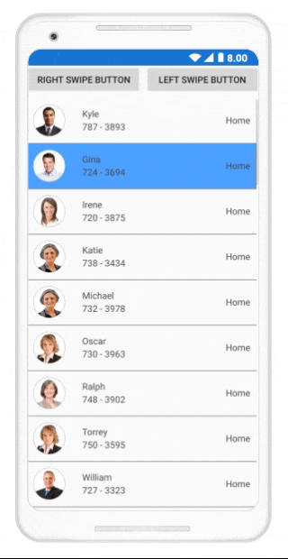

# Swiping in Xamarin ListView (SfListView)

## Overview

The SfListView allows swiping items to do custom actions such as deleting the data, adding the data, editing the data, etc. To enable swiping, set the [SfListView.AllowSwiping](https://help.syncfusion.com/cr/xamarin/Syncfusion.ListView.XForms.SfListView.html#Syncfusion_ListView_XForms_SfListView_AllowSwiping) property to `true`. Swipe views are displayed when swiping from left to right or right to left (for horizontal orientation, top to bottom or bottom to top) on the item. 

It provides customizable swipe templates for swiping on left and right sides. You can restrict the layout of swipe view up to a certain position when swiping the item by setting the [SfListView.SwipeThreshold](https://help.syncfusion.com/cr/xamarin/Syncfusion.ListView.XForms.SfListView.html#Syncfusion_ListView_XForms_SfListView_SwipeThreshold) property. You can set size of the swipe views by setting the [SfListView.SwipeOffset](https://help.syncfusion.com/cr/xamarin/Syncfusion.ListView.XForms.SfListView.html#Syncfusion_ListView_XForms_SfListView_SwipeOffset) property.

N> When [SfListView.AutoFitMode](https://help.syncfusion.com/cr/xamarin/Syncfusion.ListView.XForms.SfListView.html#Syncfusion_ListView_XForms_SfListView_AutoFitMode) is `AutoFitMode.Height` for main listview, the height of inner listview will change while scrolling the view and items will be refreshed.

N> When tap a swiped item, the [SelectionChanging](https://help.syncfusion.com/cr/xamarin/Syncfusion.ListView.XForms.SfListView.html) and [SelectionChanged](https://help.syncfusion.com/cr/xamarin/Syncfusion.ListView.XForms.SfListView.html) events will not occur since the swiped item is reset at this time.

N> When the `Visual` is `Material`, you need to set the `BackgroundColor` to `ItemTemplate` to show the slide swiping.

## Assigning left and right swipe templates

The User Interface (UI) for swiping can be customized by using swipe templates [SfListView.LeftSwipeTemplate](https://help.syncfusion.com/cr/xamarin/Syncfusion.ListView.XForms.SfListView.html#Syncfusion_ListView_XForms_SfListView_LeftSwipeTemplate) when swiping towards right and [SfListView.RightSwipeTemplate](https://help.syncfusion.com/cr/xamarin/Syncfusion.ListView.XForms.SfListView.html#Syncfusion_ListView_XForms_SfListView_RightSwipeTemplate) when swiping towards left. The contents inside the swipe template are arranged based on the offset values when swiping an item. You can reset the swiping item or swiped item by calling the [SfListView.ResetSwipe](https://help.syncfusion.com/cr/xamarin/Syncfusion.ListView.XForms.SfListView.html#Syncfusion_ListView_XForms_SfListView_ResetSwipe_System_Boolean_) method.



<ContentPage xmlns:syncfusion="clr-namespace:Syncfusion.ListView.XForms;assembly=Syncfusion.SfListView.XForms">
  <syncfusion:SfListView x:Name="listView" AllowSwiping="True">
    <syncfusion:SfListView.LeftSwipeTemplate>
      <DataTemplate x:Name="LeftSwipeTemplate">
        <Grid>
          <Grid BackgroundColor="#009EDA" HorizontalOptions="Fill" VerticalOptions="Fill" Grid.Column="0">
            <Grid VerticalOptions="Center" HorizontalOptions="Center">
              <Image Grid.Column="0"
                    Grid.Row="0"
                    BackgroundColor="Transparent"
                    HeightRequest="35"
                    WidthRequest="35"
                    Source="Favorites.png" />
            </Grid>
          </Grid>
        </Grid>
      </DataTemplate>
    </syncfusion:SfListView.LeftSwipeTemplate>
  </syncfusion:SfListView>
</ContentPage>


//Defining left swipe template
listView.LeftSwipeTemplate = new DataTemplate(() =>
{
    var grid = new Grid();

    var grid1 = new Grid() { BackgroundColor = Color.FromHex("#009EDA"), HorizontalOptions = LayoutOptions.Fill, 
                             VerticalOptions = LayoutOptions.Fill };
    var favoriteGrid = new Grid() { HorizontalOptions = LayoutOptions.Center, VerticalOptions = LayoutOptions.Center };
    var favoriteImage = new Image() { BackgroundColor = Color.Transparent, HeightRequest = 35, WidthRequest = 35 };
    favoriteImage.Source = ImageSource.FromResource("Swiping.Images.Favorites.png");
    favoriteGrid.Children.Add(favoriteImage);
    grid1.Children.Add(favoriteGrid);

    grid.Children.Add(grid1);

    return grid;

});



N> Similarly, the UI for swiping towards left can be customized by using the [SfListView.RightSwipeTemplate](https://help.syncfusion.com/cr/xamarin/Syncfusion.ListView.XForms.SfListView.html#Syncfusion_ListView_XForms_SfListView_RightSwipeTemplate).

N> Swipe Template is mandatory to perform swiping in the SfListView.

Download the entire source code from GitHub [here](https://github.com/SyncfusionExamples/Customize-swipe-view-in-xamarin-forms-listview-). 

N> To customize the appearance of each swipe item with different templates based on specific constraints by using the [DataTemplateSelector](https://developer.xamarin.com/api/type/Xamarin.Forms.DataTemplateSelector/). 

## Working with multiple views in swipe template

The swipe templates allows customizing with custom actions such as deleting the data, adding the data, editing the data, etc. by loading multiple views.



<ContentPage xmlns:syncfusion="clr-namespace:Syncfusion.ListView.XForms;assembly=Syncfusion.SfListView.XForms">
 <syncfusion:SfListView x:Name="listView">
  <syncfusion:SfListView.LeftSwipeTemplate>
    <DataTemplate x:Name="LeftSwipeTemplate">
      <Grid>
        <Grid.ColumnDefinitions>
          <ColumnDefinition Width="*" />
          <ColumnDefinition Width="*" />
        </Grid.ColumnDefinitions>
        <Grid BackgroundColor="#009EDA" HorizontalOptions="Fill" VerticalOptions="Fill" Grid.Column="0">
          <Grid VerticalOptions="Center" HorizontalOptions="Center">
            <Image Grid.Column="0"
                   Grid.Row="0"
                   BackgroundColor="Transparent"
                   HeightRequest="35"
                   WidthRequest="35"
                   BindingContextChanged="leftImage_BindingContextChanged"
                   Source="Favorites.png" />
          </Grid>
        </Grid>
        <Grid BackgroundColor="#DC595F" HorizontalOptions="Fill" VerticalOptions="Fill" Grid.Column="1">
          <Grid VerticalOptions="Center" HorizontalOptions="Center">
            <Image Grid.Column="0"
                   Grid.Row="0"
                   HeightRequest="35"
                   WidthRequest="35"
                   BackgroundColor="Transparent"
                   BindingContextChanged="rightImage_BindingContextChanged"
                   Source="Delete.png" />
          </Grid>
        </Grid>
      </Grid>
    </DataTemplate>
  </syncfusion:SfListView.LeftSwipeTemplate>
 </syncfusion:SfListView>
</ContentPage>


listView.LeftSwipeTemplate = new DataTemplate(() =>
{
  var grid = new Grid();

  var grid1 = new Grid()
  {
  BackgroundColor = Color.FromHex("#009EDA"),
  HorizontalOptions = LayoutOptions.Fill,
  VerticalOptions = LayoutOptions.Fill
  };
  var favoriteGrid = new Grid() { HorizontalOptions = LayoutOptions.Center, VerticalOptions = LayoutOptions.Center };
  var favoriteImage = new Image() { BackgroundColor = Color.Transparent, HeightRequest = 35, WidthRequest = 35 };
  favoriteImage.Source = ImageSource.FromResource("Swiping.Images.Favorites.png");
  favoriteImage.BindingContextChanged += FavoriteImage_BindingContextChanged;
  favoriteGrid.Children.Add(favoriteImage);
  grid1.Children.Add(favoriteGrid);

  var grid2 = new Grid()
  {
  BackgroundColor = Color.FromHex("#DC595F"),
  HorizontalOptions = LayoutOptions.Fill,
  VerticalOptions = LayoutOptions.Fill
  };
  var deleteGrid = new Grid() { HorizontalOptions = LayoutOptions.Center, VerticalOptions = LayoutOptions.Center };
  var deleteImage = new Image() { BackgroundColor = Color.Transparent, HeightRequest = 35, WidthRequest = 35 };
  deleteImage.Source = ImageSource.FromResource("Swiping.Images.Delete.png");
  deleteImage.BindingContextChanged += DeleteImage_BindingContextChanged;
  deleteGrid.Children.Add(deleteImage);
  grid1.Children.Add(deleteGrid);

  grid.Children.Add(grid1);
  grid.Children.Add(grid2, 1, 0);
                
  return grid;
});



To delete the item when `Delete` image is tapped and setting favorites to item when `Favorites` image is tapped, follow the code example.



Image leftImage;
Image rightImage;
int itemIndex = -1;

private void SetFavorites()
{
   if (itemIndex >= 0)
   {
       var item = viewModel.InboxInfo[itemIndex];
       item.IsFavorite = !item.IsFavorite;
   }
   this.listView.ResetSwipe();
}

private void Delete()
{
   if (itemIndex >= 0)
       viewModel.InboxInfo.RemoveAt(itemIndex);
   this.listView.ResetSwipe();
}

private void ListView_SwipeStarted(object sender, SwipeStartedEventArgs e)
{
   itemIndex = -1;
}

private void ListView_SwipeEnded(object sender, SwipeEndedEventArgs e)
{
   itemIndex = e.ItemIndex;
}

private void leftImage_BindingContextChanged(object sender, EventArgs e)
{
   if (leftImage == null)
   {
      leftImage = sender as Image;
      (leftImage.Parent as View).GestureRecognizers.Add(new TapGestureRecognizer() { Command = new Command(SetFavorites) });
      leftImage.Source = ImageSource.FromResource("Swiping.Images.Favorites.png");
   }
}

private void rightImage_BindingContextChanged(object sender, EventArgs e)
{
   if (rightImage == null)
   {
      rightImage = sender as Image;
      (rightImage.Parent as View).GestureRecognizers.Add(new TapGestureRecognizer() { Command = new Command(Delete) });
      rightImage.Source = ImageSource.FromResource("Swiping.Images.Delete.png");
   }
}



## Performing swipe delete operation

To delete an item in view while swiping the item from one extent to other by using [SfListView.SwipeEnded](https://help.syncfusion.com/cr/xamarin/Syncfusion.ListView.XForms.SfListView.html) event. By setting the [SfListView.SwipeOffset](https://help.syncfusion.com/cr/xamarin/Syncfusion.ListView.XForms.SfListView.html#Syncfusion_ListView_XForms_SfListView_SwipeOffset) value to the view size to swipe the item upto end of the item.



<ContentPage xmlns:syncfusion="clr-namespace:Syncfusion.ListView.XForms;assembly=Syncfusion.SfListView.XForms">
 <syncfusion:SfListView x:Name="listView" 
                 AllowSwiping="True" SelectionMode="None" 
                 SwipeOffset="360" SwipeThreshold="30"
                 SwipeStarted="ListView_SwipeStarted" 
                 SwipeEnded="ListView_SwipeEnded" 
                 Swiping="ListView_Swiping">
  <syncfusion:SfListView.RightSwipeTemplate>
    <DataTemplate x:Name="RightSwipeTemplate">
      <Grid BackgroundColor="#DC595F" HorizontalOptions="Fill" VerticalOptions="Fill">
        <Grid VerticalOptions="Center" HorizontalOptions="Center">
          <Image Grid.Column="0"
                 Grid.Row="0"
                 HeightRequest="35"
                 WidthRequest="35"
                 BackgroundColor="Transparent"
                 Source="Delete.png" />
        </Grid>
      </Grid>
    </DataTemplate>
  </syncfusion:SfListView.RightSwipeTemplate>
 </syncfusion:SfListView>
</ContentPage>


listView.AllowSwiping = true;
listView.SelectionMode = SelectionMode.None;
listView.SwipeOffset = 360;
listView.SwipeThreshold = 30;
listView.SwipeStarted += ListView_SwipeStarted;
listView.SwipeEnded += ListView_SwipeEnded;
listView.Swiping += ListView_Swiping;
listView.RightSwipeTemplate = new DataTemplate(() =>
{
   var grid = new Grid();

   var grid1 = new Grid()
   {
    BackgroundColor = Color.FromHex("#DC595F"),
    HorizontalOptions = LayoutOptions.Fill,
    VerticalOptions = LayoutOptions.Fill
   };
   var deleteGrid = new Grid() { HorizontalOptions = LayoutOptions.Center, VerticalOptions = LayoutOptions.Center };
   var deleteImage = new Image() { BackgroundColor = Color.Transparent, HeightRequest = 35, WidthRequest = 35 };
   deleteImage.Source = ImageSource.FromResource("Swiping.Images.Delete.png");
   deleteGrid.Children.Add(deleteImage);
   grid1.Children.Add(deleteGrid);

   grid.Children.Add(grid1);

   return grid;
});

private void ListView_SwipeEnded(object sender, SwipeEndedEventArgs e)
{
  if (e.SwipeOffset >= 360)
  {
     viewModel.InboxInfo.RemoveAt(e.ItemIndex);
     listView.ResetSwipe();
  }
}



## Programmatic swiping

Using the [SwipeItem](https://help.syncfusion.com/cr/xamarin/Syncfusion.ListView.XForms.SfListView.html#Syncfusion_ListView_XForms_SfListView_SwipeItem_System_Object_System_Double_) method, you can swipe an item programmatically based on the given offset value. You need to pass the item to be swiped and `SwipeOffset` as a parameter in the `SwipeItem` method.

<table>
<tr>
<th>Parameters</th>
<th>Description</th>
</tr>
<tr>
<td>item data</td>
<td>Represents the item data of list view item.</td>
</tr>
<tr>
<td>offset</td>
<td>Represents the value that how much the item need to swipe.</td>
</tr>
</table>



<ContentPage.Content>
    <StackLayout>
        <Grid HeightRequest="50">
            <Button x:Name="RightSwipe" Text="Right Swipe Button" />
            <Button x:Name="LeftSwipe" Text="Left Swipe Button" Grid.Column="1"/>
        </Grid>
        <listView:SfListView x:Name="listView" ItemSize="70" SelectionMode="Single" AllowSwiping="True"
    ItemSpacing="0,0,5,0" >
            <listView:SfListView.LeftSwipeTemplate>
                <DataTemplate>
                    <ViewCell>
                        <ViewCell.View>
                            <Grid BackgroundColor="SlateBlue"  HorizontalOptions="Fill" VerticalOptions="Fill">
                                <Label Text="Left Swipe Template" TextColor="White" VerticalOptions="Center" HorizontalOptions="Center"/>
                            </Grid>
                        </ViewCell.View>
                    </ViewCell>
                </DataTemplate>
            </listView:SfListView.LeftSwipeTemplate>
            <listView:SfListView.RightSwipeTemplate>
                <DataTemplate>
                    <ViewCell>
                        <ViewCell.View>
                            <Grid BackgroundColor="SlateBlue" HorizontalOptions="Fill" VerticalOptions="Fill">
                                <Label Text="Right Swipe Template" TextColor="White" VerticalOptions="Center"/>
                            </Grid>
                        </ViewCell.View>
                    </ViewCell>
                </DataTemplate>
            </listView:SfListView.RightSwipeTemplate>
        </listView:SfListView>
    </StackLayout>
</ContentPage.Content>



The `SwipeOffset` value should be positive for the left swiping of the listview item.
 


private void LeftSwipeButton_Clicked(object sender, EventArgs e)
{
    ListView.SwipeItem(viewModel.contactsinfo[1], 200);
}



The `SwipeOffset` value should be negative for the right-swiping of the listview item.



private void RightSwipeButton_Clicked(object sender, EventArgs e)
{
    ListView.SwipeItem(viewModel.contactsinfo[1], -150);
}



## Events

### SwipeStarted Event

The [SfListView.SwipeStarted](https://help.syncfusion.com/cr/xamarin/Syncfusion.ListView.XForms.SfListView.html) event is raised when the swipe offset changes from its initial value. 

The `SwipeStarted` event provides the following properties in their arguments:

 * [ItemIndex](https://help.syncfusion.com/cr/xamarin/Syncfusion.ListView.XForms.SwipeStartedEventArgs.html#Syncfusion_ListView_XForms_SwipeStartedEventArgs_ItemIndex): Defines the swiping item index.
 * [ItemData](https://help.syncfusion.com/cr/xamarin/Syncfusion.ListView.XForms.SwipeStartedEventArgs.html#Syncfusion_ListView_XForms_SwipeStartedEventArgs_ItemData): Defines the underlying data associated with the swiped item. as its arguments. 
 * [SwipeDirection](https://help.syncfusion.com/cr/xamarin/Syncfusion.ListView.XForms.SwipeStartedEventArgs.html#Syncfusion_ListView_XForms_SwipeStartedEventArgs_SwipeDirection): Defines the swipe direction of the swiped item.
 
The `SwipeStarted` event is used for the following use case:

 * To cancel the swipe action for a particular item by setting the Cancel property of the [SwipeStartedEventArgs](https://help.syncfusion.com/cr/xamarin/Syncfusion.ListView.XForms.SwipeStartedEventArgs.html).



<syncfusion:SfListView x:Name="listView" ItemsSource="{Binding InboxInfo}" 
                     SwipeStarted="ListView_SwipeStarted" />


listView.SwipeStarted += ListView_SwipeStarted;





private void ListView_SwipeStarted(object sender, SwipeStartedEventArgs e)
{
   if (e.ItemIndex == 1)
      e.Cancel = true;
}



### Swiping Event
 
The [SfListView.Swiping](https://help.syncfusion.com/cr/xamarin/Syncfusion.ListView.XForms.SfListView.html) event is raised while swiping an item is in progress. This event is triggered with [SwipingEventArgs](https://help.syncfusion.com/cr/xamarin/Syncfusion.ListView.XForms.SwipingEventArgs.html).

The `Swiping` event provides the following properties in their arguments:

 * [ItemIndex](https://help.syncfusion.com/cr/xamarin/Syncfusion.ListView.XForms.SwipingEventArgs.html#Syncfusion_ListView_XForms_SwipingEventArgs_ItemIndex): Defines the swiping item index.
 * [ItemData](https://help.syncfusion.com/cr/xamarin/Syncfusion.ListView.XForms.SwipingEventArgs.html#Syncfusion_ListView_XForms_SwipingEventArgs_ItemData): Defines the underlying data associated with the swiped item as its arguments.
 * [SwipeDirection](https://help.syncfusion.com/cr/xamarin/Syncfusion.ListView.XForms.SwipingEventArgs.html#Syncfusion_ListView_XForms_SwipingEventArgs_SwipeDirection): Defines the swipe direction of the swiped item.
 * [SwipeOffSet](https://help.syncfusion.com/cr/xamarin/Syncfusion.ListView.XForms.SwipingEventArgs.html#Syncfusion_ListView_XForms_SwipingEventArgs_SwipeOffSet): Defines the current swipe offset of the item being swiped.
 * [Handled](https://help.syncfusion.com/cr/xamarin/Syncfusion.ListView.XForms.SwipingEventArgs.html#Syncfusion_ListView_XForms_SwipingEventArgs_Handled): Defines that if it is true, current swipe offset value remains same for the swiped item until the [SwipeEnded](https://help.syncfusion.com/cr/xamarin/Syncfusion.ListView.XForms.SfListView.html) event is raised.

The `Swiping` event used for the following use cases:

* To maintain the current offset value for the swiped item till the `SwipeEnded` event gets called.
* To hold the swipe view being swiping by setting the `Handled` property if swipe offset meet certain position.



<syncfusion:SfListView x:Name="listView" ItemsSource="{Binding InboxInfo}" 
                       Swiping="ListView_Swiping" />


listView.Swiping += ListView_Swiping;





private void ListView_Swiping(object sender, SwipingEventArgs e)
{
   if (e.ItemIndex == 1 && e.SwipeOffSet > 70)
       e.Handled = true;
}



### SwipeEnded Event

The [SfListView.SwipeEnded](https://help.syncfusion.com/cr/xamarin/Syncfusion.ListView.XForms.SfListView.html) event is fired when completing the swipe action. This event is triggered with [SwipeEndedEventArgs](https://help.syncfusion.com/cr/xamarin/Syncfusion.ListView.XForms.SwipeEndedEventArgs.html).

The `SwipeEnded` event provides the following properties in their arguments: 

 * [ItemIndex](https://help.syncfusion.com/cr/xamarin/Syncfusion.ListView.XForms.SwipeEndedEventArgs.html#Syncfusion_ListView_XForms_SwipeEndedEventArgs_ItemIndex): Defines the swiping item index.
 * [ItemData](https://help.syncfusion.com/cr/xamarin/Syncfusion.ListView.XForms.SwipeEndedEventArgs.html#Syncfusion_ListView_XForms_SwipeEndedEventArgs_ItemData): Defines the underlying data associated with the swiped item as its arguments. 
 * [SwipeDirection](https://help.syncfusion.com/cr/xamarin/Syncfusion.ListView.XForms.SwipeEndedEventArgs.html#Syncfusion_ListView_XForms_SwipeEndedEventArgs_SwipeDirection): Defines the swipe direction of the swiped item.
 * [SwipeOffSet](https://help.syncfusion.com/cr/xamarin/Syncfusion.ListView.XForms.SwipeEndedEventArgs.html#Syncfusion_ListView_XForms_SwipeEndedEventArgs_SwipeOffset): Defines the current swipe offset of the item being swiped.
 
The `SwipeEnded` event is used for the following use cases:
 
 * To insert the data or edit the data after swiped.
 * To delete the item from view after swiping it to certain extent.
 * To reset the swipe view automatically for the swiped item.



<syncfusion:SfListView x:Name="listView" ItemsSource="{Binding InboxInfo}" 
                       SwipeEnded="ListView_SwipeEnded" />


listView.SwipeEnded += ListView_SwipeEnded;





private void ListView_SwipeEnded(object sender, SwipeEndedEventArgs e)
{
  if (e.SwipeOffset > 70)
      listView.ResetSwipe();
}



### SwipeReset Event

The [SfListView.SwipeReset](https://help.syncfusion.com/cr/xamarin/Syncfusion.ListView.XForms.SfListView.html) event is fired when swiping gets reset. The SwipeReset action can be canceled by setting the Cancel property of the ResetSwipeEventArgs to true. This event is triggered with [ResetSwipeEventArgs](https://help.syncfusion.com/cr/xamarin/Syncfusion.ListView.XForms.ResetSwipeEventArgs.html).

`SwipeReset` event provides the following properties in their arguments:

 * [ItemIndex](https://help.syncfusion.com/cr/xamarin/Syncfusion.ListView.XForms.SwipeEndedEventArgs.html#Syncfusion_ListView_XForms_SwipeEndedEventArgs_ItemIndex): Defines the swiping item index.
 * [ItemData](https://help.syncfusion.com/cr/xamarin/Syncfusion.ListView.XForms.SwipeEndedEventArgs.html#Syncfusion_ListView_XForms_SwipeEndedEventArgs_ItemData): Defines the underlying data associated with the swiped item as its arguments. 
 * [SwipeOffSet](https://help.syncfusion.com/cr/xamarin/Syncfusion.ListView.XForms.SwipeEndedEventArgs.html#Syncfusion_ListView_XForms_SwipeEndedEventArgs_SwipeOffset): Defines the current swipe offset of the item being swiped.
 
The `SwipeReset` event used for the following use case:

 * To skip the reset operation for a swiped item.



<syncfusion:SfListView x:Name="listView" ItemsSource="{Binding InboxInfo}" 
                       SwipeReset="ListView_SwipeReset" />


listView.SwipeReset += ListView_SwipeReset;





private void ListView_SwipeReset(object sender, ResetSwipeEventArgs e)
{
  if (e.ItemIndex == 1)
    e.Cancel = true;
}



## Limitations

When ListView is loaded in CarouselView with [SfListView.AllowSwiping](https://help.syncfusion.com/cr/xamarin/Syncfusion.ListView.XForms.SfListView.html#Syncfusion_ListView_XForms_SfListView_AllowSwiping) as false, it behaves in UWP platform as follows:
 
 * While performing first swipe on the view, it will be handled by ScrollView to ensure whether scrolling is happened or not. If not means the manipulation to parent cannot be passed immediately due to UWP platform behavior. The second swipe will be listened by CarouselView, and the view gets swiped. This is the behavior of the SfListView. 

When ListView is loaded in CarouselView with `AllowSwiping` as true, it behaves as follows:  
 
 * When swiping in iOS, suddenly carousel swipe happened. To swipe ListViewItem, touch and hold the item for some fraction of seconds (0.25 - 0.5 seconds) and then swipe. 
 * When swiping any Item, the SfListView handles the touch and swipe the ListViewItem.  
 * After swiping on ListViewItem, SwipeView will load along with it. If you swipe SwipeView element, Carousel view is swiped. Or else swipe on ListViewItem, control handles touching and swiping the item as usual. 
 * If you swipe header, footer, or group header elements, Carousel view will swipe in Android platform. But in UWP, first swipe on those elements will be handled by SfListView itself, because manipulation to parent cannot be passed immediately. The second swipe will be listened by CarouselView.

When ListView is loaded in MasterDetailPage with `AllowSwiping` as true, it behaves as follows: 

 * In iOS platform, when swiping a ListViewItem, touch and hold the item for some fraction of seconds (0.25 - 0.5 seconds) and then swipe. 

When ListView [ItemTemplate](https://help.syncfusion.com/cr/xamarin/Syncfusion.ListView.XForms.SfListView.html#Syncfusion_ListView_XForms_SfListView_ItemTemplate) contains button with `AllowSwiping` as true, it behaves as follows:

* While swiping in Android and UWP, button click event executes after swiping.
* While swiping in iOS, swipe action does not happened when clicking and swiping a button.
* Swiping will be reset whenever the listview is refreshed like scrolling or any size change is made.

## How to reset swipe view automatically?

Swiped item can be reset by defining the [SfListView.SwipeOffSet](https://help.syncfusion.com/cr/xamarin/Syncfusion.ListView.XForms.SwipeEndedEventArgs.html#Syncfusion_ListView_XForms_SwipeEndedEventArgs_SwipeOffset) argument of [SfListView.SwipeEnded](https://help.syncfusion.com/cr/xamarin/Syncfusion.ListView.XForms.SfListView.html) event to 0 when the swiping action is completed.



private void ListView_SwipeEnded(object sender, SwipeEndedEventArgs e)
{
  if (e.SwipeOffset > 70)
      e.SwipeOffset = 0;
}



## How to swipe an item indefinitely?

To swipe an item indefinitely, set the [SfListView.SwipeOffset](https://help.syncfusion.com/cr/xamarin/Syncfusion.ListView.XForms.SfListView.html#Syncfusion_ListView_XForms_SfListView_SwipeOffset) property by considering the width or height of the SfListView with [SfListView.Orientation](https://help.syncfusion.com/cr/xamarin/Syncfusion.ListView.XForms.SfListView.html#Syncfusion_ListView_XForms_SfListView_Orientation) accordingly.



ListView.PropertyChanged += ListView_PropertyChanged;

private void ListView_PropertyChanged(object sender, PropertyChangedEventArgs e)
{
  if (e.PropertyName == "Width" && ListView.Orientation == Orientation.Vertical && ListView.SwipeOffset != ListView.Width)
     ListView.SwipeOffset = ListView.Width;
  else if (e.PropertyName == "Height" && ListView.Orientation == Orientation.Horizontal && ListView.SwipeOffset != ListView.Height)
     ListView.SwipeOffset = ListView.Height;
}



Download the entire source code from GitHub [here](https://github.com/SyncfusionExamples/Swipe-an-item-indefinitely-in-xamarin-forms-listview-)

## How to edit data by swiping?

The SfListView allows editing the item data using either [SfListView.RightSwipeTemplate](https://help.syncfusion.com/cr/xamarin/Syncfusion.ListView.XForms.SfListView.html#Syncfusion_ListView_XForms_SfListView_RightSwipeTemplate) or [SfListView.LeftSwipeTemplate](https://help.syncfusion.com/cr/xamarin/Syncfusion.ListView.XForms.SfListView.html#Syncfusion_ListView_XForms_SfListView_LeftSwipeTemplate) by loading edit view into the respective template after swiping the item.



<ContentPage xmlns:syncfusion="clr-namespace:Syncfusion.ListView.XForms;assembly=Syncfusion.SfListView.XForms">
 <syncfusion:SfListView > 
  <syncfusion:SfListView.RightSwipeTemplate> 
      <DataTemplate x:Name="RightSwipeTemplate"> 
        <Grid BackgroundColor="#DC595F" HorizontalOptions="Fill" VerticalOptions="Fill"> 
          <Grid> 
            <Label Grid.Row="0" 
                    HeightRequest="50" 
                    WidthRequest="50" 
                    BackgroundColor="Transparent" 
                    Text="EditItem"> 
               <Grid.GestureRecognizers>
                   <TapGestureRecognizer Tapped="TapGestureRecognizer_Tapped"/>
               </Grid.GestureRecognizers>
            </Label> 
          </Grid> 
        </Grid> 
      </DataTemplate> 
  </syncfusion:SfListView.RightSwipeTemplate> 
 </syncfusion:SfListView>
</ContentPage>
 

listView.RightSwipeTemplate = new DataTemplate(() =>
{
  var grid = new Grid()
  {
    BackgroundColor = Color.FromHex("#009EDA"),
    HorizontalOptions = LayoutOptions.Fill,
    VerticalOptions = LayoutOptions.Fill
  };

  var grid1 = new Grid();
  TapGestureRecognizer tapped = new TapGestureRecognizer();
  grid1.GestureRecognizers.Add(tapped);
  tapped.Tapped += Grid_Tapped;
  var label = new Label()
  {
    HeightRequest =50,
    WidthRequest = 50,
    BackgroundColor =Color.Transparent,
    Text ="EditItem"
  };

  grid1.Children.Add(label);
  grid.Children.Add(grid1);
  return grid;
});



To set tapped items binding context for pop-up page, follow the code example.



private void TapGestureRecognizer_Tapped(object sender, EventArgs e)
{
   var popupPage = new SfPopUpView();
   popupPage.BindingContext = (sender as Grid).BindingContext;
   Navigation.PushAsync(popupPage);
}



Download entire source code from GitHub [here](https://github.com/SyncfusionExamples/Edit-item-by-swipe-in-xamarin.forms-listview).

## See Also

[How to swipe an item programmatically in Xamarin.Forms ListView](https://www.syncfusion.com/kb/10021)                                        
[How to swipe the item indefinitely and layout back on specified position when swipe end](https://www.syncfusion.com/kb/8026)                                                                           
[How to swipe an item like Outlook or Gmail application in Xamarin.Forms listview](https://www.syncfusion.com/kb/9965)                                                                                                                                                                                                                          
[How to conditionally handle the swiping in Xamarin.Forms ListView (SfListView)](https://www.syncfusion.com/kb/11669/)
