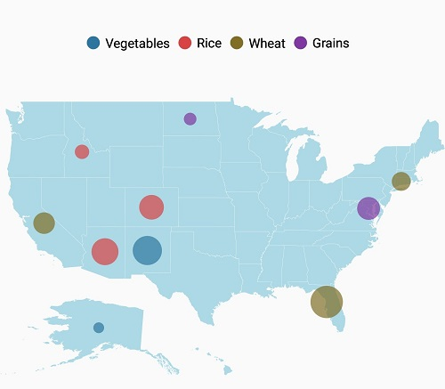
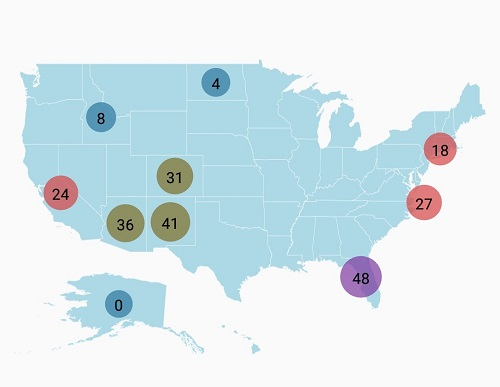

# Bubble Marker in SfMaps

Bubbles in the maps control represent the underlying data values of the maps. Bubbles are scattered throughout the map shapes that contain bound values.

## Bubble data

Bubbles are included when the data binding and [`BubbleMarkerSettings`](https://help.syncfusion.com/cr/xamarin/Syncfusion.SfMaps.XForms.ShapeFileLayer.html#Syncfusion_SfMaps_XForms_ShapeFileLayer_BubbleMarkerSettings) are set to the shape layers.

The following code sample explains data binding provided for bubble.




<maps:SfMaps x:Name="map">
    <maps:SfMaps.Layers>
        <maps:ShapeFileLayer  
            Uri="usa_state.shp" 
            ShapeIDPath="Name"  
            ShapeIDTableField="STATE_NAME" 
            ItemsSource="{Binding DataSource}" />
    </maps:SfMaps.Layers>
</maps:SfMaps>




ShapeFileLayer layer = new ShapeFileLayer()
{
    Uri = "usa_state.shp",
    ItemsSource = viewModel.DataSource,
    ShapeIDTableField = "STATE_NAME",
    ShapeIDPath = "Name"
};

map.Layers.Add(layer);





## Adding bubbles

To add bubbles to maps, the bubble marker setting should be added to the shape file layer. The [`ShowBubbles`](https://help.syncfusion.com/cr/xamarin/Syncfusion.SfMaps.XForms.BubbleMarkerSetting.html#Syncfusion_SfMaps_XForms_BubbleMarkerSetting_ShowBubbles) property should be enabled for making the bubbles visible.

The [`ValuePath`](https://help.syncfusion.com/cr/xamarin/Syncfusion.SfMaps.XForms.BubbleMarkerSetting.html#Syncfusion_SfMaps_XForms_BubbleMarkerSetting_ValuePath) represents the field value to be fetched from the data for each bubble.




<maps:ShapeFileLayer.BubbleMarkerSettings>
    <maps:BubbleMarkerSetting ShowBubbles="True"  ValuePath="index" />
</maps:ShapeFileLayer.BubbleMarkerSettings>





BubbleMarkerSetting bubbleSetting = new BubbleMarkerSetting()
{
    ShowBubbles = true,
    ValuePath = "index"
};

shapeLayer.BubbleMarkerSettings = bubbleSetting;





## Customizing bubble marker

### Customizing fill color

The fill color and opacity of the bubbles can be customized using the [`Fill`](https://help.syncfusion.com/cr/xamarin/Syncfusion.SfMaps.XForms.BubbleMarkerSetting.html#Syncfusion_SfMaps_XForms_BubbleMarkerSetting_Fill) and [`Opacity`](https://help.syncfusion.com/cr/xamarin/Syncfusion.SfMaps.XForms.BubbleMarkerSetting.html#Syncfusion_SfMaps_XForms_BubbleMarkerSetting_Opacity) properties.





<maps:ShapeFileLayer.BubbleMarkerSettings>
  <maps:BubbleMarkerSetting ShowBubbles="True" ValuePath="index"  Fill="Orange" Opacity="0.8" />
</maps:ShapeFileLayer.BubbleMarkerSettings>





BubbleMarkerSetting bubbleSetting = new BubbleMarkerSetting()
{
    ShowBubbles = true,
    ValuePath = "index",
    Fill = Color.Orange,
    Opacity = 0.8
};

shapeLayer.BubbleMarkerSettings = bubbleSetting;





Bubble color can be customized using the [`ColorMappings`](https://help.syncfusion.com/cr/xamarin/Syncfusion.SfMaps.XForms.BubbleMarkerSetting.html#Syncfusion_SfMaps_XForms_BubbleMarkerSetting_ColorMappingsProperty) property.

Maps provide the following two types of color mapping to bubble marker:

 * Equal color mapping
 * Range color mapping

### Range color mapping

It is used to differentiate the bubble fill based on its under-bound value and color ranges.
The [`From`](https://help.syncfusion.com/cr/xamarin/Syncfusion.SfMaps.XForms.RangeColorMapping.html#Syncfusion_SfMaps_XForms_RangeColorMapping_FromProperty) and [`To`](https://help.syncfusion.com/cr/xamarin/Syncfusion.SfMaps.XForms.RangeColorMapping.html#Syncfusion_SfMaps_XForms_RangeColorMapping_ToProperty) properties are used to define the color range and color for the range that can be specified using the Color property.





<maps:ShapeFileLayer.BubbleMarkerSettings>
    <maps:BubbleMarkerSetting  ValuePath="index" ColorValuePath="index" >
        <maps:BubbleMarkerSetting.ColorMappings>
            <maps:RangeColorMapping Color="#2E769F" From="0" To="15" />
            <maps:RangeColorMapping Color="#D84444" To="30" From="15" />
            <maps:RangeColorMapping Color="#816F28" To="45" From="30" />
            <maps:RangeColorMapping Color="#7F38A0" To="50" From="45" />
        </maps:BubbleMarkerSetting.ColorMappings>
    </maps:BubbleMarkerSetting>
</maps:ShapeFileLayer.BubbleMarkerSettings>





BubbleMarkerSetting bubbleSetting = new BubbleMarkerSetting()
{
    ValuePath = "index",
    ColorValuePath = "index"
};

bubbleSetting.ColorMappings.Add(new RangeColorMapping() { Color = Color.FromHex("#2E769F"), From = 0, To = 15 });
bubbleSetting.ColorMappings.Add(new RangeColorMapping() { Color = Color.FromHex("#D84444"), From = 15, To = 30 });
bubbleSetting.ColorMappings.Add(new RangeColorMapping() { Color = Color.FromHex("#816F28"), From = 30, To = 45 });
bubbleSetting.ColorMappings.Add(new RangeColorMapping() { Color = Color.FromHex("#7F38A0"), From = 45, To = 50 });

shapeLayer.BubbleMarkerSettings = bubbleSetting;





### Equal color mapping

It is used to differentiate the bubble fill based on its underlying value and color using the [`Value`](https://help.syncfusion.com/cr/xamarin/Syncfusion.SfMaps.XForms.EqualColorMapping.html#Syncfusion_SfMaps_XForms_EqualColorMapping_Value) and [`Color`](https://help.syncfusion.com/cr/xamarin/Syncfusion.SfMaps.XForms.ColorMapping.html#Syncfusion_SfMaps_XForms_ColorMapping_Color) properties.




<maps:ShapeFileLayer.BubbleMarkerSettings>
    <maps:BubbleMarkerSetting ValuePath="index" ColorValuePath="Type" >
        <maps:BubbleMarkerSetting.ColorMappings>
            <maps:EqualColorMapping Color="#2E769F" Value="Vegetables" />
            <maps:EqualColorMapping Color="#D84444" Value="Rice" />
            <maps:EqualColorMapping Color="#816F28" Value="Wheat" />
            <maps:EqualColorMapping Color="#7F38A0" Value="Grains" />
        </maps:BubbleMarkerSetting.ColorMappings>
    </maps:BubbleMarkerSetting>
</maps:ShapeFileLayer.BubbleMarkerSettings>





BubbleMarkerSetting bubbleSetting = new BubbleMarkerSetting()
{
    ValuePath = "index",
    ColorValuePath = "Type"
};

bubbleSetting.ColorMappings.Add(new EqualColorMapping() { Color = Color.FromHex("#2E769F"), Value = "Vegetables" });
bubbleSetting.ColorMappings.Add(new EqualColorMapping() { Color = Color.FromHex("#D84444"), Value = "Rice" });
bubbleSetting.ColorMappings.Add(new EqualColorMapping() { Color = Color.FromHex("#816F28"), Value = "Wheat" });
bubbleSetting.ColorMappings.Add(new EqualColorMapping() { Color = Color.FromHex("#7F38A0"), Value = "Grains" });

shapeLayer.BubbleMarkerSettings = bubbleSetting;





## Customizing bubble size

The size of the bubbles depends on the data bound to the [`ValuePath`](https://help.syncfusion.com/cr/xamarin/Syncfusion.SfMaps.XForms.BubbleMarkerSetting.html#Syncfusion_SfMaps_XForms_BubbleMarkerSetting_ValuePath). The maximum and minimum sizes of the bubbles can be customized using [`MaxSize`](https://help.syncfusion.com/cr/xamarin/Syncfusion.SfMaps.XForms.BubbleMarkerSetting.html#Syncfusion_SfMaps_XForms_BubbleMarkerSetting_MaxSize) and [`MinSize`](https://help.syncfusion.com/cr/xamarin/Syncfusion.SfMaps.XForms.BubbleMarkerSetting.html#Syncfusion_SfMaps_XForms_BubbleMarkerSetting_MinSize) properties.

I> The [`ShowMapItems`](https://help.syncfusion.com/cr/xamarin/Syncfusion.SfMaps.XForms.ShapeFileLayer.html#Syncfusion_SfMaps_XForms_ShapeFileLayer_ShowMapItems) should be enabled to display label on bubble marker.





<maps:ShapeFileLayer.BubbleMarkerSettings>
    <maps:BubbleMarkerSetting 
        ShowBubbles="True" 
        ValuePath="Electors" 
        Fill="Orange" 
        MaxSize="25" 
        MinSize="20" 
        Opacity="0.8" />
</maps:ShapeFileLayer.BubbleMarkerSettings>





BubbleMarkerSetting bubbleSetting = new BubbleMarkerSetting()
{
    ShowBubbles = true,
    ValuePath = "Electors",
    Fill = Color.Orange,
    Opacity = 0.8,
    MinSize = 20,
    MaxSize = 25
};

shapeLayer.BubbleMarkerSettings = bubbleSetting;





The following code sample demonstrates how to add bubbles to maps and customize them





<maps:SfMaps>
    <maps:SfMaps.BindingContext>
          <local:ViewModel> </local:ViewModel>
    </maps:SfMaps.BindingContext>
    <maps:SfMaps.Layers>
        <maps:ShapeFileLayer
            x:Name="shapeLayer"
            Uri="usa_state.shp"
            ShapeIDPath="Name"
            ShapeIDTableField="STATE_NAME" 
            ShowMapItems="True" 
            ItemsSource="{Binding DataSource}">
            <maps:ShapeFileLayer.BubbleMarkerSettings>
                <maps:BubbleMarkerSetting ValuePath="index" ColorValuePath="index" >
                    <maps:BubbleMarkerSetting.ColorMappings>
                    <maps:RangeColorMapping Color="#2E769F" From="0" To="15" />
                    <maps:RangeColorMapping Color="#D84444" To="30" From="15" />
                    <maps:RangeColorMapping Color="#816F28" To="45" From="30" />
                    <maps:RangeColorMapping Color="#7F38A0" To="50" From="45" />
                    </maps:BubbleMarkerSetting.ColorMappings>
                </maps:BubbleMarkerSetting>
            </maps:ShapeFileLayer.BubbleMarkerSettings>
        <maps:ShapeFileLayer.ShapeSettings>
             <maps:ShapeSetting ShapeFill="LightBlue"/>
        </maps:ShapeFileLayer.ShapeSettings>
        <maps:ShapeFileLayer.LegendSettings>
            <maps:MapLegendSetting LegendType="Bubbles"  ShowLegend="True"></maps:MapLegendSetting>
        </maps:ShapeFileLayer.LegendSettings>
        </maps:ShapeFileLayer>
    </maps:SfMaps.Layers>
</maps:SfMaps>




          
SfMaps map = new SfMaps()
{
  BackgroundColor = Color.White,
};
      
ShapeFileLayer shapeLayer = new ShapeFileLayer()
{
    Uri = "usa_state.shp",
    ItemsSource = new ViewModel().DataSource,
    ShapeIDTableField = "STATE_NAME",
    ShapeIDPath = "Name",
    ShowMapItems = true
};

BubbleMarkerSetting bubbleSetting = new BubbleMarkerSetting()
{
    ValuePath = "index",
    ColorValuePath = "index"
};

bubbleSetting.ColorMappings.Add(new RangeColorMapping() { Color = Color.FromHex("#2E769F"), From = 0, To = 15 });
bubbleSetting.ColorMappings.Add(new RangeColorMapping() { Color = Color.FromHex("#D84444"), From = 15, To = 30 });
bubbleSetting.ColorMappings.Add(new RangeColorMapping() { Color = Color.FromHex("#816F28"), From = 30, To = 45 });
bubbleSetting.ColorMappings.Add(new RangeColorMapping() { Color = Color.FromHex("#7F38A0"), From = 45, To = 50 });   

shapeLayer.BubbleMarkerSettings = bubbleSetting;

ShapeSetting shapeSetting = new ShapeSetting()
{
    ShapeFill = Color.LightBlue
};

shapeLayer.ShapeSettings = shapeSetting;
          
MapLegendSetting legendSetting = new MapLegendSetting()
{
    ShowLegend = true,
    LegendType = LegendType.Bubbles
};

shapeLayer.LegendSettings = legendSetting;   

map.Layers.Add(shapeLayer);
   






[Model]

public class AgricultureData
{
    public AgricultureData(string name, string type, int count)
    {
        Name = name;
        Type = type;
        index = count;
    }

    public string Name
    {
        get;
        set;
    }

    public string Type
    {
        get;
        set;
    }

    public int index
    {
        get;
        set;
    }
}





[ViewModel]

public class ViewModel
{
    public ViewModel()
    {
        DataSource = new ObservableCollection<AgricultureData>();
        
        DataSource.Add(new AgricultureData("Alaska", "Vegetables", 0));
        DataSource.Add(new AgricultureData("Arizona", "Rice", 36));          
        DataSource.Add(new AgricultureData("California", "Wheat", 24));
        DataSource.Add(new AgricultureData("Colorado", "Rice", 31));
        DataSource.Add(new AgricultureData("North Dakota", "Grains", 4));
        DataSource.Add(new AgricultureData("Connecticut", "Wheat", 18));          
        DataSource.Add(new AgricultureData("District of Columbia", "Grains", 27));
        DataSource.Add(new AgricultureData("Florida", "Wheat", 48));
        DataSource.Add(new AgricultureData("New Mexico", "Vegetables", 41));        
        DataSource.Add(new AgricultureData("Idaho", "Rice", 8));
        
    }
    public ObservableCollection<AgricultureData> DataSource { get; set; }
}



## Showing label on bubble marker.

The [`ShowMapItems`](https://help.syncfusion.com/cr/xamarin/Syncfusion.SfMaps.XForms.ShapeFileLayer.html#Syncfusion_SfMaps_XForms_ShapeFileLayer_ShowMapItems) property determines whether the label should be displayed on the bubble marker or not. Set the [`ShapeValuePath`](https://help.syncfusion.com/cr/xamarin/Syncfusion.SfMaps.XForms.ShapeSetting.html#Syncfusion_SfMaps_XForms_ShapeSetting_ShapeValuePath) property to get the labels.

N> The default value of [`ShowMapItems`](https://help.syncfusion.com/cr/xamarin/Syncfusion.SfMaps.XForms.ShapeFileLayer.html#Syncfusion_SfMaps_XForms_ShapeFileLayer_ShowMapItems) property is true





<maps:SfMaps>
    <maps:SfMaps.BindingContext>
        <local:ViewModel> </local:ViewModel>
    </maps:SfMaps.BindingContext>
    <maps:SfMaps.Layers>
        <maps:ShapeFileLayer x:Name="shapeLayer" Uri="usa_state.shp" ShapeIDPath="Name" ShapeIDTableField="STATE_NAME" ShowMapItems="True"  ItemsSource="{Binding DataSource}">
            <maps:ShapeFileLayer.BubbleMarkerSettings>
                <maps:BubbleMarkerSetting ValuePath="index" ColorValuePath="index"  MinSize="20" MaxSize="30">
                    <maps:BubbleMarkerSetting.ColorMappings>
                        <maps:RangeColorMapping Color="#2E769F" From="0" To="15" />
                        <maps:RangeColorMapping Color="#D84444" To="30" From="15" />
                        <maps:RangeColorMapping Color="#816F28" To="45" From="30" />
                        <maps:RangeColorMapping Color="#7F38A0" To="50" From="45" />
                    </maps:BubbleMarkerSetting.ColorMappings>
                </maps:BubbleMarkerSetting>
            </maps:ShapeFileLayer.BubbleMarkerSettings>
            <maps:ShapeFileLayer.ShapeSettings>
                <maps:ShapeSetting ShapeFill="LightBlue" ShapeValuePath="index"/>
            </maps:ShapeFileLayer.ShapeSettings>
        </maps:ShapeFileLayer>
    </maps:SfMaps.Layers>
</maps:SfMaps>





SfMaps map = new SfMaps()
{
  BackgroundColor = Color.White,
};
      
ShapeFileLayer shapeLayer = new ShapeFileLayer()
{
    Uri = "usa_state.shp",
    ItemsSource = new ViewModel().DataSource,
    ShapeIDTableField = "STATE_NAME",
    ShapeIDPath = "Name",
    ShowMapItems = true
};

BubbleMarkerSetting bubbleSetting = new BubbleMarkerSetting()
{
    ValuePath = "index",
    ColorValuePath = "index",
    MinSize = 20,
    MaxSize = 30
};

bubbleSetting.ColorMappings.Add(new RangeColorMapping() { Color = Color.FromHex("#2E769F"), From = 0, To = 15 });
bubbleSetting.ColorMappings.Add(new RangeColorMapping() { Color = Color.FromHex("#D84444"), From = 15, To = 30 });
bubbleSetting.ColorMappings.Add(new RangeColorMapping() { Color = Color.FromHex("#816F28"), From = 30, To = 45 });
bubbleSetting.ColorMappings.Add(new RangeColorMapping() { Color = Color.FromHex("#7F38A0"), From = 45, To = 50 });   

shapeLayer.BubbleMarkerSettings = bubbleSetting;

ShapeSetting shapeSetting = new ShapeSetting()
{
    ShapeFill = Color.LightBlue,
    ShapeValuePath = "index"
};

shapeLayer.ShapeSettings = shapeSetting;

shapeLayer.LegendSettings = legendSetting;   

map.Layers.Add(shapeLayer);





## See also

[How to group the markers based on zoom level in the imagery layer of the SfMaps](https://www.syncfusion.com/kb/10200/how-to-group-the-markers-based-on-zoom-level-in-the-imagery-layer-of-the-sfmaps-control)

[How to show the bubble markers in the specific latitude and longitude in SfMaps](https://www.syncfusion.com/kb/11910/how-to-show-the-bubble-markers-in-the-specific-latitude-and-longitude-in-xamarin-forms-map)

[How to add different style marker pins to SfMaps](https://www.syncfusion.com/kb/11372/how-to-add-different-style-marker-pins-to-xamarin-forms-maps-sfmaps)

[How to add map markers dynamically to the tapped location](https://www.syncfusion.com/kb/10550/how-to-add-map-markers-dynamically-to-the-tapped-location)
